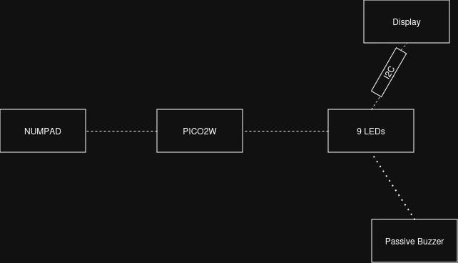

# Simon Says Game with LCD 


:::info 

**Author**: Dobrin Andrei Liviu \
**GitHub Project Link**: [https://github.com/UPB-PMRust-Students/project-andrei-1-64](https://github.com/UPB-PMRust-Students/project-andrei-1-64)

:::

## Description

This project implements a "Simon Says" memory game using 9 LEDs and a numpad. The game logic runs on a Raspberry Pi Pico 2W. An I2C-connected 16x2 LCD screen displays a start menu, current score, and high score saved in the microcontroller's flash memory.

## Motivation

I chose this project to combine embedded hardware and software concepts in a fun and interactive way. It challenges both my circuit design skills and my ability to use Rust in embedded development.

## Architecture 

The project is made up of several parts that work together to create the Simon Says game:




### Game Logic
- This is the main part of the program.
- It controls the flow of the game: when it starts, how patterns are shown, and when the game ends.

### Pattern Generator
- Generates a random sequence of LEDs that the player has to remember and repeat.
- The sequence gets longer each round to make the game more challenging.

### Input Handler
- Listens for button presses from the 4x3 keypad.
- Checks if the player's input matches the generated pattern.

### Output Handler
- Controls the 9 LEDs to display the pattern.
- Sends messages to the LCD screen (like score, "You Win", or "Game Over").
- Activates the buzzer to give sound feedback for actions.

### Score System
- Keeps track of the player’s current score.
- Saves the highest score in the microcontroller's flash memory so it’s not lost when powered off.

### How everything connects
- The **Game Logic** tells the **Pattern Generator** to make a new sequence.
- The **Input Handler** reads the player’s buttons and tells the **Game Logic** if it was correct.
- The **Output Handler** lights up the LEDs, updates the screen, and beeps the buzzer.
- The **Score System** stores the highest score and updates it when needed.

## Log

<!-- write your progress here every week -->

### Week 5 - 11 May

### Week 12 - 18 May

### Week 19 - 25 May

## Hardware

Detail in a few words the hardware used.

### Schematics

Place your KiCAD schematics here.

### Bill of Materials

<!-- Fill out this table with all the hardware components that you might need.

The format is 
```
| [Device](link://to/device) | This is used ... | [price](link://to/store) |

```

-->

| Device | Usage | Price |
|--------|--------|-------|
| [Raspberry Pi Pico W (x2)](https://www.raspberrypi.com/documentation/microcontrollers/raspberry-pi-pico.html) | The microcontroller | [35 RON](https://www.optimusdigital.ro/en/raspberry-pi-boards/12394-raspberry-pi-pico-w.html) |
| [16x2 I2C LCD Screen](https://www.optimusdigital.ro/en/lcds/62-1602-lcd-with-i2c-interface-and-yellow-green-backlight.html) | Displays menu and scores | [15 RON](https://www.optimusdigital.ro/en/lcds/62-1602-lcd-with-i2c-interface-and-yellow-green-backlight.html) |
| [LEDs (x9)](https://www.optimusdigital.ro/en/leds/696-led-rou-de-3-mm-cu-lentile-difuze.html) | Lights up in sequence | [4 RON](https://www.optimusdigital.ro/en/leds/696-led-rou-de-3-mm-cu-lentile-difuze.html) |
| [330Ω Resistors (x9)](https://www.robotshop.com/products/resistor-330-ohm-1-4-watt-pth-20pk) | LED current limiting | [5 RON](https://www.robotshop.com/products/resistor-330-ohm-1-4-watt-pth-20pk) |
| [10kΩ Resistors (x9)](https://www.optimusdigital.ro/en/resistors/1088-025w-10k-resistor.html) | Pull-down for buttons | [1 RON](https://www.optimusdigital.ro/en/resistors/1088-025w-10k-resistor.html) |
| [Breadboard](https://www.optimusdigital.ro/en/breadboards/13244-breadboard-175-x-67-x-9-mm.html) | For prototyping | [12 RON](https://www.optimusdigital.ro/en/breadboards/13244-breadboard-175-x-67-x-9-mm.html) |
| [Jumper Wires](https://www.optimusdigital.ro/en/wires-with-connectors/7330-50-cm-40p-female-female-wire.html) | Connect components | [23 RON](https://www.optimusdigital.ro/en/wires-with-connectors/7330-50-cm-40p-female-female-wire.html) |
| [Buzzer](https://www.optimusdigital.ro/en/buzzers/10-active-buzzer-module.html) | Audio feedback | [3 RON](https://www.optimusdigital.ro/en/buzzers/10-active-buzzer-module.html) |
| [Numpad](https://www.optimusdigital.ro/en/others/5825-keyboard-module.html?gad_source=1&gad_campaignid=19615979487&gclid=Cj0KCQjw_dbABhC5ARIsAAh2Z-QC84GTPPIBHt5XXHiNGdmiLp44m6mMsmXymzOsN6fYGzXHPE1uBhEaAtJKEALw_wcB) | Controlling the game | [19 RON](https://www.optimusdigital.ro/en/others/5825-keyboard-module.html?gad_source=1&gad_campaignid=19615979487&gclid=Cj0KCQjw_dbABhC5ARIsAAh2Z-QC84GTPPIBHt5XXHiNGdmiLp44m6mMsmXymzOsN6fYGzXHPE1uBhEaAtJKEALw_wcB) |


## Software

| Library | Description | Usage |
|---------|-------------|-------|
| [st7789](https://github.com/almindor/st7789) | Display driver for ST7789 | Used for the display for the Pico Explorer Base |
| [embedded-graphics](https://github.com/embedded-graphics/embedded-graphics) | 2D graphics library | Used for drawing to the display |

## Links

<!-- Add a few links that inspired you and that you think you will use for your project -->

1. [link](https://example.com)
2. [link](https://example3.com)
...
