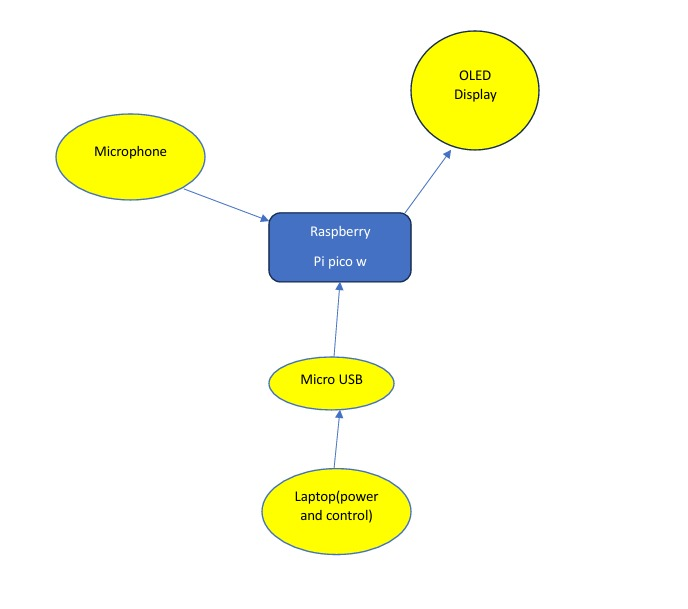

# The tone corrector
 Your tool to have a right tone EVERYWHERE
 
:::info 

**Author**: Shafiei Armin\
**GitHub Project Link**: [link to github (in progress)](https://github.com/UPB-PMRust-Students/project-ArminSHaf)

:::

## Description

This device helps users maintain an appropriate speaking volume in different situations. First, the user selects a scenario—like a quiet library or speaking with an elderly loved one who
has hearing difficulties. Using its microphone, the system monitors voice volume in real time and gives instant feedback. If the volume fits the setting, it confirms with a positive signal; if not, it gently prompts the user to adjust, at the end of each trial a statistic will be shown for user to see the decible he/she was speaking with.

## Motivation

A few months ago, I visited my grandmother and realized her hearing wasn’t what it used to be. Sometimes, I’d speak at my normal volume—unaware she couldn’t hear me—and she’d just smile silently. That’s when I thought: What if there was a gentle reminder to keep my voice just loud enough for her? That brought me to the idea of this project.

## Architecture 



Main components:
 - **Raspberry Pico 2W**  Central processing unit, the brain of the project, Receives Analog Data (from Microphone via ADC), processes the signal and sends output to logs and display.
 - **Microphone** recieves analog electrical signal with air vibrations and transmit it to microprocessor.
 - **Display**  Shows visual informations, sent from the microcontroller so the user can observe the results.
 - **power supply** provides electrical energy to the raspberry and the connected components.

## Log

<!-- write your progress here every week -->
### Week 28 April - 4 May
In this week I started my documentation. I have been doing research and learned how the decible is calculated after getting the analog outputs from microphone, Unfortunately I must change my microphone because it was broken, so placed an order for new one..

### Week 5 - 11 May

### Week 12 - 18 May

### Week 19 - 25 May

## Hardware

Detail in a few words the hardware used.

### Schematics

Place your KiCAD schematics here.

### Bill of Materials

<!-- Fill out this table with all the hardware components that you might need.

The format is 
```
| [Device](link://to/device) | This is used ... | [price](link://to/store) |

```

-->

| Device | Usage | Price |
|--------|--------|-------|
| [Raspberry Pi Pico W](https://www.raspberrypi.com/documentation/microcontrollers/raspberry-pi-pico.html) | The microcontroller | [35 RON](https://www.optimusdigital.ro/en/raspberry-pi-boards/12394-raspberry-pi-pico-w.html) |
| [Raspberry Pi Pico W](https://www.raspberrypi.com/documentation/microcontrollers/raspberry-pi-pico.html) | The debugger | [35 RON](https://www.optimusdigital.ro/en/raspberry-pi-boards/12394-raspberry-pi-pico-w.html) |
| [Max9814](https://www.analog.com/media/en/technical-documentation/data-sheets/max9814.pdf) | The microphone | [23 RON](https://www.emag.ro/amplificator-microfon-max9814-ai1095/pd/DJGRKFMBM) |
| [0.96" Inch OLED Display] | The display | [8 RON](https://www.aliexpress.com/item/1005006365881525.html?spm=a2g0o.order_list.order_list_main.5.78d81802tA33SX) |
| [Bread board] | Connecting the components | [10 RON](https://www.aliexpress.com/item/1005006713173854.html?spm=a2g0o.productlist.main.1.256d2aa3stlphA&algo_pvid=9e7e7937-916a-4227-8016-4319195a7894&algo_exp_id=9e7e7937-916a-4227-8016-4319195a7894-0&pdp_ext_f=%7B%22order%22%3A%224666%22%2C%22eval%22%3A%221%22%7D&pdp_npi=4%40dis%21RON%2128.62%214.67%21%21%2144.13%217.20%21%40211b80d117432422098814750e8707%2112000038074302745%21sea%21RO%210%21ABX&curPageLogUid=4IDdjq0wfMaI&utparam-url=scene%3Asearch%7Cquery_from%3A) |
| [Male-Male wires] | Connecting the components | [15 RON](https://www.optimusdigital.ro/en/wires-with-connectors/891-wires-male-male-10p-30cm.html?search_query=wires&results=556) |


## Software

| Library | Description | Usage |
|---------|-------------|-------|
| [embassy-rp](https://github.com/embassy-rs/embassy/blob/main/embassy-rp/README.md) | HAL for Raspberry Pi Pico | Used for ADC reading from microphone |
| [embassy-executor](https://github.com/embassy-rs/embassy/tree/main/embassy-executor) | Async runtime | Runs the main async task loop for sampling |
| [embassy-time](https://crates.io/crates/embassy-time) | Timing and delays | Delays between ADC readings and UI updates |
| [libm](https://github.com/rust-lang/libm) | `no_std` math library | Used for `sqrt()` and `log10()` in RMS and dB calculations |
| [embedded-graphics](https://github.com/embedded-graphics/embedded-graphics) | Drawing primitives | Renders text and UI elements to OLED screen |
| [defmt](https://github.com/knurling-rs/defmt) | Lightweight logging framework | Prints  decibel values for debugging and calibrating |


## Links

<!-- Add a few links that inspired you and that you think you will use for your project -->

1. [How to convert Adc to Decibel](https://forum.arduino.cc/t/analog-read-value-db/307667/2)

...
