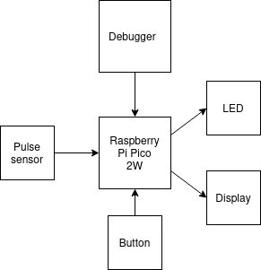

# Heart rate guided breathing assistant
A heart rate based breathing guiding system to help regulate the heart beat through controlled breathing exercises.

:::info 

**Author**: Mihon Corina-Cristiana \
**GitHub Project Link**: https://github.com/UPB-PMRust-Students/project-Corina-Mihon

:::

## Description

This project uses a heart rate sensor to monitor the user's pulse. The user can select a mode (for example: exercising) and then the heart beat is shown on a display. If the rate is too high, an LED pulses in a rhythm that guides the user to breath in and out slowly. The heart rate history is displayed on a web interface via Wi-Fi.

## Motivation

I chose this project because of the increasing importance of stress management and heart health. By combining heart rate monitoring with breathing exercises, users can make adjustments to improve their physical health or their mental health. It is a way of integrating technology into wellness practices.

## Architecture 



The main controller reads physiological data from the pulse sensor and controls an LED for visual breathing guidance. A button connected to the microcontroller allows user interaction and the display, also connected to the microcontroller, shows the data. The device also hosts a web interface over Wi-Fi, while a  second microcontroller handles debugging. 

## Log

<!-- write your progress here every week -->

### Week 5 - 11 May

### Week 12 - 18 May

### Week 19 - 25 May

## Hardware

Raspberry Pi Pico 2W: main controller for handling sensor data, controlling the LED and hosting the Wi-Fi web interface

Raspberry Pi Pico 2W: used for debugging

XD-58C pulse sensor: measure the user's heart rate

RBG LED: used for the visual breathing feedback

Button: allows the user to switch between modes

1.44'' LCD Display: Displays the heart rate

### Schematics

Place your KiCAD schematics here.

### Bill of Materials

<!-- Fill out this table with all the hardware components that you might need.

The format is 
```
| [Device](link://to/device) | This is used ... | [price](link://to/store) |

```

-->

| Device | Usage | Price |
|--------|--------|-------|
| [Raspberry Pi Pico 2W](https://www.raspberrypi.com/documentation/microcontrollers/raspberry-pi-pico.html) | The microcontroller | [39.66 RON x 2](https://www.optimusdigital.ro/ro/placi-raspberry-pi/13327-raspberry-pi-pico-2-w.html?) |
| [XD-58C pulse sensor](https://pulsesensor.com) | The pulse sensor | [15.17 RON](https://www.optimusdigital.ro/ro/senzori-altele/1273-senzor-de-puls-xd-58c.html?)|
| [1.44'' LCD Module](https://www.google.com/url?sa=t&source=web&rct=j&opi=89978449&url=https://www.optimusdigital.ro/en/index.php%3Fcontroller%3Dattachment%26id_attachment%3D196%26srsltid%3DAfmBOoruUzWlsxzAAf_-B4iAEJVfx2yxuVbGb-puhPoLH_3ZoySWRy6B&ved=2ahUKEwibuP6e7oaNAxXUiv0HHQ0hO54QFnoECB4QAQ&usg=AOvVaw0UxpN128YQYtVhZADYz4ql) | Display | [28 RON](https://www.optimusdigital.ro/ro/optoelectronice-lcd-uri/870-modul-lcd-144.html?)|
| [Button](https://www.optimusdigital.ro/ro/butoane-i-comutatoare/1115-buton-cu-capac-rotund-alb.html?)) | Press the button to select modes | [2 RON](https://www.optimusdigital.ro/ro/butoane-i-comutatoare/1115-buton-cu-capac-rotund-alb.html?)|
| [RGB LED module](https://www.optimusdigital.ro/ro/optoelectronice-led-uri/737-modul-cu-led-rgb.html?) | LED light | [5 RON](https://www.optimusdigital.ro/ro/optoelectronice-led-uri/737-modul-cu-led-rgb.html?)|


## Software

| Library | Description | Usage |
|---------|-------------|-------|
| [st7789](https://github.com/almindor/st7789) | Display driver for ST7789 | Used for the display |
| [embedded-graphics](https://github.com/embedded-graphics/embedded-graphics) | 2D graphics library | Used for drawing text to the display |


## Links

<!-- Add a few links that inspired you and that you think you will use for your project -->

1. [Projects 2023](https://ocw.cs.pub.ro/courses/pm/prj2023)
2. [link](https://iotdesignpro.com/projects/iot-heartbeat-monitoring-system-using-raspberry-pi)
...
