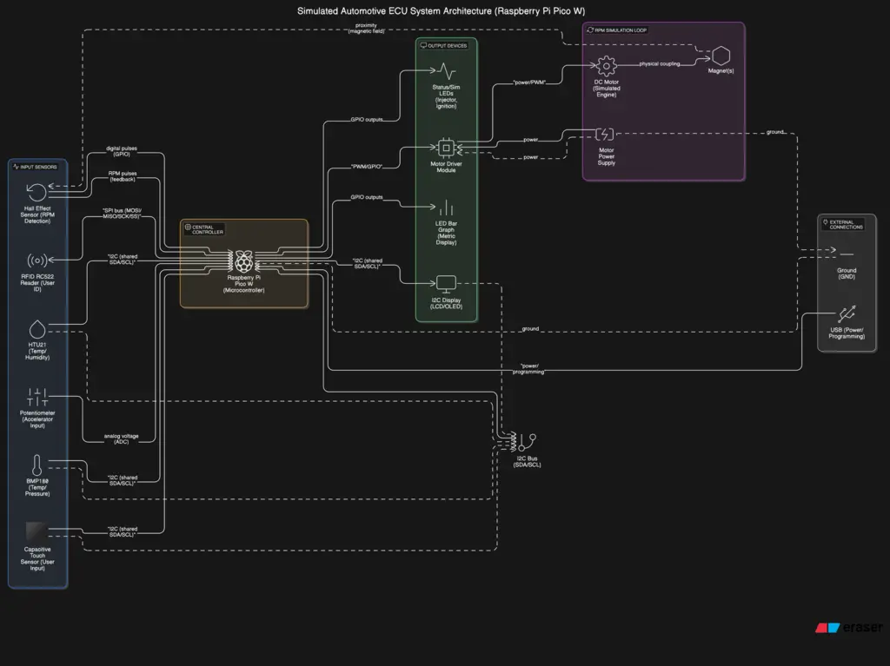

# Simulated Automotive ECU & Trip Computer
This project simulates the core functions of a car's Engine Control Unit and Trip Computer, providing interactive, real-time feedback.

:::info

**Author**: MATEI Cosmin-Alecsandru – Group 1222EB \
**GitHub Project Link**: https://github.com/UPB-PMRust-Students/project-kozmy410

:::

## Description

This project simulates the core functions of a car's Engine Control Unit (ECU) and Trip Computer. It provides interactive, real-time feedback by dynamically calculating engine operational parameters like fuel injection and ignition timing based on simulated driver input (accelerator position via a potentiometer) and engine conditions (simulated RPM via a DC motor/Hall sensor, and temperature/environmental data via I2C sensors). The system visualizes these engine control actions (e.g., using LEDs for injectors/ignition) and displays key performance metrics and trip data on an I2C display, demonstrating the fundamental logic loops within automotive electronic control systems using embedded Rust and the Embassy framework.

## Motivation

The primary motivation behind this project is to gain hands-on experience with embedded systems development using Rust, particularly focusing on real-time data acquisition, processing, and control loops common in automotive applications. It serves as a practical platform to understand the fundamental principles of an Engine Control Unit and Trip Computer, integrating various sensors and actuators, and implementing asynchronous tasks using the Embassy framework on the Raspberry Pi Pico W. Furthermore, it aims to create a tangible, interactive demonstration of these concepts.

## Architecture

The system architecture is designed around the Embassy async framework running on the Raspberry Pi Pico W. It comprises several concurrent tasks:

1.  **Input Acquisition Task(s):**
    *   Reads the accelerator position from the potentiometer via ADC.
    *   Polls I2C sensors (BMP180, HTU21) for temperature, pressure, and humidity data.
    *   Monitors the Hall Effect sensor input (likely via GPIO interrupts and timers) to calculate RPM from the simulated engine (DC motor).
    *   Reads user input from the capacitive touch sensor (I2C) or tactile buttons (GPIO).
    *   (Optional) Checks for RFID tags via the RC522 module (SPI).
    *   These tasks publish sensor readings and input events to other tasks, potentially using Embassy's sync channels or signals.

2.  **RPM Simulation Task:**
    *   Controls the speed of the DC motor using PWM, potentially influenced by the accelerator position input, to simulate varying engine speeds.

3.  **ECU Logic Task:**
    *   Receives processed inputs (RPM, accelerator position, temperature, etc.).
    *   Applies control logic (e.g., simplified lookup tables or algorithms) to determine simulated fuel injection timing/duration and ignition timing.
    *   Calculates performance metrics (e.g., simulated fuel consumption).

4.  **Output & Display Task(s):**
    *   Updates the I2C display with current data (RPM, temperature, trip information, status messages).
    *   Controls status LEDs based on system state.
    *   Pulses specific LEDs to simulate injector firing and ignition events based on timing calculated by the ECU Logic Task.
    *   Updates the 12-segment LED bar graph to visualize a selected metric (e.g., RPM or engine load).
    *   Handles UI interactions based on inputs received (e.g., switching display modes, resetting trip data).

These tasks communicate asynchronously, allowing for responsive input handling, continuous simulation, and timely output updates without blocking execution.

## Log

### Will be added when I'll have my todo list sorted by date

## Hardware

The core of the system is a Raspberry Pi Pico 2 W microcontroller. Inputs include a potentiometer simulating the accelerator pedal, various sensors (temperature, pressure, humidity), and potentially RFID for user identification. Engine RPM is simulated using a small DC motor coupled with a digital Hall effect sensor and magnet(s), driven by a motor driver module. Outputs consist of an I2C display (LCD or OLED) for showing data, LEDs (individual and bar graph) indicating injector firing, ignition events, status, and potentially other metrics, along with current limiting resistors for the LEDs. Prototyping components like breadboards, jumper wires, and a USB cable are also used. A dedicated power supply is required for the motor.

### Schematics

I know there should be a better schematic here but it is not ready now, sorry (blurry because of the size restrictions)

### Bill of Materials

| Device                                    | Usage                                                      | Price |
|-------------------------------------------|------------------------------------------------------------|-------|
| [Raspberry Pi Pico 2 W](https://www.raspberrypi.com/documentation/microcontrollers/raspberry-pi-pico.html) | The microcontroller                                          | -     |
| Small DC Motor                            | Simulates engine rotation for RPM generation               | -     |
| Digital Hall Effect Sensor                | Detects motor rotation via magnet(s) for RPM               | -     |
| Magnet(s)                                 | Used with Hall Effect Sensor for RPM detection             | -     |
| Motor Driver Module                       | Controls the DC motor speed                                | -     |
| Dedicated Power Supply                    | Powers the DC motor (shared GND with Pico)                 | -     |
| Potentiometer                             | Simulates the Accelerator Pedal input                      | -     |
| BMP180 Temperature and Pressure Sensor    | Measures temperature and potentially ambient pressure      | -     |
| GY-21 HTU21 Sensor Module                 | Measures temperature and humidity                          | -     |
| MPR121 / TP229 Capacitive Touch Sensor    | Alternative user input (replacing/augmenting buttons)      | -     |
| Tactile Push Buttons                      | User input (e.g., reset trip, cycle displays)              | -     |
| 20x4 Blue LCD                             | Outputs system status, metrics, trip data                  | -     |
| LEDs                                      | Visual indicators (Injectors, Ignition, Status)            | -     |
| 12 Segment LED Bar (4 Red, 8 Green)       | Visual indicator for a metric (e.g., RPM, load, temp)      | -     |
| RFID module RC522                         | User identification / profile loading (optional feature)   | -     |
| Current Limiting Resistors                | Protect LEDs                                               | -     |
| Breadboard(s)                             | Prototyping circuit construction                           | -     |
| Assorted Jumper Wires                     | Connecting components on the breadboard                    | -     |

## Software

| Library/Crate              | Description                                    | Usage                                                                   |
|----------------------------|------------------------------------------------|-------------------------------------------------------------------------|
| embassy-executor           | Async executor                                 | Running concurrent tasks (sensor reading, control, UI)                    |
| embassy-time               | Time-related utilities for async               | Delays, timeouts, scheduling                                            |
| embassy-rp                 | HAL for RP2040                                 | Accessing peripherals (GPIO, I2C, PWM, ADC, SPI)                        |
| embassy-sync               | Async synchronization primitives               | Mutexes, channels for safe data sharing between tasks                   |
| Specific I2C Driver   | Driver for chosen I2C devices    | Reading data via I2C                                        |
| defmt                      | Efficient logging framework                    | Debugging and logging output                                            |
| panic-probe / panic-halt   | Panic handler                                  | Handling program crashes                                                |

## Links

1.  [Embassy Framework](https://embassy.dev/)
2.  [Raspberry Pi Pico Documentation](https://www.raspberrypi.com/documentation/microcontrollers/raspberry-pi-pico.html)
3.  [Awesome Embedded Rust](https://github.com/rust-embedded/awesome-embedded-rust)
