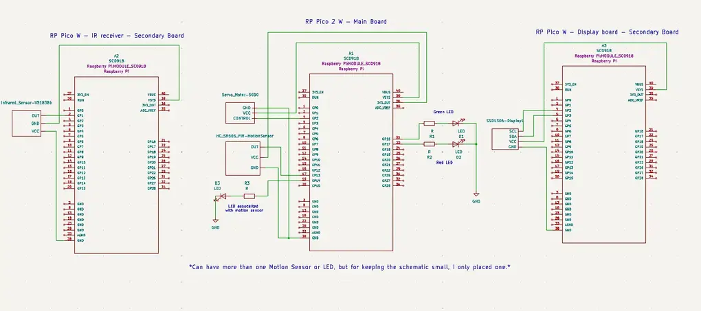

# Parking Simulator
Small scale parking lot simulation

:::info 

**Author**: Cristian Branet \
**GitHub Project Link**: https://github.com/UPB-PMRust-Students/project-cristibtz

:::

## Description

The project consists of a small scale simulation of a parking lot, that has a barrier, motion sensor and a display.

It was built using three boards, each having a separate role.
- Raspberry Pi Pico 2 W(main board)
- 2 x Raspberry Pi Pico W(secondary boards)

Besides these boards, I have also used a servo motor, motion sensors, a display and WIFI connectivity for inter-boards communications.

The idea of this project is that tasks are delegated and each board does something useful: one board receives IR commands from a remote and sends them via WIFI to the main board which opens the parking lot barrier. After the car parks, motion sensors controlled by the main board detect the event and send the information, also via WIFI, to the other secondary board which will display the parking lot space status on a display. When a car leaves, the display reflects the parking lot space changes accordingly. 

Having delegated tasks and the boards working in a detachable manner, it makes the process of handling one board's failure easier and the functionality of the whole assembly doesn't stop working 100%.

## Motivation

I built this project with the idea of simulating something that is common in real life and creating a parking lot simulation was the idea that I was sure I can bring to life. I created it because it was very practical and by researching about this topic, learning how to design the project and how components are interconnected with each other at this scale, it helped me understand how more complex systems are created. Another reason is that I like the idea of multiple components actively communicating with each other, thus the use of three boards and WIFI

## Architecture 

There are 3 important components in this project.

**RP Pico 2 W**:
 - Receives data from the IR sensor regarding the desired state of the barrier, either closed or opened. 
 - Based on received data, it moves the servo motor.
 - Receives data from one or more motion sensors, if a parking space is occupied.
 - Sends motion sensor's data to the board controlling the display.
 - Modifies LEDs based on the barrier's and sensor's state.

**RP Pico W no. 1**:
 - Receives IR signals from the remote.
 - Processes the signal and sends command corresponding to the signal to the main Pico 2.

**RP Pico W no. 2**:
 - Receives data from the main board.
 - Updates displayed details based on received data.

**LEDs**:
 - Controlled by the main board.
 - They are turned on or off based on the state of the components associated with them(ex: opened barrier - light green LED or sensor that detected motion - light red LED)

**Display**:
 - Displays data about the state of the parking lot, more exactly when a place is freed or how many spaces are available.

**IR remote and receiver**:
 - Classic IR remote which sends IR signals.
 - The IR sensor receives the signals and sends them to the IR receiving board via wire.

:::info
All the boards communicate with between them using WIFI. Each one connects to a designated network via WIFI. The boards have a TCP server setup on them to listen for incoming connections. In this way, if a certain part stops working as it should, necessary data can be sent manually to keep the functionality working(ex: barrier can be opened by sending the proper code to the main board without IR). All other components are wired between each other and programmed to communicate accordingly in the software part.
:::

## Log

### Week 5 - 11 May

Uploaded a part of the documentation for the project. Started working on each individual component's functionality and very soon planning to integrate them together. Also, still testing some functionalities, like infrared and display related stuff. 

### Week 12 - 18 May

### Week 19 - 25 May

## Hardware

Detail in a few words the hardware used.

### Schematics

### Bill of Materials

| Device | Usage | Price |
|--------|--------|-------|
| [2 x Raspberry Pi Pico WH](https://www.raspberrypi.com/documentation/microcontrollers/raspberry-pi-pico.html) | The secondary boards | [2 x 56 RON](https://ardushop.ro/ro/raspberry-pi/1945-raspberry-pi-pico-wh-wirelessheaders-6427854029621.html) |
| [Raspberry Pi Pico 2 W](https://www.raspberrypi.com/documentation/microcontrollers/pico-series.html#pico-2-family) | The main board | [40 RON](https://www.optimusdigital.ro/ro/placi-raspberry-pi/13327-raspberry-pi-pico-2-w.html) |
| [Infrared Sensor VS1838B](https://www.sivago.com.cn/upload/pdf/2022/VS1838B.pdf)| Receive IR signals | [1.77 RON](https://ardushop.ro/ro/comunicatie/758-receptor-infrarosu-vs1838b-6427854009722.html?)
| [Infrared Remote](https://ardushop.ro/ro/comunicatie/2358-kit-ir-telecomanda-receptor-cablu-6427854032461.html) | Send IR signals | [10 RON](https://ardushop.ro/ro/comunicatie/2358-kit-ir-telecomanda-receptor-cablu-6427854032461.html)|
| [SG90 Servo Motor](http://www.ee.ic.ac.uk/pcheung/teaching/DE1_EE/stores/sg90_datasheet.pdf) | Used to move the barrier | [12 RON](https://www.optimusdigital.ro/ro/motoare-servomotoare/2261-micro-servo-motor-sg90-180.html)
| [Display SSD1306](https://www.mouser.com/datasheet/2/1398/Soldered_333099-3395096.pdf?srsltid=AfmBOorDRNE8qWa15NdQ-YsWSvowft21MKXJtvTkFzpYuBffTD88NhD5) | Display parking space info | [34 RON](https://www.emag.ro/afisaj-oled-ssd1306-oled-i2c-compatibil-arduino-si-raspberry-pi-27x27x4-mm-albastru-c9/pd/D3C7C1YBM/?utm_medium=ios&utm_source=mobile%20app&utm_campaign=share%20product) | 
| [Motion Sensor PIR HC SR505](https://static.rapidonline.com/pdf/78-4110_v1.pdf) | Detects a parked car | [10 RON](https://ardushop.ro/ro/module/508-modul-mini-senzor-pir-hc-sr505-6427854005922.html)|
| [LEDs](https://ardushop.ro/ro/led-uri/293-467-led-5mm.html#/) | Used to signal certain events | [0.30 RON](https://ardushop.ro/ro/led-uri/293-467-led-5mm.html#/)|
| [Resistances](https://ardushop.ro/ro/componente-discrete/465-801-rezistor-1-4w-1-buc-alege-valoarea.html#) | Fundamental in every circuit | [0.10 RON](https://ardushop.ro/ro/componente-discrete/465-801-rezistor-1-4w-1-buc-alege-valoarea.html#)|

## Software

| Library | Description | Usage |
|---------|-------------|-------|
| [cyw43](https://github.com/embassy-rs/embassy/tree/main/cyw43) | Rust driver for the CYW43439 wifi+bluetooth chip | Used for WIFI communications between the boards |
| [embassy-rp](https://docs.embassy.dev/embassy-rp/git/rp235xb/index.html) | Access to the boards' peripherals | Used for various interactions between components and actions |
| [defmt](https://docs.rs/defmt/latest/defmt/) | Logging framework | Logged certain events and actions to the console for debugging |
| [fixed](https://docs.rs/fixed/latest/fixed/) | Provides fixed-point numbers | Used when configuring PWM |
## Links

1. [First time trying sensors on RP](https://murraytodd.medium.com/using-rust-embedded-to-capture-sensor-data-37db1f726d5c)
