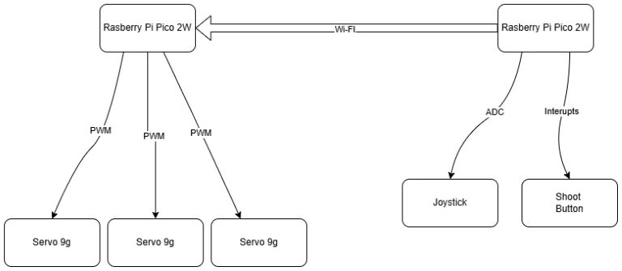
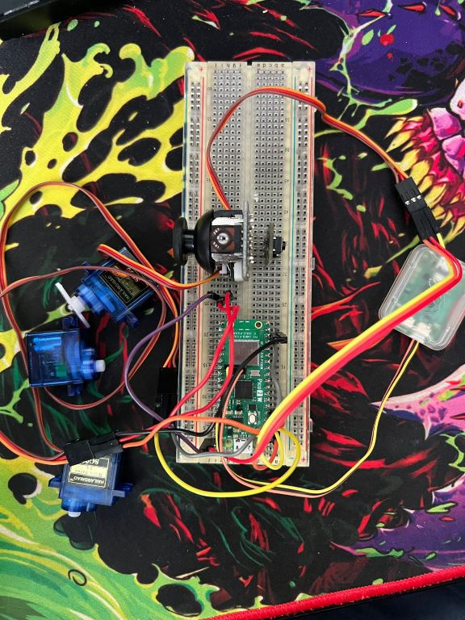
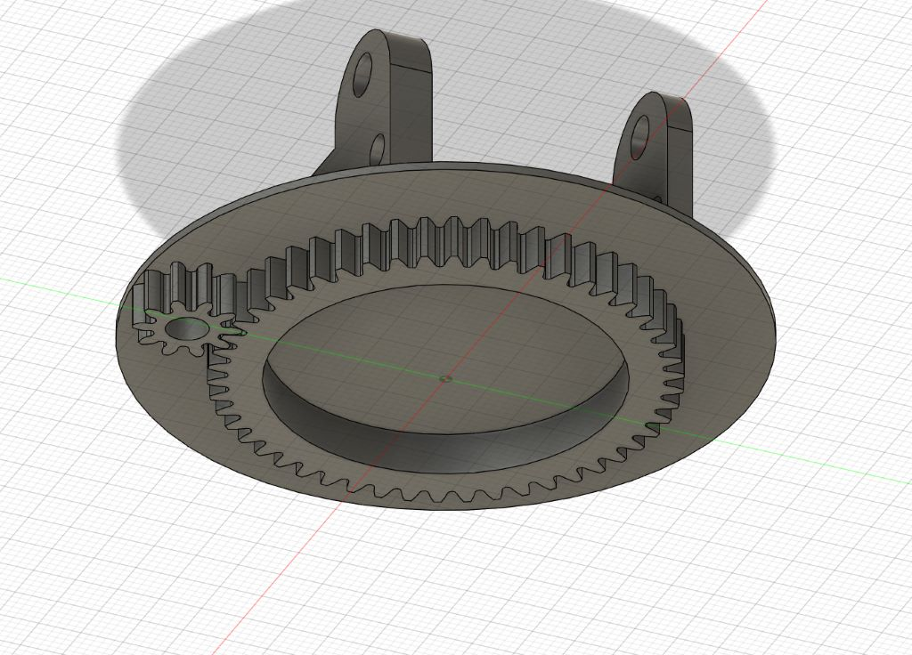
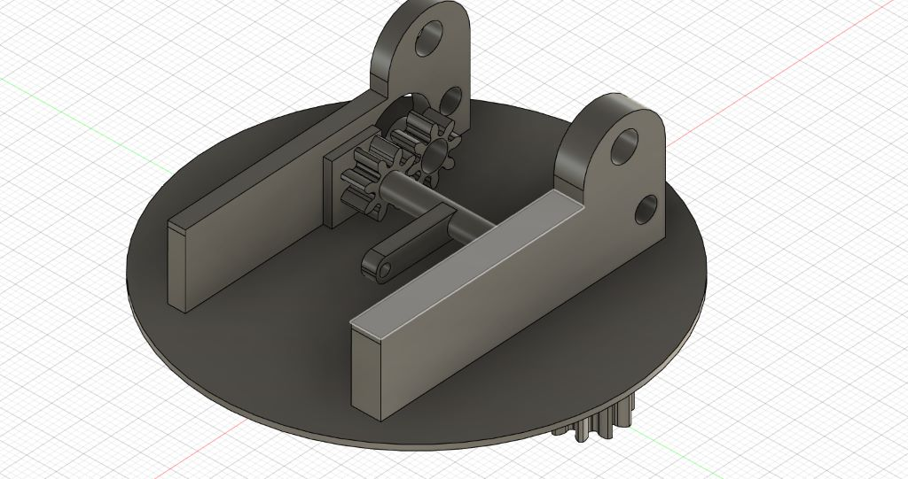
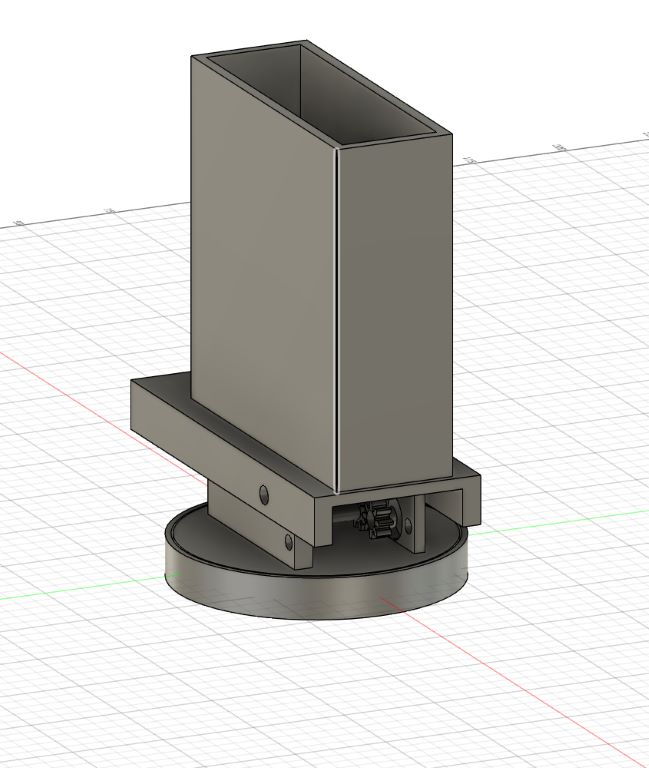
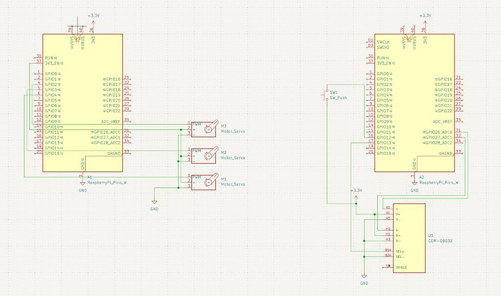

# Remote Control Turret
This project is based on the portable turrets you see in video games combined with my passion for Nerf Guns.

:::info

**Author**: Simpalean Daniel-Ioan \
**GitHub Project Link**: (https://github.com/UPB-PMRust-Students/project-DanielSimp305)

:::

## Description
My turret is a custom-made 3D design printed with an FDM printer that uses one raspberry-pi-pico 2W for its body and another one for its remote control, the turret itself will use some servos to move around and the remote control will use a joystick and some buttons for movement and shooting. Some laboratories I found relevent for the project I am implementing, are: 
- Lab 3: PWM and ADC
- Lab 7: Wi-Fi capabilities

## Motivation

My passion for Nerf guns ever since i was little combined with the tower based defense games that have slowly made their way into my free time have made this a perfect project choice for me. In the last period i also started working a lot with an FDM 3d printer and designing parts has become a passion of mine. I can't wait to finally use Fusion 360 to make something that will take some tinkering and will implemennt the digital parts of this turret, as I plan to do this as a future career. I think this project is going to help me  a lot and give me some inisght into what it is actually like to create, prototype, program and debug a project like this.

## Architecture 

### Schematic Diagram

A schematic diagram is provided to illustrate the connections and layout of the components. 

 
  **Raspberry Pi Pico 2W**
  - **Role**: Acts as the central controller for all functions.
  - **Connections**:
    - Interfaces with the Servos, joystick and Button.

 **Buttons**
  - **Interface**: GPIO (with interrupts)
  - **Connections**:
    - Connected to a GPIO pin for shooter control.
  - **Role**: Allow user to shoot.

 **Servos**
  - **Interface**: PWM capable for position control.
   - **Connections**:
    - Connected to GPIO2, 03, 04 pins for each servo.
  - **Role**: Move the turret along 2 axis and the fire mechanism

 **Joystick**
  - **Interface**: ADC 
  - **Role**: Sends signal to the servos alowing the movement of the turret.

## Log

<!-- write every week your progress here -->

### Week 5 - 11 May

### Week 6 - 18 May

### Week 19 - 25 May

## Hardware

The Raspberry Pi Picos 2W serve as the central microcontrollers for the Turret project. It provides the processing power and interfaces necessary to control various components of the turret. With its RP2350 processor and ample GPIO pins, the Pico 2W can handle tasks such as reading input from button and joystick, driving the servos for the movement, and handle the connection between the 2 picos using the 2.4GHz 802.11n wireless LAN.

This is the current progress of the Turret project. So far, i have prepared the servos and made a simple controling sofware for them and all that is missing is a second pico which will be ordered in the following week, i have also started to create my 3d design in Fusion 360 for all the parts that ill need to 3d print and im still working on how i can make the most simple yet advanced design for the movement.

### Schematics

This schematic, created with KiCad, illustrates the electronic design of the Turret project. It provides a detailed layout of the connections and components, ensuring accurate assembly and functionality.

### Bill of Materials

| Device                                                  | Usage                        | Price                           |
|---------------------------------------------------------|------------------------------|---------------------------------|
| [Raspberry Pi Pico 2W](https://www.optimusdigital.ro/ro/placi-raspberry-pi/13327-raspberry-pi-pico-2-w.html?search_query=pico+2&results=33) | The microcontroller         | [40 RON](https://www.optimusdigital.ro/ro/placi-raspberry-pi/13327-raspberry-pi-pico-2-w.html?search_query=pico+2&results=33) |
| [Micro ServoMotor](https://www.optimusdigital.ro/ro/motoare-servomotoare/26-micro-servomotor-sg90.html?search_query=servo&results=186) | Servos for movement        | [42 RON](https://www.optimusdigital.ro/ro/motoare-servomotoare/26-micro-servomotor-sg90.html?search_query=servo&results=186) |
| [Joystick](https://www.optimusdigital.ro/ro/senzori-senzori-de-atingere/742-modul-joystick-ps2-biaxial-negru-cu-5-pini.html?search_query=joystick&results=40)   | Joystick for control                 | [5 RON](https://www.optimusdigital.ro/ro/senzori-senzori-de-atingere/742-modul-joystick-ps2-biaxial-negru-cu-5-pini.html?search_query=joystick&results=40) |
| [Debug Probe](https://www.optimusdigital.ro/en/accesories/12777-raspberry-pi-debug-probe.html?search_query=debug&results=121) | Debug probe | [66 RON](https://www.optimusdigital.ro/en/accesories/12777-raspberry-pi-debug-probe.html?search_query=debug&results=121) |
| [Electronic components: LEDs, buttons, wires resistors and Breadboard](https://www.optimusdigital.ro/en/?gad_source=1&gclid=EAIaIQobChMIt8fHl_DuhQMVoj8GAB2CHwcJEAAYASAAEgLBrvD_BwE) | Electronic Components | [15-20 RON](https://www.optimusdigital.ro/en/?gad_source=1&gclid=EAIaIQobChMIt8fHl_DuhQMVoj8GAB2CHwcJEAAYASAAEgLBrvD_BwE) |

## Software

| Library | Description | Usage |
|---------|-------------|-------|
| [embedded-hal](https://github.com/rust-embedded/embedded-hal) | Hardware Abstraction Layer for embedded systems | Used for SPI and GPIO control |
| [embassy](https://github.com/embassy-rs/embassy) | Modern, lightweight, and safe async framework for embedded systems | Used for async task handling and peripheral management |
| [log](https://github.com/rust-lang/log) | Logging facade for Rust | Used for logging debug and informational messages |
| [panic-probe](https://crates.io/crates/panic-probe/) | A panic handler for embedded systems | Used for handling panics and debugging |
| [fixed](https://crates.io/crates/fixed) | Fixed-point arithmetic library | Used for precise timing calculations |

## Links

<!-- Add a few links that inspired you and that you think you will use for your project -->

1. [Insanely Fast Firing Nerf Gun](https://www.youtube.com/watch?v=3sb7GCFheK4)
2. [Web Controlled Camera Turret](https://www.instructables.com/Web-Controlled-Camera-Turret/)

