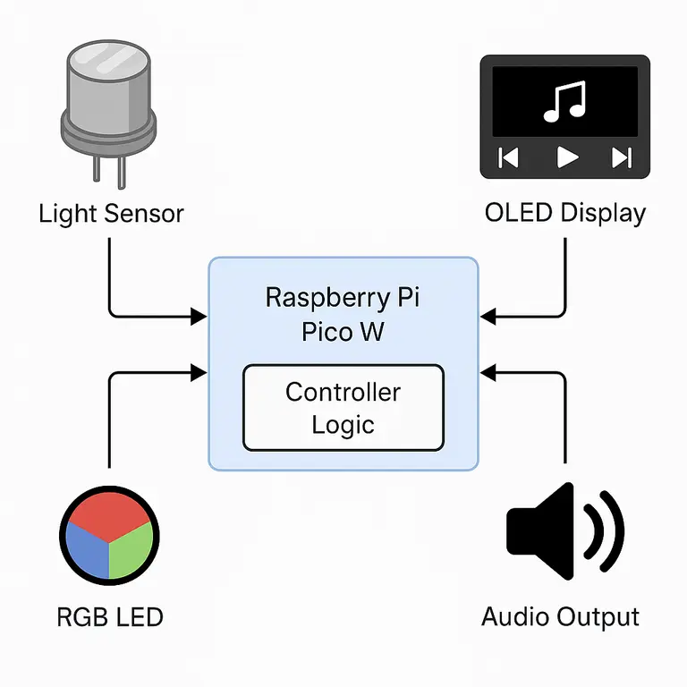
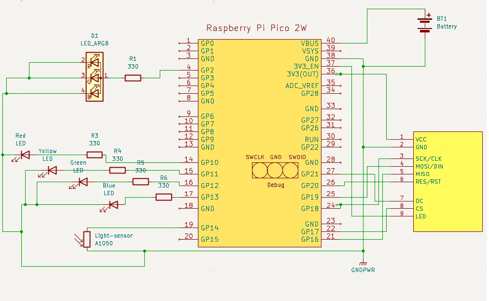

# Smart Station
An ambient-aware music controller built on Raspberry Pi Pico W using embedded Rust. 

:::info

**Author**: Daria Gladkykh \
**GitHub Project Link**: [Smart Station on GitHub](https://github.com/UPB-PMRust-Students/project-YrHoup)

:::

## Description

Smart Station is an IoT music controller that adjusts playback based on ambient light, offers a touchscreen interface, and includes clock and alarm features.

## Motivation

This project was chosen to explore embedded Rust for IoT applications, combining sensor-driven automation with an interactive user interface to create a practical, engaging device.

## Architecture

The Smart Station consists of the following main components:

- **Sensor Processing**: Handles input from the light sensor (LDR) to detect ambient brightness and trigger playback.
- **User Interface**: Manages the OLED touchscreen for music controls, clock display, and alarm settings.
- **Playback Control**: Coordinates music playback logic, integrating sensor data and user inputs.
- **Visual Feedback**: Drives the RGB LED to indicate system status and provide music-synced visuals.
- **Time Management**: Uses the RTC module for clock display and alarm scheduling.

**Connections**:
- The Sensor Processing component feeds brightness data to the Playback Control.
- The User Interface sends user commands (play, pause, etc.) to the Playback Control and queries the Time Management for clock/alarm data.
- The Playback Control updates the Visual Feedback component to reflect playback status.
- The Time Management component triggers the Playback Control for scheduled alarms.

## Log

### Week 5 - 11 May
What was already done:

- Set up Raspberry Pi Pico W with Rust toolchain.
- Configured GPIO for light sensor and RGB LED.
- Initial testing of LDR sensor for ambient light detection.

### Week 12 - 18 May
What I plan to do :
- Integrated SSD1306 OLED touchscreen with `embedded-graphics` for UI rendering.
- Implemented basic music controls (play, pause, next, previous).
- Added RTC module (DS3231) for timekeeping and tested clock display.

### Week 19 - 25 May
What I plan to do :
- Finalized playback logic based on light thresholds.
- Added alarm functionality with RTC scheduling.
- Optimized RGB LED pulsing for music feedback and completed system testing.

## Hardware

The Smart Station uses a Raspberry Pi Pico W, OLED touchscreen, light sensor, RGB LED, and RTC module for a responsive music control system.

### Schematics

### Bill of Materials

| Device                        | Quantity | Price (RON) |
|------------------------------|----------|-------------|
| [Raspberry Pi Pico W](https://www.optimusdigital.ro/ro/placi-raspberry-pi/13327-raspberry-pi-pico-2-w.html?search_query=pico+2w&results=33) | 3        | 120         |
| [TFT SPI Display ST7789V](https://www.emag.ro/display-tft-spi-2-4-inch-240x320-lcd-cu-touchscreen-driver-st7789v-arduino-emg178/pd/DXZMBSYBM/?ref=history-shopping_420684583_221614_1)      | 1        | 70          |
| [Light sensor (LDR)](https://www.sparkfun.com/products/9088)           | 1        | 10          |
| [Kit with LEDs, buttons, etc.](https://www.emag.ro/set-componente-electronice-breadboard-830-puncte-led-uri-compatibil-arduino-si-raspberry-pi-zz00044/pd/DRXG4XYBM/?ref=history-shopping_416665605_197770_1) | 1        | 60          |
| [RGB LED](https://www.adafruit.com/product/159)                      | 1        | 5           |
| [Jumper wires (various sets)](https://www.adafruit.com/product/1956)  | 1        | 40          |
| [Breadboards](https://www.optimusdigital.ro/)                 | 3        | 35          |
| **Total**                    |          | **340 RON** |

## Software

| Library | Description | Usage |
|---------|-------------|-------|
| [embedded-hal](https://github.com/rust-embedded/embedded-hal) | Hardware abstraction layer | Interfaces for GPIO, ADC, I2C, SPI |
| [rp2040-hal](https://github.com/rp-rs/rp2040-hal) | RP2040-specific HAL | Low-level Pico W peripheral access |
| [ssd1306](https://github.com/jamwaffles/ssd1306) | OLED display driver | Renders UI on SSD1306 OLED |
| [ds3231](https://crates.io/crates/ds3231) | RTC module driver | Timekeeping and alarm functionality |
| [fugit](https://github.com/rust-embedded/fugit) | Time-keeping utility | Precise timing for RTC and alarms |
| [embedded-graphics](https://github.com/embedded-graphics/embedded-graphics) | 2D graphics library | Draws UI elements on OLED |
| [rppal](https://github.com/golemparts/rppal) | Raspberry Pi Peripheral Access | GPIO and sensor communication |
| [cortex-m-rt](https://github.com/rust-embedded/cortex-m-rt) | ARM Cortex-M runtime | Interrupt handling and scheduling |

## Links

1. [Rust Embedded Book](https://docs.rust-embedded.org/book/) - Guide for embedded Rust development.
2. [Raspberry Pi Pico W Documentation](https://www.raspberrypi.com/documentation/microcontrollers/) - Official Pico W reference.
3. [Embedded Graphics Documentation](https://docs.rs/embedded-graphics/) - Resource for UI rendering.
4. [Probe-rs](https://probe.rs/) - Tooling for flashing and debugging Rust firmware.

