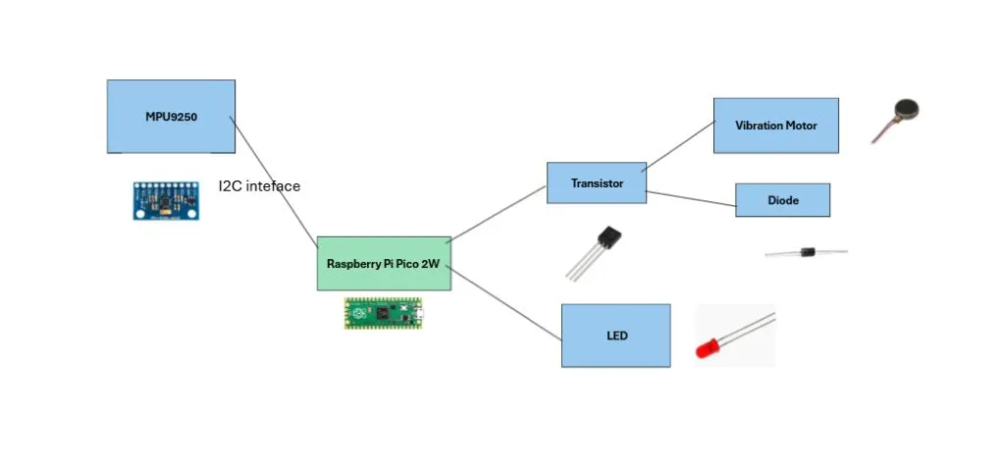

# Posture Monitor 

A simple device that alerts you when your posture is not proper.

:::info 

**Author**: Daria-Florentina Sanda \
**GitHub Project Link**: https://github.com/UPB-PMRust-Students/project-dariasanda11

:::

## Description

This project aims to be a wearable device that detects when the user is sloughing using an MPU9250 accelerometer and gyroscope sensor. When bad posture is detected, the system provides alerts via vibrations, and an LED turns on so the users knows they should improve their posture.

## Motivation

I chose this project because I spent a lot of time sitting at a desk in school and at home, often without maintaining proper posture. Besides not being aesthetically pleasing, bad posture can lead to various back problems that could be prevented with regular reminders to sit up straight. Also, a key factor in my decision for this project is that it uses sensor interaction and LED/motor control, which are elements that I found in the labs.

## Architecture 

- **MPU9250 Sensor**: It is used to detect the user's posture with the accelerometer and gyroscope that are connected to the Raspberry Pi Pico 2W via I2C
- **Raspberry Pi Pico 2W**:Acts as the central processing unit, interpreting signals from the MPU9250 sensor and controlling the other components
- **Vibration Motor and LED**: Used to alert the user and both are connected to the GPIO pins via a transistor for the motor and a resistor for the LED
- **Transistor**: Used to switch the motor on and off
- **Diode:**: Potects the circuit from back-voltage that could be generated when turning off the motor 
- **Resistors**: Used to limit the current where needed, such as for the LED and the base of the transistor
- Possible, not sure yet **Push Button**: Used for user input, such as to reset

## Log

### Week 5 - 11 May

### Week 12 - 18 May

### Week 19 - 25 May

## Hardware

### Schematics

### Bill of Materials
| Device | Usage | Price |
|--------|--------|-------|
| [2 Raspberry Pi Pico 2W](https://www.optimusdigital.ro/en/raspberry-pi-boards/13327-raspberry-pi-pico-2-w.html?srsltid=AfmBOoo4ziaX-vt_Q7PPrsLO06qiB90jc1E1yFdPfyxK6KjzQnSmybb1)| The microcontroller and one as a debugger| 80 lei|
| [MPU9250 Sensor ](https://www.optimusdigital.ro/ro/senzori-senzori-inertiali/865-modul-senzor-cu-9-axe-mpu9250.html?search_query=mpu9250&results=4)|  Detects posture | 47 lei
| [Breadboard HQ (830 Puncte)](https://www.bitmi.ro/breadboard-830-puncte-mb-102-10500.html?gad_source=1) | For assembling the prototype | 10 lei |
| [Breadboard wires](https://www.optimusdigital.ro/ro/fire-fire-mufate/12-set-de-cabluri-pentru-breadboard.html?gad_source=1&gbraid=0AAAAADv-p3DST91rElLA-XfsBRapIVDc8&gclid=Cj0KCQjw_dbABhC5ARIsAAh2Z-Q7wY5Dc3VlQMjPhqYZK-lz7i3YLGv_VIJlManglzcHRsDeNspufeIaAt3iEALw_wcB) | For connections | 8 lei
| [Vibration Motor](https://www.optimusdigital.ro/en/vibration-motors/693-motor-cu-vibratii-a1027.html?search_query=vibration+motor&results=36) | Alerts the user to correct their position| 2.5 lei |
| [NPN Transistor 2N2222](https://www.optimusdigital.ro/ro/componente-electronice-tranzistoare/935-tranzistor-s9013-npn-50-pcs-set.html?search_query=Tranzistor+NPN+2n2222+TO-92&results=9) | Controls motor via GPIO pin | 0.17 lei |
| [1N4007 Diode](https://www.optimusdigital.ro/ro/componente-electronice-diode/7457-dioda-1n4007.html?search_query=Dioda+1N4007&results=4) | Protects against voltage spikes | 0.49 lei |
| [Female-Female Jumper Wires (10 pcs, 30 cm)](https://www.optimusdigital.ro/ro/fire-fire-mufate/883-set-fire-mama-mama-10p-30-cm.html?search_query=Fire+Colorate+Mama-Mama+%2810p%2C+30+cm%29&results=11) | For connections | 4.79 lei |
| [Female-Male Jumper Wires (10 pcs, 20 cm)](https://www.optimusdigital.ro/ro/fire-fire-mufate/214-fire-colorate-mama-mama-10p.html?search_query=Fire+Colorate+Mama-Tata+%2810p%29+20+cm&results=6) | For connections | 4 lei |
| [Push Button 6x6x6 mm](https://www.optimusdigital.ro/ro/butoane-i-comutatoare/1119-buton-6x6x6.html?search_query=Buton+6x6x6&results=1) | For manual reset | 0.36 lei |
| [LED ](https://www.optimusdigital.ro/ro/optoelectronice-led-uri/696-led-rou-de-3-mm-cu-lentile-difuze.html?search_query=led+&results=779) | Alerts the user to correct their position | 0.39 lei |
| [330 Ohm Resistor](https://www.optimusdigital.ro/ro/componente-electronice-rezistoare/859-rezistor-025w-330.html) | Limits current to LED | 0.10 lei |
| [1k Ohm Resistor](https://www.optimusdigital.ro/ro/componente-electronice-rezistoare/859-rezistor-025w-1k.html) | Limits current | 0.10 lei |
## Software

| Library | Description | Usage |
|---------|-------------|-------|
| [embassy](https://docs.rs/embassy/latest/embassy/) | Async runtime for embedded systems | Manages tasks and system operations |
| [embassy-hal](https://docs.rs/embassy-hal/latest/embassy_hal/) | Hardware Abstraction Layer | Interfaces with Raspberry Pi Pico 2W hardware |
| [embassy-executor](https://docs.rs/embassy-executor/latest/embassy_executor/) | Task executor | Handles asynchronous tasks such as sensor polling |
| [embassy-time](https://docs.rs/embassy-time/latest/embassy_time/) | Timing module | Delays and periodic alerts (vibration, LED blinking) |
| [embassy-gpio](https://docs.rs/embassy-gpio/latest/embassy_gpio/) | GPIO management | Manages GPIO pins for LED, vibration motor, and button |
| [embassy-sync](https://docs.rs/embassy-sync/latest/embassy_sync/) | Sync primitives | Coordinates between concurrent tasks safely |
| [defmt](https://docs.rs/defmt/latest/defmt/) | Logging and formatting | Debug logging with minimal runtime overhead |
| [panic-probe](https://docs.rs/panic-probe/latest/panic_probe/) | Panic handler | Handles runtime panics and reports via RTT |
| [embedded-hal](https://docs.rs/embedded-hal/latest/embedded_hal/) | Abstraction layer | Interfaces with peripherals like I2C and digital IO |
| [rp2040-hal](https://docs.rs/rp2040-hal/latest/rp2040_hal/) | HAL for the Raspberry Pi Pico's RP2040 chip | Direct access to microcontroller peripherals |
| [mpu9250-driver](https://crates.io/crates/mpu9250) | Driver for the MPU9250 IMU sensor | Reads posture data from the accelerometer and gyroscope via I2C |

## Links
1.https://www.mdpi.com/2076-3417/14/19/9075