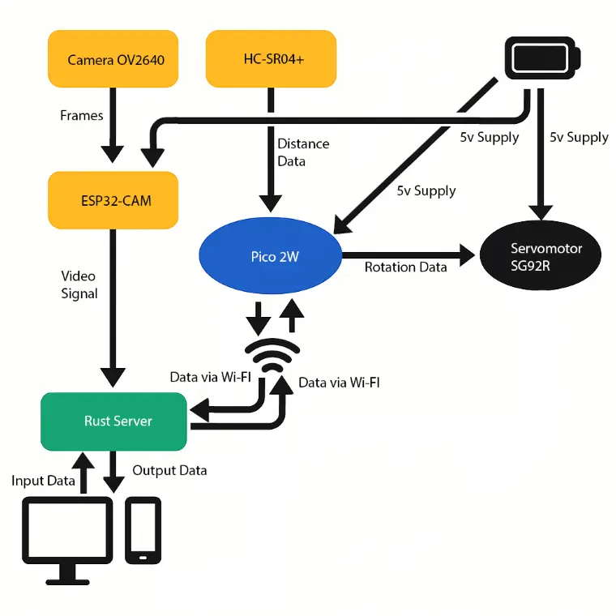
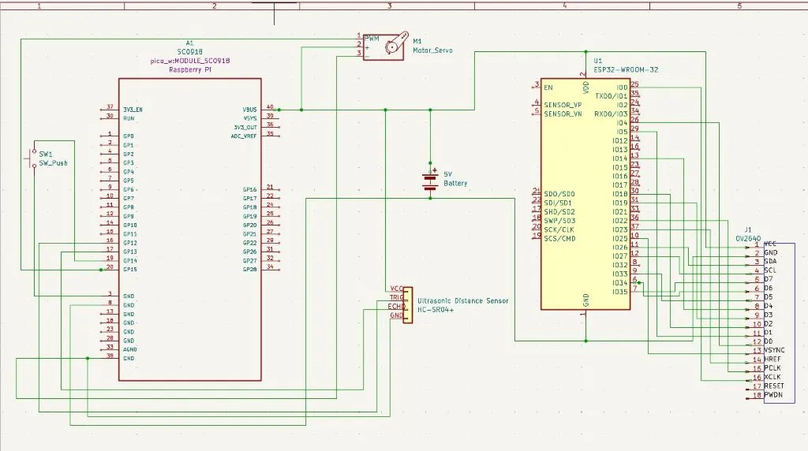

# Pet Feeder
Automatic food dispenser for animals

:::info 

**Author**: JUVERDEANU Diana-Maria \
**GitHub Project Link**: https://github.com/UPB-PMRust-Students/project-JuverdeanuDianaMaria

:::

## Description

I grew up surrounded by pets  at home, and one recurring challenge we faced as a family was planning vacations. We often had to limit our travel plans because it was difficult to find someone reliable to feed our pets while we were away. This inspired me to design a Smart Pet Feeder system built using a Raspberry Pi Pico 2W and Rust. The feeder dispenses food at scheduled times or remotely via wi-fi control. To make pet care more convenient and give pet owners more freedom and peace of mind when traveling.

## Motivation

I believe this could be a practical solution to real-life problems I've faced. Even if the project might seem a bit silly, I’m excited to have fun working with the hardware I've invested in.

## Architecture 

Main Components:

Raspberry Pico 2W: Acts as the central processing unit for the Pet Feeder, controlling the sensors and motors.

Ultrasonic Distance Sensor HC-SR04+: Detects when a pet is near the feeder.

Servo Motor SG92R: Drives the mechanism to dispense the pet food.

Power Supply: Provides the necessary power to all components at 5V.
 
ESP32-CAM with OV2640: Used for capturing real time images.

Wi-Fi Module: Facilitates communication with external devices.

Connection Overview:

The Raspberry Pi Pico 2W acts as the central controller of the Pet Feeder, directly interfacing with the ultrasonic distance sensor (HC-SR04+) and the SG92R servomotor. When the pet approaches the feeder, the sensor detects proximity, and the Pico 2W automatically activates the servo to dispense food. The Pico also runs a Wi-Fi access point and hosts a local web server, allowing the owner to manually trigger feeding from a browser interface. Capturing real time images is handled separately by the ESP32-CAM, which streams real-time footage to the owner. The SG92R servomotor is responsible for physically releasing food from a dedicated container, and is powered by a 5V supply. The ultrasonic distance sensor also helps ensure that food is only dispensed when the pet is actually near. This architecture ensures seamless interaction between sensing, actuation, and user control, enabling both automatic and manual feeding through reliable, Wi-Fi-based communication, with the Pico 2W orchestrating core functions while the ESP32-CAM provides independent visual monitoring.

## Log

<!-- write your progress here every week -->

### Week 5 - 11 May
Bought hardware parts. Mounted the Raspberry Pi Pico 2W on breadboard. Wrote the code for the ultrasonic sensor (HC-SR04+). Tested PWM for SG92R servo motor. 
### Week 12 - 18 May

### Week 19 - 25 May

## Hardware

Pico 2W - brain of the Pet Feeder

Servo Motor - delivers food

Ultrasonic Distance Sensor HC-SR04+ - detects pet

OV2640 - captures images

Power Supply - battery 5V

### Schematics

### Bill of Materials

| Device | Usage | Price |
|--------|--------|-------|
| [Raspberry Pi Pico 2W](https://www.raspberrypi.com/documentation/microcontrollers/pico-series.html) | The microcontroller | [39 RON](https://www.optimusdigital.ro/ro/placi-raspberry-pi/13327-raspberry-pi-pico-2-w.html?gad_source=1&gbraid=0AAAAADv-p3BYbmtR0U4AB0vh3IzVtnhct&gclid=Cj0KCQjw2tHABhCiARIsANZzDWpC5jvEeQu1M-4aPsGLz0h_VUH-1oeoOhxuRTAuJpaxGS73j50IQKQaAkviEALw_wcB) |
| [Servo Motor SG92R](https://www.optimusdigital.ro/ro/motoare-servomotoare/5706-servomotor-sg92r-9g-25-kgcm-48-v.html?search_query=servo&results=186) | The Servo Motor | [20 RON](https://www.optimusdigital.ro/ro/motoare-servomotoare/5706-servomotor-sg92r-9g-25-kgcm-48-v.html?search_query=servo&results=186) |
| [Raspberry Pi Pico Debug probe](https://www.raspberrypi.com/documentation/microcontrollers/debug-probe.html) | Pico Debug Probe | [66 RON](https://www.optimusdigital.ro/en/accesories/12777-raspberry-pi-debug-probe.html?srsltid=AfmBOoriZm_41cmeLX01a0sdURol6ev5VejcC2lXUkNHwUqBqNHQ_65P) |
| [HC-SR04+ Distance sensor](https://www.optimusdigital.ro/en/ultrasonic-sensors/2328-senzor-ultrasonic-de-distana-hc-sr04-compatibil-33-v-i-5-v.html?search_query=sr04&results=20) | Used to measure the distance from the pet to the device | [15 RON](https://www.optimusdigital.ro/en/ultrasonic-sensors/2328-senzor-ultrasonic-de-distana-hc-sr04-compatibil-33-v-i-5-v.html?search_query=sr04&results=20) |
| [ESP32-CAM with OV2640 Camera](https://www.emag.ro/microcontroler-esp32-cam-cu-ov2640-wi-fi-si-camera-bluetooth-5v-2-e-009/pd/DSTDNLMBM/?utm_source=mobile%20app&utm_medium=ios&utm_campaign=share%20product) | Microcontroler ESP32-CAM with OV2640 | [47 RON](https://www.emag.ro/) |

## Software

| Library | Description | Usage |
|---------|-------------|-------|
| embassy | Async executor and HAL | Asynchronous framework for embedded Rust |
| embassy-executor | Task executor | Runs your async tasks like HTTP server, distance monitor, button |
| embassy-net | Networking stack | Enables static IP, Wi-Fi AP, TCP server on the Pico W |
| embassy-rp | RP2040 HAL via Embassy | Access to GPIO, PWM, ADC, timers for Raspberry Pi Pico 2W |
| embassy-time | Async time handling | Provides Timer:: after() and Instant:: now ( ) |
| static_cell | Static memory allocation | Needed for safely creating global resources (Wi-Fi stack) |
| defmt, defmt-rtt | Debugging and logging | For logging with low overhead in embedded systems |
| panic-probe | Panic handling for no_std | Lightweight panic handler for debug output |
| esp-idf-sys | ESP-IDF system bindings | Access to ESP32-CAM system internals (C functions) |
| esp-idf-hal | Hardware Abstraction Layer for ESP32 | GPIOs, clocks, etc. on the ESP32 |
| esp-idf-svc | High-level ESP32 services | Starts the HTTP stream server on ESP32-CAM |
| log | Standard Rust logging | Logs messages from ESP32 camera logic |
| camera_config | Custom module (in Rust) | get-camera_config() function to configure the OV2640 camera | 

## Links

<!-- Add a few links that inspired you and that you think you will use for your project -->

1. [link](https://example.com)
2. [link](https://example3.com)
...
