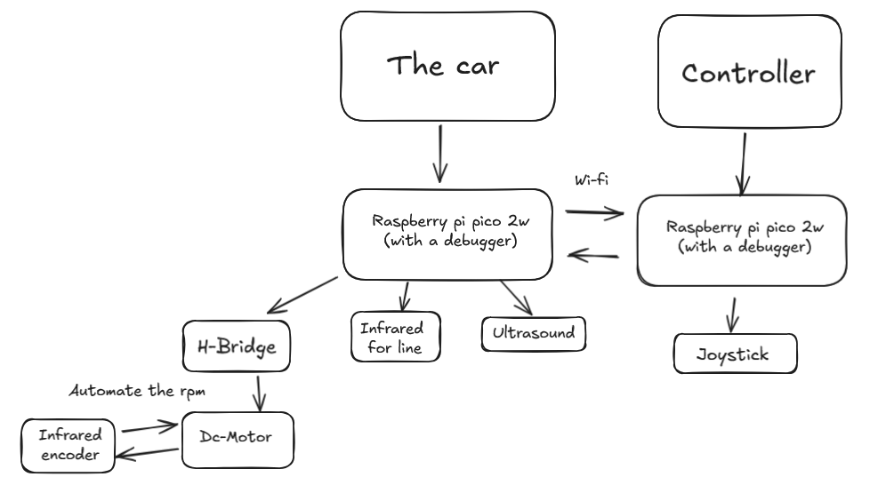
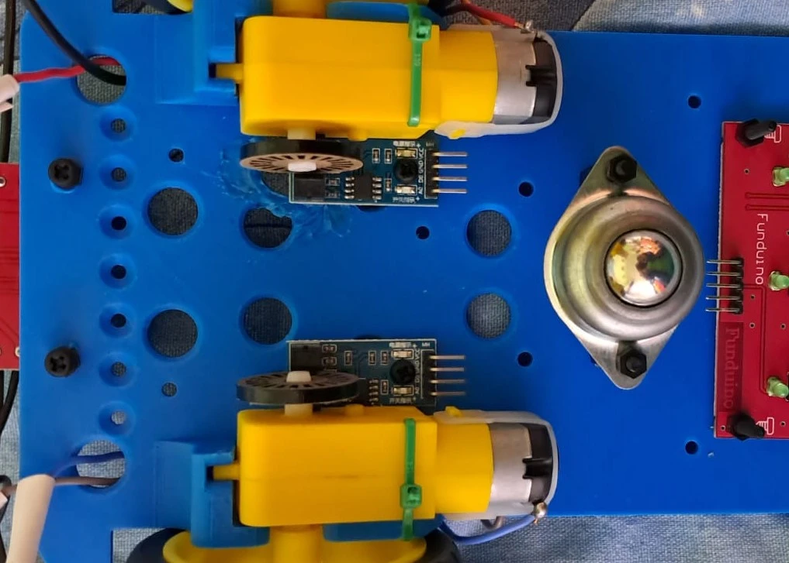
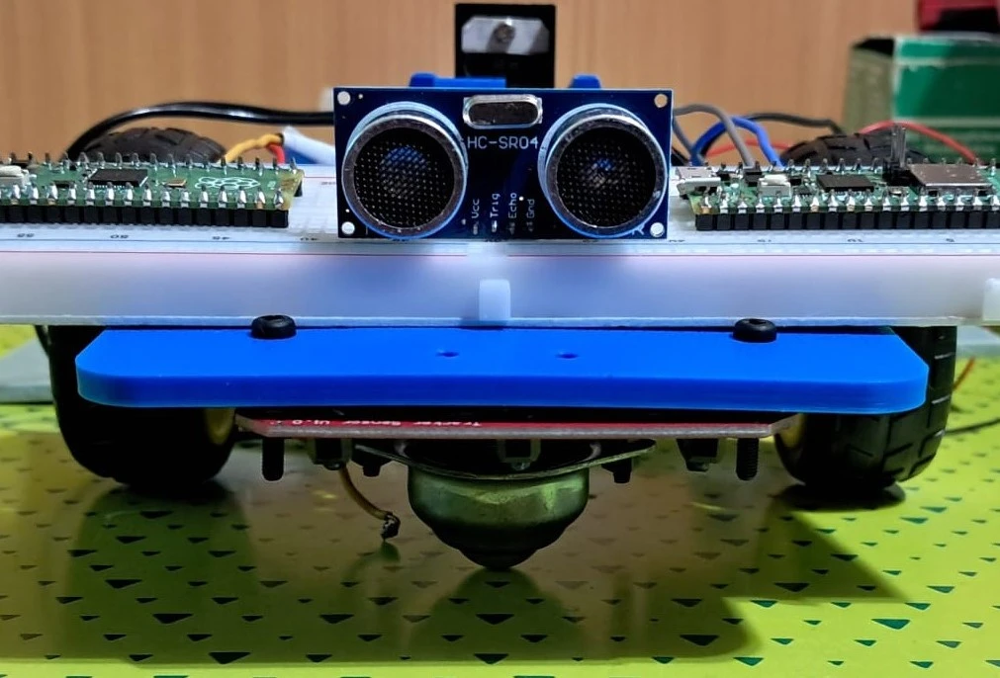
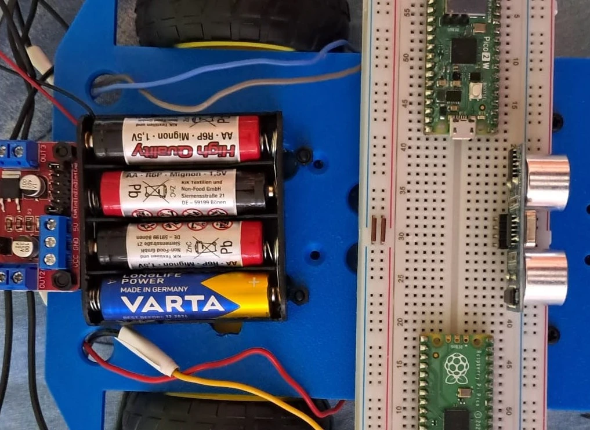
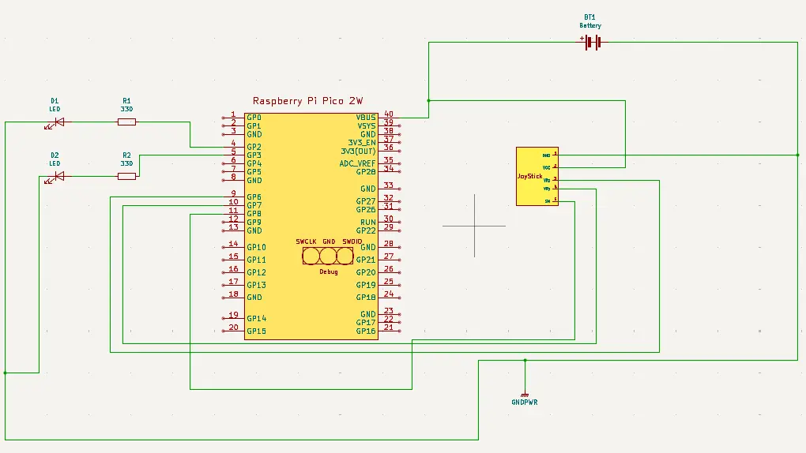

# Infracon
A line following car that can detect objects and "give the wheel" to a controller through the use of Wi-fi

:::info

**Author**: Popescu Emanoil-Florian-Sinisha\
**GitHub Project Link**: https://github.com/UPB-PMRust-Students/project-Florian6524

::::
## Description
This project is build using 2 Raspberry Pi Pico 2W boards, one for the car itself and one for its controller, 2 DC motors to move the car, an L298N Motor drive to control them, together with encoders for the wheels to regulate the rpm. It also has a matrice with infrared sensors to detect the line and an HC-SR04 ultrasound sensor to detect objects. The controller als0 has a joystick to control the direction of the car

## Motivation
I always liked to play with remote controlled cars, driving arount the house and avoiding all the people and chairs that came in my way. I wanted to recreate that childhood feeling with my project, and add a little touch of engineering by using the ideas of the "Line follower" and "Obstacle avoider" to give myself a bigger challenge

## Architecture 

### Schematic Diagram:

This is how the schematic looks like, drawn in Excallidraw at the moment of the project aproval part:

-**Raspberry Pi Pico 2W**: Used as the "brain" of the whole project, the board on the car being in charge of the motors and the line and object sensors, and on the controller taking the inputs from the joystick and transfering them through wi-fi to the other board.

-**LEDs**: One blue and one red on each part of the project, red meaning that is in control(on the car when the line follower is dictating the way to go) and blue when the controller is giving the moving instructions. On the controller, it will be blue while the car is moving by itself and red when it takes control.

-**Joystick**: In charge of giving the direction the car should follow when controlled, chosen due to its simplistic implementation.

-**InfraRed matrice**: Incorporates a Center, Left and Right sensor, said to get a better detection and reading of the line that is to be followed.

-**L298N**: Driver used in order to control the DC Motors and give a better handle on their movement.

-**HC-SR04**: Used to detect objects at a given distance and chosen because of its performance and easy way to be implemented using a special crate in rust.

-**Encoders**: Sensors to detect and compute, using an encoder wheel, the rpm of the DC Motors and regulate it to be constant on any surface.

-**DC Motors**: The main part that of the car itself, being the driving force that lets the car move in the environment

**Connections**:

**Car**:

-Raspberry PI Pico 2W is connected to the L298N through the GPIO pins\
-DC Motors are connected to the L298N through the output gates provided on its side\
-Encoders, Infrared matrice, LEDs and HC-SR04 are connected to the Raspberry PI Pico 2W board through the GPIO pins as well\
-The Power supply is connected here to the L298N

**Controller**:

-Raspberry PI Pico 2W is connecting the JoyStick through the GPIO pins, as wel as the LEDs\
-The Power supply is connected here to the board through the VBUS pin

## Log
### Week 5 - 11 May
After my project was aproved, I printed my chasis, gathered all my components and started assembling the car, as well as look for all the necessary software and crates I would need for this project

### Week 12 - 18 May

### Week 19 - 25 May

## Hardware

-All the parts of the car and controller have been specified above, so I will explain how all the parts come together as the hardware. The main idea is that the car should be able to follow a black line on a white road and keep to it till the HC-SR04 discovers an object blocking the way. At that point, the car, with the help of the Raspberry board, through the use of Wi-fi, will give controll to the other Raspberry board and, in the controller, by using the joystick, the driver can move the car back on the road and away from the obstacle. When this change occurs, as stated, the blue and red LEDs will interchange on each board. In order to give back control to the car, the user will have to press a button on the controller, such that the car can go back to following the black line. Aditionally, the driver can press another button to get control of the car even if there was no object dettected. Now, coming to the part of the motors, their movement and direction will be regulated by the L298N H-bridge and, together with the encoders, so will their rpm. A good example of why I use the encoders is the following: say we are in a ramp, if we want to climb it, we need more power to keep the rpm stable, if we want to go down, we need less power to keep the rpm stable, so we use the encoders to atomate this process.

### Schematics
KiCad Scheme

The Car:

The Controller:

### Bill of Materials
| Device                                                  | Usage                        | Price                           |
|---------------------------------------------------------|------------------------------|---------------------------------|
| [2 x Raspberry Pi Pico 2W](https://www.raspberrypi.com/documentation/microcontrollers/pico-series.html) | The microcontroller | [79.32 RON](https://www.optimusdigital.ro/en/raspberry-pi-boards/13327-raspberry-pi-pico-2-w.html?srsltid=AfmBOoo5CQdoi14-RbmA_YJJrNUG1hPBzlSKgPdCOYv9U2PgJdK3bPwM) |
[2 x Raspberry Pi Pico 1](https://www.raspberrypi.com/documentation/microcontrollers/pico-series.html) | The boards used as debuggers | [60.00 RON](https://www.emag.ro/microcontroller-raspberry-pi-rp2040-pico/pd/DKQQWNMBM/)
[Biaxial Joystick Module](https://www.laskakit.cz/user/related_files/joystick_module.pdf) | Joystick  | [5.35 RON](https://www.optimusdigital.ro/en/touch-sensors/742-ps2-joystick-breakout.html?search_query=0104110000006585&results=1) |
[L298M](https://components101.com/modules/l293n-motor-driver-module) | The motor driver | [10.99 RON](https://www.optimusdigital.ro/en/brushed-motor-drivers/145-l298n-dual-motor-driver.html?search_query=l298n&results=4) |
[Line sensor](https://www.optimusdigital.ro/en/others/1266-bara-cu-3-senzori-de-linie.html?search_query=line+sensors&results=240) | Matrice with 3 line sensors | [13.99 RON](https://www.optimusdigital.ro/en/others/1266-bara-cu-3-senzori-de-linie.html?search_query=line+sensors&results=240) |
[HC-SR04](https://www.edn.com/hc-sr04-datasheet/) | The object detection sensor | [14.99 RON](https://www.optimusdigital.ro/en/ultrasonic-sensors/2328-senzor-ultrasonic-de-distana-hc-sr04-compatibil-33-v-i-5-v.html?search_query=sr04&results=20) |
[2 x DC Motors](https://www.optimusdigital.ro/en/others/139-gearmotor-with-wheel.html?search_query=motor+with+wheel&results=168) | Motors with wheels  | [29.98 RON](https://www.optimusdigital.ro/en/others/139-gearmotor-with-wheel.html?search_query=motor+with+wheel&results=168) |
[2 x Encoders](https://www.optimusdigital.ro/en/optical-sensors/171-u-shape-photoelectric-sensor.html?search_query=encoder+sensor&results=38) | Encoding sensors for the motors(datasheet on the last part of the link) | [16.98 RON](https://www.optimusdigital.ro/en/optical-sensors/171-u-shape-photoelectric-sensor.html?search_query=encoder+sensor&results=38) |
[Ball Wheel](https://www.optimusdigital.ro/en/ball-casters/74-ball-caster.html?search_query=ball+caster&results=13) | Third wheel to make the car stable | [3.95 RON](https://www.optimusdigital.ro/en/ball-casters/74-ball-caster.html?search_query=ball+caster&results=13) |
[2 x Battery holder](https://www.optimusdigital.ro/en/battery-holders/2806-battery-holder-4-x-r6.html?search_query=battery+holders&results=37) | Holders for the power supply | [18.86 RON](https://www.optimusdigital.ro/en/battery-holders/2806-battery-holder-4-x-r6.html?search_query=battery+holders&results=37) |
[10 cm 40p Male-Female Wires](https://www.optimusdigital.ro/en/wires-with-connectors/653-10-cm-40p-male-to-female-wire.html?search_query=male-male&results=808) | Male-female Wires | [5.99 RON](https://www.optimusdigital.ro/en/wires-with-connectors/653-10-cm-40p-male-to-female-wire.html?search_query=male-male&results=808)

All other components such as the rezistors, breadboards, buttons and LEDs were included in a set I previously owned and couldn't find its price to add it to the bill of materials

## Software

| Library | Description | Usage |
|---------|-------------|-------|
[embassy-rp](https://docs.embassy.dev/embassy-rp/git/rp235xb/index.html) | Access to the pheripherals | Initializing and interacting with peripherals
[embassy-executor](https://docs.embassy.dev/embassy-executor/git/cortex-m/index.html) |An async/await executor designed for embedded usage | Used for asynchronous programming |
[embassy-time](https://docs.embassy.dev/embassy-time/git/default/index.html) | Timekeeping, delays and timeouts. | Used for delays |
[cyw43](https://github.com/UPB-PMRust/lab-2025) | Module from the labs to use the Wi-fi | Used to facilitate the comunication between the 2 boards through Wi-fi
[hcsr04_async](https://crates.io/crates/hcsr04_async) | Crate for the HC-SR04 | Used for getting the data from the object detection sensor
[embedded-hal-async](https://docs.rs/embedded-hal-async/latest/embedded_hal_async/) | An asynchronous Hardware Abstraction Layer (HAL) for embedded systems |Provides a standard way to use hardware asynchronously across different embedded devices
[gpio](https://docs.embassy.dev/embassy-rp/git/rp235xb/gpio/index.html) | GPIO management | Used for controlling GPIO pins
[adc](https://docs.embassy.dev/embassy-rp/git/rp235xb/adc/index.html) | ADC driver | User for controlling the joystick and the Ir sensors
[pwm](https://docs.embassy.dev/embassy-rp/git/rp235xb/pwm/index.html) | PWM module | Used for controlling the L298N

## Links 
1. [Line following car with Pi Pico](https://www.instructables.com/Line-Follower-Robot-With-Pi-Pico/)
2. [Obstacle avoider](https://www.youtube.com/watch?v=BhrrNtihIe8)
3. [Wi-fi on Raspberry Pi Pico(just the idea)](https://www.youtube.com/watch?v=GiT3MzRzG48)

