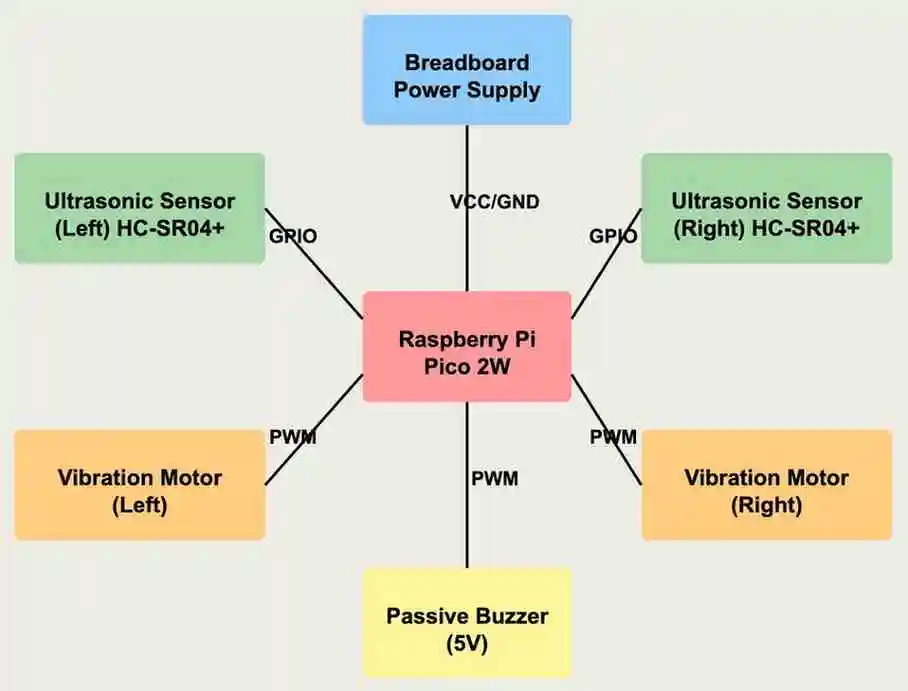

# VisionAssist

A wearable electronic device that enhances spatial awareness for visually impaired individuals using ultrasonic sensors and haptic feedback.

:::info  

**Author**: Mahmoudzadeh Hosseini Fatemeh Sadat

**GitHub Project Link**: https://github.com/UPB-PMRust-Students/project-FaMaHo

:::

## Description

The Accessible Navigation Assistant is a wearable electronic device designed to enhance spatial awareness for visually impaired individuals. The core function of this system is to detect obstacles in the user's path using ultrasonic sensors and provide real-time haptic feedback through strategically positioned vibration motors.

## Motivation

Traditional mobility aids like white canes provide limited environmental information. This project aims to complement these tools by offering additional spatial awareness through a different sensory channel (haptic feedback), improving confidence and safety during navigation, particularly in unfamiliar environments.

## Architecture

### Schematic Diagram
This is the diagram that illustrates the components and their connections.

**Raspberry Pi Pico 2W**
- **Role**: Acts as the central processing unit of the system — it processes sensor data from ultrasonic sensors and controls the haptic feedback mechanisms.
- **Connections**: GPIO pins for connecting to ultrasonic sensors, PWM outputs for vibration motors and buzzer, and WiFi module for remote configuration.

**Ultrasonic Sensors (HC-SR04+)**
- **Interface**: GPIO
- **Role**: Detect obstacles in the user's path from different angles, providing distance measurements.
- **Connections**: Two sensors connected to GPIO pins on the Raspberry Pi Pico 2W. Left sensor and right sensor provide directional obstacle detection.

**Vibration Motors**
- **Interface**: PWM
- **Role**: Provide directional haptic feedback to indicate obstacles. A left-side vibration indicates an obstacle on the left, while a right-side vibration indicates an obstacle on the right.
- **Connections**: Connected to PWM-capable GPIO pins on the Raspberry Pi Pico 2W for variable intensity feedback.

**Passive Buzzer**
- **Interface**: PWM
- **Role**: Provides optional audio feedback to complement the haptic system, alerting the user to obstacles.
- **Connections**: Connected to a PWM-capable GPIO pin on the Raspberry Pi Pico 2W.

**Power Management**
- **Role**: Provides portable power for the system, enabling mobility and independence.
- **Connections**: Breadboard power supply connected to all components in the system.

  

## Log

<!-- write your progress here every week -->

### Week 5 - 11 May
- Completed initial project documentation including architecture design, component selection, and system schematic
- Successfully connected and tested ultrasonic sensors (HC-SR04+) with the Raspberry Pi Pico 2W
- Implemented basic distance measurement functionality using the sensors
- Set up and tested the passive buzzer for audio feedback
- Created a simple program to verify component functionality and basic communication between sensors and output devices
- Established development environment with necessary Rust crates and Embassy framework

### Week 12 - 18 May

### Week 19 - 25 May
  

## Hardware

The Accessible Navigation Assistant uses a Raspberry Pi Pico W as its core microcontroller, which connects to ultrasonic sensors for obstacle detection and vibration motors for haptic feedback. The system is designed to be compact, lightweight, and wearable, with a focus on power efficiency for prolonged use.

### Schematics

[Place your KiCAD schematics here]
  
### Bill of Materials

  

| Device | Usage | Price |
|--------|-------|-------|
| [Raspberry Pi Pico 2W](https://www.optimusdigital.ro/ro/placi-raspberry-pi/13327-raspberry-pi-pico-2-w.html?search_query=Raspberry+pi+pico&results=26) | Central processing unit with built-in WiFi | 40 lei |
| [Raspberry Pi Pico 2W](https://www.optimusdigital.ro/ro/placi-raspberry-pi/13327-raspberry-pi-pico-2-w.html?search_query=Raspberry+pi+pico&results=26) | Debugger | 40 lei |
| [Senzor Ultrasonic de Distanţă HC-SR04+ (Compatibil 3.3 V şi 5 V) (2×)](https://www.optimusdigital.ro/ro/senzori-senzori-ultrasonici/2328-senzor-ultrasonic-de-distana-hc-sr04-compatibil-33-v-i-5-v.html) | Obstacle detection | 15 lei each (30 lei total) |
| [Motor cu Vibraţii de 4 x 8 mm (2×)](https://www.optimusdigital.ro/ro/motoare-motoare-cu-vibratii/2348-motor-cu-vibraii-de-4-x-8-mm.html) | Haptic feedback | 3 lei each (6 lei total) |
| [Buzzer Pasiv de 5 V](https://www.optimusdigital.ro/ro/audio-buzzere/634-buzzer-pasiv-de-5-v.html) | Optional audio feedback | 1,50 lei |
| [Breadboard HQ (400 Points)](https://www.optimusdigital.ro/ro/prototipare-breadboard-uri/44-breadboard-400-points.html) | Prototyping | 4,50 lei |
| [Breadboard HQ (830 Puncte)](https://www.optimusdigital.ro/en/breadboards/8-breadboard-hq-830-points.html) | Additional prototyping | 10 lei |
| [Breadboard Power Supply](https://www.optimusdigital.ro/en/linear-regulators/61-breadboard-source-power.html) | Power management | 5 lei |
| [Breadboard Jumper Wires Set](https://www.optimusdigital.ro/en/wires-with-connectors/890-set-fire-tata-tata-40p-30-cm.html) | Connections | 7,99 lei |
  

## Software

  

| Library | Description | Usage |
|---------|-------------|-------|
| [embassy-rs](https://github.com/embassy-rs/embassy) | Framework for async programming on embedded devices | Core framework for the system |
| [embassy-rp](https://github.com/embassy-rs/embassy) | Hardware abstraction layer for Raspberry Pi Pico | Interface with Pico hardware |
| [embassy-time](https://github.com/embassy-rs/embassy) | Timing utilities for the Embassy framework | Managing sensor polling intervals |
| [embassy-net](https://github.com/embassy-rs/embassy) | Networking stack for Embassy | WiFi communication |
| [cyw43](https://github.com/embassy-rs/embassy) | Driver for the Pico W's WiFi chip | WiFi functionality |
| [embedded-hal](https://github.com/rust-embedded/embedded-hal) | Hardware abstraction layer for embedded systems | Standardized hardware interface |
| [static-cell](https://github.com/embassy-rs/static-cell) | Allocation of static memory | Memory management |
| [heapless](https://github.com/japaric/heapless) | Data structures without dynamic memory allocation | Efficient data handling |
| [defmt](https://github.com/knurling-rs/defmt) | Debugging formatted output | Development and debugging |
| [panic-probe](https://github.com/knurling-rs/panic-probe) | Panic implementation for debugging | Error handling |
  

## Links

<!-- Add a few links that inspired you and that you think you will use for your project -->

1. [Belt Aid for Visualy Impaired Person](https://www.instructables.com/Belt-Aid-for-Visualy-Impaired-Person/)
2. [MOST-Ultrasound-based-Navigational-Support](https://github.com/apetsiuk/MOST-Ultrasound-based-Navigational-Support)