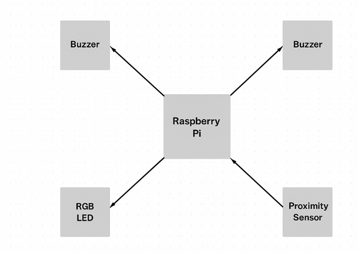
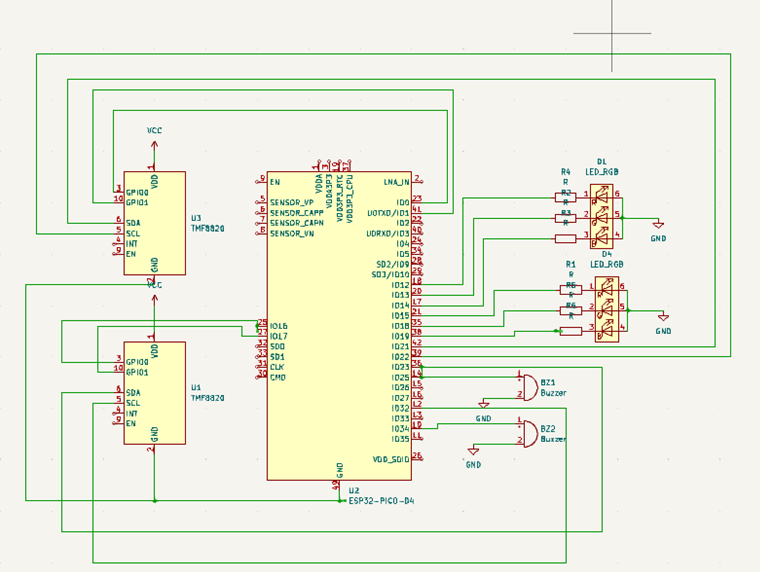

# Parking Sensor
Rust-powered smart parking sensor system using Raspberry Pi Pico for real-time distance detection and alerts.

:::info 

**Author**: Filip Denisa-Mihaela \
**GitHub Project Link**: https://github.com/UPB-PMRust-Students/project-FilipDenisa

:::


## Description

The project consists of a smart parking sensor system developed using a Raspberry Pi Pico, designed to detect the presence and proximity of nearby objects. When an object comes within a predefined range, the system emits light signals through a series of RGB LEDs. As the object moves closer—starting from green (safe), progressing to yellow (warning), and culminating in red (danger), it indicates the closest possible distance.
The light-based feedback and audio alerts simulates real-life parking assistance systems, providing an intuitive indication of distance to help avoid collisions. The system is built using the Rust programming language, offering memory safety and precise control ideal for embedded applications.
While this version of the project does not include barrier control, it lays the groundwork for potential extensions, such as integrating a motor-driven barrier that could react to sensor input.

Objectives:
- To design a functional parking sensor system.
- To integrate multiple hardware components with raspberry pi wh.
- To develop software for real-time processing of sensor data and output control.

Purpose:
The project covers the design, implementation, and testing of a parking sensor system suitable for use in vehicles.


## Motivation
The idea for this project came from a common everyday challenge—parking in tight spaces without accidentally bumping into something. Whether you're a new driver or just trying to fit into a cramped spot, it can be stressful not knowing exactly how close you are to an obstacle. This project aims to make that experience easier and safer by using simple sensors and lights to give clear, real-time feedback about how close you’re getting to an object.
It’s built around the Raspberry Pi Pico and programmed in Rust, which not only makes it efficient and reliable, but also a great way to explore the world of embedded systems. The goal isn’t just to build a useful tool, but to show how accessible technology can be used to solve real problems in a practical and hands-on way. At its core, this parking sensor system is about using tech to reduce stress, prevent accidents, and make everyday life a little smoother.


## Architecture




## Log

<!-- write every week your progress here -->

### Week 5 - 30 March: decided the project theme and searched for informations.


### Week 6 - 6 April: bought all the components and soldered the raspberry pi and started creating the prototype.


### Week 7 - 13 April: started on the documentation. 


### Week 8 - 20 April: started on the hardware and software milestones of the project. 


### Week 9 - 27 April: edited the documentation to submit the first milestone. 

### Week 10 - 4 May: I submitted the documentation and made the necessary changes.

### Week 11 - 11 May:

### Week 12 - 18 May:


## Hardware

Raspberry Pi Pico: Acts as the main controller, processing input from sensors and triggering outputs (buzzers, LEDs).

Proximity Sensors (2x): Detect the distance to nearby objects and send that data to the Raspberry Pi.

RGB LEDs (2x): Provide visual feedback—colors change (e.g., green to red) based on how close an object is.

Buzzers (2x): Emit sound alerts that increase in frequency as the object gets closer, enhancing the warning system.

  

  
  
## Schematics


Schematic of the project on KiCad Application.




## Bill of Materials

<!-- Fill out this table with all the hardware components that you might need.

The format is 
```
| [Device](link://to/device) | This is used ... | [price](link://to/store) |

```

-->


| Device | Usage | Price |
|--------|-------|-------|
| [Raspberry Pi Pico W](https://www.raspberrypi.com/documentation/microcontrollers/raspberry-pi-pico.html) | The microcontroller | [56.23 RON](https://ardushop.ro/en/home/2819-raspberry-pi-pico-wh.html) |
| [LCD 1602](https://www.optimusdigital.ro/ro/optoelectronice-lcd-uri/62-lcd-1602-cu-interfata-i2c-si-backlight-galben-verde.html?search_query=lcd&results=211) | LCD screen to display distance information | 14.99 RON |
| [LED RGB](https://www.optimusdigital.ro/ro/optoelectronice-led-uri/484-led-rgb-anod-comun.html?search_query=drgb&results=126&HTTP_REFERER=https%3A%2F%2Fwww.optimusdigital.ro%2Fro%2Fcarte%3Fcontroller%3Dsearch%26orderby%3Dposition%26orderway%3Ddesc%26search_query%3Drgb%26submit_search%3D) | For visual indication of distance | 0.99 RON |
| [Digital Infrared Obstacle Sensor Module](https://www.optimusdigital.ro/ro/senzori-senzori-optici/4347-modul-senzor-de-obstacole-digital-cu-infrarosu-reglabil-3-100-cm.html?search_query=senzor+infrarosu&results=121&HTTP_REFERER=https%3A%2F%2Fwww.optimusdigital.ro%2Fro%2Fcarte%3Fcontroller%3Dsearch%26orderby%3Dposition%26orderway%3Ddesc%26search_query%3Dsenzor%2Binfrarosu%26submit_search%3D) | Distance measurement | 19.99 RON |
| [Buzzer](https://www.optimusdigital.ro/ro/audio-buzzere/12247-buzzer-pasiv-de-33v-sau-3v.html?search_query=buzzer&results=62) | For auditory alerts | 1.95 RON |
| [Breadboard kit](https://www.optimusdigital.ro/ro/kituri/2222-kit-breadboard-hq-830-p.html?search_query=breadboard&results=145) | To connect the hardware | 22 RON |


## Software

| Library | Description | Usage |
|---------|-------------|-------|
| [PWM](https://docs.embassy.dev/embassy-nrf/git/nrf52840/pwm/index.html) | Pulse-Width Modulation | Used for Buzzer |
| [GPIO](https://docs.embassy.dev/embassy-stm32/git/stm32c011d6/gpio/index.html) | GPIO  | Used for interacting with GPIO Pins |
| [embassy-usb-logger](https://docs.embassy.dev/embassy-usb-logger/git/default/index.html) | USB Logger for embassy | Used for logging messages over USB |


## Links

1. [Pinouts for RP](https://pinout.xyz/pinout/1_wire)
2. [Rust for Embedded Systems](https://docs.rs)
3. [Embassy Documents](https://embassy.dev/book/dev/index.html)
4. [Rust For Embedded Wyliodrin](https://embedded-rust-101.wyliodrin.com)

...
