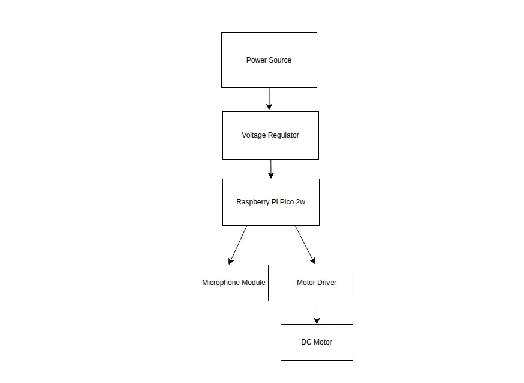
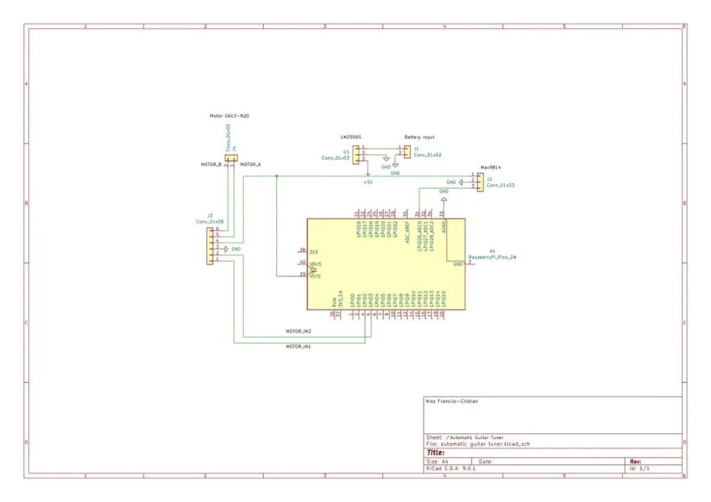

# Automatic Guitar Tuner

Automatically tunes your guitar after plucking a string.

:::info

**Author**: Niss Francisc-Cristian \
**GitHub Project Link**: https://github.com/UPB-PMRust-Students/project-Niss-Francisc-Cristian.git

:::

## Description

The “Automatic Guitar Tuner” is a device designed to assist guitarist in tuning their instruments accurately and fast. It works by detecting the frequency of a played string and adjusting the tuning peg automatically using a motor.

## Motivation

Tuning a guitar can be considered a frustrating process for a lot of guitar players, especially beginners. The motivation behind this project is to simplify that experience using a compact and portable device. This project combines my two main passions those being Music and IT.

## Architecture 

The Raspberry Pi Pico 2W acts as the central control unit, managing the input and output of the system.

The Max9814 Microphone Module captures the sound of a vibrating guitar string and sends the analog signal to the Pico for processing.

The Voltage Regulator provides a stable 5V power supply to the entire system, including the Pico, motor driver, and microphone.

The L9110S Motor Driver receives control signals from the Pico and adjusts the direction of the connected motor accordingly.

The DC Motor is connected to a 3D printed tuning peg gripper and rotates to tune the guitar string automatically.

## Log

### Week 5 - 11 May

### Week 12 - 18 May

### Week 19 - 25 May

## Hardware

Raspberry Pi Pico 2W – acts as the central controller, running the logic to read audio input, process frequency, and control the motor.

Max9814 Electret Microphone Amplifier Module – captures the sound of the vibrating guitar string and outputs an amplified analog signal.

GA12-N20 DC Motor (6V, 30RPM) – rotates the guitar tuning peg to adjust string tension.

L9110S Motor Driver Module – allows the Pico to control the motor direction using two GPIO pins.

LM2596S DC-DC Step-Down Converter – steps down the 8.4V from the battery to a stable 5V used by the entire system.

2S LiPo Battery (7.4V, 1300mAh) – provides portable power for the motor and control circuitry.

Generic Electronics Kit – includes breadboard, jumper wires, resistors, and connectors needed for prototyping.

3D Printed Tuning Peg Handle – a custom attachment mounted to the motor shaft to grip and turn the tuning peg of the guitar.

The system is powered by a 2S LiPo battery which supplies approximately 7.4V. This is stepped down using the LM2596S module to a regulated 5V that powers the Raspberry Pi Pico 2W, motor driver, microphone, and the motor itself via the L9110S.

### Schematics

### Bill of Materials

| Device | Usage | Price |
|--------|--------|-------|
| [Raspberry Pi Pico 2W](https://www.raspberrypi.com/documentation/microcontrollers/raspberry-pi-pico.html) | The microcontroller | [39,66 RON](https://www.optimusdigital.ro/en/raspberry-pi-boards/13327-raspberry-pi-pico-2-w.html) |
| [MAX9814 Microphone Module](https://www.analog.com/media/en/technical-documentation/data-sheets/max9814.pdf) | The microphone | [24,90 RON](https://ardushop.ro/ro/module/717-modul-amplificator-microfon-cu-agc-max9814-6427854009111.html) |
| [GA12-N20 DC Motor](https://www.handsontec.com/dataspecs/GA12-N20.pdf)| The motor | [26,18 RON](https://www.emag.ro/micro-motor-cu-reductie-dc-6v-30rpm-ga12-n20-ai1083/pd/DVWFTFMBM/) |
| [L9110S Motor Driver Module](https://www.laskakit.cz/user/related_files/l9110_2_channel_motor_driver.pdf) | The motor driver module | [14,28 RON](https://www.emag.ro/modul-l9110s-groundstudio-bcrrqi-gs/pd/D1D6RZYBM/) |
| [LM2596S DC-DC Step Down Module](https://www.ti.com/lit/ds/symlink/lm2596.pdf) | Voltage regulator | [12,99 RON](https://www.optimusdigital.ro/en/adjustable-step-down-power-supplies/1108-lm2596hv-dc-dc-step-down-module.html) |
| 2S LiPo 8V Battery | The battery | [95 RON](https://www.emag.ro/acumulator-lipo-gens-ace-g-tech-soaring-7-4-v-2200-ma-30c-xt60-2s2200p30/pd/DD3GY7YBM/) |
| General Electronics Kit | Breadboard,wires,capacitors,resistors,etc. | [60,38 RON](https://www.emag.ro/set-componente-electronice-breadboard-830-puncte-led-uri-compatibil-arduino-si-raspberry-pi-zz00044/pd/DRXG4XYBM/) |

## Software

| Library | Description | Usage |
|---------|-------------|-------|
| [`rp-hal`](https://docs.rs/rp-hal/latest/rp_pico/) | HAL implementation for the Raspberry Pi Pico | GPIO, ADC, and hardware setup |
| [`embedded-hal`](https://docs.rs/embedded-hal/latest/embedded_hal/) | Embedded hardware abstraction layer | General embedded hardware interface |
| [`microfft`](https://docs.rs/microfft/latest/microfft/) | Fast Fourier Transform library for microcontrollers | Converts time-domain audio samples into frequency domain |
| [`defmt`](https://docs.rs/defmt/latest/defmt/) | Logging crate optimized for embedded systems | Debugging values during development |
| [`cortex-m`](https://docs.rs/cortex-m/latest/cortex_m/) | Low-level Cortex-M functionality | Optional: interrupt and timing control |

## Links

1. [Rust on Raspberry Pi Pico](https://docs.rust-embedded.org/rust-on-embedded/index.html)
2. [embedded-hal Documentation](https://docs.rs/embedded-hal/latest/embedded_hal/)
3. [microfft Crate for Frequency Analysis](https://docs.rs/microfft/latest/microfft/)
4. [Max9814 Microphone Datasheet (Analog)](https://www.analog.com/media/en/technical-documentation/data-sheets/max9814.pdf)
5. [Raspberry Pi Pico 2W Docs](https://www.raspberrypi.com/documentation/microcontrollers/raspberry-pi-pico.html)
