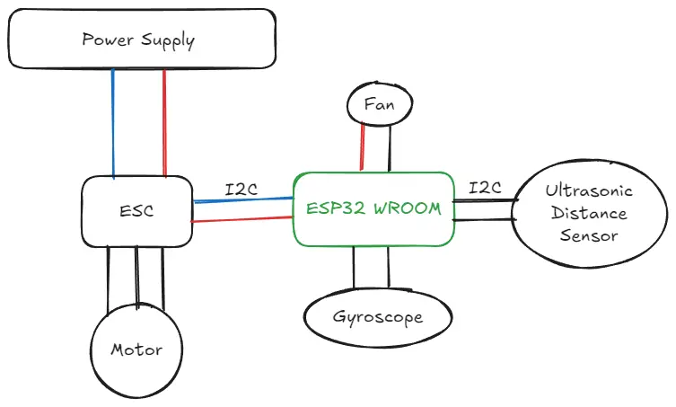
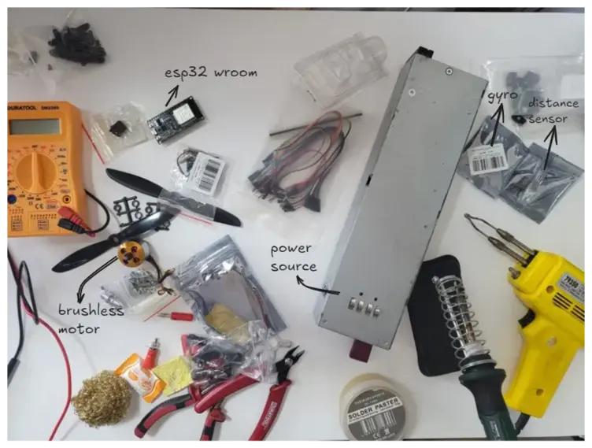
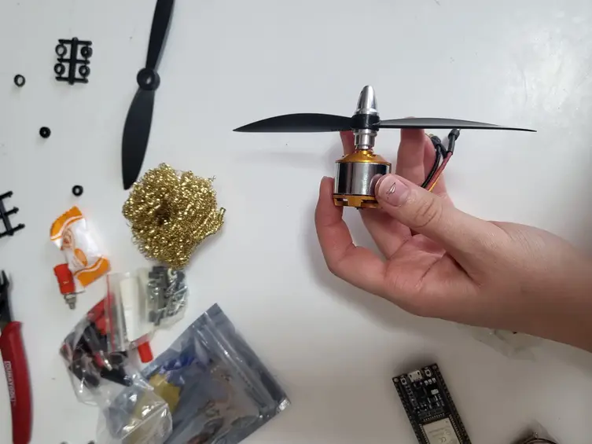
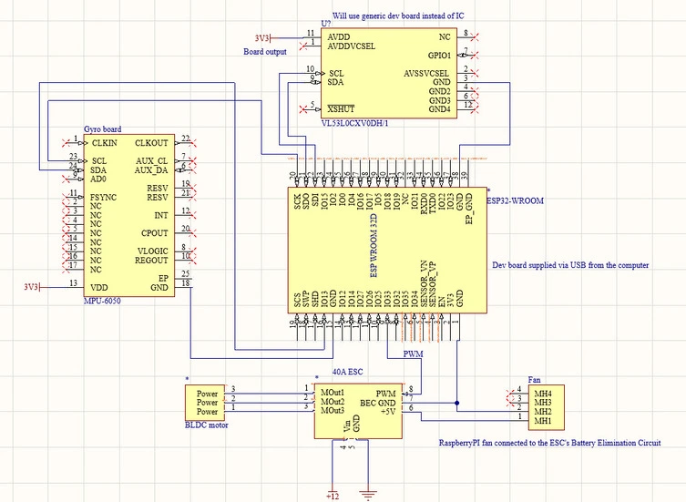

# Educational PID Demonstration
A visual representation of Control System application: a moving arm.

:::info

**Author**: Gabriela-Florentina Alexa \
**GitHub Project Link**: https://github.com/UPB-PMRust-Students/project-Eiline04

:::

## Description

The project I am about to make has the purpose of illustrating PID principles, using an ESP32 WROOM to balance a fan-powered arm. The system consists of a distance sensor used to follow the hand of the user. For educational purposes, I am also going to use a gyroscope in order to get stability feedback. Furthermore, the fan is moved with a brushless motor (which is connected to the microcontroller via an ESC - electronic Speed Controller). Thus, this project has a high impact on demonstrating how a real-time control system works.

## Motivation

My interest in PID control began in high school, when I first used it to optimize the trajectory of an autonomous robot (as I was part of a robotics team). Since then, I've been fascinated by how control systems are applied in everyday life-whether in cars, drones, or even household appliances like thermostats. This project allows me to dive deeper into a topic I find both intellectually challenging and personally rewarding. By combining sensors, real-time feedback, and control algorithms, I aim to better understand and illustrate the principles behind modern automation. I am excited to help the 16 y.o. version of me understand the 'magic' behind the programming tools she had used in high school, but also create a visual representation of a very cool principle, so that others can understand it too.

## Architecture 

The architecture of the system is designed to demonstrate PID control principles in a real-time environment. The main components of the architecture are:

- **Sensor System**: A **distance sensor** detects the user's hand position, acting as the system input.
- **Controller**: An **ESP32 WROOM** microcontroller runs the PID algorithm and processes data from the sensors (gyro and distance sensor).
- **Feedback System**: A **gyroscope** provides real-time orientation data for stability feedback. It will also provide data that can be used to draw informative graphics.
- **Actuator System**: A **brushless motor**, connected to the ESP32 via an **ESC (Electronic Speed Controller)**, adjusts the fan's thrust to balance the arm.
- **Power Supply**: Delivers sufficient current (~20A) to drive the motor. (It has bult-in off swith in case of danger)
- **Cooler**: Makes sure the ESC is not overheating (althought it is very unlikely to heat, as I am going to use 20-30A).

These components are interconnected to form a closed-loop control system that continuously adjusts the fan thrust to maintain balance (to keep the arm at a constant position) based on the data provided by the distance sensor.

## Log

### Week 5 - 11 May

### Week 12 - 18 May

### Week 19 - 25 May

## Hardware

## Hardware

The project uses the following hardware components:

- **ESP32 WROOM**: Core microcontroller for real-time PID control logic.
- **VL53L0X Distance Sensor**: Detects the position of the user's hand (I²C).
- **MPU6050 Gyroscope**: Provides angular velocity and acceleration data for stability feedback (I²C).
- **Brushless Motor (BLDC) + ESC (Electronic Speed Controller)**: Acts as the actuator that drives the fan to balance the arm, controlled via PWM from the ESP32.
- **Cooler (Fan)**: Controlled via a GPIO pin to prevent overheating.
- **Power Source (12V / 20A)**: Powers the ESC -> brushless motor.
- **Physical Frame (wood/cardboard)**: Holds all components and supports the motion of the balancing arm.

## Components and materials - Photos

### Schematics 

### Bill of Materials

| Device | Usage | Price |
|--------|--------|-------|
| [ESP32 WROOM Dev Board](https://sigmanortec.ro/placa-dezvoltare-esp32-cu-wifi-si-bluetooth) | Main microcontroller | 40.00 RON |
| [GY-521 (MPU6050)](https://sigmanortec.ro/Modul-giroscopic-si-accelerometru-3-axe-GY-521-p126016326) | Gyroscope and accelerometer module | 24.16 RON |
| [VL53L0X Time-of-Flight Sensor](https://sigmanortec.ro/Modul-VL53L0X-timp-de-zbor-p126182383) | Measures distance to user's hand | 16.76 RON |
| [ESC 30A](https://sigmanortec.ro/Controller-Motor-ESC-30A-p139673260) | Controls brushless motor | 47.15 RON |
| [Brushless Propeller Set 6045 CW/CCW](https://sigmanortec.ro/Elice-drona-6045-p139673087) | Attached to motor for thrust | 9.84 RON |
| [Brushless Motor (BLDC)](https://www.emag.ro/motor-brushless-rqiurpn-a2212-kv2200-3-17mm-pentru-drone-diy-22-brushlessmotors/pd/DNJRFSYBM/) | Keeps the hand in needed position. | 45 RON |
| [5V Fan (Raspberry Pi, 3030)](https://sigmanortec.ro/ventilator-5v-raspberry-pi-02a-3030) | Used as a cooler | 8.04 RON |
| [4mm Banana Connector (Female, Red) x3](https://sigmanortec.ro/Mufa-Banana-4mm-Mama-Negru-p209899296) | Power connection | 5.22 RON |
| [4mm Banana Connector (Female, Black) x3](https://sigmanortec.ro/Mufa-Banana-4mm-Mama-Negru-p209899296) | Ground connection | 5.22 RON |
| [4mm Banana Connector (Male, Red) x3](https://sigmanortec.ro/Conector-Banana-4mm-Rosu-p209905097) | Power cable end | 2.94 RON |
| [4mm Banana Connector (Male, Black) x3](https://sigmanortec.ro/Conector-Banana-4mm-Negru-p128736095) | Ground cable end | 2.94 RON |
| [Hinge](physical shop) | Makes the arm mobile. | 8 RON |

**Total estimated cost: ~215 RON**

## Software

| Library | Description | Usage |
|---------|-------------|-------|
| [`embassy-rs`](https://github.com/embassy-rs/embassy) | Asynchronous embedded framework | Handles async tasks on the ESP32 |
| [`esp-idf-sys`](https://github.com/esp-rs/esp-idf-sys) | Rust bindings for ESP-IDF | Enables low-level interaction with ESP32 |
| [`i2cdev`](https://github.com/rust-embedded/linux-embedded-hal) | I2C device communication | Communicates with distance sensor and gyroscope |
| [`pwm`](https://docs.rs/pwm/) | Pulse Width Modulation | Controls ESC for motor speed |
| [`serialport`](https://docs.rs/serialport/) | Serial communication | Debugging and data logging |

---

## Links

1. [PID Explained](https://www.youtube.com/watch?v=UR0hOmjaHp0) – Useful introduction to PID control.
1. [Idea](https://www.instagram.com/reel/DHL0V8ZMKM4/) – From here I have the project idea.
1. [ESP32 & BLDC Motor](https://www.electronicsforu.com/electronics-projects/wireless-bldc-motor-control-esp32) – Useful tutorial.

