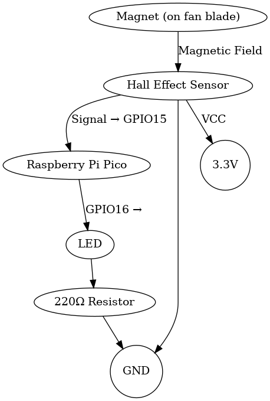
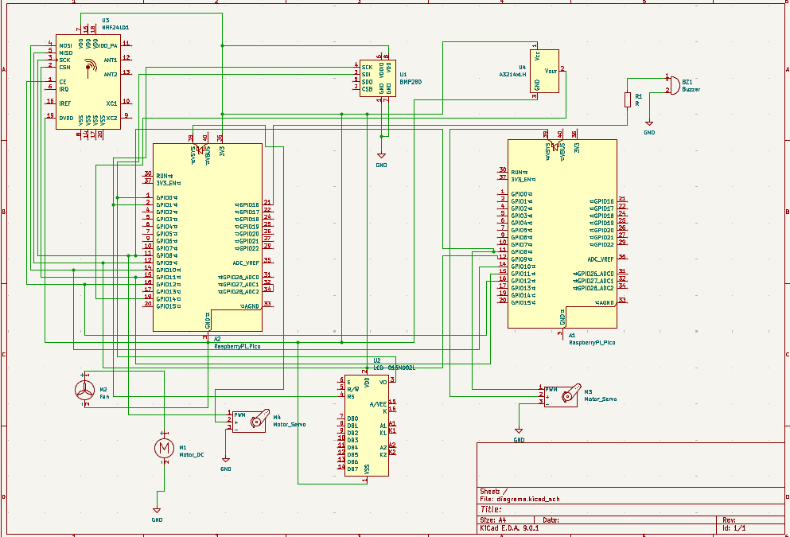

# Fan Rotation Detection with Door Control
If a fan exceeds a certain number of RPMs, the Pico closes the door.

**Author**: Popazu George-Alexandru\
**GitHub Project Link**:https://github.com/UPB-PMRust-Students/project-PopazuAlexandru

## Description
This project is built using two Raspberry Pi Pico 2W and two servo-motors. The first Pico monitors temperature and pressure, controls the fan, and detects when the fan is rotating.
 When fan rotation is detected, the first Pico transmits a signal to a second Pico which controls a door mechanism to close it.

## Motivation
The motivation behind this project is to create an affordable and automated solution for protecting homes from incoming rain. By using a simple external fan as a wind-speed sensor and Raspberry Pi Pico microcontrollers, the system detects high wind speeds—often a precursor to rain—and automatically signals to close windows. This adds a layer of convenience and protection for homeowners, especially when they are away or unable to act quickly.
## Architecture 
### Schematic Diagram
This is the diagram that illustrates the components and their connections.

**Raspberry Pi Pico 2W**
- **Role**: The brain of the system.Reads signals from the Hall effect sensor.Controls the LED based on fan rotation status.Processes sensor data to determine if the fan is moving.

**LEDs**
- **Role**: Visual indicator. Lights up when the Hall sensor detects rotation (fan is ON). Turns off when no rotation is detected (fan is OFF). Resistor Purpose: Limits current to prevent LED burnout.

**Hall Effect Sensor**
- **Role**: Detects fan rotation. Senses the magnetic field from the magnet attached to the fan blade. Outputs a digital signal (HIGH/LOW) to the Pico each time the magnet passes by. Note: Requires a magnet mounted on the fan blade.

**Breadboard & Jumper Wires**
- **Role**:  System assembly. Provides a platform for prototyping without soldering. Jumper wires connect components to the Pico.

**USB Cable**
- **Role**:   Power and programming. Powers the Pico during development. Used to upload code to the microcontroller.

**Neodymium Magnet**
- **Role**:  Triggers the Hall effect sensor.
Mounted on one fan blade. Each rotation brings the magnet close to the sensor, generating a detectable pulse.

 **220Ω Resistor**
  - **Interface**: SPI
  - **Role**: Protects the LED. Limits current flow through the LED to a safe level (typically 5–20mA). Connected in series with the LED.
  
## Log
### Week 5 - 11 May
Once the project was approved, I collected all the required components and began assembling the hardware. I also started designing a 3D model for the fan, but paused the design temporarily since I had not finalized the component layout for the final setup. After completing the hardware assembly, I moved on to researching the crates I planned to use for software development.

### Week 12 - 18 May

### Week 19 - 25 May

## Hardware
The hardware setup consists of a Raspberry Pi Pico microcontroller as the core unit, interfacing with multiple peripherals.

A Hall effect sensor (A44E), connected to a digital GPIO pin, detects rotational movement by sensing magnetic pulses from a neodymium magnet mounted on the fan blade. The sensor's output signal is processed by the Pico to determine real-time fan operation status.

An LED indicator, driven through a current-limiting 220Ω resistor, provides immediate visual feedback by illuminating when fan rotation is detected. The LED connects to a dedicated GPIO pin configured for digital output control.

Power is supplied through the Pico's USB interface or external 5V source, with onboard voltage regulation ensuring stable 3.3V operation for all components. The compact design uses a breadboard or soldered perfboard for reliable interconnections between the Pico, sensor, and indicator circuit.

### Schematics
KiCad Scheme

### Bill of Materials
| Component | Purpose | Price |  
|-----------|---------|----------|  
| [Raspberry Pi Pico 2W](https://www.raspberrypi.com/documentation/microcontrollers/pico-series.html) | Microcontroller | [34.50 RON](https://www.optimusdigital.ro/ro/placi-raspberry-pi/12394-raspberry-pi-pico-w.html?search_query=raspberry+pico+pi&results=26) | 
|[Breadboard 175 x 67 x 9 mm](https://www.optimusdigital.ro/ro/prototipare-breadboard-uri/13244-breadboard-175-x-67-x-9-mm.html?search_query=bread+board&results=129) | Motherboard | [11,99 RON](https://www.optimusdigital.ro/ro/placi-raspberry-pi/12394-raspberry-pi-pico-w.html?search_query=raspberry+pico+pi&results=26) | 
| [Hall Effect Sensor (A44E)](https://www.optimusdigital.ro/ro/senzori-senzori-hall/250-modul-cu-senzor-hall-a44e.html?search_query=Hall+Sensor+&results=3) | Detects fan rotation | [9,99 RON](https://www.optimusdigital.ro/ro/placi-raspberry-pi/12394-raspberry-pi-pico-w.html?search_query=raspberry+pico+pi&results=26) |  
| [Servo Motor](https://towerpro.com.tw/product/sg90-7/) | Mounts on fan blade | [13.99 RON](https://www.optimusdigital.ro/ro/motoare-servomotoare/26-micro-servomotor-sg90.html?search_query=servo+motor&results=145) |  
| [8 x LED (Red/Green)](https://www.optimusdigital.ro/ro/optoelectronice-led-uri/696-led-rou-de-3-mm-cu-lentile-difuze.html?search_query=led&results=779) | Rotation indicator | [0.39 RON](https://www.optimusdigital.ro/ro/placi-raspberry-pi/12394-raspberry-pi-pico-w.html?search_query=raspberry+pico+pi&results=26)  |  
| [Debuger probe](https://www.raspberrypi.com/documentation/microcontrollers/debug-probe.html) | Debugs the program | [62.62 RON](https://www.tme.eu/ro/details/sc0889/raspberry-pi-accesorii/raspberry-pi/debug-probe/?brutto=1&currency=RON&utm_source=google&utm_medium=cpc&utm_campaign=RUMUNIA%20%5BPLA%5D%20CSS&gad_source=1&gad_campaignid=10591401989&gbraid=0AAAAADyylhLIalzdikROUJ5OaesMylBGh&gclid=Cj0KCQjwoNzABhDbARIsALfY8VPhRLmm3ZYvX88qYYSuwuyljeRuP47NEkTOQakHe_OXlYOwL8TLZfQaAmRzEALw_wcB) |  
| [15 cm 10p Male-Female Wires](https://www.optimusdigital.ro/en/all-products/876-15-cm-male-female-wires-10p.html?search_query=male-male&results=808) | Male-Female Wires | [4.45 RON](https://www.optimusdigital.ro/en/all-products/876-15-cm-male-female-wires-10p.html?search_query=male-male&results=808)|
[10 cm 40p Male-Female Wires](https://www.optimusdigital.ro/en/wires-with-connectors/653-10-cm-40p-male-to-female-wire.html?search_query=male-male&results=808) | Male-Male Wires | [5.99 RON](https://www.optimusdigital.ro/en/wires-with-connectors/653-10-cm-40p-male-to-female-wire.html?search_query=male-male&results=808)
[8 x 220Ω Resistors](https://www.optimusdigital.ro/en/resistors/10958-05w-220-resistor.html)| Resistors | [0.80 RON](https://www.optimusdigital.ro/en/resistors/10958-05w-220-resistor.html) |  

## Software

| Library | Description | Usage |
|---------|-------------|-------|
[embassy-rp](https://docs.embassy.dev/embassy-rp/git/rp235xb/index.html) | Access to the pheripherals.| Initializing and interacting with peripherals |
[embassy-executor](https://docs.embassy.dev/embassy-executor/git/cortex-m/index.html) |An async/await executor designed for embedded usage | Used for asynchronous programming |
[embassy-time](https://docs.embassy.dev/embassy-time/git/default/index.html) | Timekeeping, delays and timeouts. | Used for delays |
[embassy-sync](https://docs.rs/defmt/latest/defmt/) |Synchronization primitives and data structures with async support | Used for providing channels, mutexes, signals, etc |
[defmt](https://docs.rs/ili9341/0.6.0/ili9341/) | A highly efficient logging framework that targets resource-constrained devices, like microcontrollers | Used for log messages with very small binary size and debugging embedded systems |
[defmt rtt](https://docs.rs/defmt-rtt/latest/defmt_rtt/) | A very highly efficient logging framework because of rtt | Diagnose crashes or panics with clear, compressed messages |
[cyw43](https://docs.embassy.dev/cyw43/git/default/index.html) |  It enables wireless communication, allowing your embedded Rust code to connect to Wi-Fi networks | Adding Wi-Fi capability to your Pico W for remote control, cloud communication, or app integration |
[cyw43-pio](https://docs.embassy.dev/cyw43-pio/git/default/index.html) | It's essential for connecting the Pico W to Wi-Fi in no_std Rust environments | Enabling Wi-Fi on the Pico W using Rust also supports embedded Rust projects that need networking |
[embassy-net](https://docs.embassy.dev/embassy-net/git/default/index.html) | It enables TCP/IP networking on microcontrollers | Creating non-blocking, async network applications on microcontrollers and also pairs with cyw43-pio for Wi-Fi-enabled embedded apps on the Pico W |
[pwm](https://docs.embassy.dev/embassy-rp/git/rp235xb/pwm/index.html) | PWM module | Used for controlling the buzzer

## Links
1. [how to make automatic door by IR sensor, servo motor and Arduino diy best futurestickArduino project](https://youtu.be/Ow3xSBkGPXE?si=DkegBTvWr0hPZknP)

