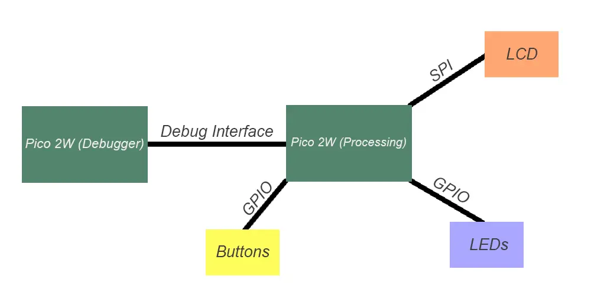
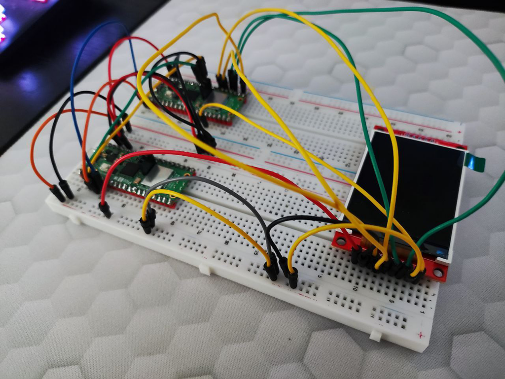
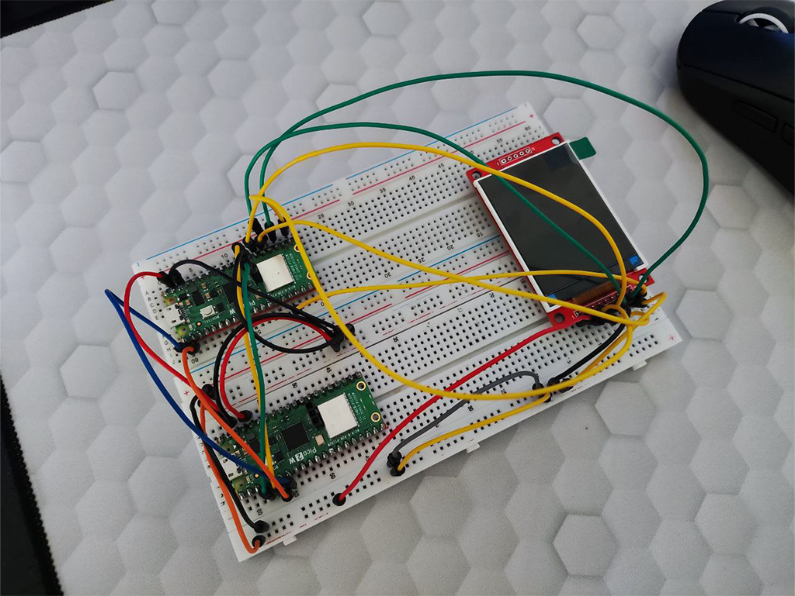

# Portable Retro Gaming Console

:::info 

**Author**: Illia Kucherenko

**GitHub Project Link**: [link to github](https://github.com/UPB-PMRust-Students/project-illia-kucherenko)

:::

## Description

It's a portable gaming console that will run some retro games that used to be popular back in the day. It is built using 2 RP pico 2w, an LCD Display, 4 buttons for controls and LEDs for visual feedback.

## Motivation

I've always been passionate about games and it remains a big part of my life even today. I decided to make something fun that would bring that childish joy we all crave for. I plan on implementing games like Pac-Man and Snake for now, if I succeed, I will try implementing more games.

## Architecture 

Architectural Diagram:

**Raspberry RP Pico 2W (Debugger)**
-Used to flash firmware to processing RP Pico 2W and debug in case of issues.
-Connects to the PC via micro-usb cable and to processing PR Pico 2W via debug interface  

**Raspberry RP Pico 2W (Processing)**
-Runs flashed firmware and acts as a main processing unit for the whole model. Reads data from buttons, controls LCDs, sends and updates image on an LCD, runs firmware with games and games themselves.

**LEDs**
-Used to add visual feedback to whats going on on the screen
-Connected via gpio pins to processing RP Pico 2W

**Buttons**
-Used for controls in menus and games
-Connected via gpio pins to processing RP Pico 2W

**LCD**
-Used to display the image (menus, games etc.)
-Connected via spi interface to processing RP Pico 2W

## Log
### Week 5 - 11 May
I've acquired all the necessary hardware, which is likely still subject to be rethought and changed. I've set up a configuration with two Pico 2Ws, one of them being a debugger for another one. Currently I'm in the process of getting LCD to work and looking for suitable libraries and crates for the project.

### Week 12 - 18 May

### Week 19 - 25 May

## Hardware
Consists of RP Pico 2W (2x), LCD TFT 2.2" module, buttons and resistors and 2 breadboards to hold everything together. At the moment buttons and resistors are not installed due to design concerns.

### Schematics

At the moment KiCad schematic cannot be done as I am unsure about connections. For now I will only provide architectural schematic, KiCad schematic is WIP.

### Bill of Materials

| Device | Usage | Price |
|--------|--------|-------|
| [Raspberry Pi Pico 2W (2x)](https://www.raspberrypi.com/documentation/microcontrollers/pico-series.html) | Microcontroller | [39.66 RON](https://www.optimusdigital.ro/en/raspberry-pi-boards/13327-raspberry-pi-pico-2-w.html?srsltid=AfmBOoo5CQdoi14-RbmA_YJJrNUG1hPBzlSKgPdCOYv9U2PgJdK3bPwM)|
| LCD SPI 2,2 '' 240x320 PX (1x) | LCD Screen | [59.99 RON](https://www.optimusdigital.ro/ro/optoelectronice-lcd-uri/1260-lcd-spi-22-240x320-px.html)|
| Wire Kit(2x) | Wires | [7.99 RON](https://www.optimusdigital.ro/ro/fire-fire-mufate/12-set-de-cabluri-pentru-breadboard.html)|
| Resistor Kit (1x) | Resistors | [14.99 RON](https://www.optimusdigital.ro/ro/componente-electronice-rezistoare/10928-plusivo-kit-250-buc-rezistoare.html) |
| Breadboard (2x) | Breadboards | [19.96](https://www.optimusdigital.ro/ro/prototipare-breadboard-uri/8-breadboard-830-points.html) |
| White Capped Buttons (4x) | Buttons | [1.99 RON](https://www.optimusdigital.ro/ro/butoane-i-comutatoare/1115-buton-cu-capac-rotund-alb.html) |
| Common Cathode RGB (3x) | RGB LEDs | [0.99 RON](https://www.optimusdigital.ro/ro/optoelectronice-led-uri/483-led-rgb-catod-comun.html?search_query=rgb&results=121) |

## Software

| Library | Description | Usage |
|---------|-------------|-------|
[embassy-rp](https://docs.embassy.dev/embassy-rp/git/rp235xb/index.html) | Grants access to low-level peripherals on RP microcontrollers | Initializing and interacting with peripherals
[embassy-executor](https://docs.embassy.dev/embassy-executor/git/cortex-m/index.html) | Async runtime tailored for embedded environments | Used for async programming |
[embassy-time](https://docs.embassy.dev/embassy-time/git/default/index.html) | Time abstraction library for delays and timers | Used for delays |
[embassy-sync](https://docs.embassy.dev/embassy-sync/git/default/index.html) | Async-safe primitives for shared state management | Used for inter-task communication via channels, mutexes, etc. in async code |
[ili9341](https://docs.rs/ili9341/0.6.0/ili9341/) | Driver for TFT module based on ILI9341 chip | Used for rendering graphics on compatible TFT LCD displays |
[embedded-graphics](https://docs.rs/embedded-graphics/0.8.1/embedded_graphics/) | 2D graphics library that is focused on memory constrained embedded devices | Used for displaying graphics on the display |
[embedded-hal-async](https://docs.rs/embedded-hal-async/latest/embedded_hal_async/) | An asynchronous Hardware Abstraction Layer (HAL) for embedded systems | Provides a standard way to use hardware asynchronously across different embedded devices |
[gpio](https://docs.embassy.dev/embassy-rp/git/rp235xb/gpio/index.html) | GPIO management | Used for controlling GPIO pins

## Links

1. [link](https://www.youtube.com/watch?v=SB3qwe6CTjM)