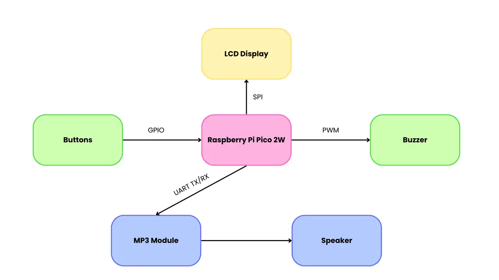

# Rusty Rhythm
Rusty Rythm is a simple rhythm game where you press buttons to the beat of a track of your choosing from the game's catalogue.

:::info 

**Author**: NEDELCU Ioana \
**GitHub Project Link**: https://github.com/UPB-PMRust-Students/project-ioqnq

! - to fill in \
? - subject to change

:::

## Description

When booting up the game, you will be prompted to pick one of the available songs and the difficulty which you wish to play on. You can then input a 3 character username. The gameplay itself consists of pressing the buttons to the rhythm of the song you selected with the aid of the visual interface. Hitting the correct button(s) at the right time adds to your score. If it is high enough, your score will be registered to the leaderboard (for the song and difficulty that you played), which shows the username of the 5 top scoring users.

## Motivation

While being more familiar with mobile, touch-screen based rhythm games, I've always been fascinated by the larger-scale arcade machines, which offer more of a physical, tactile response. I hope to put the technical knowledge I have gained throughout the semester to use by bringing to life a pocket-sized version of the arcade experience.

## Architecture



## Log !

<!-- write every week your progress here -->

### Week 6 - 12 May
<!-- I connected all the components and made the electronic circuit according to the shape of the stage and tested it.  -->

### Week 7 - 19 May
<!-- I made the KiCad Schematic for the project. Because I couldn't find any symbol for Pico Display Pack, I created it and added to the schematic. -->
<!-- I created the stage and added it to the circuit having now the final shape of it. -->

### Week 20 - 26 May
<!-- I started the software and finished it, while also doing final improvements to my project. -->

## Hardware

1. **Raspberry Pi Pico W Microcontroller**: Coordinates all of the components.
2. **Buttons**: Game input.
3. **Buzzer**: Audio feedback for game inputs.
4. **MP3 Player Module**: Reads song from a microSD card.
5. **Speaker**: Ouputs song.
6. **Display**: Visual output device, displays the game elements (falling notes, score, menus). 
7. **Breadboard**: Used for building the circuit.
8. **Wires**: Used for connecting the components.


### Schematics !

<!-- 


 -->


### Final Look !
<!--  -->


### Bill of Materials

<!-- Fill out this table with all the hardware components that you might need.

The format is 
```
| [Device](link://to/device) | This is used ... | [price](link://to/store) |

```

-->

| Device | Usage | Price |
|--------|--------|-------|
| [Rapspberry Pi Pico 2W](https://www.raspberrypi.com/documentation/microcontrollers/pico-series.html#pico-2-family) | The microcontroller | [39,66 RON](https://www.optimusdigital.ro/ro/placi-raspberry-pi/13327-raspberry-pi-pico-2-w.html?search_query=raspberry+pi+pico&results=26) |
| Male-Female Wires | Electronic Components | [4,45 RON](https://www.optimusdigital.ro/ro/toate-produsele/876-set-fire-mama-tata-10p-15-cm.html?search_query=mama+15cm&results=3) |
| Jumper Wires Set | Electronic Components | [7,99 RON](https://www.optimusdigital.ro/ro/fire-fire-mufate/12-set-de-cabluri-pentru-breadboard.html?search_query=set+fire&results=110) |
| Breadboard 400 | Electronic Components | [4,56 RON](https://www.optimusdigital.ro/ro/prototipare-breadboard-uri/44-breadboard-400-points.html?search_query=breadboard+hq&results=128) |
| Breadboard 830 | Electronic Components | [4,99 RON](https://www.optimusdigital.ro/ro/prototipare-breadboard-uri/44-breadboard-400-points.html?search_query=breadboard+hq&results=128) |
| Push Buttons | Game inputs | [1,44 RON](https://www.optimusdigital.ro/ro/butoane-i-comutatoare/1119-buton-6x6x6.html?search_query=buton+6&results=213) |
| [MP3 Player Mini](https://wiki.dfrobot.com/DFPlayer_Mini_SKU_DFR0299)| Reads song | [13,99 RON](https://www.optimusdigital.ro/ro/audio/1484-modul-mp3-player-in-miniatura-dfplayer-mini.html?search_query=mp3&results=45) |
| [LCD SPI Module Screen](https://ardushop.ro/en/displays-and-leds/1349-modul-lcd-spi-128x160-6427854019561.html) | Display | [43,58 RON](https://ardushop.ro/en/displays-and-leds/1349-modul-lcd-spi-128x160-6427854019561.html) |
| Speaker 2W | Outputs song | [4,98 RON](https://ardushop.ro/en/modules/1898-difuzor-2w-8ohm-6427854028723.html) |
| Passive Buzzer Module | Game feedback | [1,69 RON](https://www.optimusdigital.ro/ro/componente-electronice/12598-modul-buzzer-pasiv.html?search_query=modul+buzzer&results=30) |
| [Rapspberry Pi Pico](https://www.raspberrypi.com/documentation/microcontrollers/pico-series.html#pico-1-family) | Debugger | [31,50 RON](https://ardushop.ro/en/raspberry-pi/513-raspberry-pi-pico-6427854006004.html) |


## Software ?

| Library | Description | Usage |
|---------|-------------|-------|
| [embassy-embedded-hal](https://github.com/embassy-rs/embassy/tree/main/embassy-embedded-hal) | Embedded I/O | Manages buttons, PWM for buzzer |
| [embedded-graphics](https://github.com/embedded-graphics/embedded-graphics) | 2D graphics library | Used for drawing to the display |
| [st7735-lcd](https://github.com/sajattack/st7735-lcd-rs) | Display driver | Controls the display |
| [embedded-time](https://crates.io/crates/embedded-time) | Durations, clocks, rates | Beatmap timings |
| [fugit](https://crates.io/crates/fugit) | Precise timing utilities | Beatmap timings |
| [heapless](https://docs.rs/heapless/latest/heapless/) | Static data structures | Beatmap storing |


## Links ?

<!-- Add a few links that inspired you and that you think you will use for your project --> 

1. [Additional project inspiration](https://www.youtube.com/watch?v=SYxIqJ6wqH0)
2. [Raspbery Pi Pico 2W with DFPlayerMini MP3 Player](https://www.youtube.com/watch?v=Tuc359wUx_E)
3. [DFPlayer Raspberry Pi Pico Audio Player Project](https://www.youtube.com/watch?v=IDCNz7A6sWA)

