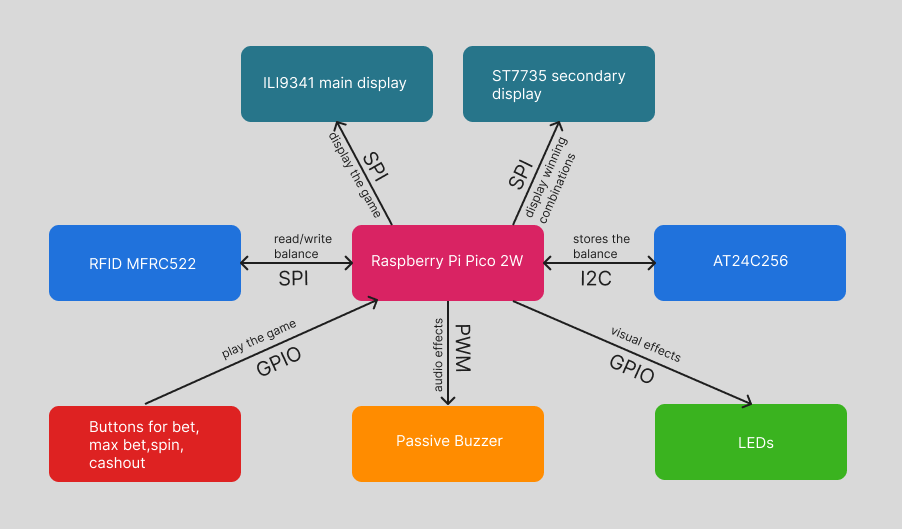
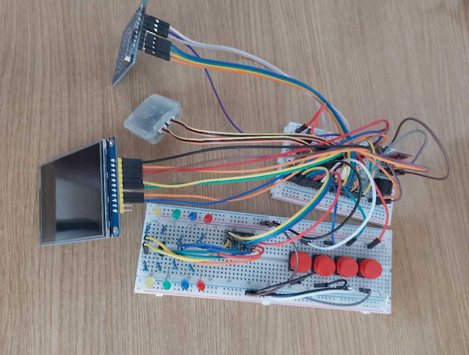
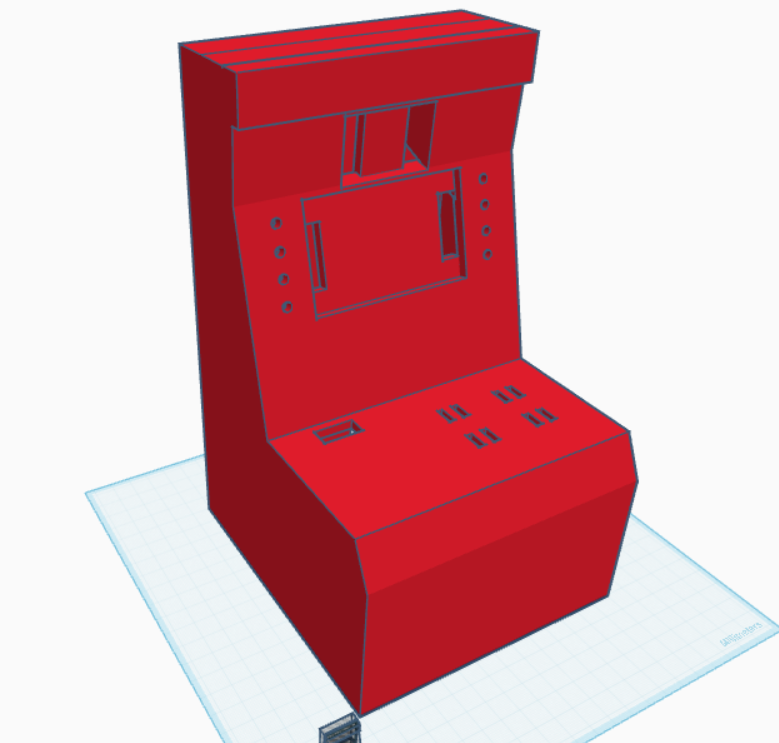
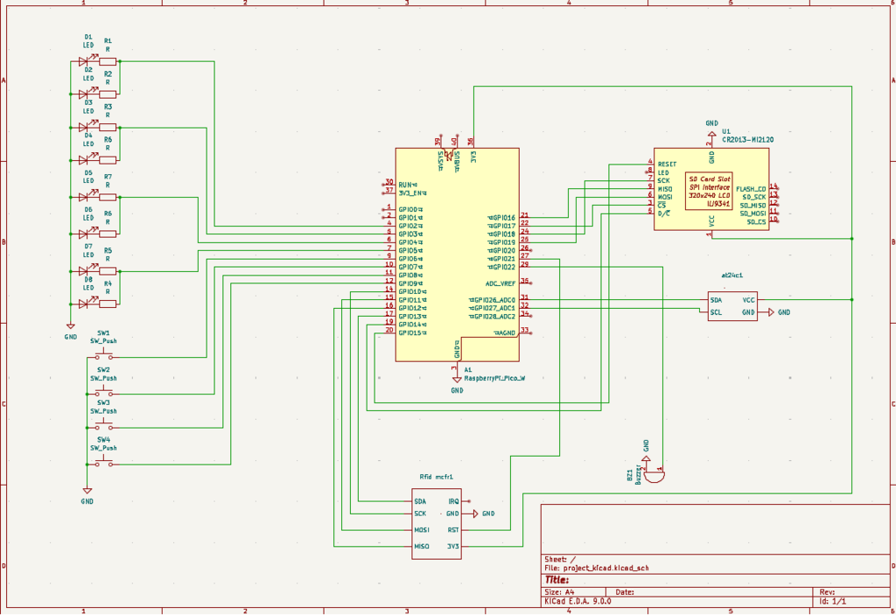

# Arcade Game

A slots machine inspired from the the game GTA Online, in which the symbols are represented by the logos of programming languages.

:::info 

**Author**:  Pruteanu Ionut-Gabriel\
**GitHub Project Link**: https://github.com/UPB-PMRust-Students/project-Gabyyi

:::

## Description

The project uses a Raspberry Pi Pico 2W as the control unit, along with two displays — a main display showing the slot machine game and a secondary display showing the winning combinations. The balance is simulated using an RFID card reader and a memory module. For an even better simulation, LEDs and a passive buzzer are used for audio-visual effects.

## Motivation

I have always been passionate about video games, especially open-world games like GTA Online. The project and its design are inspired by the slot machines from the Diamond Casino, a classic place to spend time with friends or other players. The slot machine project is a fun one that draws positive reactions from everyone, as each person wants to try their luck. The LED animations and the sound when pressing the spin button, along with the LED animations and sound effects when winning, create a complete slot machine experience. It brings the excitement and atmosphere of a real casino into a fun and interactive project.

## Architecture 

### Schematics Diagram

The diagram shows all the components and its connections.



**Raspberry Pi Pico 2W**:

+ **Purpose**: Controlls all the components and runs the game.
+ **Connection**: SPI for the displays and rfid, GPIO for the LEDs and buttons and PWM for the passive buzzer.

**ILI9341**:

+ **Purpose**: Displays the slot game, balance, bet ammount, last win and encouraging messages after a loss and win message after a win.
+ **Connections**: via SPI
    + **CS** (Chip Select): GPIO17
    + **CLK** (Clock): GPIO18
    + **MOSI** (Master Out Slave In): GPIO19
    + **MISO** (Master In Slave Out): GPIO16
    + **DC** (Data/Command): GPIO14
    + **Reset**: GPIO15
    + **Vcc 3.3V_OUT** and **GND**

**ST7735**:     NOT CONNECTED YET

+ **Purpose**: Displays the winning combinations of symbols.
+ **Connections**: via SPI
    + **CS** (Chip Select): GPIO
    + **CLK** (Clock): GPIO
    + **MOSI** (Master Out Slave In): GPIO
    + **MISO** (Master In Slave Out): GPIO
    + **DC** (Data/Command): GPIO
    + **Reset**: GPIO
    + **Vcc 3.3V_OUT** and **GND**

**RFID MFRC522**:

+ **Purpose**: Simmulates the input/output of the balance.
+ **Connections**: via SPI
    + **SDA**: GPIO13
    + **SCK** (Clock): GPIO10
    + **MOSI** (Master Out Slave In): GPIO11
    + **MISO** (Master In Slave Out): GPIO12
    + **RST**: (Reset): GPIO21
    + **Vcc 3.3V_OUT** and **GND**

**AT24C256**:
+ **Purpose**: Stores the balance.
+ **Connections**: via I2C
    + **SDA**: GPIO26
    + **SCL**: GPIO27
    + **Vcc 3.3V_OUT** ad **GND**

    

**Buttons**:

+ **Purpose**: Controlls the input of the slots machine.
+ **Connections**: via GPIO
    + **SPIN**: GPIO6
    + **BET**: GPIO7
    + **BET MAX**: GPIO8
    + **CASHOUT**: GPIO9

**LEDs**:

+ **Purpose**: Visual effects for enhanced experience, the LEDs cascade when the spin button is pressed and flash when a win is hit.
+ **Connections**: via GPIO
    + **Yellow**: GPIO2
    + **Green**: GPIO3
    + **Blue**: GPIO4
    + **Red**: GPIO5

**Passive Buzzer**:

+ **Purpose**: Visual effects for enhanced experience, the LEDs cascade when the spin button is pressed and flash when a win is hit.
+ **Connections**: via GPIO
    + **Vcc 3.3V_OUT** and **GND**

## Log

<!-- write every week your progress here -->

### Week 14 - 20 April

I bought the required componenets and and started working on the display interface. I played with the display learning how it works and I managed to create a basic slot game interface that will guide the project development. I also created the led task which provide a cascade animation of the leds when the spin button is hit.

### Week 21 - 27 April

I implemented a basic slot game, that uses colors instead of symbols. This will be changed into actual symbols that will be programming languages logos. I introduced a new led flickering animation that play when a win is obtained.

### Week 28 - 4 April

I added the buzzer and here i ran into some problems. Initially the buttons were sending messages through signal. I changed this to channels, but the problem was that the code was randomly choosing to run either the led task, either the buzzer task, but never both at the same time. I changed again the communication method to publisher which sends explicit messages and finnaly the code was running as intended, when the spin button is pressed the led animation and buzzer starts playing and when a win is hit both the led animation and buzzer sound play.

### Week 5 - 11 May

TODO - adding rfid module\
TODO - adding eeprom memory

### Week 12 - 18 May

TODO - adding programming languages logos as symbols\
TODO - second display

## Hardware

The project uses a Raspberry Pi Pico 2W microcontroller. It features two SPI-driven displays: an ILI9341 TFT screen for high-resolution color graphics for the main game and a ST7735 TFT screen for smaller secondary display. For RFID functionality, it integrates an MFRC522 module, capable of reading and writing RFID tags. Data storage is supported by an external EEPROM memory chip, useful for saving card details permanently, even after flashing the Pico again. The setup also includes eight LEDs paired with eight resistors for visual feedback, along with four push buttons to allow user interaction.



3D Model:



### Schematics



### Bill of Materials

<!-- Fill out this table with all the hardware components that you might need.

The format is 
```
| [Device](link://to/device) | This is used ... | [price](link://to/store) |

```

-->

| Device | Usage | Price |
|--------|--------|-------|
| [Raspberry Pi Pico 2W](https://www.optimusdigital.ro/ro/placi-raspberry-pi/13327-raspberry-pi-pico-2-w.html) | The microcontroller | [39.66 RON](https://www.optimusdigital.ro/ro/placi-raspberry-pi/13327-raspberry-pi-pico-2-w.html) |
| [ILI9341](https://www.optimusdigital.ro/ro/optoelectronice-lcd-uri/3550-modul-lcd-de-28-cu-spi-i-controller-ili9341-240x320-px.html) | Main display | [69.99 RON](https://www.optimusdigital.ro/ro/optoelectronice-lcd-uri/3550-modul-lcd-de-28-cu-spi-i-controller-ili9341-240x320-px.html) |
| [ST7735](https://www.optimusdigital.ro/ro/optoelectronice-lcd-uri/870-modul-lcd-144.html) | Secondary display | [27.99 RON](https://www.optimusdigital.ro/ro/optoelectronice-lcd-uri/870-modul-lcd-144.html) |
| [RFID MFRC522](https://www.optimusdigital.ro/ro/wireless-rfid/67-modul-cititor-rfid-mfrc522.html) | Card Reader | [9.99 RON](https://www.optimusdigital.ro/ro/wireless-rfid/67-modul-cititor-rfid-mfrc522.html) |
| [AT24C256](https://www.optimusdigital.ro/ro/memorii/632-modul-eeprom-at24c256.html) | Stores the balance | [8.99 RON](https://www.optimusdigital.ro/ro/memorii/632-modul-eeprom-at24c256.html) |
| [Passive Buzzer](https://www.optimusdigital.ro/ro/componente-electronice/12598-modul-buzzer-pasiv.html) | Audio Effects | [1.69 RON](https://www.optimusdigital.ro/ro/componente-electronice/12598-modul-buzzer-pasiv.html) |
| [Red Cap Button](https://www.optimusdigital.ro/ro/butoane-i-comutatoare/1114-buton-cu-capac-rotund-rou.html) | x4 | [1.99 RON](https://www.optimusdigital.ro/ro/butoane-i-comutatoare/1114-buton-cu-capac-rotund-rou.html) |
| [LEDs](https://www.optimusdigital.ro/ro/kituri-optimus-digital/9517-set-de-led-uri-asortate-de-5-mm-si-3-mm-310-buc-cu-rezistoare-bonus.html) | x8 (from kit)| [26.99 RON](https://www.optimusdigital.ro/ro/kituri-optimus-digital/9517-set-de-led-uri-asortate-de-5-mm-si-3-mm-310-buc-cu-rezistoare-bonus.html) |
| [220Ω Resistors](https://www.optimusdigital.ro/ro/kituri-optimus-digital/9517-set-de-led-uri-asortate-de-5-mm-si-3-mm-310-buc-cu-rezistoare-bonus.html) | x8 (from kit)| [26.99 RON](https://www.optimusdigital.ro/ro/kituri-optimus-digital/9517-set-de-led-uri-asortate-de-5-mm-si-3-mm-310-buc-cu-rezistoare-bonus.html) |


## Software

| Library | Description | Usage |
|---------|-------------|-------|
[embassy-rp](https://docs.embassy.dev/embassy-rp/git/rp235xb/index.html) | Access to the pheripherals | Initializing and interacting with peripherals
[embassy-executor](https://docs.embassy.dev/embassy-executor/git/cortex-m/index.html) |An async/await executor designed for embedded usage | Used for asynchronous programming |
[embassy-time](https://docs.embassy.dev/embassy-time/git/default/index.html) | Timekeeping, delays and timeouts. | Used for delays |
[embassy-sync](https://docs.embassy.dev/embassy-sync/git/default/index.html) |Synchronization primitives and data structures with async support | Used for providing channels, mutexes, signals, etc |
[ili9341](https://docs.rs/ili9341/0.6.0/ili9341/) | Display driver for ILI9341 | Used to controll the main display |
[st7735](https://docs.rs/st7735-lcd/latest/st7735_lcd/) | Display driver for ST7735 | Used to controll the second display |
[embedded-graphics](https://docs.rs/embedded-graphics/0.8.1/embedded_graphics/) |2D graphics library that is focused on memory constrained embedded devices | Used for drawing and writing on the display
[embedded-hal-async](https://docs.rs/embedded-hal-async/latest/embedded_hal_async/) | An asynchronous Hardware Abstraction Layer (HAL) for embedded systems |Provides a standard way to use hardware asynchronously across different embedded devices
[gpio](https://docs.embassy.dev/embassy-rp/git/rp235xb/gpio/index.html) | GPIO management | Used for controlling GPIO pins
[pwm](https://docs.embassy.dev/embassy-rp/git/rp235xb/pwm/index.html) | PWM module | Used for controlling the buzzer
[smallrng](https://docs.rs/rand/latest/rand/rngs/struct.SmallRng.html) | Random number generator | Used for slots simulation

