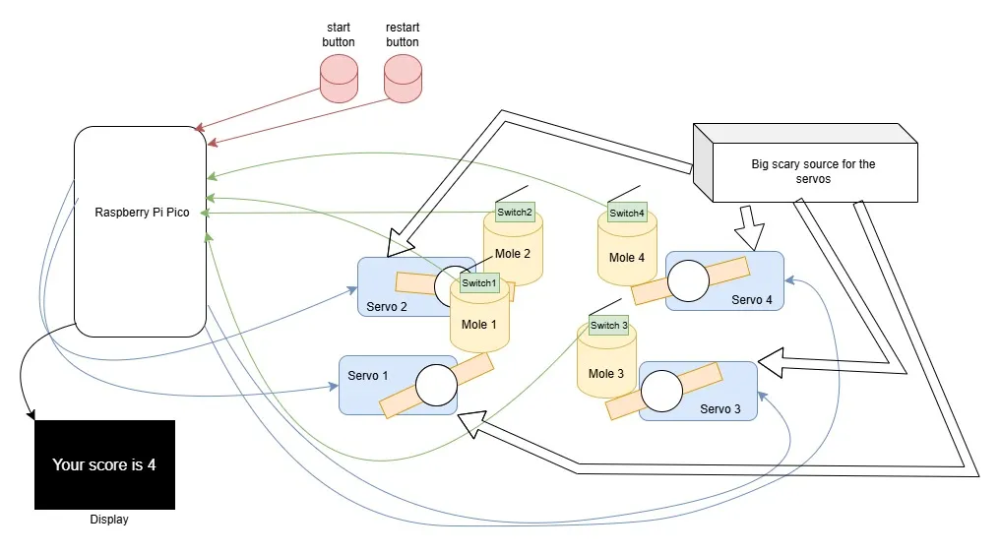
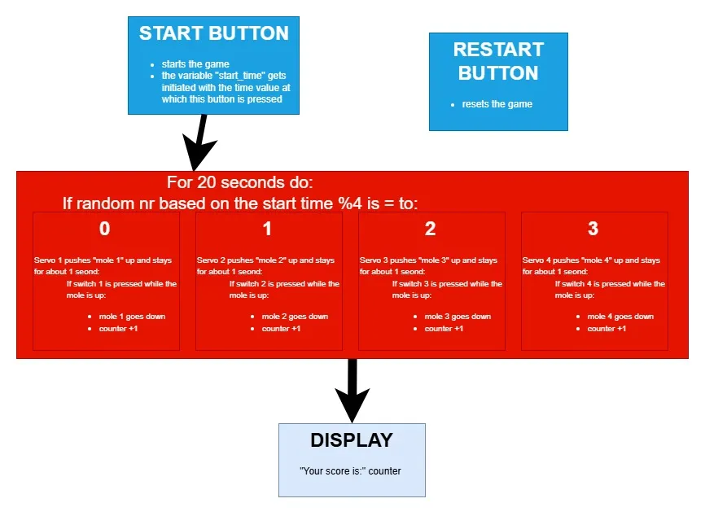
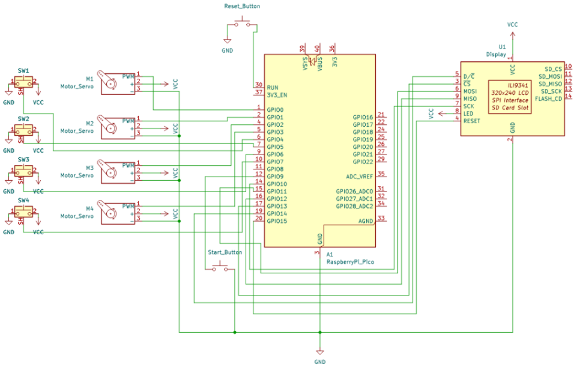

# Whack a Mole
A game in which you have to hit moles :)

:::info 

**Author**: Chiorean Irina \
**GitHub Project Link**: https://github.com/UPB-PMRust-Students/project-IrinaCh524


:::

## Description

My project is a "Whack-a-Mole" game. It features four moles that briefly pop up (for about one second each) in random order. A mole will go down either when the time runs out or if the player successfully hits it, in which case the player scores a point. This continues for 20 seconds, after which the total score is displayed on the screen.

## Motivation

In all honesty, I chose this idea for my project because my sister had planned to do it last year but had to abandon it due to time constraints.

## Architecture 

1. **Start and Restart buttons**
    -used to start and restart the game

2. **Screen**
    -displays your final score at the end of the game

3. **Game Area**
    -4 sets of "moles" that consist of one servo motor and one micro-switch each
    
    -the motors are connected to a source of 5V and 10A





## Log

<!-- write your progress here every week -->

### Week 10 - 28 April

As of right now, I have a prototype that has LEDs and buttons instead of the motors and switches. Next, I need to 3D model the game area of my project before replacing the LEDs with the motors and other components.

## Hardware

**Raspberry Pi Pico W**
    -Central microcontroller 
    
    -runs the program
    
**Source (5V-10A  LRS-50-5 MEAN WELL)**
    -used specifically for the servos

**Servo motors (MG996R)x4**
    -used to push up the moles
    
**Micro-switches x4**

**Display (LCD 2.4'' SPI ILI9341)**

### Schematics





### Bill of Materials

<!-- Fill out this table with all the hardware components that you might need.

The format is 
```
| [Device](link://to/device) | This is used ... | [price](link://to/store) |

```

-->

| Device | Usage | Price |
|--------|--------|-------|
| [Raspberry Pi Pico W](https://www.raspberrypi.com/documentation/microcontrollers/raspberry-pi-pico.html) | The microcontroller | [35 RON](https://www.optimusdigital.ro/en/raspberry-pi-boards/12394-raspberry-pi-pico-w.html) |
| [LCD 2.4'' SPI ILI9341](https://cdn-shop.adafruit.com/datasheets/ILI9341.pdf) | Display | [70 RON](https://www.optimusdigital.ro/ro/optoelectronice-lcd-uri/3531-modul-lcd-de-24-cu-spi-i-controller-ili9341-240x320-px.html?search_query=ili9341&results=9) |
| [Microswitch 1A 125V](https://uelectronics.com/wp-content/uploads/2020/11/AR1759-Interruptor-Fin-de-Carrera-125V-2A-Limit-Switch.pdf?srsltid=AfmBOop8oinqXbhGHKVqGcBtZH1sXTcERP_M9v7HPOQNRZQyM8IZIRdM) | Switch x4 | [12 RON](https://ardushop.ro/ro/butoane--switch-uri/460-microswitch-1a-125v-6427854005298.html) |
| [Servomotor MG996R](https://www.electronicoscaldas.com/datasheet/MG996R_Tower-Pro.pdf?srsltid=AfmBOopmebgauhFD0Y6DK220BxMSzKDF9aS_ItcPBOelRDBRhb2tYJg4) | The motor x4 | [112 RON](https://sigmanortec.ro/servomotor-mg996r-360-grade-13kg?SubmitCurrency=1&id_currency=2&gad_source=1&gad_campaignid=22174019478&gclid=Cj0KCQjw2tHABhCiARIsANZzDWr5iIGJeyR5Ji4HVpOwOlkIWYO65NrDSC8gjJtIVayATD6GmvJw9P0aAuxFEALw_wcB) |
| [LRS-50-5 5V/10A MEAN WELL Source](https://www.meanwell-web.com/content/files/pdfs/productPdfs/MW/LRS-50/LRS-50-spec.pdf) | The source | [74 RON](https://www.conexelectronic.ro/surse-mean-well/17494-SURSA-LRS-50-5-5V-10A-MEAN-WELL-5949203901699.html?srsltid=AfmBOorITupyfDg3___Ca0H1QDXSKWmXuUgEjT4_djtXeIFeOH77_aui) |
| Wires + Breadboard + Buttons | For connections and such | 20 lei |

## Software

| Library | Description | Usage |
|---------|-------------|-------|
| [ili9341](https://github.com/yuri91/ili9341-rs) | Display driver for ILI9341 | Used for the display for showing the score |
| [embedded-graphics](https://github.com/embedded-graphics/embedded-graphics) | 2D graphics library | Used for drawing to the display |
| [heapless](https://github.com/rust-embedded/heapless) | Data structures that don't require dynamic memory allocation | Used for transforming the score variable from to u32 to String |
| [picorand](https://github.com/inspier/picorand) | Library intended for random number generation  | Used for generating the mole order |

## Links

<!-- Add a few links that inspired you and that you think you will use for your project -->

This is where  the idea came from initially:
[Mini Whack A Mole Game](https://www.thingiverse.com/thing:3327853)

