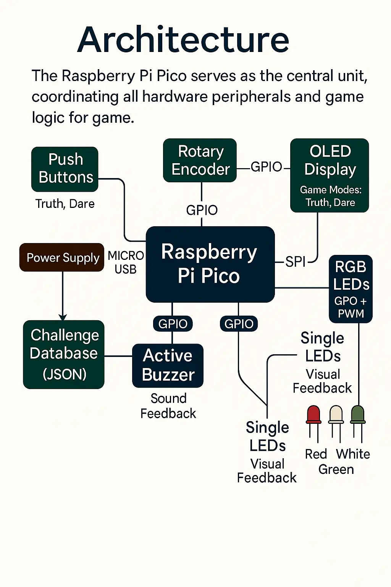
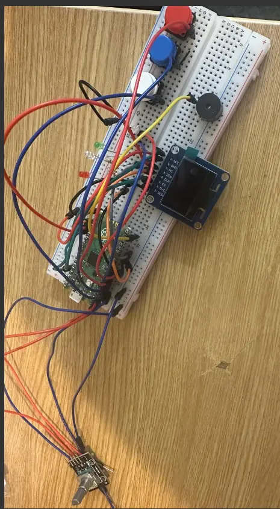
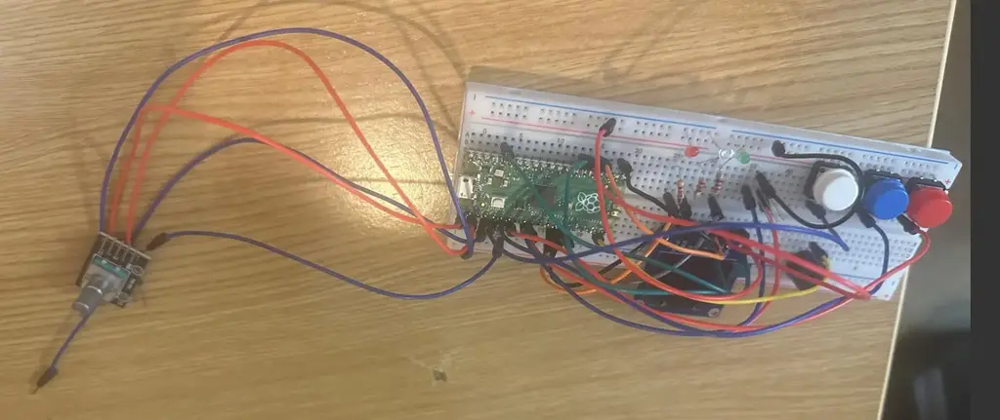

# Expose or Explore

Dare to play? An interactive Truth or Dare game merging hardware fun and Rust power on Raspberry Pi Pico.

:::info

**Author**: Jaleesha Abbas

**GitHub Project Link**: [https://github.com/UPB-PMRust-Students/project-Jaleesha](https://github.com/UPB-PMRust-Students/project-Jaleesha)

:::

---

## Description

Expose or Explore is an interactive Truth or Dare game that combines fun with embedded technology. Players interact using buttons and a rotary encoder to select game modes, difficulties, and receive random challenges displayed on an OLED screen.
Key gameplay features:
- Truth or Dare buttons randomly assign challenges from a local JSON database.
- Rotary encoder allows choosing between modes: Truth Only, Dare Only, or Random.
- Automatic switching to Dare if Truth is refused.
- LEDs and a buzzer provide visual and audio feedback.
- A Start button resets the game for the next round.

This project integrates multiple hardware components to create a fully immersive embedded game experience.

---

## Motivation

Throughout my life, games have always been a source of excitement for me. From simple childhood games to complex video games, the idea of creating experiences that bring people together has always fascinated me.

While my main passion has been in software and coding, but after learning Rust and embedded development, I saw this project as the perfect opportunity to push myself further. Instead of just making simple embedded project, I wanted to create something interactive, fun, and social — a game that people can actually play and enjoy.

"Expose or Explore" is my way of turning technical learning into something playful and dynamic. Even though hardware has never been my strongest area, I challenged myself to bring together logic into a complete physical device running my code. The idea of seeing my game actually work on real hardware, where people interact and enjoy, is extremely motivating.

This project is my personal step towards merging my love for software with the physical world. I hope it inspires others to see that embedded systems can be exciting, interactive, and fun.

---

## Architecture

The Raspberry Pi Pico serves as the central control unit, coordinating all hardware peripherals and logic for the game.

-   **OLED Display** (SPI):  
    Acts as the main interface. Displays game modes, player actions (Truth, Dare), and the challenges fetched from the local JSON database.
    
-   **Rotary Encoder** (GPIO + Interrupts):  
    Allows users to select the game mode (Truth Only, Dare Only, Random) and difficulty level (Easy, Medium, Hard). This gives customization and control over the gameplay.
    
-   **Push Buttons** (GPIO):  
    Dedicated buttons are used for selecting Truth or Dare actions. Once pressed, the system will randomly select a challenge and display it on the OLED.
    
-   **Buzzer** (GPIO):  
    Provides sound feedback during game events — for example, when a new challenge is displayed or when a user refuses Truth (auto-switch to Dare).
    
-   **RGB LED (Tri-Leg)** (GPIO + PWM):  
    Provides colorful visual feedback depending on the action (Truth → Blue, Dare → Red, Game Mode Selection → Green).
    
-   **Single LEDs (Red, Green, White)** → Visual Feedback (game states or indication) 
    
-   **Start Button** (GPIO):  
    Resets the game and gets it ready for the next round or player.
    
-   **Local JSON Storage** (On-Device Storage / Flash):  
    Stores all Truth and Dare challenges. On player action, the game randomly selects a challenge and displays it on the OLED.
    

----------

**How they connect:**

-   The Raspberry Pi Pico receives all player inputs (rotary encoder + buttons).
    
-   It then processes them and selects challenges or actions accordingly.
    
-   Challenges are fetched from the local JSON and sent to the OLED for display.
    
-   At the same time, feedback (audio from the buzzer and visuals from RGB LEDs) is triggered.
    
-   After each round, players can press the Start button to reset the game logic.

---

## Log

### Week 6 - 12 May

I uploaded the necessary project documentation, making sure everything was in order. Then, I began working on the schematics, carefully mapping out the design. Additionally, I started developing some of the software. Each step brought the project closer to realization.

### Week 7 - 19 May

Continuing the progress. Will update as soon as I reach the milestone.

### Week 20 - 26 May

Continuing the progress. Will update as soon as I reach the milestone.

## Hardware

---

## Photos

### Device Front View

### Device Side View

---

-   **OLED Display (SSD1331)** → Displays Truth or Dare prompts and game states.
    
-   **Push Buttons** → Used to select Truth, Dare, and other game options.
    
-   **Rotary Encoder** → Allows the player to select game modes and difficulty >
    
-   **Active Buzzer** → Provides sound feedback when a Truth or Dare is selecte>
    
-   **RGB LED (3-legged)** → Provides colorful visual feedback and indicates ga>
    
-   **Single Color LEDs (Red, White, Green)** → Used for specific cues and visu>
    
-   **Power Supply (Micro USB)** → Powers the Raspberry Pi Pico and peripherals.
    
-   **Challenge Database (JSON stored locally)** → Holds the game challenges an>
   

---

## Schematic
 

---

## Bill of Materials

| Device | Usage | Price |
|--------|-------|-------|
| Raspberry Pi Pico 2350 | Microcontroller (Main Controller) | 51 RON |
| OLED Display 0.96" SSD1331 (SPI) | Display module (Truth/Dare Modes) | 50 RON |
| RGB LED (3-Leg Common Cathode) | Visual feedback (RGB colours) | 5 RON |
| Resistors (220Ω - 470Ω) | Current limiting for LEDs | 5 RON |
| Single LEDs (Red, Green, Colourless/White, White) | Visual indicators | 5 RON |
| Push Buttons (3x) | Truth, Dare, Start | 8 RON |
| Rotary Encoder with push | Game selection input | 5 RON |
| Active Buzzer | Sound feedback | 1.5 RON |
| Breadboard | Circuit prototyping | 10 RON |
| Jumper Wires (Male-Male, Male-Female ~30 wires) | Connections | 8 RON |

---

## Software

| Library | Description | Usage |
|---------|-------------|-------|
| embassy | Rust framework for embedded programming | Used for async tasks, delays, blinking LEDs, button handling |
| rp2040-hal | Rust crate for RP2040 peripherals | Used for GPIO, SPI, PWM, and other microcontroller functions |
| embedded-hal | Rust crate providing embedded hardware abstraction | Used for generic traits for GPIO, SPI, and other peripherals |
| rand | Rust crate for random number generation | Used to select random Truth or Dare challenges |
| serde + serde_json | Rust crates for serialization and JSON parsing | Used to load and parse local JSON database of Truth and Dare |
| ssd1331 | Rust driver crate for SSD1331 OLED display (SPI) | Used for displaying text like Truth, Dare, and other messages |
| embassy-time | Rust crate for async time handling | Used for delays, LED blinking and timing related tasks |
| embassy-sync | Rust crate for task synchronization | Used to manage async/await tasks cleanly (optional but recommended) |

---

## Links

1. [Rotary Encoder + Raspberry Pi Pico Example](https://youtu.be/l2W_75S8Dek?si=JOiQHMjfI7fidVtF)
2. [RGB LED 3-Leg Common Cathode Wiring Example](https://youtube.com/shorts/moTiZWjkDvk?si=78VKgAnXZ8TciS3m)

Written with [StackEdit](https://stackedit.io/)

