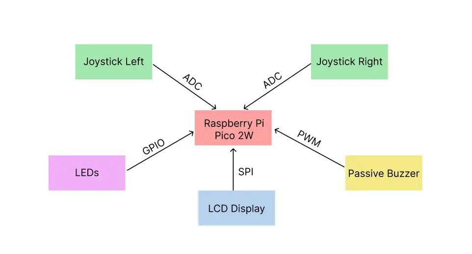
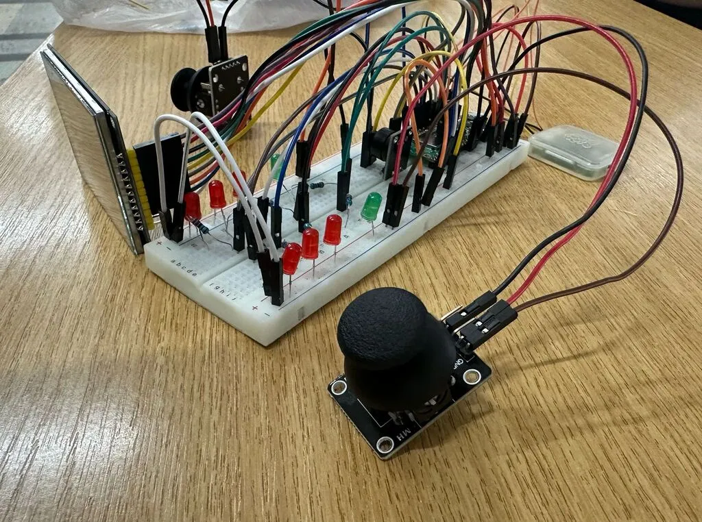
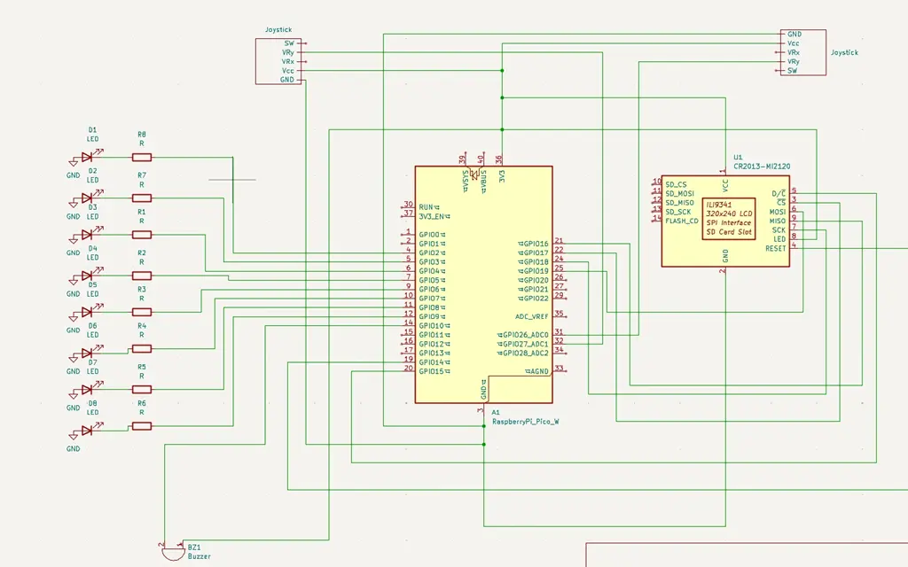
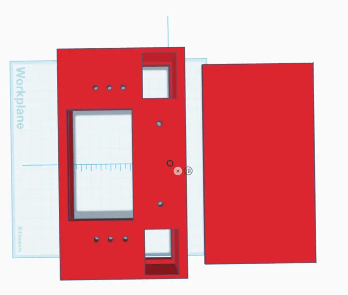

# Pong-Game
A multiplayer Pong game inspired by the classic consoles, bringing back the experience of playing with friends during your free time. Designed to capture the simplicity and fun of those timeless gaming moments.

:::info

**Author**: Militaru Luana-Maria\
**GitHub Project Link**:https://github.com/UPB-PMRust-Students/project-lvanaaa

::::
## Description
This project is built using a Raspberry Pi Pico 2W, an LCD display, and two joysticks that control the paddles. A buzzer is triggered when the ball collides with the paddles or the top/bottom walls, while a life system is implemented using red LEDs.
## Motivation
I have been passionate about games since I was little. I remember my classmates coming to school with handheld consoles, which had screens smaller than today’s phones and lots of buttons. I chose this project out of nostalgia for those old consoles. I aimed to recreate a classic atmosphere, with a buzzer that triggers when the ball hits the walls, and a physical life system using LEDs. The game itself is simple and doesn’t have a complex dynamic—it's a classic that many may have forgotten, but whenever we see it again, we can’t help but give it another try, whether it's to test our old skills or just for fun.
## Architecture 
### Schematic Diagram
This is the diagram that illustrates the components and their connections.

**Raspberry Pi Pico 2W**
- **Role**: Acts as the "brain" of the project — it controls all components: reads the joystick input, manages the LEDs and buzzer, updates the LCD display, and runs the game logic.
- **Connections**: GPIO pins for LEDs and the buzzer. ADC pin for the joystick. SPI interface for the LCD display.

**LEDs**
- **Interface**: GPIO
- **Role**: Represent the players' lives. Each LED being turned on or off indicates whether a life is lost or remaining.
- **Connections**: Each LED is connected to a GPIO pin configured as output.A current-limiting resistor (220Ω) is placed between the GPIO and the LED. Left lives: GPIO4, GPIO5, GPIO6. Right lives: GPIO7, GPIO8, GPIO9. Win LED left: GPIO2. Win LED right: GPIO3.

**Passive Buzzer**
- **Interface**: PWM
- **Role**: Emits a short sound when the ball collides with a paddle or the top/bottom walls, providing sound feedback during the game.
- **Connections**: Connected to a GPIO pin configured for PWM (Pulse Width Modulation). PWM controls the frequency and duration of the sound. PWM Channel: 5A, GPIO10.

**Joysticks**
- **Interface**: ADC
- **Role**:  Controls the paddle's vertical movement (up and down, only Y-axis connected).
- **Connections**: The Y-axis output of the joystick is connected to an ADC (Analog-to-Digital Converter) pin on the Raspberry Pi Pico 2W. The X-axis is not used in this project. Left joystick: GPIO26. Right joystick: GPIO27.

 **LCD Display**
  - **Interface**: SPI
  - **Role**: Displays the Pong game, including the ball, paddles, and background.
  - **Connections**: Connected via the SPI protocol to the Pico:
    - **CS** (Chip Select): GPIO17
    - **CLK** (Clock): GPIO18
    - **MOSI** (Master Out Slave In): GPIO19
    - **MISO** (Master In Slave Out): GPIO16
    - **DC** (Data/Command): GPIO15
    - **Reset**: GPIO14 
    - Power supply connected to 3.3V and GND.
  
## Log
### Week 5 - 11 May
After the project was approved, I gathered all the necessary components and started working on the hardware. I also began designing a 3D model for the game’s case, but I decided to put it on hold for the moment, as I wasn’t yet sure how I wanted the components to be positioned in the final setup. I completed the hardware assembly and began researching the crates I intended to use for the software development.

### Week 12 - 18 May

### Week 19 - 25 May

## Hardware
The hardware setup consists of a Raspberry Pi Pico 2W microcontroller as the core unit, interfacing with multiple peripherals.
Two analog joysticks, each connected through the ADC pins, are used to control the paddles' vertical movement. An LCD display, communicating via the SPI interface, visually represents the game elements such as the paddles, ball, and background.
A passive buzzer, driven using PWM signals, provides audio feedback during ball collisions with the paddles or the screen edges.
The life system is physically implemented using multiple red LEDs connected to GPIOs, which decrease as players lose lives. Additionally, two green LEDs are used to indicate the winner by lighting up next to the victorious player at the end of the match.

### Schematics
KiCad Scheme

TinkerCad Scheme

### Bill of Materials
| Device                                                  | Usage                        | Price                           |
|---------------------------------------------------------|------------------------------|---------------------------------|
| [Raspberry Pi Pico 2W](https://www.raspberrypi.com/documentation/microcontrollers/pico-series.html) | The microcontroller | [39.66 RON](https://www.optimusdigital.ro/en/raspberry-pi-boards/13327-raspberry-pi-pico-2-w.html?srsltid=AfmBOoo5CQdoi14-RbmA_YJJrNUG1hPBzlSKgPdCOYv9U2PgJdK3bPwM) |
[2 x Biaxial Joystick Module](https://www.laskakit.cz/user/related_files/joystick_module.pdf) | Joystick  | [10.70 RON](https://www.optimusdigital.ro/en/touch-sensors/742-ps2-joystick-breakout.html?search_query=0104110000006585&results=1) |
[2.8" SPI LCD Module with ILI9341 Controller (240 x 320 px)](https://cdn-shop.adafruit.com/datasheets/ILI9341.pdf) | LCD Display | [69.99 RON](https://cdn-shop.adafruit.com/datasheets/ILI9341.pdf) |
[Passive Buzzer Module](https://www.handsontec.com/dataspecs/module/passive%20buzzer.pdf) | Buzzer | [1.69 RON](https://www.optimusdigital.ro/en/electronic-components/12598-passive-buzzer-module.html?search_query=passive+buzzer&results=17) |
[6 x 5 mm Red LED with Diffused Lens](https://www.farnell.com/datasheets/1498852.pdf) | Red LED | [2.34 RON](https://www.optimusdigital.ro/en/leds/29-5-mm-red-led-with-difused-lens.html?search_query=led&results=2050) |
[2 x 5 mm Green LED with Diffused Lens](https://www.farnell.com/datasheets/1498852.pdf) | Green LED | [0.78 RON](https://www.optimusdigital.ro/en/leds/38-5-mm-green-led-with-difused-lens.html?search_query=led&results=2050&HTTP_REFERER=https%3A%2F%2Fwww.optimusdigital.ro%2Fen%2Fsearch%3Fcontroller%3Dsearch%26orderby%3Dposition%26orderway%3Ddesc%26search_query%3Dled%26submit_search%3D) |
[15 cm 10p Male-Female Wires](https://www.optimusdigital.ro/en/all-products/876-15-cm-male-female-wires-10p.html?search_query=male-male&results=808) | Male-Female Wires | [4.45 RON](https://www.optimusdigital.ro/en/all-products/876-15-cm-male-female-wires-10p.html?search_query=male-male&results=808)
[10 cm 40p Male-Female Wires](https://www.optimusdigital.ro/en/wires-with-connectors/653-10-cm-40p-male-to-female-wire.html?search_query=male-male&results=808) | Male-Male Wires | [5.99 RON](https://www.optimusdigital.ro/en/wires-with-connectors/653-10-cm-40p-male-to-female-wire.html?search_query=male-male&results=808)
[8 x 220Ω Resistors](https://www.optimusdigital.ro/en/resistors/10958-05w-220-resistor.html)| Resistors | [0.80 RON](https://www.optimusdigital.ro/en/resistors/10958-05w-220-resistor.html)

## Software

| Library | Description | Usage |
|---------|-------------|-------|
[embassy-rp](https://docs.embassy.dev/embassy-rp/git/rp235xb/index.html) | Access to the pheripherals | Initializing and interacting with peripherals
[embassy-executor](https://docs.embassy.dev/embassy-executor/git/cortex-m/index.html) |An async/await executor designed for embedded usage | Used for asynchronous programming |
[embassy-time](https://docs.embassy.dev/embassy-time/git/default/index.html) | Timekeeping, delays and timeouts. | Used for delays |
[embassy-sync](https://docs.embassy.dev/embassy-sync/git/default/index.html) |Synchronization primitives and data structures with async support | Used for providing channels, mutexes, signals, etc |
[ili9341](https://docs.rs/ili9341/0.6.0/ili9341/) | Driver to interface with the ILI9341 TFT LCD display | Used to controll the display |
[embedded-graphics](https://docs.rs/embedded-graphics/0.8.1/embedded_graphics/) |2D graphics library that is focused on memory constrained embedded devices | Used for drawing and writing on the display
[embedded-hal-async](https://docs.rs/embedded-hal-async/latest/embedded_hal_async/) | An asynchronous Hardware Abstraction Layer (HAL) for embedded systems |Provides a standard way to use hardware asynchronously across different embedded devices
[gpio](https://docs.embassy.dev/embassy-rp/git/rp235xb/gpio/index.html) | GPIO management | Used for controlling GPIO pins
[adc](https://docs.embassy.dev/embassy-rp/git/rp235xb/adc/index.html) | ADC driver | User for controlling the joysticks
[pwm](https://docs.embassy.dev/embassy-rp/git/rp235xb/pwm/index.html) | PWM module | Used for controlling the buzzer

## Links
1. [Arduino Pong Game!](https://www.youtube.com/watch?v=xenYYDqOijs&ab_channel=gpTeacher)

