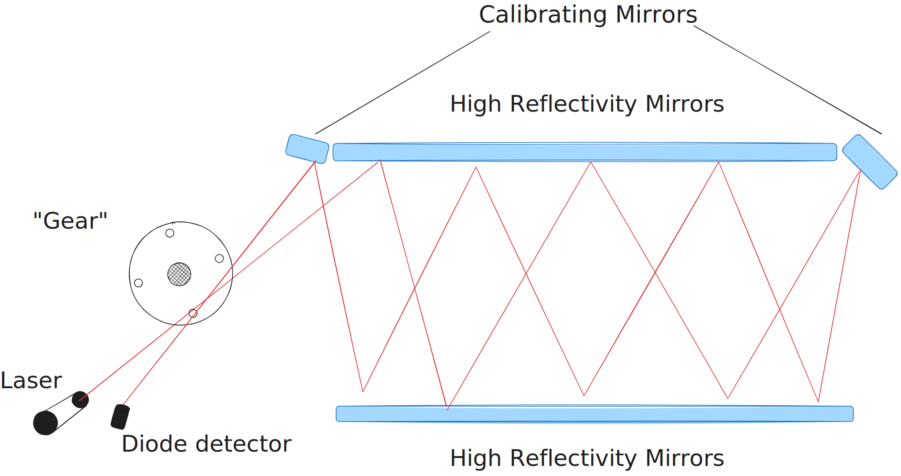
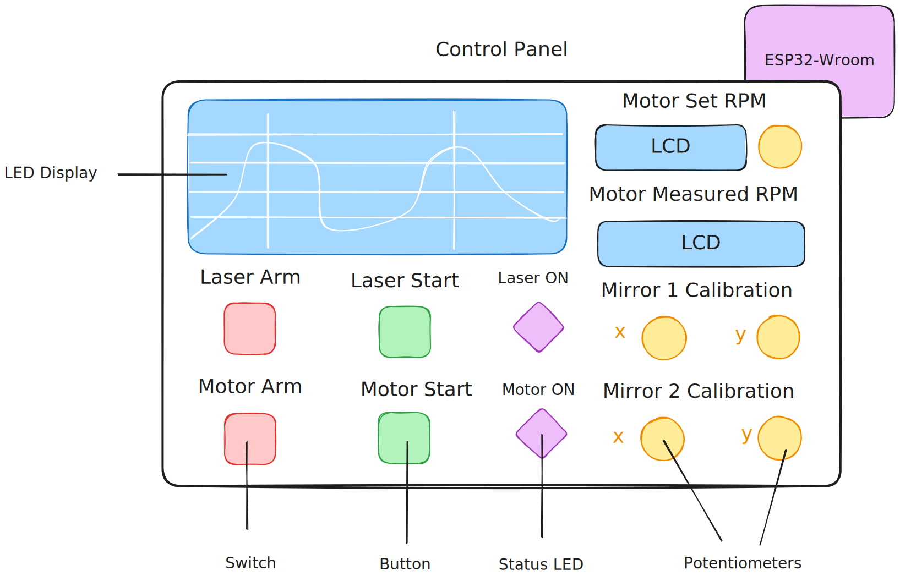
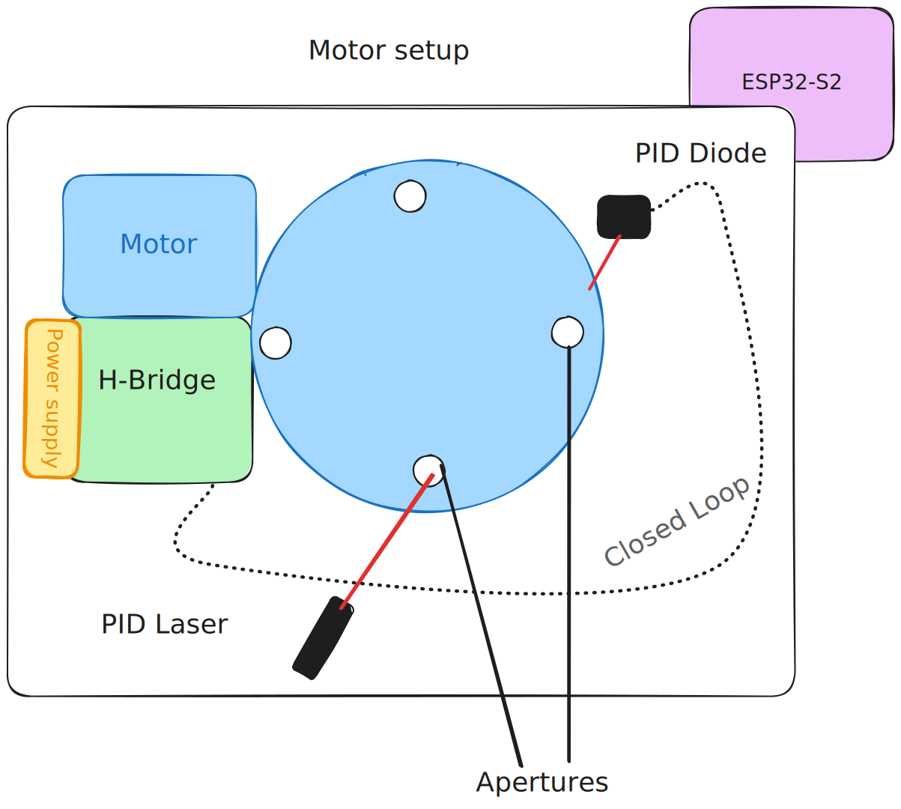
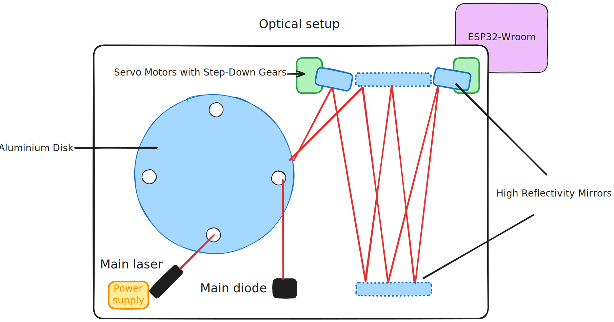

# Project Name

Radu: Measuring the Speed of Light in a 3x1 setup.

:::info

**Author**: Sainenco Luchian (1221C) \
**GitHub Project Link**: https://github.com/UPB-PMRust-Students/project-LucaSain

:::

## Description

In 1850s Fizeau measured the speed of light in a 8km setup using a gear. The key point of the measurement was that the light would travel the distance from the source and back slower than the aperture of the gear. Today, using high reflectivty mirrors, electrical motors and high precision laser cutting we can repeat Fizeau in a 3x1m setup.

Project Development Blog: [LucaSain's Blog](https://blog.lucasain.dev/radu-development/)

## Motivation

I went to ELI-NP Winter school and I enojyed the labs we had there so I decided to build my own "lab application" to measure the speed of light just like Fizeau did in 1850 but using modern technologies.

## Architecture

**Main Functionality**

- 200mW 640nm Laser releases a beam
- The beam passes through the aperture of an aluminium disk
- The aluminium disk is rotating at about 7000rpm by an electrical engine (calibrated using PID)
- Next the beam reflects off a setup of high reflectivity mirrors
- Using a final mirror, the beam is reflected back the path and through the aperture
- A diode detects the intensity of the laser beam and is used to sample a signal
- By analysing the discrete signal the speed of light can be computed

We distinguish three main components:

- Control panel (interface)
- Control systems
  - Motor control (PID)
  - Optics control

More about these in the **hardware** part

## Log

### Week 5 - 11 May

- [x] Tested the LLM capabiltiy and changed the project theme.
- [x] Theoretical setup and architecture for the actual project.

### Week 12 - 18 May

### Week 19 - 25 May

## Hardware

The hardware will be built around three chips made by espressif (because of their **amazing** Rust support and idf).

### Control Panel Component

This is the control panel for the whole setup.

- Two 4 digit common anode display will be used to display the measured and the theoretical RPM for the motor.
- One potentiometer will be used to manipulate the speed of the motor.
- Two potentiometers will control the calibrating mirrors.
- One pair of switch + button (+ led for status) will arm and control the power status of the motor.
- Another pair (+ led for status) will arm and control the power status of the laser.
- The LCD display will show the signal captured through the diode.
- Everything driven by the ESP32-Wroom.

This is the Motor System.

- A high power H-bridge will drive the motor
- A power supply is needed (aluminium disk at 7000 rpm will eat some juice)
- A small power laser and diode detector will be used to measure the real speed of the motor
  - A closed loop is thus created, making PID control possible.
- Everything driven by the ESP32-S2.

This is the Optics Control System.

- A Class 3B (200mW) laser is used as a beam source (PLEASE REMIND ME TO NOT LOOK INTO THE LASER WHEN IT'S RUNNING).
- Stationary high reflectivity mirrors (about 97% reflected intensity) will reflect the ray back and forth
- Mobile high reflectivity mirrors will be used to focus the beam back into the aperture.
- Diode detector will be used to focus the beam onto the detector diode.
- Everything driven by the ESP32-Wroom

### Schematics

Schematics will be added after final hardware components are bought.

### Bill of Materials

| Device                                                                                                                                   | Usage                                                     | Price                                                                                                                                                                                                                                                                                                                                                                                                                                                                                                |
| ---------------------------------------------------------------------------------------------------------------------------------------- | --------------------------------------------------------- | ---------------------------------------------------------------------------------------------------------------------------------------------------------------------------------------------------------------------------------------------------------------------------------------------------------------------------------------------------------------------------------------------------------------------------------------------------------------------------------------------------- |
| [ESP32-WROOM](https://www.espressif.com/sites/default/files/documentation/esp32-wroom-32_datasheet_en.pdf) (x2)                          | Controllers                                               | [36RON](https://www.optimusdigital.ro/en/bluetooth-boards/4371-esp32-development-board-with-wifi-and-bluetooth-42.html?search_query=esp32&results=39)                                                                                                                                                                                                                                                                                                                                                |
| [ESP32-S2](https://www.espressif.com/sites/default/files/documentation/esp32-s2_datasheet_en.pdf)                                        | Controllers                                               | [13.07RON](https://www.aliexpress.com/item/1005008090019706.html?spm=a2g0o.productlist.main.1.4ac9oh9xoh9xBK&algo_pvid=c12fa76d-3522-45ab-9cfd-02e1214fd439&algo_exp_id=c12fa76d-3522-45ab-9cfd-02e1214fd439-0&pdp_ext_f=%7B%22order%22%3A%22195%22%2C%22eval%22%3A%221%22%7D&pdp_npi=4%40dis%21RON%2144.38%2115.32%21%21%2171.46%2124.66%21%40211b680e17463650227683388edb91%2112000043659331044%21sea%21RO%216326867446%21X&curPageLogUid=jndh8OllU3uO&utparam-url=scene%3Asearch%7Cquery_from%3A) |
| [High Reflectivity Mirrors](https://www.aliexpress.com/item/1005003649802094.html?spm=a2g0o.order_list.order_list_main.4.11191802tl2qdr) | Mirros for increased optical path                         | [90.25RON](https://www.aliexpress.com/item/1005003649802094.html?spm=a2g0o.order_list.order_list_main.4.11191802tl2qdr)                                                                                                                                                                                                                                                                                                                                                                              |
| Class 3B laser                                                                                                                           | Laser ray                                                 | [68RON](https://www.aliexpress.com/item/1005007661492403.html?spm=a2g0o.order_list.order_list_main.11.11191802tl2qdr)                                                                                                                                                                                                                                                                                                                                                                                |
| 4 Digit LED Common Anode (x2)                                                                                                            | Display the measured and theoretical speed of the motor   | [3.95RON](https://www.optimusdigital.ro/en/led-displays/645-afisaj-cu-led-de-4-cifre-cu-anod-comun-de-036-.html?search_query=segment+display&results=46)                                                                                                                                                                                                                                                                                                                                             |
| Push button with hold                                                                                                                    | Start/stop the laser/motor                                | [2.77RON](https://www.optimusdigital.ro/en/buttons-and-switches/8031-square-push-button-with-hold.html?search_query=button&results=491)                                                                                                                                                                                                                                                                                                                                                              |
| ON/OFF Switch                                                                                                                            | Arm/Disarm the laser/motor                                | [1.99RON](https://www.optimusdigital.ro/en/buttons-and-switches/8036-large-on-off-switch-with-led.html?search_query=switch&results=786)                                                                                                                                                                                                                                                                                                                                                              |
| Relay module                                                                                                                             | Arm/Disarm the motor power supply                         | [7.99RON](https://www.optimusdigital.ro/en/relay-modules/8409-m118-relay-module-5-v.html?search_query=relay&results=154)                                                                                                                                                                                                                                                                                                                                                                             |
| SG90 Servo (x4)                                                                                                                          | Manipulate the calibration mirrors                        | [12RON](https://www.optimusdigital.ro/en/servomotors/2261-micro-servo-motor-sg90-180.html?search_query=servo&results=246)                                                                                                                                                                                                                                                                                                                                                                            |
| Potentiometers (x5)                                                                                                                      | Set the speed of motor/manipulate the mirrors calibration | [1.49RON](https://www.optimusdigital.ro/en/potentiometers/1887-100k-mono-potentiometer.html?search_query=potentiometer&results=225)                                                                                                                                                                                                                                                                                                                                                                  |
| Red laser module                                                                                                                         | Motor Speed Measurement                                   | [2.99RON](https://www.optimusdigital.ro/en/optoelectronice-laser/605-red-laser-diode-module.html?search_query=laser&results=51)                                                                                                                                                                                                                                                                                                                                                                      |
| Photodiodes (x2)                                                                                                                         | Motor Speed Measurement and Sampling of the signal        | ??? Searching for this                                                                                                                                                                                                                                                                                                                                                                                                                                                                               |
| High Power H-Bridge                                                                                                                      | Motor Control                                             | [99RON](https://www.optimusdigital.ro/en/brushed-motor-drivers/476-vnh2sp30-dual-motor-driver-shield.html)                                                                                                                                                                                                                                                                                                                                                                                           |
| Motor                                                                                                                                    | Rotation of the aluminium disk                            | ??? (will recycle one)                                                                                                                                                                                                                                                                                                                                                                                                                                                                               |
| Aluminium disk                                                                                                                           | Rotation of apertures                                     | Ordered from Moldova ???                                                                                                                                                                                                                                                                                                                                                                                                                                                                             |
| 5V DC Power Supply                                                                                                                       | Class 3B Laser Power Supply                               | Free, Recycled                                                                                                                                                                                                                                                                                                                                                                                                                                                                                       |
| 10A Power Supply                                                                                                                         | Motor Power Supply                                        | ??? (will recycle one)                                                                                                                                                                                                                                                                                                                                                                                                                                                                               |
| Red LED (x2)                                                                                                                             | Motor and laser status                                    | Free, Recycled                                                                                                                                                                                                                                                                                                                                                                                                                                                                                       |

## Software

Will be added after all the hardware is bought.

## Links

Inspiration

0. [LLM on ESP32, IT'S POSSIBLE](https://www.youtube.com/watch?v=E6E_KrfyWFQ)
1. [Fizeau Experiment](https://www.youtube.com/watch?v=a6gl8KZM0PM)
