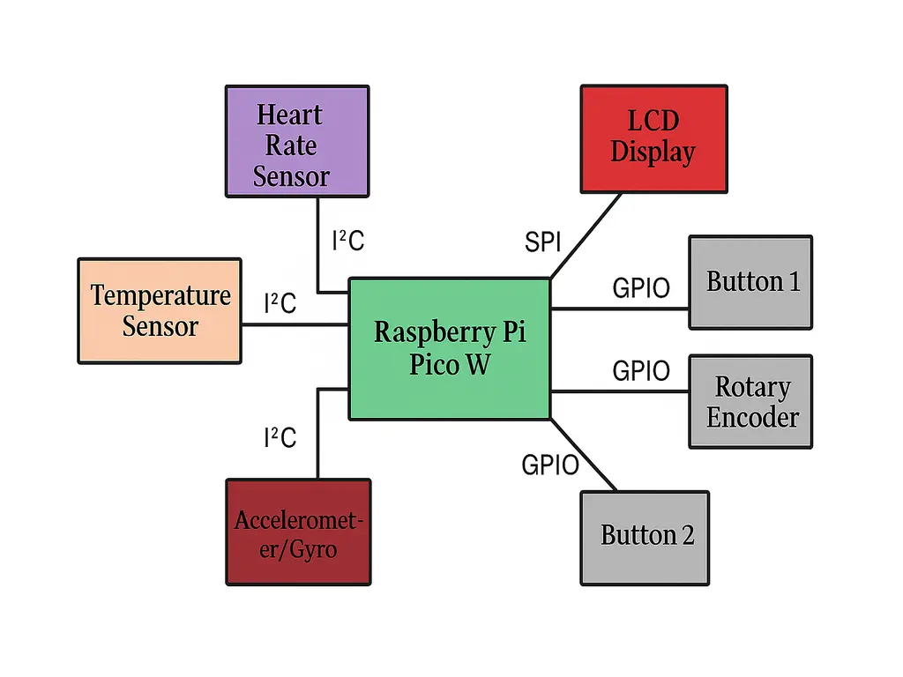
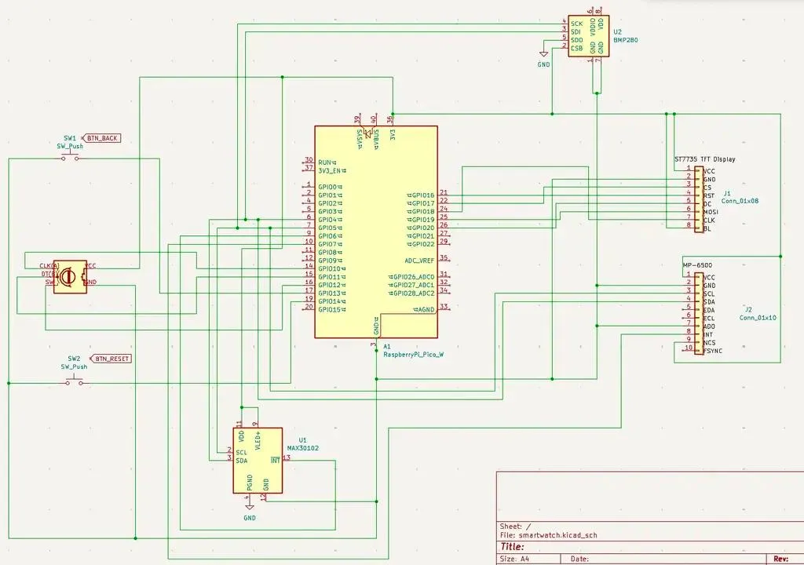

# General Smartwatch

A smartwatch-inspired device that tracks temperature, heart rate, and step count, and suggests actions based on mood.

:::info 

**Author**: Ghibirdic Maria-Cristina \
**GitHub Project Link**: [General Smartwactch](https://github.com/UPB-PMRust-Students/project-mariaghibirdic)

:::

## Description

This smartwatch is designed with user-friendly interactions for daily use. It displays the current time and temperature, monitors the user’s heart rate, and counts steps throughout the day. Based on the heart rate and activity levels, it provides simple mood-based suggestions: helping users become more aware of their emotional state. With its playful design and practical features, the smartwatch makes wellness tracking more engaging and accessible.


## Motivation

I wanted to create something both interactive and useful, a tool that could assist in monitoring key health indicators while remaining easy and enjoyable to use. The idea was to design a lightweight smartwatch that not only tracks data like heart rate, temperature, and steps but also encourages the user to become more aware of their physical and emotional state. By combining wellness tracking with a subtle challenge to stay mindful, the project aims to offer value beyond simple measurements.


## Architecture 

This is the diagram that illustrates the components and their connections.



**Raspberry Pi Pico W**  
- **Role**: Acts as the "brain" of the smartwatch: it controls all sensors, reads inputs, manages the display, and processes data in real-time.
- **Connections**: 
  - I²C for temperature, heart rate, and motion sensors  
  - SPI for display  
  - GPIO for rotary encoder and tactile buttons

**LCD Display (ST7735)**  
- **Interface**: SPI  
- **Role**: Displays the user interface: time, heart rate, temperature, mood, and step count  
- **Connections**:
  - **CS** (Chip Select): GPIO17  
  - **CLK** (Clock): GPIO18  
  - **MOSI** (Master Out Slave In): GPIO19  
  - **DC** (Data/Command): GPIO20  
  - **RESET**: GPIO21  
  - **Backlight & Power**: 3.3V and GND  

**Heart Rate Sensor (MAX30102)**  
- **Interface**: I²C  
- **Role**: Measures the user's heart rate and SpO₂ levels  
- **Connections**:
  - **SCL**: GPIO5  
  - **SDA**: GPIO4  
  - **Power**: 3.3V and GND  

**Temperature Sensor (BMP280)**  
- **Interface**: I²C  
- **Role**: Measures ambient temperature and pressure  
- **Connections**:
  - **SCL**: GPIO5 (shared)  
  - **SDA**: GPIO4 (shared)  
  - **Power**: 3.3V and GND  

**Motion Sensor (MPU-6500)**  
- **Interface**: I²C  
- **Role**: Tracks movement and counts steps using 3-axis accelerometer and gyroscope  
- **Connections**:
  - **SCL**: GPIO5 (shared)  
  - **SDA**: GPIO4 (shared)  
  - **Power**: 3.3V and GND  

**Rotary Encoder (KY-040)**  
- **Interface**: GPIO  
- **Role**: Used for UI navigation (scroll left/right + click to select)  
- **Connections**:
  - **CLK (A)**: GPIO10  
  - **DT (B)**: GPIO11  
  - **SW (Click)**: GPIO12  
  - **Power**: 3.3V and GND  

**Tactile Button 1**  
- **Interface**: GPIO  
- **Role**: "Back" button to exit views or return to main screen  
- **Connection**: GPIO13  

**Tactile Button 2**  
- **Interface**: GPIO  
- **Role**: "Reset" or additional custom input  
- **Connection**: GPIO14 

## Log

<!-- write your progress here every week -->

### Week 5 - 11 May
I started to search for the necessary components, looking for inspiration online and creating the overall plan of the project. Also, I ran small tests to observe the functionality of the pieces that I am using, for a better understanding.
### Week 12 - 18 May

### Week 19 - 25 May

## Hardware

1. **Microcontroller**  
   **Raspberry Pi Pico W**  
   - Dual-core Cortex-M0+  
   - Built-in Wi-Fi  
   - Supports Embedded Rust (Embassy)  
   - Low power consumption  

2. **Display and User Input**  
   **ST7735 TFT LCD**  
   - 1.3", 240×240 resolution  
   - SPI interface  
   - Displays time, mood, sensor data, and basic UI 
    
    **Rotary Encoder (KY-040)**  
   - Acts as a scroll wheel and selection button  
   - Uses 2 GPIOs for rotation + 1 GPIO for click  

   **Tactile Push Buttons (x2)**  
   - One for back/exit, one for reset or additional input  
   - Connected to GPIO pins  

3. **Sensors**  
   **Heart Rate Sensor - MAX30102**  
   - Measures heart rate and SpO₂  
   - I²C interface  
   - Used for mood/emotion estimation  

    **Temperature Sensor – BMP280**  
   - Measures ambient temperature and pressure  
   - I²C interface  
   - Accurate and low-power sensor    

   **Motion Sensor – MPU-6500**  
   - 3-axis accelerometer + 3-axis gyroscope  
   - SPI  
   - Used for step counting and motion tracking  

4. **Power Supply**  
   **LiPo Battery (9V, 500–1000mAh)**  
   - Portable power for wearable use   

5. **Input (Optional)**  
   **Tactile Push Buttons (x2 or x3)**  
   - Optional fallback input  
   - Connected to GPIOs for basic interaction  

6. **Breadboard**  
     
7. **Jumper wires**  

### Schematics

The Kicad scheme of the project: 



### Bill of Materials

<!-- Fill out this table with all the hardware components that you might need.

The format is 
```
| [Device](link://to/device) | This is used ... | [price](link://to/store) |

```

-->

| Device | Usage | Price |
|--------|--------|-------|
| [Raspberry Pi Pico W](https://ardushop.ro/ro/raspberry-pi/513-raspberry-pi-pico-6427854006004.html?gad_source=1&gbraid=0AAAAADlKU-42jinprSiunx6NMKr_hBv10&gclid=Cj0KCQjw_dbABhC5ARIsAAh2Z-QZ_2VEqphC-aUeK5cMd5FMvk5FfX926bzEJo8KvP8IVU-Dl3aCxC0aAg7gEALw_wcB) | The main microcontroller with Wi-Fi support | [~35 RON](https://www.aliexpress.com/item/1005004647347543.html) |
| [1.3" ST7735 TFT LCD Display](https://www.aliexpress.com/item/1005006690968351.html?src=google&pdp_npi=4%40dis!RON!22.37!14.68!!!!!%40!12000038178811402!ppc!!!&src=google&albch=shopping&acnt=298-731-3000&isdl=y&slnk=&plac=&mtctp=&albbt=Google_7_shopping&aff_platform=google&aff_short_key=UneMJZVf&gclsrc=aw.ds&&albagn=888888&&ds_e_adid=&ds_e_matchtype=&ds_e_device=c&ds_e_network=x&ds_e_product_group_id=&ds_e_product_id=en1005006690968351&ds_e_product_merchant_id=5088463358&ds_e_product_country=RO&ds_e_product_language=en&ds_e_product_channel=online&ds_e_product_store_id=&ds_url_v=2&albcp=21564641029&albag=&isSmbAutoCall=false&needSmbHouyi=false&gad_source=1&gbraid=0AAAAAqc5ie1sj-Oz_cMiZ9pBkpaFnXOUA&gclid=Cj0KCQjw_dbABhC5ARIsAAh2Z-SwN-gQZs7LwAXMplkVf63yIY57MbXObE7YdOteOHCN4CntfH9FRTYaAgyuEALw_wcB) | UI display for time, sensor data, and mood | [~12 RON](https://www.aliexpress.com/item/1005005097403947.html) |
| [Rotary Encoder Module](https://www.optimusdigital.ro/en/touch-sensors/7150-rotary-encoder-module.html?gad_source=1&gbraid=0AAAAADv-p3DST91rElLA-XfsBRapIVDc8&gclid=Cj0KCQjw_dbABhC5ARIsAAh2Z-S5Z8B9L9ZCnC3jZE_tYiWeB5Ks5VepGYU4Bpz7yCnCQeyV1NY9a60aAgs6EALw_wcB) | Scroll navigation | [~10 RON](https://www.aliexpress.com/item/1005003316879017.html) |
| [MAX30102 Heart Rate Sensor](https://www.aliexpress.com/item/1005005340463101.html) | Measures heart rate and SpO₂ | [~15 RON](https://www.aliexpress.com/item/1005005340463101.html) |
| [BMP280 Barometric Pressure Sensor Module ](https://www.optimusdigital.ro/en/pressure-sensors/1666-modul-senzor-de-presiune-barometric-bmp280.html?srsltid=AfmBOoqVoFU4Puo7DRsgnPe2BaMWG83vkZyJ3IDF1Il7P0NAquWecVQB) | Measures ambient temperature | [~8 RON](https://www.aliexpress.com/item/32792430517.html) |
| [MPU-6500 Accelerometer + Gyroscope](https://sigmanortec.ro/Modul-Accelerometru-Giroscop-I2C-MPU-6500-6-axe-p136248782?SubmitCurrency=1&id_currency=2&gad_source=1&gbraid=0AAAAAC3W72NKFDYwdfyTTpSdW2LkNtz2F&gclid=Cj0KCQjw_dbABhC5ARIsAAh2Z-RXaCz5PXyfl9knIBP0TchD5fPlfYEBgT2k2_cGC2WfCO-EHHJICrUaAok3EALw_wcB) | Motion detection and step counting | [~12 RON](https://www.aliexpress.com/item/1005001900978490.html) |
| [9V Alkaline Battery](https://www.aliexpress.com/item/1005005806074904.html) | Power supply for the smartwatch | [~10 RON](https://www.aliexpress.com/item/1005005806074904.html) |
| [Breadboard + Jumper Wires](https://www.optimusdigital.ro/en/kits/12026-plusivo-electronics-starter-kit-0721248990075.html?gad_source=1&gbraid=0AAAAADv-p3DST91rElLA-XfsBRapIVDc8&gclid=Cj0KCQjw_dbABhC5ARIsAAh2Z-QkeGMf9xWm5LnsMxHSpBMUKRBmqI9g3MxwQbAexsVZ7TNXNQZNYt4aAvOqEALw_wcB) | Used for prototyping and wiring | [Alredy owned](https://www.aliexpress.com/item/1005004657371379.html) |
| [Tactile Push Buttons (x2)](https://www.optimusdigital.ro/en/kits/12026-plusivo-electronics-starter-kit-0721248990075.html?gad_source=1&gbraid=0AAAAADv-p3DST91rElLA-XfsBRapIVDc8&gclid=Cj0KCQjw_dbABhC5ARIsAAh2Z-QkeGMf9xWm5LnsMxHSpBMUKRBmqI9g3MxwQbAexsVZ7TNXNQZNYt4aAvOqEALw_wcB) | Simple back/exit and interaction input | [Already owned](https://www.aliexpress.com/item/1005002750564980.html) |


## Software
The smartwatch firmware is developed in **Rust**, utilizing the **Embassy async framework** for efficient multitasking on embedded devices. Sensor readings, display updates, and data processing are structured as concurrent tasks.

| Library | Description | Usage |
|---------|-------------|-------|
| [embassy](https://github.com/embassy-rs/embassy) | Asynchronous embedded runtime for Rust | Handles multitasking and timing |
| [embedded-time](https://crates.io/crates/embedded-time) | Comprehensive library for handling time-related operations in embedded systems | Provides time and date utilities for embedded sysems |
| [embedded-graphics](https://github.com/embedded-graphics/embedded-graphics) | 2D graphics library for embedded displays | Used for drawing time, icons, and graphs on the display |
| [st7789](https://crates.io/crates/st7789) | Driver for ST7789 SPI TFT displays | Interfaces with the smartwatch’s LCD screen |
| [max3010x](https://crates.io/crates/max3010x) | Driver for MAX30102 pulse oximeter sensor | Reads heart rate and SpO₂ data |
| [heapless](https://crates.io/crates/heapless) | Fixed-capacity data structures for no_std environments | Manages queues, buffers, and logging without dynamic allocation |
| [defmt](https://crates.io/crates/defmt) | Logging framework for embedded systems | Provides efficient logging for debugging |

## Links

<!-- Add a few links that inspired you and that you think you will use for your project -->

1. [mwatch_kernel](https://docs.rs/mwatch_kernel/latest/mwatch_kernel/)
2. [Raspberry Pi Pico powers open source smart watch](https://github.com/umutsevdi/wear-pico)
3. [SmartWatch on the Raspberry Pi](https://youtu.be/fglvm2uxHSY?si=1Do3UmcfHFWQ0q5-) 
4. [What is MAX30102 and how to use it | Heart Beat Sensor | UtGo](https://youtu.be/V5UvNVQsUsY?si=OKcr_n-L4a2eRB6c)
5. [How to build your own Raspberry Pi watch](https://www.raspberrypi.com/news/how-to-build-your-own-raspberry-pi-watch/)
...
