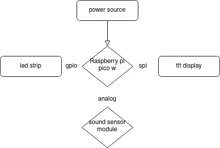

# Sound Visualiser
 Sound Visualiser- An interactive system that synchronizes sound with animation.

:::info 

**Author**: Tudorie Maria-Alexia \ 
**GitHub Project Link**: https://github.com/UPB-PMRust-Students/project-alexiatudorie

:::

## Description

The Sound Visualiser is an interactive project built with a Raspberry Pi Pico W, programmed in Rust. It uses a ST-7735 TFT screen controller and a sound sensor module to create a dynamic visual experience, where a ball reacts to sound frequencies in real time. The ball's movement, such as jumping or bouncing is directly tied to the audio input. Additionally, a led strip is representing visually the sound's intensity, with varying brightness.

## Motivation

The motivation behind this project comes from a desire to combine technology and music in a fun, interactive way. The use of a Raspberry Pi Pico and a sound sensor module provides a hands-on way to explore embedded systems and audio processing, while offering a creative approach which can be expanded in future iterations.

## Architecture 

## Log

### Week 5 - 11 May
Created the initial index.md file for project documentation.
Began structuring the project outline and documentation framework.
Started working on the hardware prototype.

### Week 12 - 18 May

### Week 19 - 25 May

## Hardware
 For this project, I used a Raspberry Pi Pico Wireless Plus with headers as the main microcontroller to control the various components. The breadboard serves as the central platform to prototype and organize the components. Jumper wires are used to establish the necessary electrical connections between the Pico and the other modules.

The RGB LED strip (WS2812, 8 LEDs) is connected to a GPIO pin on the Pico, allowing for dynamic lighting control through software. The sound sensor module is wired to an input pin on the Pico to detect sound levels, enabling interaction with the system based on ambient noise. Finally, the ST7735 TFT display is connected to the Pico via the SPI interface, providing a compact display for visual output and feedback. Resistors are strategically used in the circuit to ensure safe voltage levels and current regulation across components.

This hardware setup allows for real-time control and monitoring, with the LEDs responding to sound inputs and the display showing relevant information.

### Schematics

Place your KiCAD schematics here.

## Software

| Library           | Description  | Usage                                           |
|-------------------|------------- |-------------------------------------------------|
| ST7735 driver     |display driver| Used for the display for the Pico Explorer Base |
| embedded-graphics |2D graphics   | Used for drawing to the display                 |

### Bill of Materials

| Device | Usage | Price |
|--------|--------|-------|

<!--
## Links

..
-->

