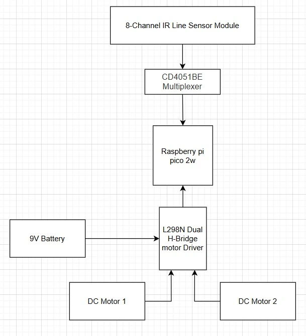
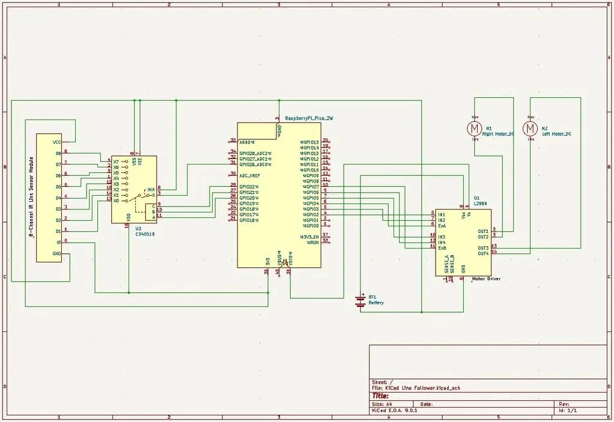

# Line Follower
A robot that follows a black line on a white background. 

:::info 

**Author**: Vasilca Maria \
**GitHub Project Link**: https://github.com/UPB-PMRust-Students/project-VasilcaMaria

:::

## Description

My project is a line-following robot programmed in Rust, using a Raspberry Pi Pico 2W as the microcontroller. The robot navigates autonomously by reading input from an 8-channel infrared line sensor module, which detects a black line on a white surface. Based on this sensor data, the robot makes real-time decisions to adjust its direction and stay on track. It uses two DC motors controlled through an L298N dual H-bridge motor driver to manage movement.

## Motivation

I chose this project because I started developing a passion for robotics and I wanted a practical way to apply what I have been learning about electronics and embedded systems. A line-following robot is a great starting point for a beginner because it will give me a chance to work with sensor integration, motor control and real time decision-making, which are all fundamental concepts in robotics.

## Architecture 

The sensors detect the black line and send data to the multiplexer, which selects and sends the sensor's data to the Raspberry Pi Pico 2W, where it processes the information to determine the movement, then sends control signals to the L298N motor driver to drive the DC motors, while the battery powers all the components.



## Log

<!-- write your progress here every week -->

### Week 5 - 11 May

### Week 12 - 18 May

### Week 19 - 25 May

## Hardware

<!--Detail in a few words the hardware used.-->
Raspberry Pi Pico 2W - Acts as the microcontroller, processing sensor input and controlling the motors.

8-Channel IR Line Sensors - These sensors detect the black line by reflecting infrared light off the surface. 

CD4051BE Multiplexer - Selects between multiple sensor outputs, allowing the Pico to read them through a single ADC pin.

L298N Motor Driver - It controls the motor speed and direction using signals from the Raspberry Pi Pico 2W, connecting the microcontroller to the motors.

2 DC Motors - Provide movement and steering based on the motor driver's commands.

Chassis + 2 Tires + Swivel Wheel - Provide structural support and movement capabilities for the robot.

9V Battery - powers the robot by connecting to the motor power input of the L298N motor driver, whose onboard regulator steps it down to 5V; this 5V is then fed into the VSYS pin of the Raspberry Pi Pico 2W to power the microcontroller. 

### Schematics

<!--Place your KiCAD schematics here.-->


### Bill of Materials

<!-- Fill out this table with all the hardware components that you might need.

The format is 
```
| [Device](link://to/device) | This is used ... | [price](link://to/store) |

```

-->

| Device | Usage | Price |
|--------|--------|-------|
| [Raspberry Pi Pico W](https://www.raspberrypi.com/documentation/microcontrollers/raspberry-pi-pico.html) | The microcontroller | [39,66 RON](https://www.optimusdigital.ro/ro/placi-raspberry-pi/13327-raspberry-pi-pico-2-w.html) |
| [L298N Dual H-Bridge Motor Driver](https://components101.com/sites/default/files/component_datasheet/L298N-Motor-Driver-Datasheet.pdf) | The motor driver | [10,99 RON](https://www.optimusdigital.ro/ro/drivere-de-motoare-cu-perii/145-driver-de-motoare-dual-l298n.html) |
| [2 DC Motors](https://media.digikey.com/pdf/Data%20Sheets/Adafruit%20PDFs/3777_Web.pdf) | The motors | [14,28 RON](https://ardushop.ro/ro/electronica/752-motor-dc-3v-6v-cu-reductor-1-48-6427854009609.html) |
| [8-channel infrared line sensors](https://www.pololu.com/docs/pdf/0j12/qtr-8x.pdf) | Used for line detection | [14,93 RON](https://sigmanortec.ro/Modul-urmarire-linie-8-canale-p159946861) |
| [9V Battery](https://manlybattery.com/the-essential-guide-to-selecting-batteries-for-robotics/) | Power supply | [15,14 RON](https://www.emag.ro/baterie-duracell-bsc-9v-dl-5000394077225/pd/DP5KQ3BBM/) |
| Battery Support | Power supply | [1,29 RON](https://www.optimusdigital.ro/ro/suporturi-de-baterii/20-conector-pentru-baterie-de-9-v.html) |
| [CD4051BE Multiplexer](https://www.ti.com/lit/ds/symlink/cd4053b.pdf?ts=1746197523444&ref_url=https%253A%252F%252Fwww.ti.com%252Fproduct%252FCD4053B%253Futm_source%253Dgoogle%2526utm_medium%253Dcpc%2526utm_campaign%253Dasc-int-null-44700045788355296_prodfolderdynamic-cpc-pf-google-eu_en_int%2526utm_content%253Dprodfolddynamic%2526ds_k%253DDYNAMIC+SEARCH+ADS%2526DCM%253Dyes%2526gclsrc%253Daw.ds%2526gad_source%253D1%2526gad_campaignid%253D11373390683%2526gclid%253DCj0KCQjw2tHABhCiARIsANZzDWpX9VqB8r_bnbn_Eh3Voc2BfDPT5YGvjCrHT_bB_4NcO3-GMwG1Pt0aAqJcEALw_wcB) | Signal selection switch | [1,34 RON](https://ardushop.ro/ro/circuite-integrate/1705-circuit-integrat-multiplexor-cd4051be-6427854025708.html) |
| [Debug Probe](https://eu.mouser.com/datasheet/2/635/raspberry_pi_debug_probe_product_brief-3241361.pdf) | Used for debugging | [57,56 RON](https://ro.farnell.com/raspberry-pi/sc0889/debug-connector-3-pin-raspberry/dp/4163983?srsltid=AfmBOoq5qFLwD_-AtayFL2ZX3RVx3BnJz5MtIgY3jBWoVywyEKFWAxuB) |
| Chassis | Structural support | 15 RON |
| 2 Tires | Movement| [10,72 RON](https://ardushop.ro/ro/roboti/2150-roata-roboti-cauciuc-65mm-diametru-6427854033017.html) |
| Swivel caster wheel | Movement | [5,95 RON](https://sigmanortec.ro/Roata-pivotanta-robot-p135756395) |
| Electronic Components Kit | Breadboard, wires, resistors, etc. | [60,38 RON](https://www.emag.ro/set-componente-electronice-breadboard-830-puncte-led-uri-compatibil-arduino-si-raspberry-pi-zz00044/pd/DRXG4XYBM/?utm_medium=ios&utm_source=mobile%20app&utm_campaign=share%20product) |


## Software

| Library | Description | Usage |
|---------|-------------|-------|
| [embassy](https://github.com/embassy-rs/embassy) | Framework | Used for developing embedded applications in Rust |
| [gpio](https://docs.embassy.dev/embassy-stm32/git/stm32c011d6/gpio/index.html) | General-purpose Input/Output module | Used for controlling GPIO pins |
| [ADC](https://docs.embassy.dev/embassy-rp/git/rp2040/adc/index.html) | Analog-to-digial converter module | Used for controlling ADC pins |
| [defmt](https://github.com/knurling-rs/defmt) | Compact logging crate for embedded systems | Used for debugging |

## Links

<!-- Add a few links that inspired you and that you think you will use for your project -->

1. [How to build a line follower](https://www.youtube.com/watch?v=wbrt2ClgZik&ab_channel=Maker101)
2. [L298N - How it works](https://howtomechatronics.com/tutorials/arduino/arduino-dc-motor-control-tutorial-l298n-pwm-h-bridge/)
