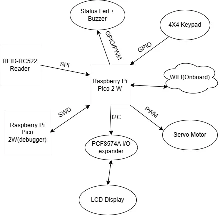
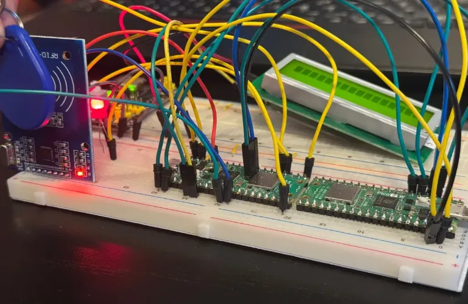

# Rusty Lock Access System
The Rusty Lock Access System is a multi-authentication security solution designed to control access using multiple user validation methods.

:::info

**Author**: Bejinaru Matei-Cristian\
**GitHub Project Link**: https://github.com/UPB-PMRust-Students/project-Matty27100

::::
## Description
Built around the Raspberry Pi Pico 2W microcontroller, this project integrates an RFID reader, Wi-Fi-based control, a matrix keypad, LCD feedback display, and a servo motor attatched by an iron wire to a door mechanism. The goal is to provide secure, user-friendly access control that can be managed both locally and remotely.
## Motivation
I've been brainstorming project ideas with a friend who shares my passion for technology and automation earlier this year. We came up with a few concepts for the Innovation Labs competition, with smart-home equipment being a central theme. Although we weren’t able to participate, the idea of creating a smart device stuck with me. When the time came to choose a project for this course, I knew I wanted to pursue something in that direction. That’s how I arrived at the idea of building a versatile smart lock system.
## Architecture 
### Logical Diagram
The Diagram with all the components:

### How it works

### Initialization: 
The system boots and initializes all components. The LCD displays a welcome message.

### Authentication:

***RFID:*** When a card is detected, its UID is checked against a known list.

***Keypad***: A valid PIN entered via the keypad is accepted.

***Wi-Fi***: Pressing the "Unlock" button on the web app sends a request that, if received, triggers the unlock.

### Unlocking: 
A validated user causes the servo to open the lock and display a message for a few seconds.

### Locking: 
After a delay, the servo returns to the locked position.

## Log
### Week 5 - 11 May
Once my project idea was approved, I ordered most of the required components and began implementation step by step. I started by configuring the second Pico as a debugger. After that, I got the RFID reader to work, successfully lighting up an LED upon tag detection. After that, I moved on to integrating the LCD screen.

### Week 12 - 18 May

### Week 19 - 25 May

## Hardware
The hardware setup is centered around the Raspberry Pi Pico 2W, with its built-in Wi-Fi capabilities. A variety of peripherals are used to create an interactive, multi-authentication smart lock system.

**Components Used**

**Raspberry Pi Pico 2W**            Central microcontroller; manages all logic and peripherals               
  **Raspberry Pi Pico 2W**             Microcontroller configured as a debugger for the central Pico             
  **RC522 RFID Reader**                SPI-based tag reader for user authentication                              
  **HD44780 16x2 LCD (via PCF8574)**   Displays system messages over I2C using an I/O expander                   
  **4x4 Matrix Keypad**                Used to enter a  PIN code for access                                      
  **SG90 Servo Motor**                 Drives the door lock mechanism (via PWM control)                          
  **Passive Buzzer**                   Emits audio feedback upon certain actions (e.g. denied access)            
  **LED**                              Status indicator (access granted, error, etc.)                            
  **External 5V Power Source**         Provides sufficient current for the LCD and servo motor                   

### Schematics
KiCad Scheme

### Bill of Materials
| Device                                                  | Usage                        | Price                           |
|---------------------------------------------------------|------------------------------|---------------------------------|
| [2xRaspberry Pi Pico 2W](https://www.raspberrypi.com/documentation/microcontrollers/pico-series.html) | Main Controller & Debugger | [39.66 RON x2](https://www.optimusdigital.ro/en/raspberry-pi-boards/13327-raspberry-pi-pico-2-w.html?srsltid=AfmBOoo5CQdoi14-RbmA_YJJrNUG1hPBzlSKgPdCOYv9U2PgJdK3bPwM) |
[RFID RC522](http://www.handsontec.com/dataspecs/RC522.pdf) | RFID Reader  | [9,99 RON](https://www.optimusdigital.ro/ro/wireless-rfid/67-modul-cititor-rfid-mfrc522.html?search_query=Modul+RFID+RC522+%28similar+cu+MFRC522%29&results=1) |
[4x4 Keypad](https://www.optimusdigital.ro/ro/senzori-senzori-de-atingere/470-tastatura-matriceala-4x4-cu-conector-pin-de-tip-mama.html?search_query=tastatura+matriceala+4x4+cu+conector+pin+de+tip+mama&results=1) | PIN Insertion | [6.99 RON](https://www.optimusdigital.ro/ro/senzori-senzori-de-atingere/470-tastatura-matriceala-4x4-cu-conector-pin-de-tip-mama.html?search_query=tastatura+matriceala+4x4+cu+conector+pin+de+tip+mama&results=1) |
[Active Buzzer Module](https://www.electronicoscaldas.com/datasheet/LTE12-Series.pdf?srsltid=AfmBOoq-FpY3VXD7NaVgtaZ0otTmO9sds9SsXFvK7EoTtfnxrfwBEN1t) | Buzzer | [1.40 RON](https://www.optimusdigital.ro/ro/audio-buzzere/633-buzzer-activ-de-5-v.html?search_query=buzzer+activ&results=18) |
[Breadboard, Jumpers & Power Supply Kit](https://www.optimusdigital.ro/ro/kituri/2222-kit-breadboard-hq-830-p.html?search_query=Kit+Breadboard+HQ830+cu+Fire+%C8%99i+Sursa&results=1) | General Wiring & Voltage | [22.00 RON](https://www.optimusdigital.ro/ro/kituri/2222-kit-breadboard-hq-830-p.html?search_query=Kit+Breadboard+HQ830+cu+Fire+%C8%99i+Sursa&results=1) |
[3 mm Diffused LED Diode Assortment Kit](https://www.optimusdigital.ro/ro/kituri/11971-set-led-uri-colorate-de-3mm-plusivo-cu-pcb-si-rezistoare-bonus-1000-buc.html?search_query=Set+led&results=192) | LEDs & Resistors | [29.99 RON](https://www.optimusdigital.ro/ro/kituri/11971-set-led-uri-colorate-de-3mm-plusivo-cu-pcb-si-rezistoare-bonus-1000-buc.html?search_query=Set+led&results=192) |
[Micro Servomotor SG90 90°](http://www.ee.ic.ac.uk/pcheung/teaching/DE1_EE/stores/sg90_datasheet.pdf) | Unlocking mechanism   | [13.99 RON](https://www.optimusdigital.ro/en/all-products/876-15-cm-male-female-wires-10p.html?search_query=male-male&results=808)
[16x2 LCD with PCF8574 Backpack](https://www.handsontec.com/dataspecs/module/I2C_1602_LCD.pdf) | Status Display| [16.34 RON](https://www.optimusdigital.ro/ro/optoelectronice-lcd-uri/2894-lcd-cu-interfata-i2c-si-backlight-albastru.html?gad_source=1&gbraid=0AAAAADv-p3AfplsCNHBzjgzLSoZOCd7e7&gclid=Cj0KCQjwoNzABhDbARIsALfY8VPXd4_ehDh3Er-IoPe6o3I9Sv9d3Aqny0TLet_b66dxgzk_iLnDUVcaAv9oEALw_wcB)

## Software

| Library | Description | Usage |
|---------|-------------|-------|
[embassy-rp](https://docs.embassy.dev/embassy-rp/git/rp235xb/index.html) | Embassy HAL for Raspberry Pi Pico (RP2040) | Direct access and async control of peripherals like SPI, I2C, GPIO, and timers
[embassy-executor](https://docs.embassy.dev/embassy-executor/git/cortex-m/index.html) | Async executor designed for embedded systems | Manages asynchronous task execution without needing an OS |
[embassy-time](https://docs.embassy.dev/embassy-time/git/default/index.html) | Timekeeping and delay abstraction | Used for creating delays and timers without blocking |
[embassy-sync](https://docs.embassy.dev/embassy-sync/git/default/index.html) | Primitives for concurrency and synchronization | Enables mutexes, signals, and channels between async tasks |
[embassy-net](https://docs.embassy.dev/embassy-net/git/default/index.html) | Async embedded TCP/IP network stack | Used to serve a web interface over Wi-Fi (for unlocking remotely) |
[cyw43](https://github.com/embassy-rs/embassy/tree/main/drivers/cyw43) |	Driver for the CYW43 Wi-Fi chip on the Pico W | Used to join a Wi-Fi network and host a small HTTP server
[mfrc522](https://crates.io/crates/mfrc522) | 	Rust driver for the MFRC522 RFID reader |Handles tag detection and UID reading
[gpio](https://docs.embassy.dev/embassy-rp/git/rp235xb/gpio/index.html) | GPIO management | Used for controlling GPIO pins
[pcf857x](https://crates.io/crates/pcf857x) | Driver for PCF8574 I/O expander | Used to communicate with the I2C backpack for LCDs
[pwm](https://docs.embassy.dev/embassy-rp/git/rp235xb/pwm/index.html) | PWM module | Used for controlling the buzzer

## Links
1. [DIY Smart Door Lock](https://www.youtube.com/shorts/Bcqeyk_-kx8)
2. [RFID DOOR LOCK](https://www.youtube.com/shorts/94idGywsd70)

