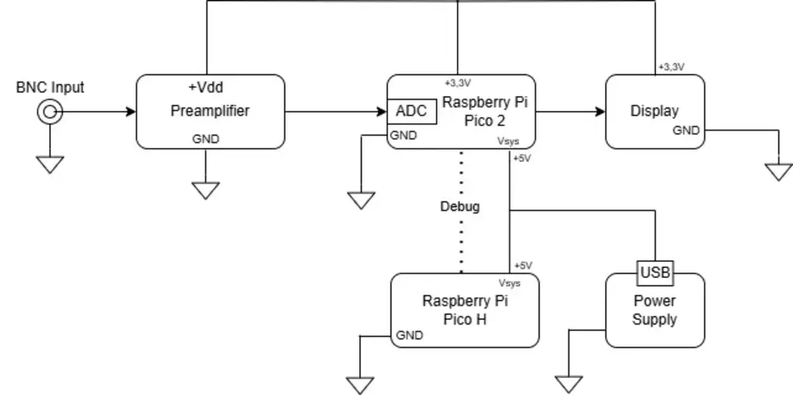
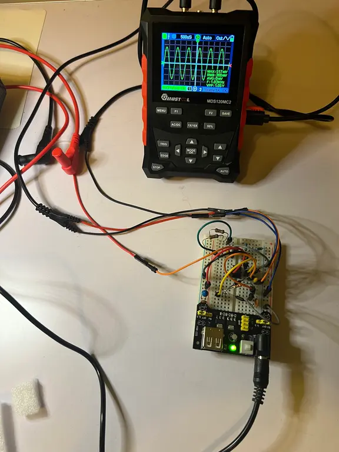
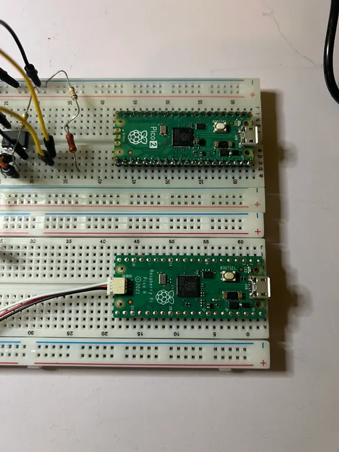
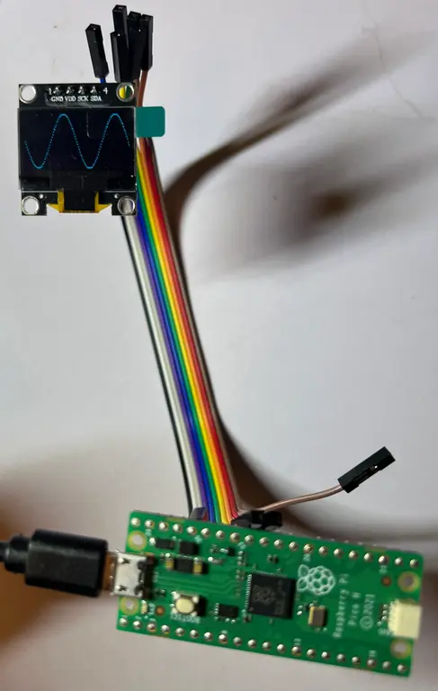
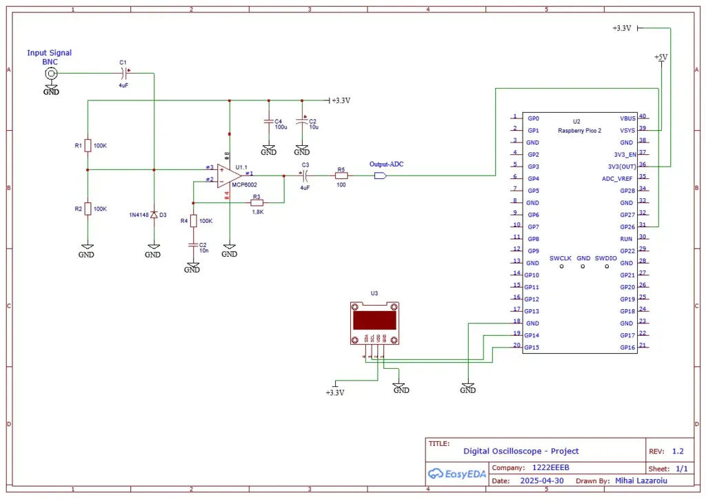

# Digital Oscilloscope
A digital oscilloscope that displays the most important parameters

:::info 

**Author**: Lazaroiu Mihai \
**GitHub Project Link**: https://github.com/UPB-PMRust-Students/project-mihai1402

:::

---

## Description

This project’s main function is to demonstrate the functionality of a digital oscilloscope programmed in Rust. The hardware consists of:

- An analog pre-amplifier for preparing the input signal
- A microcontroller for signal processing
- A debugger to aid the microcontroller during testing
- A screen for display
 
The software allows the hardware to perform various functions of an oscilloscope like displaying an external signal and measuring its key parameters.

---

## Motivation

I chose to build an oscilloscope,to combine my interest in electronics and audio signals with a practical and useful application. It also helps me understand theoretical concepts I've learned so far.

---

## Architecture 

The hardware is composed of four main components:

1. **Pre-amplifier**  
   - Built using resistors, diodes, capacitors, and an op-amp in a non-inverting configuration.
2. **Processing unit**  
   - Based on the Raspberry Pi Pico 2 (main processor) and Raspberry Pi Pico H (debugger during testing).
3. **Display**  
   - Visualizes the signal from the microcontroller.
4. **Power supply**  
   - Feeds all the components with necessary voltage.

These 4 components work together to form the oscilloscope in the following way:

Signal flow:
- Input signal → probe → pre-amplifier → ADC (Pico 2) → display.

Power setup:
- Raspberry powered via USB; peripherals via 3.3V GPIO pin.

---

## Log

### Week 10
- Wrote the documentation
- Finished the pre-amplifier
- Tested different screen types by drawing signal functions
- **Note**: Final screen model still undecided, so specified crate is not yet final

### Week 9
- Troubleshooting the pre-amplifier
- Started more detailed software design

### Week 8
- Started building the pre-amplifier

### Week 7
- Parts arrived
- Began planning next steps

### Week 6
- Ordered parts for the pre-amplifier

### Week 5
- Finished initial plan (hardware & software bill of materials)
- Uploaded project idea document

### Week 4
- Brainstormed project ideas

---

## Hardware

### Components

- 5x Resistors (R1 → R5)
- 5x Capacitors (C1 → C5)
- 1x Diode (D1)
- 1x Op-amp (MCP6002, non-inverting configuration)
- Power source
- Raspberry Pi Pico 2
- Display
- Probe

### Function of Components

- `C1`: used to eliminate the DC component
- `R1`, `R2`: form a voltage divider that ensures the input bias 
- `R3`, `R4`: are used to set the amplification factor of the op-amp to 1
- `C2`: used so that the amplification only applies to the AC component
- `Op-amp`: part of a MCP6002 integrated circuit that has 2 operational amplifiers. Only one of the 2 was used. A secondary function of the amplifier in combination with the voltage that powers it is to limit the max amplification in order to protect the internal ADC of the microcontroller
- `C3`: used to make sure no DC component enters the ADC, after the operational-amplifier. `C1` was used to block the DC component before the amplifier
- `C4`: used to block high frequencies from generating auto-oscillations
- `C5`: is used to eliminate spikes from a switching power supply
- `R5`: limits potential high currents from affecting the ADC
- `D1`: used to protect the non-inverting input of the amplifier from negative voltages
- Probe: used to acquire the signal

### Prototype Photos

**Breadboard analog pre-amplifier prototype:**  

**Processing hardware:**  

**Signal on screen:**  

---

### Schematics

The connections of the components described previously can be seen on the following electric diagram.

---

### Bill of Materials

| **Device** | **Usage** | **Price** |
|------------|-----------|-----------|
| [BNC Female Connector](https://www.alldatasheet.com/datasheet-pdf/view/295283/DDK/UG-1094SLASHU.html) | Connects the probe to the pre-amplifier | [5.83 RON](https://www.infinity.ro/mufa-bnc-mama-ug1094-u-panou-cu-contacte-placate-cu-aur-goobay-1249029/p?idsku=5154091&gad_source=1&gclid=Cj0KCQjw_dbABhC5ARIsAAh2Z-Sd8Xp91JGsaZ2eHA7XSrJa7BzURtEQikkvb39enAw92yQqO51Q8KoaAtJSEALw_wcB) |
| [1N4148 Diode](https://www.vishay.com/docs/81857/1n4148.pdf) | Protects the non-inverting input of the op-amp | [0.49 RON](https://www.adelaida.ro/1n4148.html) |
| [100kΩ Resistor (x2)](https://assets.rs-online.com/v1699613067/Datasheets/7ec977c91977fd4e95a020bd86d6d6c5.pdf) | Voltage divider and amplification factor | [0.10 RON](https://sigmanortec.ro/kit-rezistori-30-valori-20-bucati) |
| [4µF Capacitor (x2)](https://www.farnell.com/datasheets/2167237.pdf) | DC decoupling | [0.49 RON](https://sigmanortec.ro/Set-condensatori-ceramici-300-bucati-p136306101) |
| [MCP6002-I/P Op-Amp](https://ww1.microchip.com/downloads/en/DeviceDoc/MCP6001-1R-1U-2-4-1-MHz-Low-Power-Op-Amp-DS20001733L.pdf) | High input impedance operational amplifier | [3.00 RON](https://www.adelaida.ro/mcp6002-i-p.html) |
| [1.8kΩ Resistor](https://www.vitrohm.com/files_stat/VITROHM_SF_Catalogue_2005_06.pdf) | Amplification factor setting | [0.05 RON](https://sigmanortec.ro/kit-rezistori-30-valori-20-bucati) |
| [10nF Capacitor](https://www.mouser.com/catalog/specsheets/Murata%20GRM%20Series.pdf?srsltid=AfmBOoq4RT9utvcCwZqC6P3IlrdjqVwv4fdaIIBLYwuLAMYXWOf3wjRY) | Avoid DC amplification | [0.10 RON](https://sigmanortec.ro/Set-condensatori-ceramici-300-bucati-p136306101) |
| [200Ω Resistor](https://www.texro.ro/frizlen/gwadq-320x80-200-200ohm-oem) | Input current limiting for ADC | [0.10 RON](https://sigmanortec.ro/kit-rezistori-30-valori-20-bucati) |
| [Li-Ion 3.7V Battery 18650 (x2)](https://mm.digikey.com/Volume0/opasdata/d220001/medias/docus/427/ICR18650_2600_DS.pdf) | Powers the oscilloscope | [32.00 RON](https://sogest.ro/acumulator/acumulator-pkcell-icr18650-li-ion-37v-cu-terminale-2600-mah-632) |
| [100nF Capacitor](https://docs.rs-online.com/9eb3/A700000006704457.pdf) | Avoid auto-oscillation | [0.10 RON](https://sigmanortec.ro/Set-condensatori-ceramici-300-bucati-p136306101) |
| [10µF Capacitor](https://www.farnell.com/datasheets/2243561.pdf) | Avoid voltage spikes | [0.49 RON](https://sigmanortec.ro/Set-condensatori-ceramici-300-bucati-p136306101) |
| [Oscilloscope Probe](https://www.virtins.com/P6060.shtml) | Signal acquisition | [79.99 RON](https://www.optimusdigital.ro/accesorii/1017-sonda-de-osciloscop-p6060-de-60-mhz.html) |
| [Raspberry Pi Pico 2](https://datasheets.raspberrypi.com/pico/pico-2-datasheet.pdf) | Microcontroller unit (MPU) | [39.66 RON](https://ardushop.ro/ro/raspberry-pi/2453-raspberry-pi-pico-2-5056561803951.html) |
| [Raspberry Pi Pico H](https://www.raspberrypi.com/documentation/microcontrollers/pico-series.html) | Debugging | [42.74 RON](https://www.optimusdigital.ro/ro/placi-raspberry-pi/12393-raspberry-pi-pico-h.html) |
| [Display OLED 1.3" (Prototype)](https://www.mouser.com/datasheet/2/1398/Soldered_333099-3395096.pdf) | Shows signal and parameters | [20.99 RON](https://ardushop.ro/ro/display-uri-si-led-uri/1577-display-oled-096-i2c-albastru-jmd096d-1-6427854023469.html) |
| [IC Socket](https://www.mouser.com/pdfDocs/te-connectivity-dip-socket-data.pdf?srsltid=AfmBOorTl-JuFRXVDn0Gy8AO-NJMjdgZ-fLtzpp4Q_E8__QewjH7AlPZ) | Socket for op-amp | [1.37 RON](https://sigmanortec.ro/soclu-dip-8-pini) |
| [Header Pins](https://voron.ua/files/pdf/razjem/zl201.pdf) | Connects Raspberry Pico | [0.95 RON](https://www.adelaida.ro/bareta-20-pini-zl201-20g.html) |
| [Breadboard + Prototype Power Source](https://microcontrollerslab.com/mb102-breadboard-power-supply-module-pinout-and-how-to-use-it/) | Prototyping circuit | [25.57 RON](https://sigmanortec.ro/Kit-Breadboard-MB102-Sursa-Fire-dupont-p136264993) |

---

## Software

| **Library** | **Description** | **Usage** |
|-------------|-----------------|----------|
| [embassy-rp](https://docs.embassy.dev/embassy-rp/) | Raspberry Pi Pico 2 hardware abstraction | Used for interacting with peripherals like ADC, SPI, I2C, timers, and GPIOs to acquire and display waveform data |
| [embassy-executor](https://docs.embassy.dev/embassy-executor/) | Async task executor for embedded projects | Manages concurrent tasks for waveform sampling, processing, and display update in real-time |
| [embassy-time](https://docs.rs/embassy-time/) | Timekeeping and async timers | Used to generate accurate sampling intervals for the oscilloscope and trigger time-based actions |
| [embassy-sync](https://docs.embassy.dev/embassy-sync/) | Async-safe signals, mutexes, and channels | Coordinates data flow between ADC sampling, processing, and the display task to ensure smooth real-time updates |
| [heapless](https://docs.rs/heapless/) | Fixed-size data structures for `no_std` | Implements double buffering for waveform data to ensure no data loss during updates to the display |
| [embedded-graphics](https://docs.rs/embedded-graphics/) | 2D graphics and text rendering | Renders waveforms, signal properties like amplitude/frequency, and other graphical elements on the display |
| [ssd1306](https://github.com/eldruin/ssd1306) | Display driver for I2C OLED screens | Controls the OLED display to show real-time waveforms and signal information in the oscilloscope |
| [display-interface-i2c](https://docs.rs/display-interface-i2c/) | Adapter crate for I2C display interface | Connects the SSD1306 driver to the embedded-graphics library via I2C communication |
| [microfft](https://docs.rs/microfft/) | Lightweight FFT crate for `no_std` | Performs Fast Fourier Transform (FFT) to calculate the frequency of the signal in real time |
| [cortex-m](https://docs.rs/cortex-m/) | Low-level access to Cortex-M processor features | Supports interrupts and system functions for handling ADC, DMA, and display updates |
| [cortex-m-rt](https://docs.rs/cortex-m-rt/) | Runtime crate for Cortex-M | Initializes the board and manages interrupt-driven tasks, including DMA and signal sampling |
| [defmt](https://docs.rs/defmt/) | Logging crate for embedded projects | Provides debug logging for signal data, task progress, and error tracking in the oscilloscope |
| [panic-halt](https://docs.rs/panic-halt/) | Panic handler for embedded projects | Safely halts the CPU on panic, ensuring stable operation in embedded systems like the oscilloscope |

---

## Links

1. [Inspiration for the pre-amplifier](https://people.ece.cornell.edu/land/courses/ece4760/ideas/singlesupply.pdf)
2. [Help for building the pre-amplifier](https://www.electronics-notes.com/articles/analogue_circuits/operational-amplifier-op-amp/non-inverting-amplifier.php)
