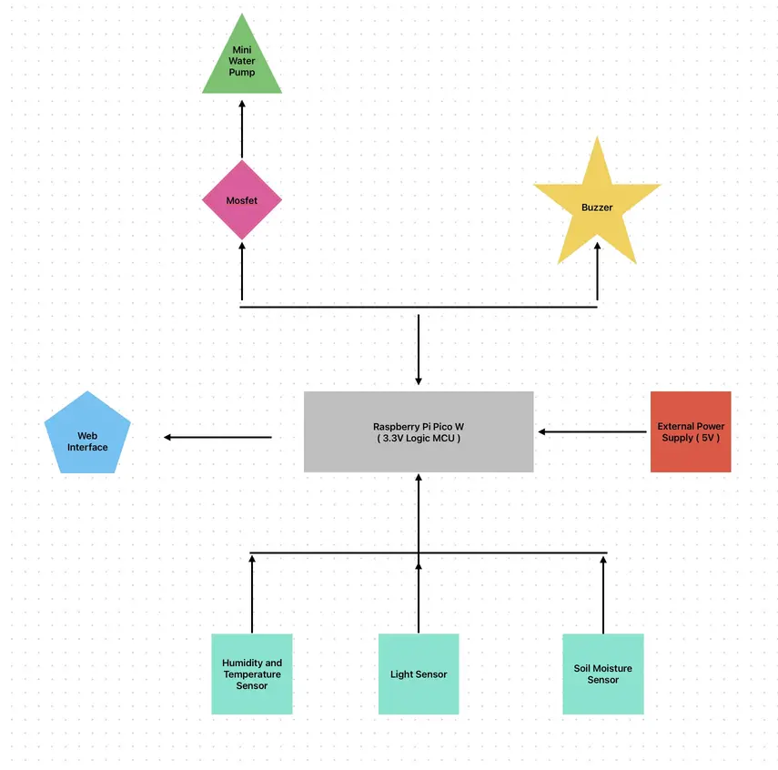

# Plant Guardian

A smart system using microprocessors to monitor and protect plants by measuring soil moisture, light, and temperature, ensuring optimal growth conditions.

:::info

**Author**: Sîrbu Mihai-Alexandru \
**GitHub Project Link**: [Click Here!](https://github.com/UPB-PMRust-Students/project-akachimao)

:::

# Description

This project aims to collect data through various sensors in order to fulfill a plant’s basic needs. The information provided by these sensors triggers different components of the system, such as a water pump that activates when the soil moisture—measured by a soil moisture sensor—drops below an optimal level for the plant, or a buzzer that alerts when light or temperature levels are not suitable for the plant’s well-being. Every aspect of this project can be monitored through a web interface.

# Motivation

I chose this project because I wanted to create something that could realistically be used in my day-to-day life. I’ve always loved plants, but watering them can be a burden—especially when I want to leave home for more than a couple of days. This sparked the idea of an automated watering system for my plants that can also notify me if something is wrong with the temperature or light levels via a website, so I can ask someone to check on them only if needed.

# Architecture

The Main Components of the Project's Architecture:

**1.User Interface (UI)**

*Function*: Allows the user to interact with the system (via web or app / i'll choose one soon).

*Connection*: Connects to the Controller and Sensors to retrieve and display data (moisture levels, temperature, and light).

**2.Controller (Raspberry Pi Pico W)**

*Function*: The brain of the system, which processes sensor data, makes decisions, and controls actuators (like the water pump).

*Connection*: ~~~

~Interfaces with the Sensors (reads data).

~Sends control signals to Actuators (water pump, buzzer).

~Communicates with the User Interface via Wi-Fi.

**3.Sensors**

**Soil Humidity Sensor**: Detects the moisture level of the soil.

**Temperature and Humidity Sensor**: Measures the ambient temperature and humidity.

**Light Sensor**: Monitors the light levels.

*Connection*: Sensors send data to the Controller, which processes the information and makes decisions.

**4.Actuators**

**Water Pump**: Activated by the Controller when the soil is too dry.

**Buzzer**: Alerts the user when something is wrong (low light or high temperature).

*Connection*: The Controller sends signals to actuate them based on sensor data.

# Log

### Week 5-11 May

*to be updated this week*

### Week 12-18 May

### Week 19-25 May 

# Hardware

For this project, I am using a **Raspberry Pi Pico W** as the brain of the system. This microcontroller is connected to and gathers information through various sensors: a soil moisture sensor, a light sensor, and a temperature and humidity sensor. Each sensor triggers a key function that this project aims to fulfill.

The soil moisture sensor directly controls a water pump, which is submerged in water and activates when the soil becomes too dry. The water pump is connected through an **IRLZ34NPBF MOSFET** to prevent any voltage or power issues caused by the pump’s higher power requirements.

The other sensors provide data on light levels, humidity, and temperature, and alert the user via a buzzer and the web interface if any of these parameters fall outside the normal range.

### Schematics

*to be updated next week when the project will be fully built*

# Bill of Materials

| Device | Usage | Price |
| ----------- | ----------- | ------------|
| Raspberry Pi Pico W | The microcontroller | 40 RON |
| Soil Humidity Sensor | It detects the humidity level from the soil | 35 RON  |
| Passive Buzzer| Alerts the user when certain conditions are met | 1 RON  |
| Mini Water Pump| Pumps water when needed | 10 RON |
| N-Mosfet IRLZ34NPBF | Acts as an electric switch for controlling higher current and voltage required by the water pump  | 7 RON  |
| Humidity and Temperature Sensor | It detects the humidity level in the air and also the temperature | 25 RON |
| Light Sensor | It Detects the light level around the plant | 50 RON |
| Plastic Hose | It's used to transport the water pumped by the **Water Pump** | 25 RON |
| Wires , BreadBoard , Diodes , Leds , Pins , etc ... | The "veins" of our "living organism" , used for testing and connecting all the components | ~50 RON |

# Software 

| Library | Description | Usage |
| ----------- | ----------- | --------- |
| rp-pico | Official support crate | Initializes the Pico W microcontroller, including pins and clocks |
| embedded-hal | Core traits for GPIO, PWM, and ADC control | Soil Humidity Sensor, Passive Buzzer, Mini Water Pump, MOSFET, Light Sensor, LEDs, Wires, etc |
| dht-sensor  | DHT11/DHT22 sensor driver  | Reads temperature and humidity from the DHT sensor  |

# Links

[GitHub Profile](https://github.com/akachimao)

[GitHub Project Page](https://github.com/UPB-PMRust-Students/project-akachimao)
