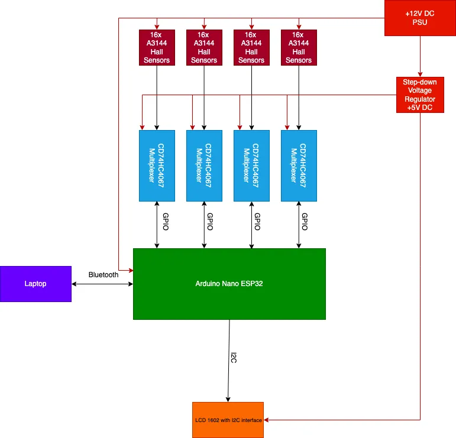
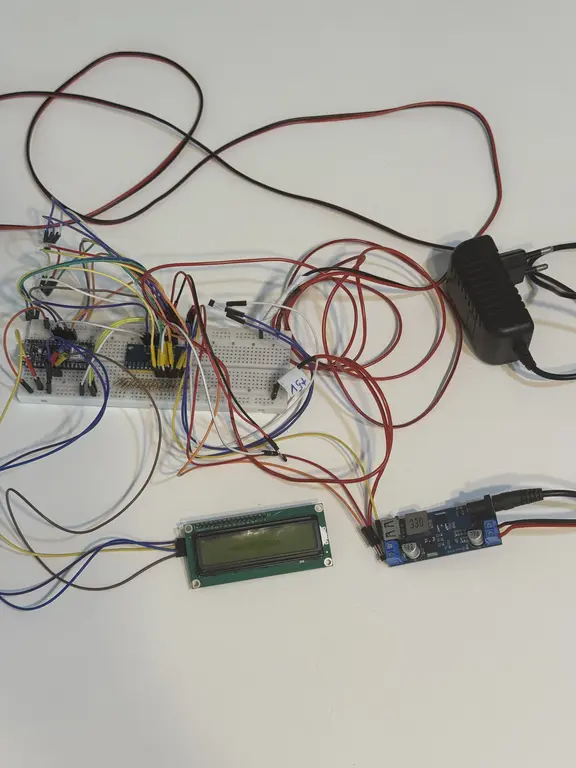
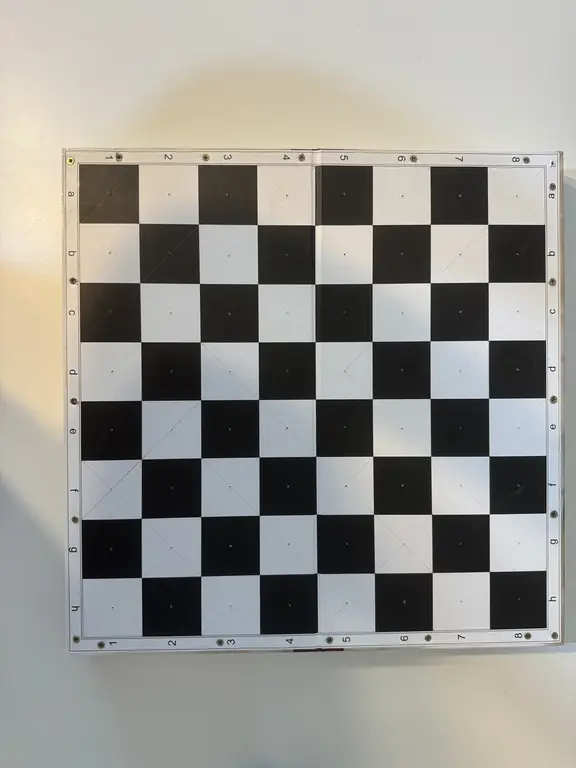
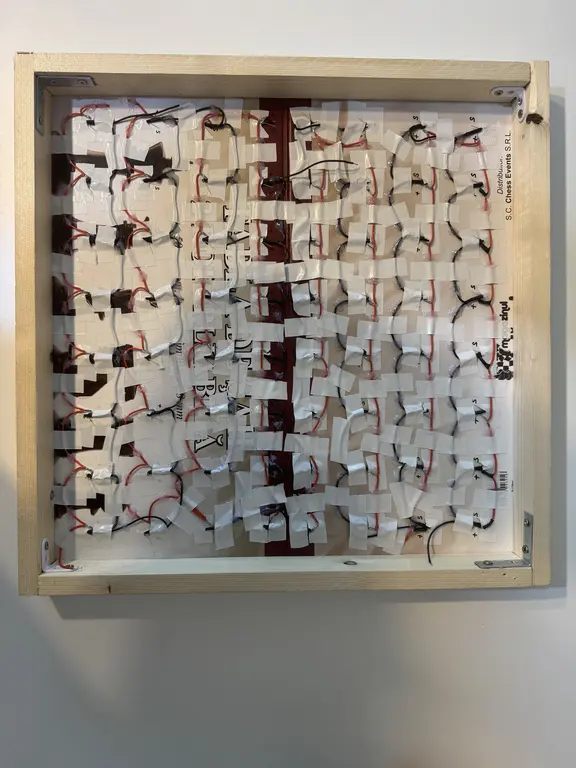
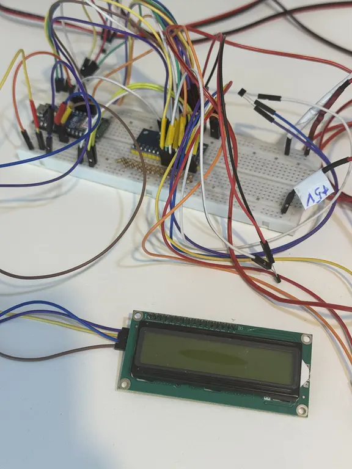
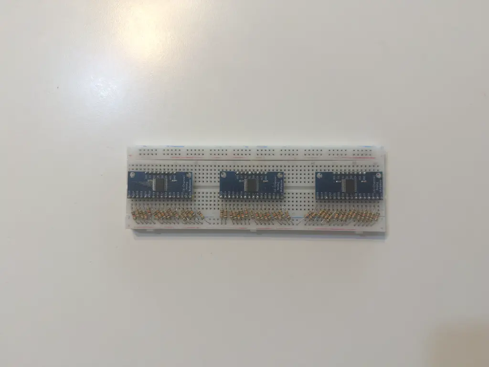
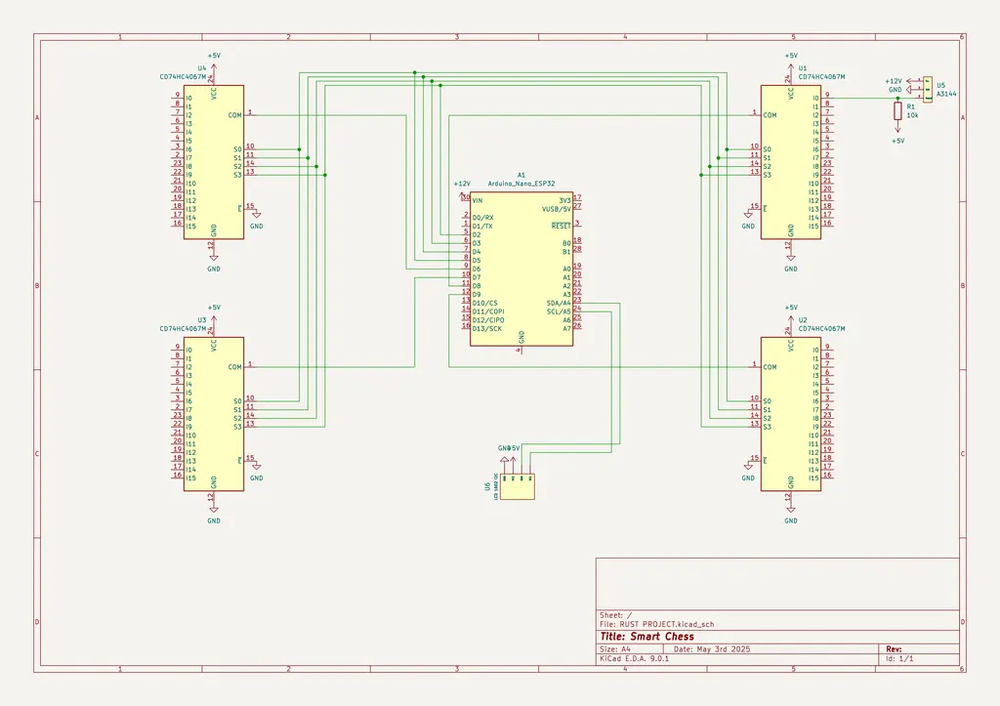

# Smart Chess

Physical chess meets electronics: a sensor-equipped board that wirelessly connects players to chess engines while preserving the tactile experience of traditional gameplay.

:::info

**Author**: Țînțareanu-Mircea Mihai-Cezar \
**GitHub Project Link**: https://github.com/UPB-PMRust-Students/project-JustTOE

:::

## Description

Picture this: It's Saturday night. You've returned from university, exhausted your gaming options, and suddenly spot your old chess board gathering dust in the corner. Nostalgia hits and you feel like a game of over the board chess is exactly what you need. But there's a problem—who's going to play with you? Enter the Smart Chess project. No more desperately calling friends who can barely distinguish a rook from a pawn, or interrupting your father's weekend relaxation time. And let's be serious, no online chess platform could ever beat the tactile feeling of moving chess pieces across the board. Now you are going to face much better oponents and take a taste of the real deal!

## Motivation

I have always been into chess. Ever since I was a kid I participated in countless chess competitions across the country. Although I had always had strong oponents and friends to play with, there were times where I was simply left alone, with no one to play against. I wanted to play over the board chess, the real deal, not in browser over some interface. This project bridges that gap—delivering the traditional, tactile chess experience that I love but updated for the 21st century.

## Architecture 

The core of the system revolves around the detection of chess piece positions through Hall effect sensors and Bluetooth communication with a chess engine.

This project diagram illustrates the connectivity of the system utilizing a Arduino Nano ESP32 as the main controller. The Arduino Nano ESP32 is connected to various components including four multiplexers which are connected to sixty four hall effect sensors themselves, as well as an LCD 16x2 Character Display with an I2C controller.

___

**Arduino Nano ESP32:**
- **Role**: Acts as the "brain" of the system — reads sensor data, manages chess game state, communicates via Bluetooth, and controls the LCD display 
- **Connections**: GPIO pins for multiplexer control (S0-S3) and multiplexer input, I2C interface for LCD, Bluetooth for laptop communication 
- **Features**: Dual-core operation (BLE on APP core, sensor reading on main core)

___

**Hall Effect Sensors (A3144):** 
- **Interface**: Digital 
- **Role**: Detect the presence of magnetic chess pieces on the board 
- **Connections**: Each set of 16 sensors connects to a multiplexer. The sensors are arranged in an 8x8 grid (64 total) 
- **Operation**: Triggered by neodymium magnets attached to chess pieces, outputs digital state

___

**Multiplexers (CD74HC4067):** 
- **Interface**: GPIO 
- **Role**: Manage input from 64 Hall sensors using only 4 control pins and 4 signal output pins 
- **Connections**: 
Control pins (S0-S3): GPIO5-8 
Signal output: GPIO-9,10,17,18
16 inputs from Hall sensors 
- **Function**: Select one of 16 channels at a time based on control pin states

___

**LCD 1602 with I2C Interface:** 
- **Interface**: I2C 
- **Role**: Displays chess engine moves and current game information 
- **Connections**: I2C communication protocol (SDA/SCL pins)
- **Display**: 16 characters × 2 lines for move notation and game status

___

**Laptop with Bluetooth:**
- **Role**: Runs Stockfish chess engine and processes move calculations 
- **Communication**: Receives board state via Bluetooth, returns calculated moves to ESP32 
- **Function**: Provides AI opponent for the physical chess board

___

**Power System**
- **Primary**: +12V DC power supply unit (PSU)
- **Regulation**: Step-down voltage regulator converting to +5V DC
- **Distribution**: Powers all components (sensors, multiplexers, ESP32, LCD)

## Log

### Week 6 - 12 May

Once the project had been approved I had began researching the components that I needed as well as building the framework of the chess board. Since then I have assembled a debug board with all the necessary components in order to test the behavior of the sensors and I have also started builiding the data transmission pipeline with the use of Bluetooth.

### Week 7 - 19 May

### Week 20 - 26 May

## Hardware

Arduino Nano ESP32: Acts as the brain of the operation, running the Rust firmware

Hall Effect Sensors: One for each square (64 total), detecting magnetic presence

CD74HC4067 Multiplexers: Manage the input from 64 sensors

Chess Board: Standard 8x8 board with internal sensor array

Chess Pieces: Standard pieces fitted with neodymium magnets

1602 LCD with I2C Controller: Displays chess engine moves and game information

Here are some pictures of the project:\
**Please do note that the images are subject to change as this is just a debug setup.**

**Chess board**:\

**Hardware**:\

### Schematics

Here is presented the KiCad schematic:

For ease of understanding, only one Hall effect sensor is represented as to not clutter the schematic.

### Bill of Materials

| Device | Usage | Price |
|--------|--------|-------|
| [Arduino Nano ESP32](https://store.arduino.cc/en-ro/products/nano-esp32?srsltid=AfmBOoqC4eIdTrano76blvZp6Q0We8uBHyOaPMQAitD-6Mrb9SefAUX0) | The microcontroller | [190 RON](https://www.robofun.ro/arduino-nano-esp32.html?gad_source=1&gbraid=0AAAAApSyPJUv5yOKnC2LV-IPSIIx6Afyd&gclid=Cj0KCQjw2tHABhCiARIsANZzDWrv4jn4NH4c7QVGqQrBrF4-gS3PNDmrNyfcH08mWKmjf1SIN1d6qrsaAjOYEALw_wcB) |
| [64x A3144 Hall Effect Sensors](https://www.alldatasheet.com/datasheet-pdf/view/55092/ALLEGRO/A3144.html) | Detecting magnetic presence | [2.25 x64 RON (30% off)](https://ardushop.ro/ro/senzori/955-senzor-magnetic-hall-a3144-6427854012852.html?gad_source=1&gbraid=0AAAAADlKU-5WgFBYGi9Sv3X801LMWCocK&gclid=Cj0KCQjw2tHABhCiARIsANZzDWrV37fsctGN5ClD1hDh9uYGNU5IJzE4UDzIjpckpxbgGBn_fE_sfdAaAufeEALw_wcB) |
| [4x CD74HC4067 Multiplexer](https://www.alldatasheet.com/datasheet-pdf/view/27059/TI/CD74HC4067.html) | Manages the input from 64 sensors | [5.77 x4 RON](https://www.optimusdigital.ro/ro/electronica-de-putere-multiplexoare-de-alimentare/1378-modul-multiplexor-analogic-cu-16-canale-cd74hc4067.html?gad_source=1&gbraid=0AAAAADv-p3B5TYhyjMqYSQe-vwiSkvVW-&gclid=Cj0KCQjw2tHABhCiARIsANZzDWqIt86WUKLbULyLvFVha6HRhg-cQ9Ehl68iTUJ4BSx3QVmkYQp3Vz4aAmCREALw_wcB) |
| [LCD 1602 with I2C Backpack Interface](https://www.optimusdigital.ro/ro/optoelectronice-lcd-uri/62-lcd-1602-cu-interfata-i2c-si-backlight-galben-verde.html?search_query=LCD+1602&results=17) | Displays chess engine moves and game information | [14.99 RON](https://ardushop.ro/ro/electronica/299-led-5mm.html?search_query=Led&results=242#/10-culoare-rou) |
| [Step-down voltage regulator](https://www.optimusdigital.ro/ro/surse-coboratoare/8401-modul-sursa-de-tensiune-coboratoare-6-a-intrare-9-36-v-ieire-5-v.html?search_query=Modul+Sursa+de+Tensiune+Coboratoare%2C+6+A+%28Intrare%3A+9+-+36+V%2C+Ie%C8%99ire%3A+5+V%29&results=36) | Reduces the voltage from 12V DC to 5V DC | [24.99 RON](https://www.optimusdigital.ro/ro/surse-coboratoare/8401-modul-sursa-de-tensiune-coboratoare-6-a-intrare-9-36-v-ieire-5-v.html?search_query=Modul+Sursa+de+Tensiune+Coboratoare%2C+6+A+%28Intrare%3A+9+-+36+V%2C+Ie%C8%99ire%3A+5+V%29&results=36) |
| [AWG22 Silicone Wire Kit](https://www.optimusdigital.ro/ro/kituri/9514-set-de-fire-siliconice-22awg-6-culori-7m-fiecare.html?search_query=AWG22+&results=1) | Sensor VCC and GND wires | [50 RON](https://www.optimusdigital.ro/ro/kituri/9514-set-de-fire-siliconice-22awg-6-culori-7m-fiecare.html?search_query=AWG22+&results=1) |
| [AWG24 Silicone Wire Kit](https://www.optimusdigital.ro/ro/kituri/11950-set-de-fire-siliconice-24awg-6-culori-9m-fiecare-0721248989734.html) | Sensor output wires | [50 RON](https://www.optimusdigital.ro/ro/kituri/11950-set-de-fire-siliconice-24awg-6-culori-9m-fiecare-0721248989734.html) |
| [64x 10k Ohm Resistor](https://www.electronicmarket.ro/ro/product/rezistor-10k-025-watt?gad_source=1&gbraid=0AAAAA-D1O9ZL1cRfZVonzPh4KU4YfXOAb&gclid=Cj0KCQjw2tHABhCiARIsANZzDWqVEgI63gm-oIgh-ne1LMXEDLz07hR7zVVF8_-hpqaXpS_mayw5RIwaApnaEALw_wcB) | Connecting 5V and open collector output of sensors | [0.07 x64 RON](https://www.electronicmarket.ro/ro/product/rezistor-10k-025-watt?gad_source=1&gbraid=0AAAAA-D1O9ZL1cRfZVonzPh4KU4YfXOAb&gclid=Cj0KCQjw2tHABhCiARIsANZzDWqVEgI63gm-oIgh-ne1LMXEDLz07hR7zVVF8_-hpqaXpS_mayw5RIwaApnaEALw_wcB) |
| [Plastic chess pieces](https://www.magazinuldesah.ro/piese-din-plastic/piese-de-sah-din-plastic-no-6-light.html) | The chess pieces | [37 RON](https://www.magazinuldesah.ro/piese-din-plastic/piese-de-sah-din-plastic-no-6-light.html) |
| [Cardboard chess board](https://www.magazinuldesah.ro/tabla-din-material-plastic/tabla-de-sah-din-carton.html) | The chess board | [31 RON](https://www.magazinuldesah.ro/tabla-din-material-plastic/tabla-de-sah-din-carton.html) |
| [32x 20x2mm N35 Neodymium magnet](https://neomagnet.ro/Magnet-Neodim-disc-20x2-mm-N35) | The magnets | [3.5 x32 RON](https://neomagnet.ro/Magnet-Neodim-disc-20x2-mm-N35) |
| [12V 2A Power Supply](https://www.optimusdigital.ro/en/wall-socket-power-supplies/2888-12-v-2000-ma-stabilized-power-supply.html?gad_source=1&gbraid=0AAAAADv-p3B5TYhyjMqYSQe-vwiSkvVW-&gclid=Cj0KCQjw2tHABhCiARIsANZzDWrZmBCTN_Y8_0ZDPnesZRKbo6tdzFFttQBFP2l_KPuMW5fWCNJ57lIaAr16EALw_wcB) | The power supply | [24.99 RON](https://www.optimusdigital.ro/en/wall-socket-power-supplies/2888-12-v-2000-ma-stabilized-power-supply.html?gad_source=1&gbraid=0AAAAADv-p3B5TYhyjMqYSQe-vwiSkvVW-&gclid=Cj0KCQjw2tHABhCiARIsANZzDWrZmBCTN_Y8_0ZDPnesZRKbo6tdzFFttQBFP2l_KPuMW5fWCNJ57lIaAr16EALw_wcB) |

## Software

| Library | Description | Usage |
|---------|-------------|-------|
| [esp-hal](https://github.com/esp-rs/esp-hal) | esp-hal | Bare-metal (no_std) hardware abstraction layer for Espressif devices |
| [esp-wifi](https://github.com/esp-rs/esp-hal/tree/main/esp-wifi) | esp-wifi | Bluetooth initialization library |
| [esp-alloc](https://github.com/esp-rs/esp-hal/tree/main/esp-alloc) | esp-alloc | A simple no_std heap allocator for RISC-V and Xtensa processors from Espressif. |
| [bleps](https://github.com/bjoernQ/bleps) | bleps | Bare-metal BLE protocol stack for embedded systems |
| [embassy-executor](https://github.com/embassy-rs/embassy/tree/main/embassy-executor) | embassy-executor | Async task executor for embedded systems |
| [esp_hal_embassy](https://github.com/esp-rs/esp-hal/tree/main/esp-hal-embassy) | esp_hal_embassy | Embassy support for esp-hal |
| [hd44780-driver](https://github.com/JohnDoneth/hd44780-driver) | esp_hal_embassy | Implementation of the embedded-hal traits for the HD44780. |

## Links

1. [esp-hal examples](https://github.com/esp-rs/esp-hal/tree/main/examples)
2. [hd44780-driver documentation](https://github.com/JohnDoneth/hd44780-driver)
