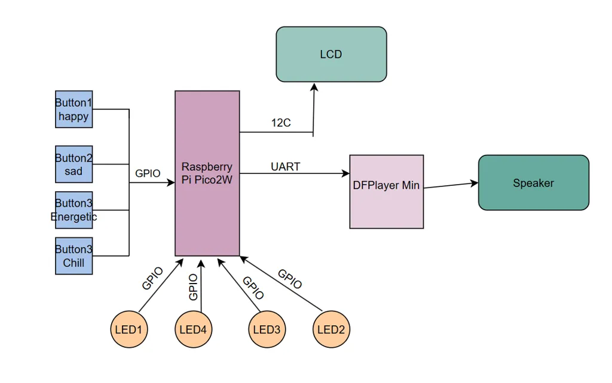
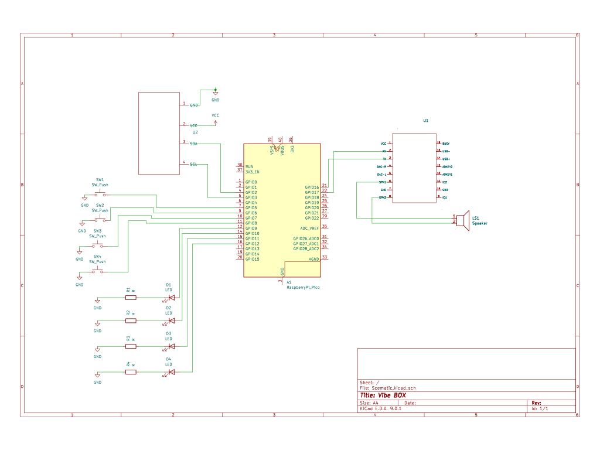

# VibeBox
A Raspberry Pi Pico-based music mood controller with LEDs, LCD, buttons and a speaker

:::info 

**Author**: Bulugea Miruna Elena \
**GitHub Project Link**: https://github.com/UPB-PMRust-Students/project-mirunabulugea

:::

## Description

A Raspberry Pi Pico project that uses four buttons, each representing a mood(happy,sad,energetic and chill). When a button is pressed, a corresponding playlist is played through a speaker via a DFP Player Mini MP3 module. The LCD displays the mood name, and four LEDs light up in sync with the music beat.

## Motivation 

I chose this project because I wanted to build something that combines music, hardware interaction, and visual feedback.I’ve always wanted to have a small device on my wall where I could simply press a button based on how I’m feeling, and instantly have music I’ve selected start playing. Along with the music, I imagined a light show synced to the beat.
## Architecture 

The main components of the project are:  

- Raspberry Pi Pico W (controller)  
- Four push-buttons (for mood selection)  
- DFPPlayer Mini MP3 module (audio playback)  
- Speaker (audio output)  
- LCD 1602 I2C (displays the current mood)  
- Four LEDs (flash according to music beats)

*Connections:*  
- Each button connected to a GPIO pin  
- DFPPlayer Mini connected via UART  
- LCD connected via I2C  
- LEDs connected to GPIOs  
- Speaker connected to DFPPlayer Mini output

## Log

<!-- write your progress here every week -->

### Week 5 - 11 May

### Week 12 - 18 May

### Week 19 - 25 May

## Hardware

Raspberry Pi Pico W:
A compact, Wi-Fi-enabled microcontroller board that serves as the core controller for the entire system. It handles button inputs, controls the LEDs, sends data to the LCD display, and communicates with the MP3 player module via UART.

4 Push Buttons:
Physical input controls, each one assigned to a specific mood: Happy, Sad, Energetic, and Chill. When a button is pressed, it triggers the corresponding music playlist and lighting pattern.

4 LEDs:
Visual feedback components that light up and blink in sync with the beat of the currently playing track.

1602 LCD Display with I2C Module:
A simple character display used to show the current selected mood. The I2C module simplifies wiring by reducing the number of GPIO pins needed for connection.

DFPlayer Mini MP3 Module:
A compact MP3 player module that can read audio files from a microSD card. It’s controlled via UART from the Raspberry Pi Pico W and outputs audio to a connected speaker.

Speaker:
Outputs the audio from the DFPlayer Mini, playing the selected music track in real time based on the mood button pressed
### Schematics

### Bill of Materials

| Device | Usage | Price |
|--------|--------|-------|
| [Raspberry Pi Pico 2W](https://www.optimusdigital.ro/ro/placi-raspberry-pi/13327-raspberry-pi-pico-2-w.html?gad_source=1&gbraid=0AAAAADv-p3B_VkQFxiPfaNoAEcFAPICVQ&gclid=Cj0KCQjw2tHABhCiARIsANZzDWrM0Dls3-gjJIN_HhPFamtX-n--3ZgfenMrOB1iqqYLpUBZqKTlVGcaAqeAEALw_wcB) | Microcontroller board that controls the entire system | 39,66 LEI |
| [Electronic Components Kit (LEDs, Buttons, Wires, Resistors, Breadboard)](https://www.emag.ro/set-componente-electronice-breadboard-830-puncte-led-uri-compatibil-arduino-si-raspberry-pi-zz00044/pd/DRXG4XYBM/?utm_medium=ios&utm_source=mobile%20app&utm_campaign=share%20product) | Interface elements and basic electronics for user input/output | 60,38 LEI |
| [DFPlayer Mini MP3 Module](https://www.optimusdigital.ro/ro/audio/1484-modul-mp3-player-in-miniatura-dfplayer-mini.html) | Plays audio files based on selected mood | 13,99 LEI |
| [Speaker](https://ro.farnell.com/multicomp-pro/abs-224-rc/speaker-200hz-to-20khz-4ohm-83db/dp/1761631) | Outputs audio from the MP3 module | 16,31 LEI |
| [LCD with I2C Interface and Blue Backlight](https://www.optimusdigital.ro/ro/optoelectronice-lcd-uri/2894-lcd-cu-interfata-i2c-si-backlight-albastru.html) | Displays the current mood and track information | 16,34 LEI |
## Software

| Crate / Library | Description | Usage |
|:----------------|:----------------------------------------|:------------------------------------|
| [rp-hal](https://github.com/rp-rs/rp-hal) | Hardware Abstraction Layer (HAL) for Raspberry Pi RP2040 microcontrollers | Controls GPIO pins, delays, and peripherals like buttons, LEDs, and LCD |
| [embedded-hal](https://github.com/rust-embedded/embedded-hal) | Hardware abstraction traits for embedded systems | Provides standard interfaces for digital output, delays, and other peripherals |
| [embedded-graphics](https://github.com/embedded-graphics/embedded-graphics) | 2D graphics library for embedded systems | Draws text and simple graphics on the LCD display |
| [embassy](https://github.com/embassy-rs/embassy) (optional) | Modern async framework for embedded systems | For async task management (optional for your setup) |
| [log](https://github.com/rust-lang/log) | Logging facade for Rust applications | Debugging and logging events like button presses or errors |
| [panic-halt](https://github.com/rust-embedded/panic-halt) | Minimal panic handler for embedded systems | Stops execution and halts the MCU on panic |

---
## Links

<!-- Add a few links that inspired you and that you think you will use for your project -->

1.[Music Player using Raspberry Pi Pico and DFPPlayer](https://www.youtube.com/watch?v=1--GBKYXRyY)
2. [pmrust/2025](https://pmrust.pages.upb.ro/docs/fils_en/project)
...
