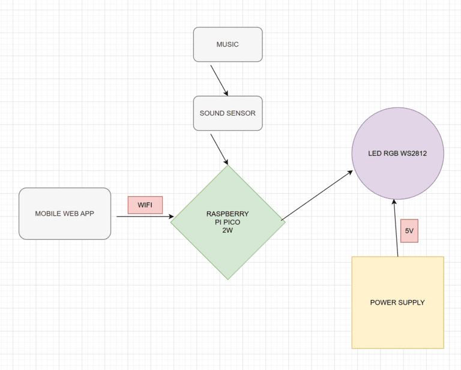
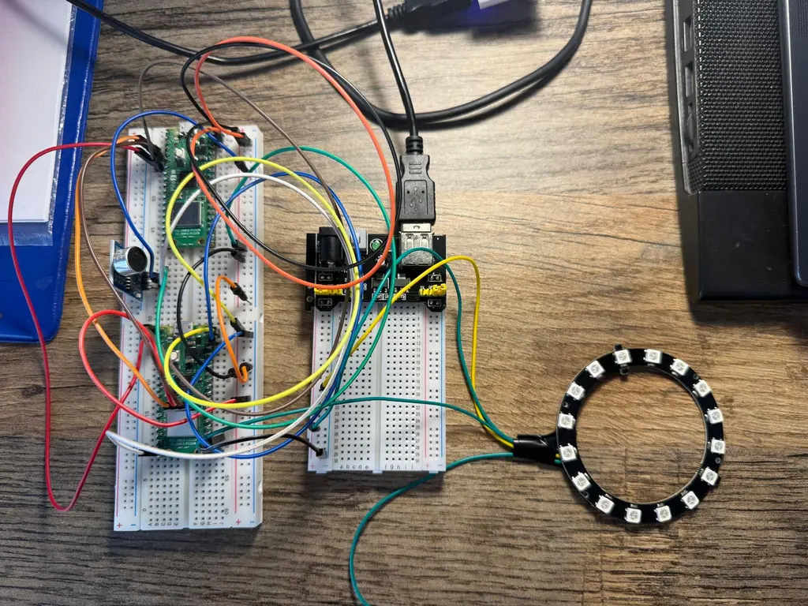
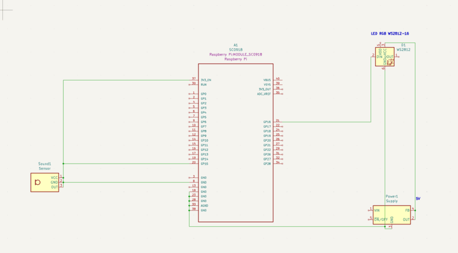

# PiGlowTune
PiglowTune is a Rust-powered project that syncs LED light patterns with music in real time.
:::info 

**Author**: Stoean Miruna-Teodora \
**GitHub Project Link**: [https://github.com/UPB-PMRust-Students/project-mirunastoean]

:::

## Description

This project features a music-reactive LED ring powered by a Raspberry Pi Pico W 2, which lights up in real time based on sound intensity. A connected web app over Wi-Fi lets you control the LEDs remotely, toggle power, and switch between vibrant color modes for a fully interactive light-and-sound experience.

## Motivation

My motivation for this project comes from my passion for both music and visual aesthetics. I've always been fascinated by how sound can be transformed into something you can see and feel, not just hear. This project gave me the perfect opportunity to blend those interests by creating a system where music drives a visual experience in real time. I wanted to explore how technology could bridge the gap between auditory and visual art, and building a music-reactive LED setup felt like a natural and exciting challenge—especially with the added control and customization through a web interface.

## Architecture 




The sound sensor picks up music and sends audio data to the Raspberry Pi Pico W 2, which also connects via Wi-Fi to a mobile web app for remote control. The Pico processes the sound input and controls a WS2812 RGB LED ring, powered by a 5V external supply, to create light effects synchronized with the music.

## Log


### Week 5 - 11 May
After purchasing all the necessary materials for my project, I began assembling the components, connected everything using jumper wires, performed debugging, and verified that my Raspberry Pi was functioning correctly.
### Week 12 - 18 May

### Week 19 - 25 May

## Hardware

\
**1. Raspberry Pi Pico 2W** – Controls the LEDs and connects to Wi-Fi.\
**2. Microphone Sound Sensor** – Detects sound intensity from music.\
**3. WS2812B LED Ring** – RGB LEDs that light up based on audio input.\
**4. Power Supply (5V)** – Powers the LED ring.\
**5. Breadboard & Jumper Wires** – For easy circuit connections.

### Schematics



### Bill of Materials

<!-- Fill out this table with all the hardware components that you might need.

The format is 
```
| [Device](link://to/device) | This is used ... | [price](link://to/store) |

```

-->

| Device | Usage | Price |
|--------|--------|-------|
| [Raspberry Pi Pico 2W](https://www.raspberrypi.com/documentation/microcontrollers/raspberry-pi-pico.html) | The microcontroller | [39 RON](https://www.optimusdigital.ro/en/raspberry-pi-boards/13327-raspberry-pi-pico-2-w.html?gad_source=1&gbraid=0AAAAADv-p3DfPn0jghDBkW5rmkni4ZwoA&gclid=Cj0KCQjwlMfABhCWARIsADGXdy_lnzlbb9XJk7UTW9TkCTAm8ZO8qfzlB-ip4f0Q1Y9SH4H72JOmpJIaAg6iEALw_wcB) |
| [ Sound Sensor Module](https://docs.sunfounder.com/projects/vincent-kit/en/latest/components/component_sound_module.html) | The sound sensor | [5 RON](https://www.optimusdigital.ro/en/others/12325-sound-sensor-module-no-cable.html?gad_source=1&gbraid=0AAAAADv-p3DfPn0jghDBkW5rmkni4ZwoA&gclid=Cj0KCQjwlMfABhCWARIsADGXdy-HKSPwoqj3SIXiT-xBpWjE4KsrZDu62aPRudyepcXEmM5GoV-WlKkaAmLYEALw_wcB)|
| [ 2 x Breadboard ](https://os.mbed.com/handbook/Breadboard) | The breadboards used | [15 RON](https://www.optimusdigital.ro/en/breadboards/8-breadboard-hq-830-points.html?gad_source=1&gbraid=0AAAAADv-p3Bg2RZlhy48fcp-_r0lc4u3t&gclid=Cj0KCQjwlMfABhCWARIsADGXdy_ZvCM78LZHRQIGdsT20NooKmcugTGzs2lQRYEnMjOO0kPVxvZpem4aAmZNEALw_wcB) |
| [ 40 x Male-Male Wires](https://docs.sunfounder.com/projects/sf-components/en/latest/component_wires.html) | Male to Male Jumpers Wires| [5,99 RON](https://www.optimusdigital.ro/ro/fire-fire-mufate/886-set-fire-tata-tata-40p-15-cm.html?search_query=fire+tata+tata&results=73)|
| [10 x Female-Male Wires](https://docs.sunfounder.com/projects/sf-components/en/latest/component_wires.html) | Female to Male Jumper Wires | [5,99 RON](https://www.optimusdigital.ro/en/wires-with-connectors/653-10-cm-40p-male-to-female-wire.html?gad_source=1&gbraid=0AAAAADv-p3B_VkQFxiPfaNoAEcFAPICVQ&gclid=Cj0KCQjw_dbABhC5ARIsAAh2Z-TVakS-GcyoE-yBG96jgOewY1Ps9Q-EOhbhifYEJ2SK_i-J9Z-BW1kaAh3GEALw_wcB)|
| [Power Supply Module](https://docs.sunfounder.com/projects/kepler-kit/en/latest/component/component_power_module.html)| Alimentation Source for Breadboard|[4,69 RON](https://www.optimusdigital.ro/ro/electronica-de-putere-stabilizatoare-liniare/61-sursa-de-alimentare-pentru-breadboard.html?gad_source=1&gbraid=0AAAAADv-p3B_VkQFxiPfaNoAEcFAPICVQ&gclid=Cj0KCQjw_dbABhC5ARIsAAh2Z-TMS5d9pNDhk9tBLnjs0ttXkzHn5xV4ZCWnihaWuqgMuibOegNXTZAaAlwzEALw_wcB)|
| [ Led Ring RGB WS2812 ](https://www.mouser.com/pdfDocs/DFRobotWS2812RGBLEDRingLampsPO.pdf?srsltid=AfmBOooggsr5iSSPCSzeYvbg8zc4iG230C3B_qvqh73WA1DefzgbisR5)| Led Ring |[29,15 RON](https://www.mouser.com/pdfDocs/DFRobotWS2812RGBLEDRingLampsPO.pdf?srsltid=AfmBOooggsr5iSSPCSzeYvbg8zc4iG230C3B_qvqh73WA1DefzgbisR5)|


## Software

| Library | Description | Usage |
|---------|-------------|-------|
| [st7789](https://github.com/almindor/st7789) | Display driver for ST7789 | Used for the display for the Pico Explorer Base |
| [embedded-graphics](https://github.com/embedded-graphics/embedded-graphics) | 2D graphics library | Used for drawing to the display |
| [smart-leds](https://github.com/smart-leds-rs/smart-leds)| A library designed to control addressable LED strips and matrices, with support for multiple protocols and pixel formats.| Used to control the LED ring by setting the color and brightness of each LED based on the sound intensity of the music|
| [embassy-rp](https://docs.embassy.dev/embassy-rp/git/rp2040/index.html)| A hardware abstraction layer (HAL) for the Raspberry Pi RP2040 microcontroller, built on the async-first Embassy framework, enabling efficient, non-blocking embedded applications in Rust| Used to interact asynchronously with the Raspberry Pi Pico 2W’s hardware components, enabling responsive and efficient control of the LED ring in sync with music input|
| [rp2040-hal](https://docs.rs/rp2040-hal/latest/rp2040_hal/)| Is the official hardware abstraction layer for the Raspberry Pi RP2040 microcontroller, providing low-level, synchronous access to its peripherals and features in Rust| Used to configure and control the Raspberry Pi Pico W’s GPIO pins and timers for driving the LED ring and processing sound input signals|


## Links

<!-- Add a few links that inspired you and that you think you will use for your project -->

1. [Raspberry Pi Audio Reactive LED Strip (2020)](https://www.youtube.com/watch?v=7YLF-N0596I)
2. [Sound Reactive WS Led with Raspberry Pi Pico](https://www.youtube.com/watch?v=PaSVcxk2iVk&t=3s)

