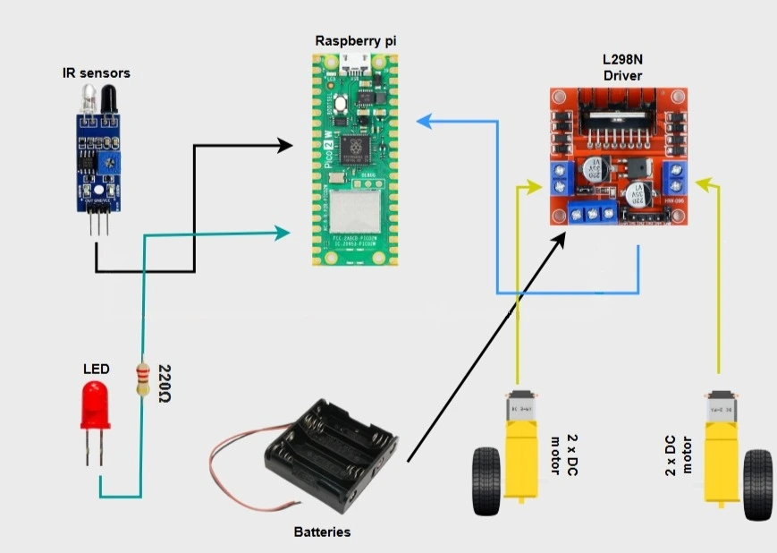
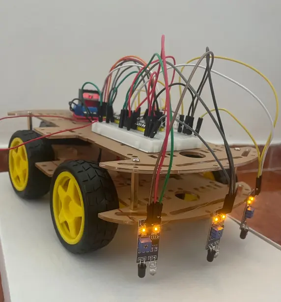
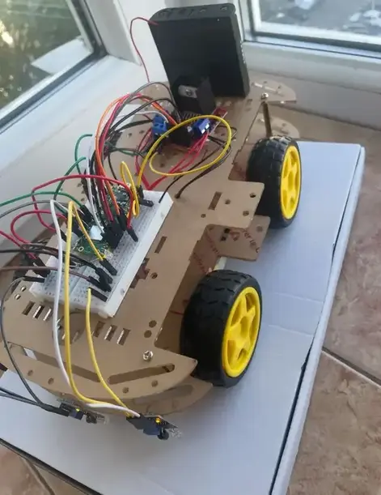
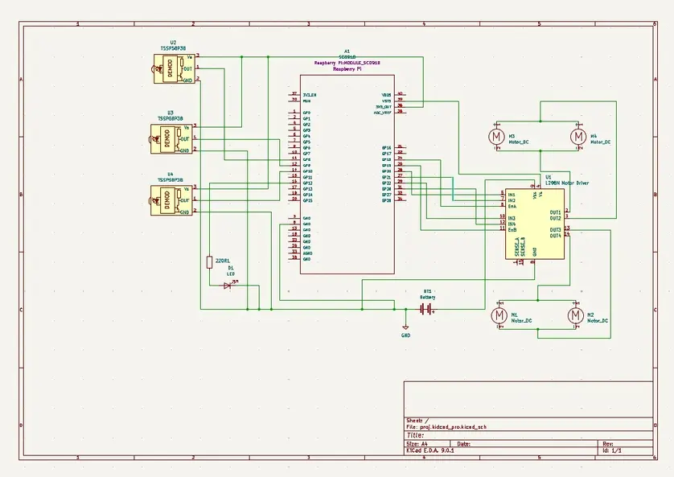

# Rusty Car-go line follower
A car that follows a light-absorbing black line using Infrared sensors.

:::info 

**Author**: Mohamed Daoudo \
**GitHub Project Link**: https://github.com/UPB-PMRust-Students/project-Joan-DwD

:::

## Description

**Rusty Car-go** is a car programmed in Rust that follows a black colored tape that absorbs light compared to the surrounding surface which typically absorbs more light using IR (infrared) sensors that read digital low or digital high, and the Rasberry Pi Pico 2W reads these signals and adjusts the motors' speed/direction via L298N moto driver, and lights up a little LED when the car is going. This project serves as a door to building more more creative and fun projects.

## Motivation

As a little kid, the idea of seeing wires connected to each other causing machines to move and work, whether for fun or to assist us in our daily lives fascinated me. It led me to build simple projects, such as small fans during the summer or a cotton candy machine because I enjoyed sweets. Reminiscing about these days motivated me to work with DC motors and wires again and build a car with them.

## Architecture

The Raspberry Pi Pico 2W powered by L298N motor driver's onboard 5V regulator to ensure stable supply, It serves as a brain that directs the behaviour of the robot, it's technically responsible for data processing, It outputs directional control and PWM speed signals to the L298N Motor driver which is connected to it via several GPIO pins.

The IR sensors, powered by 3.3V power source of the pico, are connected to the Pico's GPIO pins, detect the line's position based on the color black and send digital signals to the microcontroller to keep the robot on it's track .

The L298N motor driver controls the speed and direction of DC motors connected to it via it's output terminals, whose role is to drive the robot's wheels according to Pico's commands, simultaneously, an LED connected to Pico's GPIO pin lights up whenever the motors are active, providing visual feedback.

Finally, the chassis, it provides a well-structured body for the components ensuring stable operation, protection, and ease of assembly.

## Log

### Week 5-11 May
I worked on the code a bit, but I started working on the car by assembling the components as soon as they arrived.

### Week 12-18 May
### Week 19-25 May

## Hardware

- Raspberry Pi Pico 2W: The central controller of the robot aka the "brain".
- Infrared sensors: Used for black or white line detection.
- L298N motor driver: Controls DC motor speed or direction.
- DC motors: used to move and steer the robot.
- AA battery holder (4x): Supplies power to the motor driver.
- LED: indication of motor activity.
- The robot chassis: It serves as the body of the robot and holds all components

### Pictures as of now

## Schematics

## Bill of Materials

| Device              | Usage                      | Price   |
|---------------------|----------------------------|---------|
|[Raspberry Pi Pico 2W](https://www.raspberrypi.com/documentation/microcontrollers/pico-series.html#pico2w-technical-specification) | Microcontroller            | [39.66 RON](https://www.optimusdigital.ro/ro/placi-raspberry-pi/13327-raspberry-pi-pico-2-w.html?search_query=raspberry+pico+2w&results=26)  |
|[IR sensors](https://www.circuits-diy.com/hw201-infrared-ir-sensor-module/)        | line detection    | [10,47 RON](https://www.optimusdigital.ro/en/optical-sensors/4514-infrared-obstacle-sensor.html?search_query=infrared+obstacle+sensors&results=14)  |
|[DC motors with wheels & chassis (unassembled)](https://cdn.ozdisan.com/ETicaret_Dosya/729231_182181.pdf)                     | Structure of the robot                            | [79.59 RON](https://sigmanortec.ro/en/smart-car-4wd-chassis-kit)        |
|[L298N Motor Driver](https://www.twicea.com/solution/l298n-motor-driver-specification-features-pinout-how-it-works)                  | Control speed of DC motors                              | [10.99 RON](https://www.optimusdigital.ro/en/brushed-motor-drivers/145-l298n-dual-motor-driver.html?search_query=L298N&results=4)         |
|Male-Male jumper wires set                     |       Connecting components                     |   [7.99 RON](https://www.optimusdigital.ro/en/wires-with-connectors/12-breadboard-jumper-wire-set.html?search_query=Breadboard+Jumper+Wires+Set&results=22)| 
|10cm Female-Male jumper wires                    |          Connecting components                  |    [2.99 RON](https://www.optimusdigital.ro/en/wires-with-connectors/650-fire-colorate-mama-tata-10p.html?search_query=10+cm+10p+Male-Female+Wires&results=12)     |
|20cm Female-Male jumper wires                     |        Connecting components                    | [3.99 RON](https://www.optimusdigital.ro/en/wires-with-connectors/214-fire-colorate-mama-mama-10p.html?search_query=10+cm+10p+Male-Female+Wires&results=12)         |
|LED                      |   Motor activity indication                        | Already had it     |
|Battery holder 4 x R6                      |Power supply| [9.43 RON](https://www.optimusdigital.ro/en/battery-holders/2806-battery-holder-4-x-r6.html?search_query=%09Battery+Holder+4+x+R6&results=74)  |                                  
|Breadboard          |  Circuit building     |[4.56 RON](https://www.optimusdigital.ro/en/breadboards/44-400p-hq-breadboard.html?search_query=breadboard&results=362)|

## Software

| Library            | Description                               | Usage                                     |
|--------------------|-------------------------------------------|-------------------------------------------|
| [defmt](https://docs.rs/crate/defmt/latest)              | Logging and debugging           | printing debug information |
| [embassy_executor](https://crates.io/crates/embassy-executor)   | Task management system for asynchronous Rust    |spawning asynchronous tasks concurrently |
| [embassy_rp::gpio](https://docs.embassy.dev/embassy-stm32/git/stm32c011d6/gpio/index.html)   | Pico GPIO control pins            |configuring digital input/output pins |
| [embassy_rp::pwm](https://docs.embassy.dev/embassy-rp/git/rp2040/pwm/index.html)    | Pulse width modulation           | to mainly control motor speed and direction|
| [embassy_time](https://docs.embassy.dev/embassy-time/)       | Time and delay handling in asynchronous Rust     | adds delays or wait for a specific duration in tasks |

## Links

1.[How to construct line following robot](https://youtu.be/H8wVLaQeSWQ?si=odB3tcmSnWRXZFpz)

2.[Line following car with Raspberry Pi Pico](https://srituhobby.com/how-to-make-a-line-tracking-robot-with-raspberry-pi-pico-board/)
 
3.[More guidance](https://quartzcomponents.com/blogs/electronics-projects/line-follower-robot-using-arduino?srsltid=AfmBOopANi596iyggapmAuFa1iQ-XZoUMyAkejQJASX9k0wGWDHNtwUL)

4.[Reasearch Article](https://academics.su.edu.krd/public/profiles/Ahmad.ahmed/research-register/research-register-554-4016-1612220739-1.pdf)
