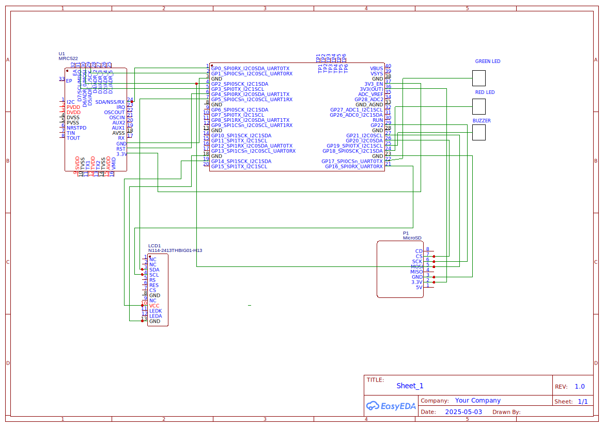

# Project Name
Attendance System

:::info 

**Author**: Mokhadder Hussein \
**GitHub Project Link**: [https://github.com/UPB-PMRust-Students/project-Hussein026](https://github.com/UPB-PMRust-Students/project-Hussein026)

:::

## Description

An Attendance System that reads RFID/NFC cards to automatically record and manage attendance data:

The system utilizes a Raspberry Pi Pico 2 microcontroller running Rust software to process card data.
The RC522 RFID Reader scans cards and sends identification data to the microcontroller.
All attendance records are logged in a local SQLite/PostgreSQL database stored on a 32GB memory card.
The system synchronizes attendance data with an online Laravel backend for cloud-based storage.
Visual feedback is provided through green (success) and red (failure) LEDs.
Audible confirmation is delivered via a buzzer with distinct tones for successful and failed scans.
An optional 16x2 LCD display shows status messages and scan results in real-time.
A web interface displays attendance records showing names and timestamps of attendees.
The web page updates dynamically using AJAX and features a responsive Bootstrap design.
An optional push button allows for switching between different operating modes.
The system continues to function during network outages, storing data locally until synchronization is possible.


## Motivation

This project is especially meaningful to me as it provided a chance to apply my knowledge of microcontroller programming and electronic circuit design to a real-world problem by developing an Attendance System Reader. By leveraging the Raspberry Pi Pico 2 and exploring the use of Rust in embedded systems, I was able to integrate RFID technology with real-time data synchronization, balancing the complexity of both offline functionality and cloud connectivity. The project also pushed me into full-stack development through the creation of a web interface, aligning with my passion for building efficient, automated systems that streamline administrative tasks. Overall, it has deepened my practical experience in IoT and prepared me for future challenges in the field.

## Architecture 

Add here the schematics with the architecture of your project. Make sure to include:
 - what are the main components (architecture components, not hardware components)
 - how they connect with each other
 

## Log

<!-- write your progress here every week -->

### Week 5 - 11 May
Completed submission of all project documentation and ensured everything was properly organized. Initiated work on the schematic design, carefully planning the layout. Began initial development of the software components, making steady progress toward project implementation.

### Week 12 - 18 May

### Week 19 - 25 May

## Hardware

Hardware Overview:
•	The Raspberry Pi Pico 2 functions as the central controller for all system operations.
•	The RC522 RFID Reader continuously monitors for RFID/NFC cards in its vicinity.
•	When a card is detected: 
o	The reader captures the card's unique ID and forwards it to the Raspberry Pi Pico 2.
o	The system verifies the ID against its database.
o	The Green LED illuminates and the Buzzer emits a confirmation tone for authorized cards.
o	The Red LED activates and the Buzzer signals an alert for unauthorized cards.
o	The LCD Display (if installed) shows the relevant user information and scan status.
•	All scan events are logged to the 32GB Memory Card in the local database.
•	The system periodically synchronizes this data with the online Laravel backend.
•	The Push Button allows operators to switch between different system modes as needed.
•	All components are connected via Electric Wires and powered by the 5V Power Supply, with the Breadboard providing organized connection points during development.


### Schematics




### Bill of Materials

<!-- Fill out this table with all the hardware components that you might need.

The format is 
```
| [Device](link://to/device) | This is used ... | [price](link://to/store) |

```

-->

| Device | Usage | Price |
|--------|--------|-------|
|Raspberry Pi Pico 2W (x2) | Microcontroller + Debugger | 39.66 |
| RC522 RFID Reader | Card reader module | 15 |
|RFID/NFC Cards (10 pack) | Identification cards | 30 |
| 16x2 LCD Display with I2C | User interface display | 20 |
| Active Buzzer Module | Audio feedback for scans | 1 |
|LEDs (Green & Red) | Visual status indicators | 1 |
| Push Button | Breadboard Mode selection | 2 |
| Breadboard HQ 400 Points | Prototyping | 4.56 |
| Breadboard HQ 830 Points | Prototyping | 9.98 |
| MicroSD Card Module | Interface for storage | 10 |
| MicroSD Card (32GB) | Storage for OS, database, and logs | 20 |
| Jumper Wires (40pcs) | Component connections | 18.99 |


## Software

| Library | Description | Usage |
|---------|-------------|-------|
| embassy-rp | RP2040 HAL with async support | Main async runtime and peripheral control |
| mipidsi | Generic TFT driver | Controls the ST7735s SPI display |
| heapless | Fixed-size buffer and data structures | Flash log strings and buffers |
| embassy-sync | Async mutexes and primitives | SPI/I2C bus sharing |
| embassy-time | Timer and delay utilities | Timed events and log delay control |
| embassy-flash | Flash memory abstraction | Persistent log storage |
| embassy-net, cyw43 | WiFi/network stack for remote logging | Enables wireless access to log data |
| defmt + panic-probe| Debug logging and error handling | RTT logging/debug |

## Links

<!-- Add a few links that inspired you and that you think you will use for your project -->

1. [Embedded Graphics Docs](https://docs.rs/embedded-graphics/latest/embedded_graphics/)
2. [Embassy Framework GitHub](https://github.com/embassy-rs/embassy)
...
