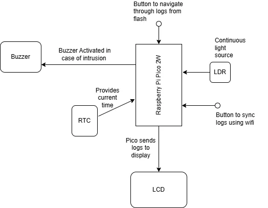
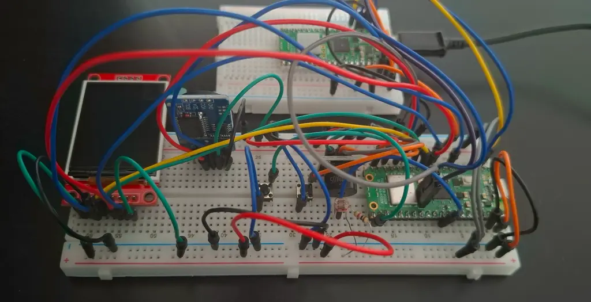
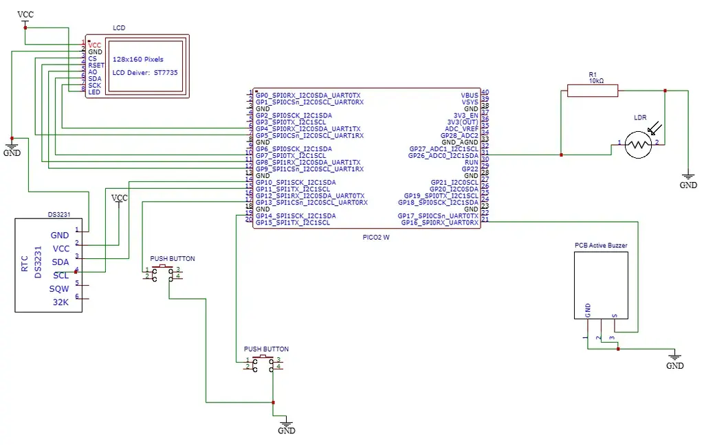

# PeekAlert
A smart light-based alert system with WiFi connectivity.

:::info
**Author:** Nour Al Houda Mahfood \
**GitHub:** [PeekAlert Repository](https://github.com/UPB-PMRust-Students/project-nouralmahfood)
:::

---

## Description  
PeekAlert is a light-activated alert system that detects unusual lighting conditions (like someone peeking through a door or curtain) and responds by sounding a buzzer, logging the event, and displaying it on an LCD. It also offers wireless connectivity to enable remote access to logs via WiFi.

## Motivation  
This project is inspired by the idea of privacy and awareness in shared spaces. It provides a simple yet effective way to detect and record potential intrusions or unexpected movement using only light changes.

## Architecture  
The project uses two Raspberry Pi Pico 2W boards, one as the main microcontroller handling all system logic, and another as a debugger. A photoresistor (LDR) is connected to an analog pin to detect ambient light changes, triggering a buzzer when suspicious activity is detected. An LCD display, connected over SPI, shows system status and alerts, while a DS3231 RTC module communicates over I2C to timestamp events. WiFi functionality is provided through the Pico's onboard CYW43 chip.

## Log  
- **Week 5 – 11 May:**  Initial testing of the photoresistor and buzzer modules, and implementing flash logging.  
- **Week 12 – 18 May:**  LCD set up using SPI, and RTC integrated.  
- **Week 19 – 25 May:**  WiFi functionality implemented for remote access to logs.

## Hardware  
- Raspberry Pi Pico 2W (x2) – one used as microcontroller, one as debugger  
- 1.8'' SPI LCD (ST7735s, 128x160)  
- DS3231 RTC module (I2C)  
- Active buzzer module  
- 10kΩ resistor  
- Breadboards (400 + 830 points)  
- White 2.54mm pin headers  
- Jumper wires  
- Photoresistor (LDR) sensor  
- 6x6x6 push buttons (2 used)

## Schematics  

## Bill of Materials

| Device                       | Usage                        | Price in RON |
|-----------------------------|------------------------------|-------------|
| Raspberry Pi Pico 2W (x2)   | Microcontroller + Debugger   | 39.66       |
| Resistor 10KΩ               | Voltage divider              | 0.10        |
| Push Button (x2)         | Log scroll, Sync      | 0.72        |
| SPI LCD Display 1.8''       | Visuals               | 28.99       |
| Active Buzzer Module        | Audio alert                  | 4.98        |
| Jumper Wire Set             | Connections                  | 7.99        |
| White Pin Header (x2)       | For the pico         | 1.98        |
| Breadboard HQ 400 Points    | Prototyping                  | 4.56        |
| Breadboard HQ 830 Points    | Prototyping                  | 9.98        |
| Photoresistor (LDR)         | Light detection              | 1.90        |
| DS3231 RTC Module           | Real-time clock              | 18.99       |

## Software

| Library                | Description                                      | Usage                                         |
|------------------------|--------------------------------------------------|-----------------------------------------------|
| `embassy-rp`           | RP2350 HAL with async support                    | Main async runtime and peripheral control     |
| `mipidsi`              | Generic TFT driver                               | Controls the ST7735s SPI display              |
| `embedded-graphics`    | Graphics primitives for embedded displays        | Drawing text and logs                         |
| `ds323x`               | RTC interface                                    | Interfacing with DS3231 RTC module            |
| `heapless`             | Fixed-size buffer and data structures            | Flash log strings and buffers                 |
| `embassy-sync`         | Async mutexes and primitives                     | SPI/I2C bus sharing                           |
| `embassy-time`         | Timer and delay utilities                        | Timed events and log delay control            |
| `embassy-flash`        | Flash memory abstraction                         | Persistent log storage                        |
| `embassy-net`, `cyw43` | WiFi/network stack for remote logging            | Enables wireless access to log data           |
| `defmt` + `panic-probe`| Debug logging and error handling                 | RTT logging/debug                             |

## Useful Links  
- [Embassy examples](https://github.com/embassy-rs/embassy/tree/main/examples)  
- [DS3231 RTC documentation](https://docs.rs/ds323x/latest/ds323x/)
