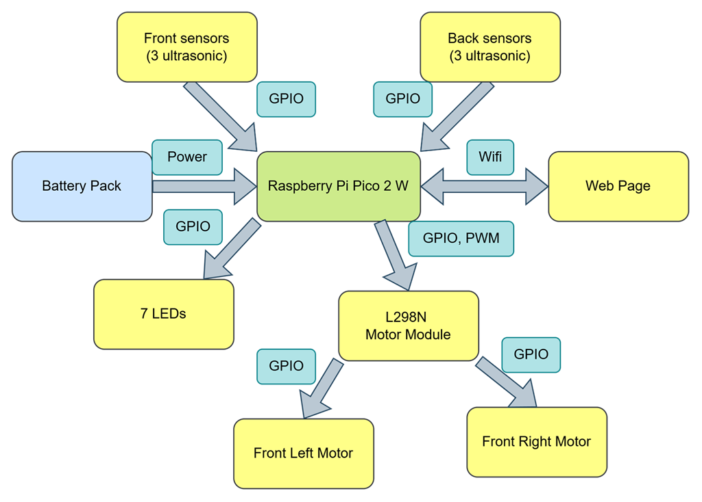
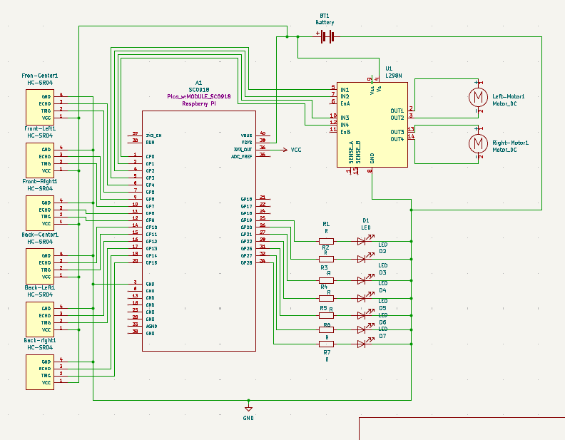

# Car with Parking Sensors

A car equipped with front and back parking sensors. 

:::info 

**Author**: Popazu Petru Andrei\
**GitHub Project Link**: https://github.com/UPB-PMRust-Students/project-PetruPopazu.git

:::

## Description

The project consists of a car equipped with 6 ultrasonic sensors (3 at the front and 3 at the rear), 2 DC motors that allow it to move forward and backward. It detects the obstacles nearby, expressing the distance using LEDs, and based on readings of the sensors it stops when getting too close to an object. Using the wifi chip on the Pico, data from the sensor is transmitted to a web page and signals (forward, stop or backward) are sent to the Pico.

## Motivation

The reason behind choosing the theme for this project is my great passion for cars, wanting to do something related to it. As i drive an older car with no parking sensors, i've always wished for this feature. I wanted to build them myself and learn how they operate. Along the way of building this project, i hope to gather as much knowledge as possible about microprocessor architecture and electronics.

## Architecture 
### Diagram



**Raspberry Pi Pico 2 W**
- Controls all peripherals: reads distance from the ultrasonic sensors, manages the motors and the LEDs, sends data to the web page

**HC-SR04 Ultrasonic sensors**
- They constantly read distances, detecting obstacles in front and back
- Interface: GPIO

**LEDs**
- They light up reacting to the distances read by the ultrasonic sensors
- 2 Green LEDs, 2 Yellow LEDs, 2 Red LEDs and one Blue LED (Green = Safe, Yellow = Caution, Red = Stop, Blue: On = front detection, Off = rear detection)
- Interface: GPIO

**L298n Motor Driver Module**
- Controls the DC motors: forward and backward
- PWM speed control
- Interface: GPIO

**DC Motors**
- Drive the car forward and backward
- Interface: GPIO

## Log

<!-- write your progress here every week -->

### Week 28 April - 4 May
Started to visualize the idea of the project and wanted to better understand the overall concept, so i started to translate the idea into something more detailed using Kicad. During the drawing of the schematic I added to the cart the components of the project and ordered them.
### Week 12 - 18 May

### Week 19 - 25 May

## Hardware

When signaling the car to move, the ultrasonic sensors start reading and the motors move in the direction provided. While moving, the ultrasonic sensors may detect obstacles; as the car approaches them, it slows down and provides visual indication through LEDs, eventually stopping ahead of the obstacle. 


### Schematics

This is the Kicad schematic.



### Bill of Materials

<!-- Fill out this table with all the hardware components that you might need.

The format is 
```
| [Device](link://to/device) | This is used ... | [price](link://to/store) |

```

-->

| Device | Usage | Price |
|--------|--------|-------|
| [Raspberry Pi Pico 2 W](https://www.raspberrypi.com/documentation/microcontrollers/raspberry-pi-pico.html) | The microcontroller | [40 RON](https://www.optimusdigital.ro/ro/placi-raspberry-pi/13327-raspberry-pi-pico-2-w.html?gad_source=1&gad_campaignid=19615979487&gbraid=0AAAAADv-p3DfPn0jghDBkW5rmkni4ZwoA&gclid=Cj0KCQjwlMfABhCWARIsADGXdy-2UJynBEaijVkLUjd2GMpHaLt4yTef_1SemcI0xAtDyYZ3etr6UoAaAhstEALw_wcB) |
|[Breadboard HQ (830 Puncte)](https://www.mouser.com/datasheet/2/737/breadboards_for_beginners-2489753.pdf?srsltid=AfmBOooZwwJE-Z5BTXGU_PjlmlkV8tOXefhxb5O4ve18X78d9_MAQ3II)|Main board for connecting the components|[9,98 RON](https://www.optimusdigital.ro/ro/prototipare-breadboard-uri/13245-breadboard-750-puncte.html?search_query=breadboard&results=127)|
|[6 x HC-SR04 Ultrasonic sensor](https://cdn.sparkfun.com/datasheets/Sensors/Proximity/HCSR04.pdf)|The base of the parking feature|[40 RON](https://www.optimusdigital.ro/ro/senzori-senzori-ultrasonici/9-senzor-ultrasonic-hc-sr04-.html?search_query=senzor+ultrasonic&results=42)|
|[2 x DC motors](https://handsontec.com/index.php/product/36v-mini-dc-gear-motor/)|Drive Motors|[30 RON](https://www.optimusdigital.ro/ro/motoare-altele/139-motor-cu-reductor-si-roata.html?search_query=motor+cu+roata&results=33)|
|[L298N Motor Driver Module](https://www.handsontec.com/dataspecs/L298N%20Motor%20Driver.pdf)|The motor driver module|[10.99 RON](https://www.optimusdigital.ro/ro/drivere-de-motoare-cu-perii/145-driver-de-motoare-dual-l298n.html?search_query=l298n&results=4)|
|[Plusivo LED set](https://www.plusivo.com/electronics-kit/36-plusivo-3mm-and-5mm-diffused-led-light-emitting-diode-assortment-kit.html)|Indicators for distance|[26.99 RON](https://www.optimusdigital.ro/ro/kituri-optimus-digital/9517-set-de-led-uri-asortate-de-5-mm-si-3-mm-310-buc-cu-rezistoare-bonus.html?search_query=led&results=779)|
|[Battery Holder + batteries](https://www.optimusdigital.ro/ro/suporturi-de-baterii/1090-suport-baterii-3-x-r6.html?search_query=suport+pentru+baterii&results=59)|Supplying current to the circuit|[12 Ron](https://www.optimusdigital.ro/ro/suporturi-de-baterii/1090-suport-baterii-3-x-r6.html?search_query=suport+pentru+baterii&results=59)|


## Software

| Library | Description | Usage |
|---------|-------------|-------|
|[embassy_rp](https://docs.embassy.dev/embassy-rp/git/rp235xb/index.html)|Embassy RP|Initializing and interacting with the peripherals|
|[gpio](https://docs.embassy.dev/embassy-stm32/git/stm32c011d6/gpio/index.html)|General Purpose Input/Output|Used for controlling digital pins connected to motors, LEDs, and ultrasonic sensors|
|[hc_sr04](https://docs.rs/hc-sr04/latest/hc_sr04/)|Driver for the ultrasonic sensors|Reading measurements|
|[pwm](https://docs.embassy.dev/embassy-rp/git/rp235xb/pwm/index.html)|PWM Module|For controlling the motors speed|
|[cyw43](https://docs.rs/cyw43/latest/cyw43/)|Rust driver for the CYW43 wifi chip|Interacting with the Wi-fi chip|
|[embassy-net](https://docs.rs/embassy-net/latest/embassy_net/)|async network stack, designed for embedded systems|To send data of the sensor and receive commands for the car|

## Links

<!-- Add a few links that inspired you and that you think you will use for your project -->

1. [Embedded Programming with Rust](https://pico.implrust.com/ultrasonic/circuit.html)
2. [NerdCave](https://www.youtube.com/@NerdCaveYT)