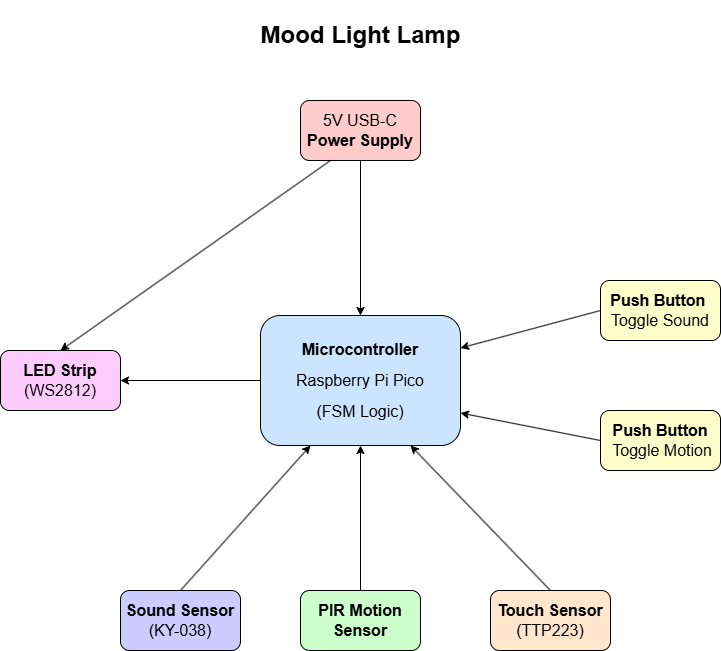

# Mood-Light-Lamp  
An interactive smart lamp that dynamically adjusts lighting based on touch, motion, and sound inputs, now also remotely controllable via Wi-Fi.

:::info  
**Author**: Băițan Raluca-Mihaela \
**GitHub Project Link**: [https://github.com/UPB-PMRust-Students/project-RalucaBaitan](https://github.com/UPB-PMRust-Students/project-RalucaBaitan)  
::::

## Description  
This project is a mood-responsive RGB lamp powered by a Raspberry Pi Pico W. It uses a Finite State Machine (FSM) to manage and cycle through a set of interactive lighting modes:  
- **Calm Fade** – slow transitions through pastel tones  
- **Party Pulse** – color changes reacting to sound intensity  
- **Focus Blink** – soft white pulsing to aid concentration  
- **Ambient Wave** – moving color gradients triggered by motion  

A capacitive touch sensor allows users to cycle between modes, while two tactile buttons toggle the reactivity of sound and motion sensors. The project also supports **Wi-Fi control**, enabling users to change settings or monitor the current mode from a web interface or mobile device.

## Motivation  
I was inspired to create a light-based project that was not only aesthetic and responsive but also deeply interactive. I wanted a relaxing but smart device that adapts to ambient conditions. Adding Wi-Fi allowed me to elevate it from a basic RGB lamp to a remotely configurable IoT device, aligning with the current trends in smart home environments.

## Architecture  
 

### Components Overview

**Raspberry Pi Pico W**  
- **Role**: Controls all components, manages state transitions, and hosts the Wi-Fi server.  
- **Connections**: GPIO2 (LEDs), GPIO3 (Touch), GPIO4 (Motion), GPIO5–6 (Buttons), GPIO26 (Sound sensor)

**WS2812 LED Strip**  
- **Interface**: PIO  
- **Modes**: Calm fade, party pulse (audio-reactive), ambient wave, focus blink

**Touch Sensor (TTP223)**  
- **Interface**: Digital input  
- **Role**: Cycles FSM states on tap

**PIR Motion Sensor**  
- **Interface**: Digital  
- **Role**: Triggers effects based on presence

**Sound Sensor (KY-038)**  
- **Interface**: Analog (ADC)  
- **Role**: Reacts to ambient sound

**Tactile Buttons (x2)**  
- **Role**: Toggles for sensors

**Wi-Fi Web Interface**  
- **Interface**: HTTP API  
- **Role**: Remote mode switch & sensor control

## Log  
### Week 5 – 11 May  
Basic FSM structure completed, sensors tested, LED test patterns implemented using `ws2812-pio-rs`. Mode logic mapped on paper.

### Week 12 – 18 May  

### Week 19 – 25 May  

## Hardware

| Device | Usage | Price |
|--------|-------|-------|
| [Raspberry Pi Pico W](https://www.optimusdigital.ro/en/raspberry-pi-boards/13327-raspberry-pi-pico-2-w.html) | Main controller with Wi-Fi | 40 RON |
| [WS2812 RGB LED Strip (1m)](https://www.optimusdigital.ro/en/led-strips/10155-apa102-rgb-led-strip.html) | Dynamic lighting effects | 25 RON |
| [KY-038 Sound Sensor](https://ardushop.ro/ro/module/1589-modul-microfon-high-sensitivity-sound-detection-6427854023735.html?gad_source=1&gad_campaignid=22058879462&gbraid=0AAAAADlKU-4NO_j3AMeKNI3Vj8E7PKnMk&gclid=Cj0KCQjwoNzABhDbARIsALfY8VOmnAS1RzUBTMu3x44OJlDh1x1D8AmLimaljn_JyPmKOVGZE4al-IQaAhU-EALw_wcB) | Audio input | 6 RON |
| [PIR Motion Sensor](https://ardushop.ro/ro/electronica/2322-modul-pir-senzor-de-prezenta-miscare-6427854005663.html?gad_source=1&gad_campaignid=22058879462&gbraid=0AAAAADlKU-4NO_j3AMeKNI3Vj8E7PKnMk&gclid=Cj0KCQjwoNzABhDbARIsALfY8VO_Gzx-zxaTxVur4vhKQog9jsl6dk-LduGnvo2SFVRy1_hFzgDUkKMaAiiiEALw_wcB) | Motion detection | 9 RON |
| [TTP223 Touch Sensor](https://ardushop.ro/ro/senzori/640-senzor-capacitiv-ttp223b-6427854007988.html?gad_source=1&gad_campaignid=22058879462&gbraid=0AAAAADlKU-4NO_j3AMeKNI3Vj8E7PKnMk&gclid=Cj0KCQjwoNzABhDbARIsALfY8VN0ocFVvyvLDNQrtOTGFvXQSzIpy2SpJAauqBkfoHW4lSq_wdC9HR4aAp06EALw_wcB) | Touch control | 3 RON |
| [Tactile Push Button x2](https://ardushop.ro/ro/butoane--switch-uri/713-buton-mic-push-button-trough-hole-6427854009050.html?gad_source=1&gad_campaignid=22058879462&gbraid=0AAAAADlKU-4NO_j3AMeKNI3Vj8E7PKnMk&gclid=Cj0KCQjwoNzABhDbARIsALfY8VPnpFcCkEdqU7ytSH87sBpnFk0wvJ2YRFNd0CChpzsJF5o2DvWHmnQaAg_vEALw_wcB) | Sensor toggles | 2 RON |
| [5V USB-C Power Supply](https://ardushop.ro/ro/alimentare/527-sursa-alimentare-5v-2a-6427854006158.html?gad_source=1&gad_campaignid=22058879462&gbraid=0AAAAADlKU-4NO_j3AMeKNI3Vj8E7PKnMk&gclid=Cj0KCQjwoNzABhDbARIsALfY8VO4U3YkHkAnfyKDWAxtVmBQklZBn7vOahG3sPrSVIGkbLVGhpNOIP8aAq_MEALw_wcB) | System power | 20 RON |
| Breadboard, wires, resistors | Electrical wiring | 10 RON |

## Schematics  
 

## Software

| Library | Description | Usage |
|--------|-------------|-------|
| `embassy-rs` | Async executor for embedded Rust | Task scheduling and I/O |
| `ws2812-pio-rs` | WS2812 driver using RP2040 PIO | LED animations |
| `rp2040-hal` | HAL for Raspberry Pi Pico | Access peripherals |
| `adc-rs` | ADC driver | Analog input from sound sensor |
| `rtic` | Real-time interrupt concurrency | FSM + timers |
| `portable-atomic` | Shared-state across tasks | Button toggle logic |
| `smoltcp` | Embedded TCP/IP stack | Web control over Wi-Fi |
| `tiny-http` | Lightweight HTTP server | REST API for remote use  |

## Links  

