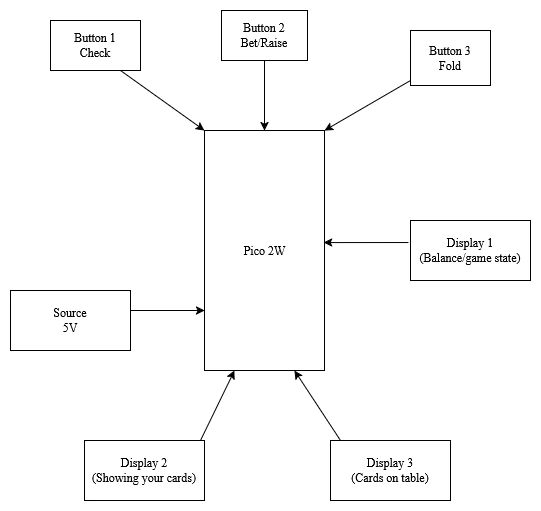

# Poker Game
A poker game against an AI using rust and the Raspberry Pi Pico 2

:::info
**Author**: Ciortan Rares-Sebastian \
**GitHub Project Link**:  https://github.com/UPB-PMRust-Students/project-troly69

:::

## Description
Pocket Poker is a single-player Texas Hold'em-style poker game that runs entirely on a Raspberry Pi Pico 2W, using a 1.8" SPI TFT LCD for the displays and push buttons for input. The game allows the player to go head-to-head against a simple AI dealer, simulating betting rounds, card dealing, and hand evaluation. All logic and graphics are written in Rust, demonstrating how embedded systems can be used for interactive, game-like applications without requiring internet or external screens.

## Motivation
I wanted to create something more interactive and fun than traditional embedded projects. Poker is a great balance of logic, randomness, and user interface work. This project is a chance to explore Rust for embedded systems, work with SPI-based LCDs, and implement game logic on limited hardware.

## Architecture

**Raspberry Pi Pico 2W**: Acts as the main controller. Runs the game logic written in Rust. Communicates with the displays via SPI and handles button input through GPIO.
-**Connection**: Communicates with the display via SPI and handles button input through GPIO.

**Buttons**: Used for player inputs (Check,Bet,Fold).
-**Connection**: Each button is connected to a GPIO pin with pull-down resistors for clean signals.
**Displays**: Used to show the table cards, your cards, balance of both players/game state.
-**Connection**: Connected via SPI (MOSI and CLK), plus control pins (CS, DC, RST).

## Log
### Week 5-11 May
wip
### Week 12-18 May
wip
### Week 19-25 May
wip

## Hardware
The hardware consists of a raspberry pi pico 2W microcontroller as the core unit, around 3 displays used for displaying the cards, balance etc. , buttons for checking, folding, betting.

## Bill of materials
| Device                                                  | Usage                        | Price                           |
|---------------------------------------------------------|------------------------------|---------------------------------|
| [Raspberry Pi Pico 2W](https://www.optimusdigital.ro/ro/placi-raspberry-pi/13327-raspberry-pi-pico-2-w.html?search_query=raspberry+pi+pico+2W&results=26) | The microcontroller | [40 RON] 
[Wireless Super Starter Kit with ESP8266 (Programmable with Arduino IDE)](https://www.optimusdigital.ro/ro/kituri-optimus-digital/7356-kit-wireless-super-starter-cu-esp8266.html?search_query=Wireless+Super+Starter+Kit+with+ESP8266+%28Programmable+with+Arduino+IDE%29&results=1) | Kit  | [65 RON] 
[3X Modul LCD SPI de 1.8"(128x160)](https://www.optimusdigital.ro/ro/optoelectronice-lcd-uri/1311-modul-lcd-spi-de-18-128x160.html?search_query=lcd&results=217) | LCD Display | [29 RON] 
[Breadboard] | Connectivity | in kit 
[Buttons] X3| Game Inputs | in kit 
[Jumpers] | Connectivity | in kit
TOTAL: 200 RON

## Software

| Library / Tool                                                    | Description                                   | Usage                                                     |
| ----------------------------------------------------------------- | --------------------------------------------- | --------------------------------------------------------- |
| [`rp-pico`](https://crates.io/crates/rp-pico)                     | Board support crate for Raspberry Pi Pico (W) | Provides pin definitions, boot setup, and HAL integration |
| [`rp2040-hal`](https://crates.io/crates/rp2040-hal)               | Hardware Abstraction Layer for the RP2040     | Access to SPI, GPIO, timers, clocks, etc.                 |
| [`embedded-hal`](https://crates.io/crates/embedded-hal)           | Embedded hardware abstraction traits          | Interface between display/button drivers and hardware     |
| [`st7735-lcd`](https://crates.io/crates/st7735-lcd)               | Rust driver for ST7735 LCD over SPI           | Used to draw graphics and text to the LCD screen          |
| [`embedded-graphics`](https://crates.io/crates/embedded-graphics) | 2D graphics library for embedded displays     | Draws text, shapes, cards, etc. on screen                 |
| [`cortex-m`](https://crates.io/crates/cortex-m)                   | Low-level access to ARM Cortex-M processors   | Required for system boot and interrupts                   |
| [`cortex-m-rt`](https://crates.io/crates/cortex-m-rt)             | Runtime support for Cortex-M                  | Entry point and memory layout setup                       |
| [`panic-halt`](https://crates.io/crates/panic-halt)               | Halts the program on panic                    | Simple panic handler for embedded                         |
| [`embedded-time`](https://crates.io/crates/embedded-time)         | Time units and delays for embedded            | Used for timing animations or button debounce             |
| [`probe-rs`](https://crates.io/crates/probe-rs) *(optional)*      | Flash and debug Rust code to microcontrollers | Used to upload code directly (or you can use `elf2uf2`)   |

## Links

1. [Texas Hold'em rules] (https://casinos.lotoquebec.com/dam/jcr:c49e36e5-1e3d-4123-ae10-e7250d837140/Regles_Ultimate-Texas-Holdem_e.pdf)
2. [embedded-graphics] (https://github.com/embedded-graphics/examples)
3. [Rust on Raspberry Pi Pico Guide] (https://github.com/knurling-rs/app-template)