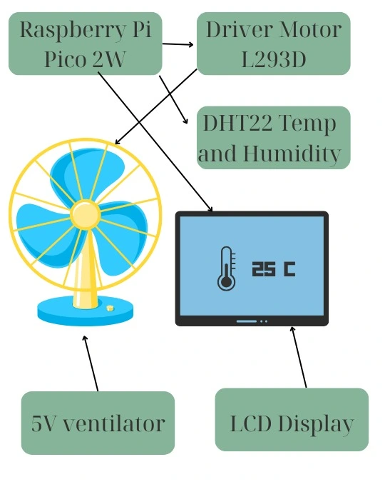

# Smart fan
A smart fan with a built-in display.

:::info

**Author**: Herghelegiu Rares-Andrei \
**GitHub Project Link**: https://github.com/UPB-PMRust-Students/project-RaresAndrei0

:::

## Description

A smart fan that features an integrated digital display for real-time temperature monitoring.
It automatically activates when ambient temperature exceeds a user-defined threshold.

## Motivation

I chose this project because it presented a manageable challenge for someone with my current level of programming experience. Additionally, given the ongoing concerns around global warming and the need for more energy-conscious solutions, developing a fan that operates autonomously based on temperature thresholds seemed both practical and timely. It aligns well with sustainability goals while allowing me to grow my technical skills through a meaningful application.

## Architecture


**Raspberry Pi Pico 2W**

Acts as the main controller of the project — reads temperature from the sensor, controls the fan via the L293D motor driver, and updates the LCD display with temperature data and fan status.

**DHT22 Temperature Sensor**

Single-wire digital interface. Measures temperature and humidity, used to determine whether the fan should turn on or off.

**LCD 16x2 Display (I2C module)**

Displays real-time temperature readings and fan status (“ON” / “OFF”).

**L293D Motor Driver**

Using the GPIO, controls the 5V fan by switching it on/off based on temperature thresholds received from the Pico.

**5V Fan**

Controlled via L293D outputs, activates automatically when temperature exceeds a certain threshold.

## Log

### Week 28 April - 4 May
After submitting the project proposal and refining it to add complexity, as advised by the lab professor, I proceeded to purchase the necessary components and began assembling the system. I encountered my first major issue when attempting to interface the DHT-22 temperature sensor with the Raspberry Pi Pico. Although I identified an embassy-rs crate that supports the sensor, it turned out to be non-functional. Unfortunately, the DHT-22 lacks broader support outside of this crate, leaving me with two options: either switch from Embassy to another framework, such as Tock, or attempt to fix the existing crate by rewriting or adapting a significant portion of its rather complicated codebase.

### Week 5 - 11 May

### Week 12 - 18 May

### Week 19 - 25 May

## Hardware

Detail in a few words the hardware used.

### Schematics

Place your KiCAD schematics here.

### Bill of Materials

<!-- Fill out this table with all the hardware components that you might need.

The format is
```
| [Device](link://to/device) | This is used ... | [price](link://to/store) |

```

-->

| Device | Usage | Price |
|--------|--------|-------|
| [Raspberry Pi Pico W](https://www.raspberrypi.com/documentation/microcontrollers/raspberry-pi-pico.html) | The microcontroller | [35 RON](https://www.optimusdigital.ro/en/raspberry-pi-boards/12394-raspberry-pi-pico-w.html) |


## Software

| Library | Description | Usage |
|---------|-------------|-------|
| [st7789](https://github.com/almindor/st7789) | Display driver for ST7789 | Used for the display for the Pico Explorer Base |
| [embedded-graphics](https://github.com/embedded-graphics/embedded-graphics) | 2D graphics library | Used for drawing to the display |

## Links

<!-- Add a few links that inspired you and that you think you will use for your project -->

1. [link](https://example.com)
2. [link](https://example3.com)
...
