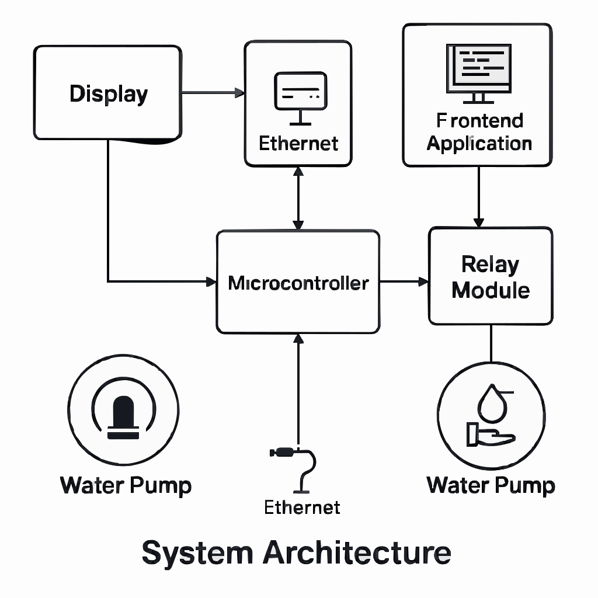
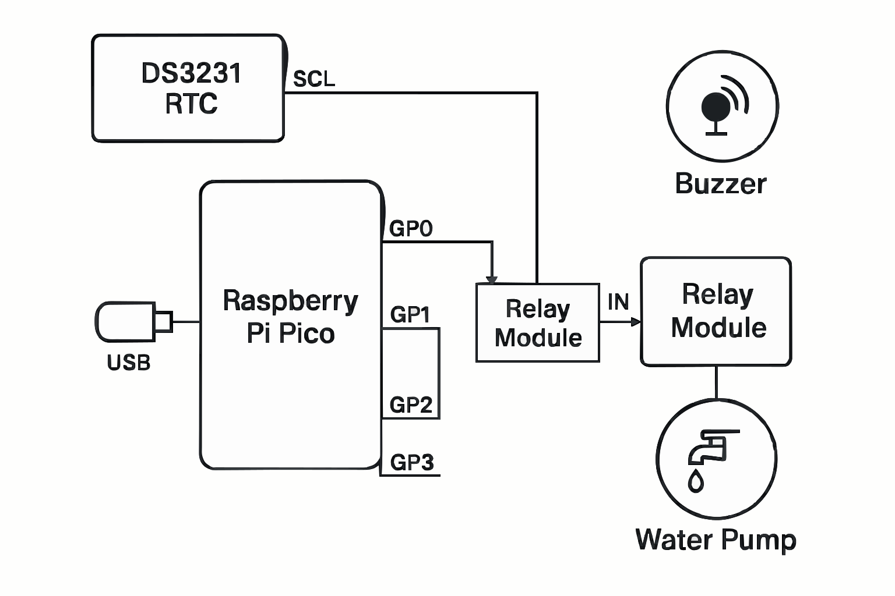
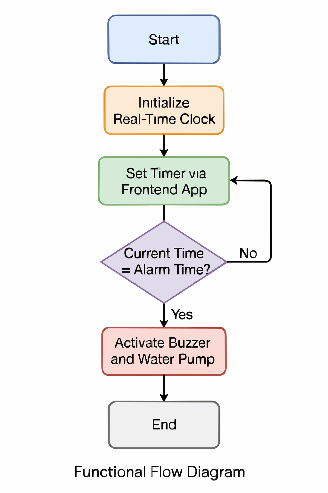

# 💧 Water Spitting Alarm

A creative and effective alarm clock that *guarantees* you'll wake up — by spraying water on your face when the alarm goes off.

:::info

**Author**: Rizescu Razvan-Alexandru\
**GitHub Project Link**:https://github.com/UPB-PMRust-Students/project-RazvanRZR

::::

# Description

Built around a Raspberry Pi Pico microcontroller and a DS3231 real-time clock module, the system uses a relay-controlled water pump and a buzzer to deliver both audio and physical alerts when the alarm time is reached. The alarm time is easily configurable through a simple frontend web interface. This project combines embedded hardware design with Rust-based software development to create a reliable, fun, and slightly mischievous alarm system. With a modular architecture, clear schematics, and robust software design, it’s a perfect example of how creative engineering can solve everyday problems in unexpected ways.

---

## 🎯 Motivation

Since I was 14 years old, I struggled to wake up to traditional alarms. Most mornings, I would snooze or sleep through them. This project solves that by introducing an unavoidable physical stimulus — **a blast of water** — triggered by a reliable, time-based microcontroller system.

---

## 🧱 Architecture

### Main Components:
- Raspberry Pi Pico
- DS3231 RTC
- Relay Module
- Buzzer
- Water Pump
- USB Power
- Frontend App (for time setting)

---

## 🗂 Architecture Diagram

The diagram above shows:
- USB powering the Raspberry Pi Pico
- Pico connections:
  - I2C to RTC
  - GPIO to Buzzer and Relay
- Relay powering the water pump
- Frontend app interface via serial or USB input

---

## 📆 Weekly Development Log

### Week 6-12 May

-In the first week after deciding on my project, I ordered the necessary components and worked on schematics, architecture and documentation, planning everything that i want to do in my head, first important features, possible future features.

---

## 🛠 Hardware

- Raspberry Pi Pico reads time and controls outputs.
- Relay safely drives the water pump.
- All powered via USB.
- RTC provides persistent and accurate timekeeping.
- When the current time matches the alarm:
  - Triggers a **buzzer** for audio alert.
  - Activates a **water pump** to spray water on the user.
- Both components run until manually stopped.
- Alarm time is set via a **simple frontend web app**.

---

## 📐 Schematics

Describes the physical circuit:
- RTC (I2C) to Pico
- Relay and Buzzer via GPIO
- Water pump through relay
- Powered through USB

---

## 🔄 Functional Flow Diagram

Diagram:
- Start → Init RTC
- Set time via frontend
- Loop: Compare time
- If match → Activate buzzer + pump
- Wait/Reset

---

## 📋 Bill of Materials

| Item              | Quantity | Purpose                    | Estimated Price (RON) |
|-------------------|----------|----------------------------|------------------------|
| Raspberry Pi Pico | 1        | Controller                 | $46.99                 |
| DS3231 RTC Module | 1        | Timekeeping                | $15.98                 |
| Relay Module      | 1        | Switches water pump        | $04.99                 |
| Water Pump        | 1        | Sprays water               | $15.99                 |
| Buzzer            | 1        | Audio alarm                | $05.78                 |
| Breadboard        | 1        | Prototyping circuit        | $12.10                 |
| Jumper Wires      | 10+      | Connections                | $15.90                 |
| USB Power Adapter | 1        | Power supply               | $10.49                 |

---

## 💾 Software

| **Component / Library**| **Description**                                       | **Usage in Project**                                           |
|------------------------|-------------------------------------------------------|----------------------------------------------------------------|
| `rp-pico`              | Rust support crate for Raspberry Pi Pico              | Provides low-level access to Pico-specific peripherals and pins|
| `embedded-hal`         | Hardware Abstraction Layer (HAL) for embedded Rust    | Offers standardized traits for GPIO, I2C, timers, etc.         |
| `ds323-x`              | Driver for DS3231 RTC module                          | Communicates with RTC over I2C to get/set current time         | 
| `embedded-time`        | Time handling library for embedded systems            | Manages durations, clocks, and time comparisons                |
| `chrono`               | Date and time library                                 | Parses and formats time values; aids alarm comparison logic    |
| `defmt`                |Debug logging framework for embedded Rust              | Provides efficient, low-overhead logging over serial           |
| Frontend App (Web UI)  | Simple web interface for setting alarm time           | Allows user to configure the alarm time over serial/USB        |

---

## 🌐 Links

1. No links just yet,

---
