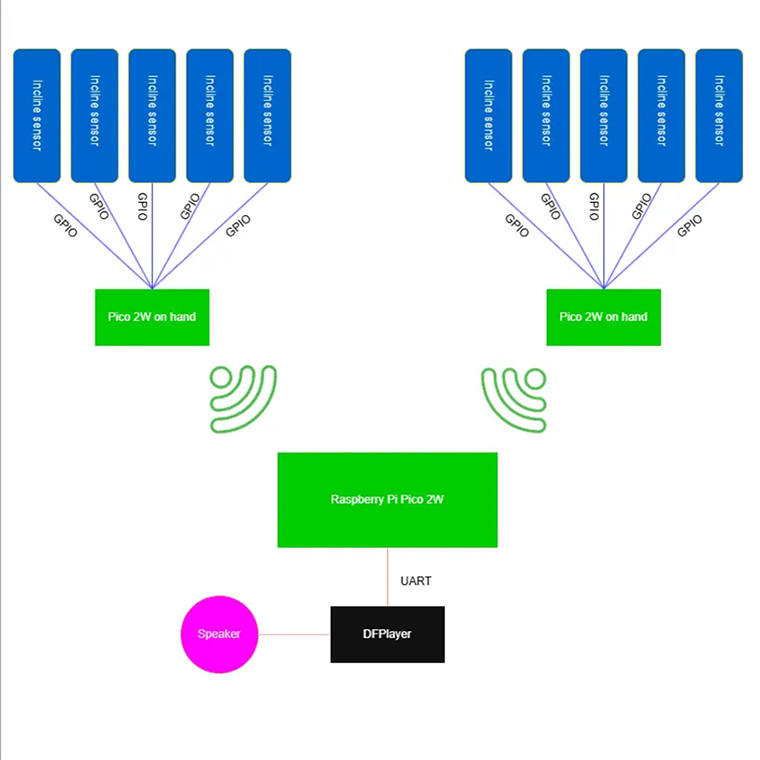
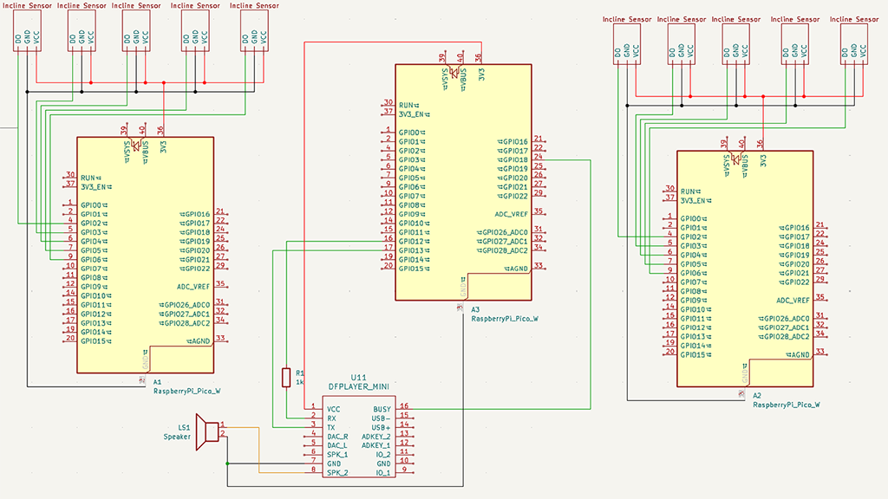

# Pico Piano

Inspired by the idea of the Power Glove accessory for the Nintendo Entertainment System, the Pico Piano is built to give the same cyber-punk feeling of virtual control over an instrument, without needing the actual piano physically.

:::info

**Author**: Bercut Remus-Gabriel \
**GitHub Project Link**: https://github.com/UPB-PMRust-Students/project-GnarGnaw

:::

## Description

The Pico Piano simulates playing the piano by using incline sensors on each finger, connected to a Pico 2W board for each hand which communicate wirelessly to a main Pico 2W sending signals for each note to a DFPlayer.

## Motivation

I got the idea after browsing optimus and seeing incline sensors. I knew immediately that it would be amazing to connect them to a finger and work some magic. After that, everything came naturally with the musical instruments, piano was the most intuitive idea.

## Architecture

**Components used**

**Raspeberry Pi Pico 2W**: This is used for communicating with the sensors through GPIO, controlling the DFPlayer through UART, debugging throughout.

**DFPLayer**: This module is used for playing the actual sound. It includes a DAC and an SD Card reader which reduces the amount of work needed in order to communicate between modules. Connection with the Pico is done via UART.

**Incline Sensors**: The sensors use a very simple mechanism inside with 2 balls that are acted upon by gravity. They send a signal when they touch each other and a metal pin at the base of the sensor. They communicate via GPIO with the Pico.

## Log

### Week 5-11 May

I've received all 12 incline sensors and the DFPlayer last week so I can finally start to test everything. The sensors can communicate through GPIO since their signal need not be processed, but I'm having trouble figuring how the DFPlayer works and how to use UART.

Song of the week is: TOOL - Reflection

### Week 12-18 May

## Hardware
Setup consists of 3 Raspeberry Pi Pico 2W boards, one for each hand and one acting as the main unit for playing the music. The music is played through a speaker connected to a DFPlayer module which receives signal from the main Pico board.
The DFPlayer connects to the main Pico 2W through SPI and to the speaker via the SPK pin. VCC is supplied by the Pico board. 5 incline sensors are connected through GPIO to a Pico 2W for each hand.
### Schematics

### Bill of Materials
| Device                                                  | Usage                        | Price                           |
|---------------------------------------------------------|------------------------------|---------------------------------|
| [3x Raspberry Pi Pico W](https://www.raspberrypi.com/documentation/microcontrollers/raspberry-pi-pico.html) | Microcontrollers | [120 RON](https://www.optimusdigital.ro/en/raspberry-pi-boards/13327-raspberry-pi-pico-2-w.html) |
| [DFPlayer Mini](https://picaxe.com/docs/spe033.pdf) | MP3 Module with SD Card | [14 RON](https://www.optimusdigital.ro/en/audio/1484-dfplayer-mini-miniature-mp3-player-module.html) |
| [10x Incline Sensor](https://components101.com/sensors/sw-520d-tilt-sensor-module)| Incline Sensor | [10x5 RON](https://www.bitmi.ro/electronica/senzor-inclinare-sw-520d-11527.html) |
| [Resistor 1K Ohm](https://www.optimusdigital.ro/en/resistors/10928-250-pcs-plusivo-resistor-kit.html)| Resistor from Kit  | [15 RON](https://www.optimusdigital.ro/en/resistors/10928-250-pcs-plusivo-resistor-kit.html) |
| [Wires](https://www.optimusdigital.ro/en/wires-with-connectors/885-wires-male-male-10p-10cm.html) | Wires, Male-Male and Female-Female | [~10 RON](https://www.optimusdigital.ro/en/wires-with-connectors/885-wires-male-male-10p-10cm.html) |
| Speaker 8Ohm | Speaker | Couldn't find speakers available anywhere for a good price actually, nobody seems to sell these anymore, I ripped one out of a toy, I will edit this later if I buy a speaker |

## Software
| Library | Description | Usage |
|---------|-------------|-------|
[embassy-rp](https://docs.embassy.dev/embassy-rp/git/rp235xb/index.html) | For communication with the peripherals |  |
[embassy-executor](https://docs.embassy.dev/embassy-executor/git/cortex-m/index.html) | Executor for tasks |  |
[embassy-time](https://docs.embassy.dev/embassy-time/git/default/index.html) | Used for timers, delay, duration etc |  |
[embassy-sync](https://docs.embassy.dev/embassy-sync/git/default/index.html) | Used for synchronization |  |
[dfplayer_async](https://docs.rs/dfplayer-async/latest/dfplayer_async/) | Found on crates.io, made specifically for the DFPlayer module |  |  |
## Links