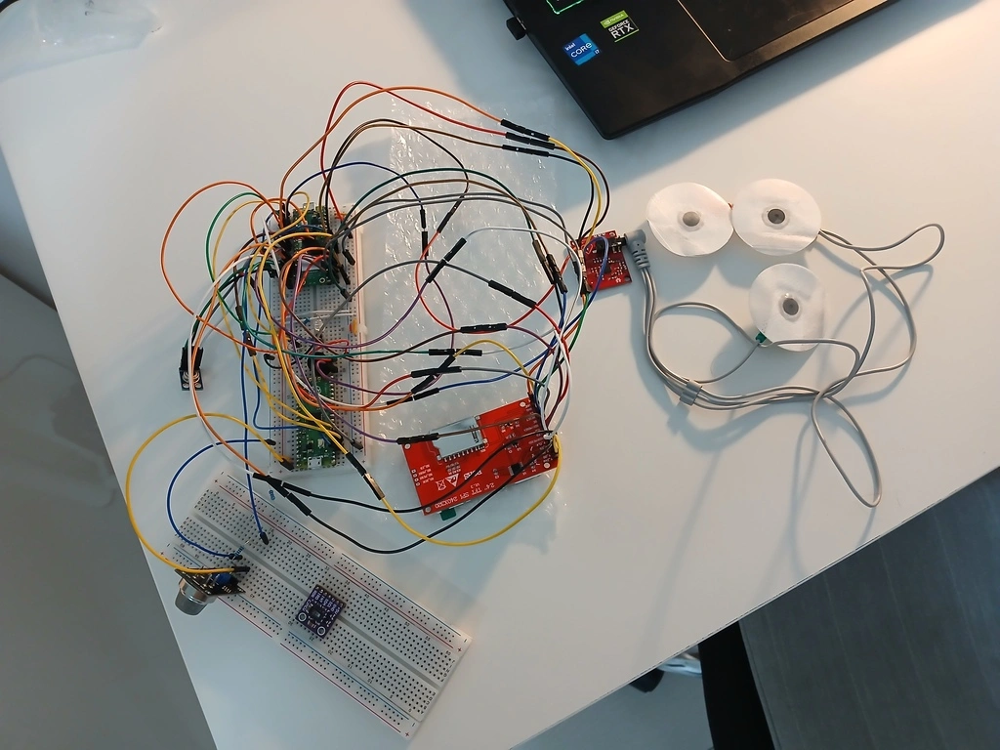
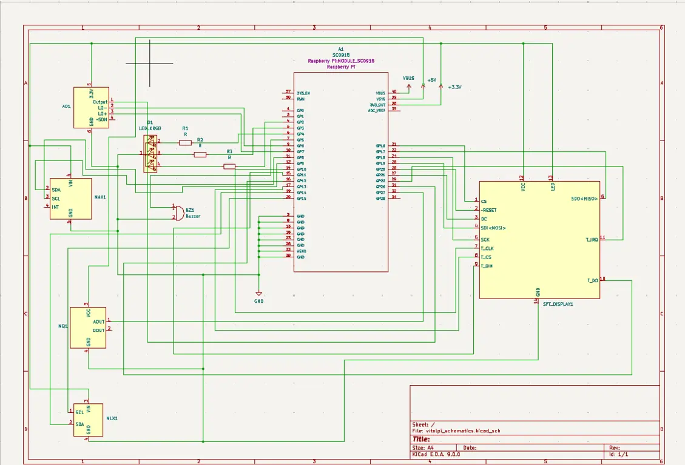

# VitalPi
Meet Your Personal Health Guardian - Real-time Vital Monitoring at Your Fingertips

:::info 

**Author**: Bachynskyi Roi \
**GitHub Project Link**: https://github.com/UPB-PMRust-Students/project-frihetselsker

:::

## Description

It is a stationary health station featuring body temperature, ECG, and air quality sensors allowing evaluate your wellness from home. The system provides immediate notifications and results on site, while transmitting health data wirelessly to the server for remote monitoring and better view.

## Motivation

I chose VitalPi to democratize healthcare monitoring, making vital health data accessible to everyone regardless of location or resources. This solution brings decent health monitoring into homes and underserved communities potentially improving health outcomes for those with limited access to regular medical care.

## Architecture 
### Schematics
This diagram reflects the concept of connections of every part in this project.

---

**Raspberry Pi Pico 2W**

*Role:* Central controller for the entire health station system

*Connections:* GPIO pins for all sensors, display, LED, and buzzer

*Function:* Collects data from sensors, processes readings, manages notifications, and sends data to server

---

**Touchscreen Display**

*Interface:* SPI

*Role:* User interface for health monitoring station

*Connections:* GPIO10 - 13, GPIO16 - 22

*Function:* Displays real-time health metrics, allows user interaction with the system

---

**Temperature Sensor**

*Interface:* I2C

*Role:* Monitors body or ambient temperature

*Connections:* GPIO14 and GPIO15

*Function:* Provides temperature readings for health assessment

---

**Air Quality Sensor**

*Interface:* ADC

*Role:* Detects air pollutants, VOCs, or specific gases

*Connections:* GPIO27(ADC1)

*Function:* Monitors environmental air quality that could affect health

---

**ECG Sensor**

*Interface:* ADC

*Role:* Captures electrical signals from the heart

*Connections:* GPIO26(ADC0)

*Function:* Records cardiac activity for heart health monitoring

---

**BPE-SpO2 Sensor:**

*Interface:* I2C

*Role:* Measures blood oxygen saturation and pulse rate

*Connections:* GPIO8 and GPIO9

*Function:* Monitors oxygen levels in blood and heart rate, critical vital signs for overall health assessment

---
**RGB LED**

*Interface:* PWM

*Role:* Visual notification system

*Connections:* GPIO2, GPIO3, and GPIO4 with current-limiting resistors

*Function:* Color-coded alerts based on sensor readings

---

**Passive Buzzer**

*Interface:* PWM

*Role:* Audible notification system

*Connections:* GPIO5

*Function:* Sounds alerts

---

**Web Application**

*Interface:* Wi-Fi

*Role:* Data visualization and remote monitoring interface

*Features:* Displays historical data trends, allows data export for medical professionals

*Function:* Provides accessible interface for viewing health data 

## Log

### Week 5 - 11 May

### Week 12 - 18 May

### Week 19 - 25 May

## Hardware

VitalPi utilizes a Raspberry Pi Pico 2W microcontroller as its processing core and webbite communicator, paired with a TFT LCD touchscreen (240×320px) for user interaction. Health monitoring is provided through an AD8232 ECG sensor module for cardiac activity, an MLX90614ESF infrared temperature sensor for contactless temperature readings, and a GY-MAX30102 optical heart rate and blood oxygen sensor. Environmental monitoring comes from an MQ135 gas sensor configured with a 10kΩ/20kΩ resistor voltage divider. User notifications are delivered via an RGB LED (with 220Ω current-limiting resistors) for visual alerts and a passive buzzer for audible warnings.

### Schematics

This is the KiCad Schematics of the project.

### Bill of Materials

| Device | Usage | Price |
|--------|--------|-------|
| [Raspberry Pi Pico 2W](https://www.raspberrypi.com/documentation/microcontrollers/raspberry-pi-pico.html) | The microcontroller that processes all sensor data and manages wireless connectivity | [35 RON](https://www.optimusdigital.ro/en/raspberry-pi-boards/12394-raspberry-pi-pico-w.html) |
|[2.4" TFT LCD Touchscreen (240×320px)](http://www.lcdwiki.com/2.4inch_SPI_Module_ILI9341_SKU:MSP2402)|User interface display for viewing health data and interacting with the system|[54 RON](https://www.emag.ro/display-tactil-tft-lcd-240-x-320-px-cu-cititor-sd-spi-2-4-inch-gri-rosu-tft-24-ili9341-restouch-spi/pd/D49CJMYBM/?utm_campaign=share_product&utm_source=mobile_dynamic_share&utm_medium=android)|
|[MLX90614ESF Infrared Temperature Sensor](https://www.melexis.com/en/product/MLX90614/Digital-Plug-Play-Infrared-Thermometer-TO-Can) |Non-contact temperature measurement for body and ambient temperature monitoring|[60 RON](https://www.optimusdigital.ro/en/temperature-sensors/138-mlx90614esf-infrared-temperature-sensor.html?gad_source=1&gclid=Cj0KCQjwoNzABhDbARIsALfY8VP4KOk-uamBw2aAAHJ--2XHtenjYjfFNSvu1_ldMD97vs0Ro4AwfvkaAomFEALw_wcB)|
|[AD8232 ECG Sensor Module](https://www.google.com/url?sa=t&source=web&rct=j&opi=89978449&url=https://www.analog.com/media/en/technical-documentation/data-sheets/ad8232.pdf&ved=2ahUKEwivq-_73YmNAxWgSfEDHfFSNnEQFnoECCEQAQ&usg=AOvVaw1ZekMJX-ZT0NP6lisc-KfI) |Single-lead electrocardiogram sensor for heart activity monitoring and analysis|[35 RON](https://www.google.com/url?sa=t&source=web&rct=j&opi=89978449&url=https://www.optimusdigital.ro/en/others/1347-modul-senzor-ecg-ad8232.html%3Fsrsltid%3DAfmBOoq7ktMvGHH3i34NuyOIysD9tOLrn9shzC3jfg7yPPLJ9DLfWkmG&ved=2ahUKEwjU0LKh3omNAxUTRPEDHaxjITIQFnoECCYQAQ&usg=AOvVaw3B14kha6sXv0jADqs4gqSQ)|
|[MQ135 Gas Sensor](https://www.olimex.com/Products/Components/Sensors/Gas/SNS-MQ135/resources/SNS-MQ135.pdf)|Air quality detection for monitoring harmful gases and environmental conditions|[16 RON](https://www.bitmi.ro/modul-senzor-calitate-aer-mq135-10423.html?gad_source=1&gclid=Cj0KCQjwoNzABhDbARIsALfY8VMkJt8lr23lYsZGiwqCjhqz0_K5gn6aomgZT2sPRCyjlESzoN40NHAaAshEEALw_wcB)|
|[Breakout heart rate sensor GY-MAX30102](https://www.instructables.com/Guide-to-Using-MAX30102-Heart-Rate-and-Oxygen-Sens/)|Pulse oximetry sensor for monitoring blood oxygen levels and heart rate|[14 RON](https://www.emag.ro/breakout-senzor-ritm-cardiac-robofun-gy-max30102-pentru-arduino-00005330/pd/DJQVF1YBM/)|
|[Passive Buzzer Module](https://www.handsontec.com/dataspecs/module/passive%20buzzer.pdf)|Audio notification system for alerts and warnings|[2 RON](https://www.optimusdigital.ro/en/electronic-components/12598-passive-buzzer-module.html)|
|[RGB LED Common Cathode](https://www.mouser.com/catalog/specsheets/Soldered_100105%205mm%20RGB%20LED%20diode%20common%20cathode.pdf?srsltid=AfmBOooEda5-sqCRuQ-qNjnFkSjChamOBkOXMJI-_FxKITltrbbSo-8I)|Visual status indicator showing system and health conditions through color coding|[1 RON](https://www.optimusdigital.ro/en/leds/483-rgb-led-common-cathode.html?srsltid=AfmBOoqqRw8qCkA0KuLfmskkMIM2O0KJjFAchG4kDGp_oNTNVTboTiOw)|
|[3 x 220Ω Resistors](https://www.optimusdigital.ro/en/resistors/10958-05w-220-resistor.html) |Current-limiting components for the RGB LED|[0,30 RON](https://www.optimusdigital.ro/en/resistors/10958-05w-220-resistor.html)|
|[1 kΩ Resistor](https://www.optimusdigital.ro/en/resistors/859-025w-1k-resistor.html?srsltid=AfmBOopYUKWi3_R7jO7hJJaGlh9ly_XcDNCyIgR8xsUILaELgU_VR-Gc)|Component of voltage divider for MQ135 gas sensor|[0,10 RON](https://www.optimusdigital.ro/en/resistors/859-025w-1k-resistor.html?srsltid=AfmBOopYUKWi3_R7jO7hJJaGlh9ly_XcDNCyIgR8xsUILaELgU_VR-Gc)|
|[2 kΩ Resistor](https://www.optimusdigital.ro/en/resistors/851-025w-22k-resistor.html?srsltid=AfmBOorNykvdmztfEqMvz_hlfJonyaACrUh2bPOsvN76Xk9tm9VrWeT7)|Component of voltage divider for MQ135 gas sensor|[0,10 RON](https://www.optimusdigital.ro/en/resistors/851-025w-22k-resistor.html?srsltid=AfmBOorNykvdmztfEqMvz_hlfJonyaACrUh2bPOsvN76Xk9tm9VrWeT7)|

## Software

| Library | Description | Usage |
|---------|-------------|-------|
| [embassy-rp](https://github.com/embassy-rs/embassy)|	Embassy support for Raspberry Pi RP2350|Runs async embedded tasks on Raspberry Pi Pico 2W|
|[embassy-embedded-hal](https://github.com/embassy-rs/embassy)|Async implementation of embedded-hal traits|Interfaces with async-compatible embedded peripherals|
|[embassy-sync](https://github.com/embassy-rs/embassy)|Synchronization primitives for async embedded Rust|Used for mutexes, signals, and channels in concurrent tasks|
|[embassy-executor](https://github.com/embassy-rs/embassy)|Async task executor for bare-metal embedded systems|Manages scheduling and running async tasks on the device|
|[embassy-futures](https://github.com/embassy-rs/embassy)|Lightweight async utilities for embedded systems|Provides futures and combinators used in async workflows|
|[embassy-time](https://github.com/embassy-rs/embassy)|Timekeeping and delays for embedded systems|Used for timers, delays, and task timeouts|
|[embassy-net](https://github.com/embassy-rs/embassy)|Async TCP/IP networking stack|Handles communication between device and remote server|
|[cyw43](https://github.com/embassy-rs/embassy)|Driver for the CYW43 Wi-Fi chip|Provides Wi-Fi connectivity to the Raspberry Pi Pico 2W|
|[cyw43-pio](https://github.com/embassy-rs/embassy)|PIO-based CYW43 driver implementation|Allows communication with CYW43 via the Pico’s PIO|
|[defmt](https://github.com/knurling-rs/defmt)|Logging framework optimized for embedded devices|Used for low-overhead logging during debugging|
|[defmt-rtt](https://github.com/knurling-rs/defmt)|Backend for defmt using RTT (Real-Time Transfer)|Backend for defmt using RTT (Real-Time Transfer)|
|[cortex-m-rt](https://github.com/rust-embedded/cortex-m)|Runtime for Cortex-M microcontrollers|Sets up interrupt vectors and program entry point|
|[panic-probe](https://github.com/knurling-rs/defmt)|Panic handler for defmt-enabled embedded apps|Captures and displays panics for debugging|
|[embedded-hal-async](https://github.com/rust-embedded/embedded-hal)|	Asynchronous embedded-hal traits|Defines async traits for interacting with hardware|
|[display-interface-spi](https://github.com/therealprof/display-interface)|SPI interface for display drivers|Provides abstraction for SPI-based display communication|
|[ili9341](https://github.com/yuri91/ili9341-rs)|Driver for ILI9341 LCD display controller|Enables graphics output to ILI9341-based displays|
|[heapless](https://github.com/rust-embedded/heapless)|	Data structures that don’t require dynamic memory|Used for buffers and queues with guaranteed memory use|
|[xpt2046](https://github.com/nullstalgia/mff-hr-v1/tree/master/xpt2046)|Touchscreen driver for XPT2046|Reads user input from resistive touchscreen displays|
|[micromath](https://github.com/tarcieri/micromath)|Lightweight math library for microcontrollers|Used for computations like ECG signal processing|
|[embedded-alloc](https://github.com/rust-embedded/embedded-alloc)|Minimal allocator for embedded environments|Enables dynamic memory allocation in no_std contexts|
|[embedded-canvas](https://github.com/LechevSpace/embedded-canvas)|Drawing primitives for embedded displays|Renders basic shapes and text to embedded screens|
|[mlx9061x](https://github.com/eldruin/mlx9061x-rs)|Driver for MLX90614 temperature sensor|Used for contactless infrared temperature measurement|
| [embedded-graphics](https://github.com/embedded-graphics/embedded-graphics) | 2D graphics library | Used for drawing to the display |

## Links

<!-- Add a few links that inspired you and that you think you will use for your project -->

1. [Datasheet for MAX30102](https://www.analog.com/media/en/technical-documentation/data-sheets/max30102.pdf)
2. [Embedded-canvas for better update on the screen](https://crates.io/crates/embedded-canvas)

