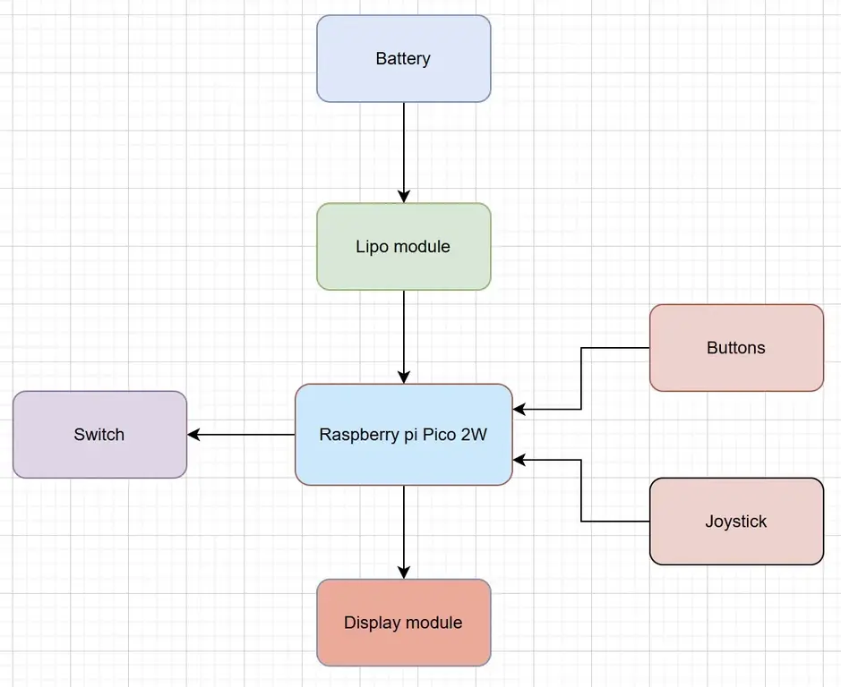
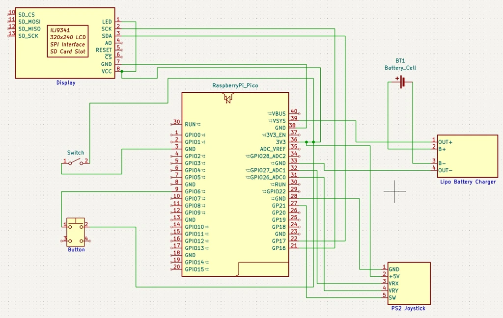

# Lil-console
My project is named Lil-Console and it's a little portable retro gaming device.

:::info

**Author**: Simion Sarah Stefania \
**GitHub Project Link**: [link_to_github](https://github.com/UPB-PMRust-Students/project-Dydys12)

:::

## Description

The goals of this project is to use the Raspberry Pi Pico 2W microcontroller to build a basic retro portable console. A joystick and a few buttons are used for movement, navigation and selection. The games will have a classic gaming vibe, for this I choose the games "Pong" and "Snake", along with a simple menu system.

## Motivation

I choose this idea because I am currently very passionate about games and I enjoy playing games on both computer and consoles, but I haven't experienced the retro gaming consoles world and thought that if it is possible to make one myself now I would really enjoy the making of it and definitely the using of it.  

## Architecture 



## Log

<!-- write your progress here every week -->

### Week 5 - 11 May

### Week 12 - 18 May

### Week 19 - 25 May

## Hardware

This are the hardware parts that I would like to use:

- Raspberry Pi Pico 2W (main microcontroller)
- LCD SPI 1.8"(128x160) Display
- TP4056 Lipo Charger Module
- 300 mAh Battery
- KCD10-101 Switch
- PS2 Joystick Module and a few buttons
- simple PCB boards


### Schematics



### Bill of Materials

<!-- Fill out this table with all the hardware components that you mi>

The format is 
```
| [Device](link://to/device) | This is used ... | [price](link://to/s>

```

-->

| Device | Usage | Price |
|--------|--------|-------|
| [Raspberry Pi Pico 2W](https://datasheets.raspberrypi.com/picow/pico-2-w-pinout.pdf) | Main microcontroller board | [40 lei](https://www.optimusdigital.ro/en/raspberry-pi-boards/13327-raspberry-pi-pico-2-w.html?search_query=raspberry+pi+pico&results=36) |
| [LCD SPI 1.8" (128x160) Display](https://www.openimpulse.com/blog/wp-content/uploads/wpsc/downloadables/1.8-SPI-LCD-Module-datasheet.pdf) | Used to visually display information or interface elements. | [29 lei](https://www.optimusdigital.ro/ro/optoelectronice-lcd-uri/1311-modul-lcd-spi-de-18-128x160.html?search_query=Modul+LCD+SPI+de+1.8%27%27+%28128x160%29&results=3) |
| [TP4056 Lipo Charger Module](https://static.chipdip.ru/lib/977/DOC002977110.pdf) | Charges a single-cell LiPo battery via micro USB. | [6 lei](https://www.optimusdigital.ro/ro/electronica-de-putere-incarcatoare/7534-incarcator-tp4056-cu-micro-usb-pt-baterie-lipo-1a-cu-protectie-pentru-circuite.html?search_query=Incarcator+TP4056+cu+MICRO+USB+pt.+Baterie+LiPo+%281A%29+cu+Prote&results=1) |
| [3.7V 300mAh Battery] | Powers the system | [will get one from a lantern at home] |
| [KCD10-101 Switch](https://www.ncr.hk/uploads/Switches/Rocker_Switch/KCD1-101F.pdf) | Toggles power. | [2 lei](https://www.optimusdigital.ro/ro/butoane-i-comutatoare/7377-comutator-kcd10-101.html?search_query=Comutator+KCD10-101&results=1) |
| [PS2 Joystick Module](https://naylampmechatronics.com/img/cms/Datasheets/000036%20-%20datasheet%20KY-023-Joy-IT.pdf) | Provides directional input and control options. | [4 lei](https://www.robofun.ro/componente/modul-joystick-ps2.html) |
| [Simple PCB Boards] | Base for soldering and connecting components. | [had at home] |
| [Buttons](https://components101.com/switches/push-button) | For control options | [2x 2 lei](https://www.optimusdigital.ro/ro/butoane-i-comutatoare/1114-buton-cu-capac-rotund-rou.html?search_query=%09Buton+cu+Capac+Rotund+Ro%C8%99u&results=1) |


## Software

| Library | Description | Usage |
|---------|-------------|-------|
| [rp-hal](https://github.com/rp-rs/rp-hal) | Hardware Abstraction Layer for the RP2040 microcontroller | Provides access to RP2040 peripherals |
| [embedded-graphics](https://github.com/embedded-graphics/embedded-graphics) | 2D graphics library for embedded systems without a display server | Renders shapes, text, and images on the display |
| [embedded-hal](https://github.com/rust-embedded/embedded-hal) | A set of traits for embedded hardware abstraction in Rust | Provides generic interfaces for timers, digital I/O, SPI, etc |
| [st7789](https://github.com/almindor/st7789) | Driver crate for ST7789-based LCD displays | Drives the display with embedded-graphics support |

## Links

1. [link](https://github.com/Gameboypi/SPW)
2. [link](https://www.youtube.com/watch?v=yauNQSS6nC4&t=16s)
