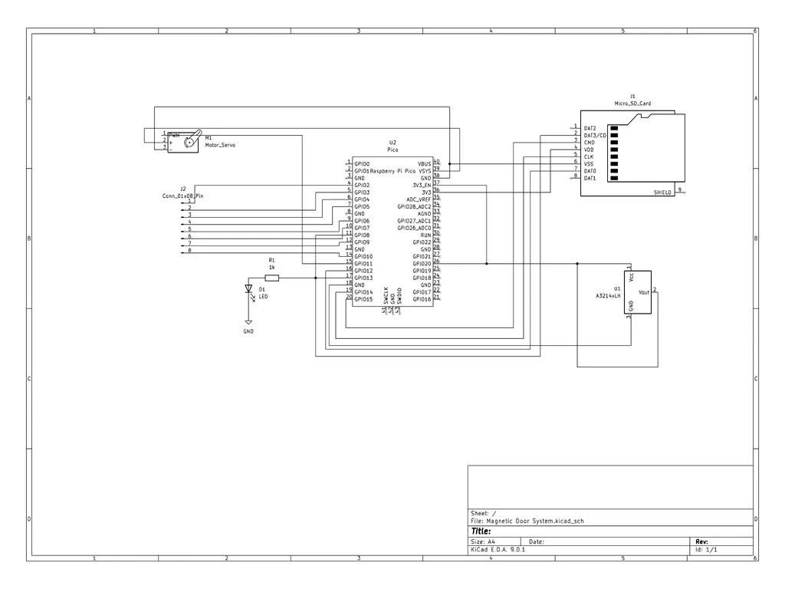

# Magnetic Door System
A IoT door lock mechanism

:::info 

**Author**: Pică Sebastian \
**GitHub Project Link**: https://github.com/UPB-PMRust-Students/project-SebiP21

:::

## Description

The Smart Magnetic Door Lock System is a security device that lets you open a door using a keypad and checks if the door was opened. If the correct password is entered on the keypad, a servo motor unlocks the door. A magnetic sensor on the door checks if it has actually been opened. When the door opens, an LED turns on and the system sends a message over Wi-Fi. The Raspberry Pi Pico W handles everything and stores the passwords on an SD card.

## Motivation

The reason why I chose this project is because it combines several interesting and useful features: a password-protected door lock, door status detection, and Wi-Fi notifications. I believe that this project is a great way to learn how to use components like a keypad, servo motor, SD card, and magnetic sensor with a Raspberry Pi Pico W. 

## Architecture 

  
This is the description of the system components and their interactions:

1) **Keypad**  
   - The keypad is the user input interface.  
   - Users input a numeric password which is read by the microcontroller.  

2) **Raspberry Pi Pico W**  
   - Acts as the brain of the system.  
   - Reads the keypad input and compares it against a list of valid passwords stored on an SD card.  
   - If the password is correct, it sends a signal to open the servo motor.  
   - Monitors the magnetic sensor for door state changes.  
   - Sends a Wi-Fi message if the door is opened.  

3) **SD Card Module**  
   - Stores one or more valid passwords in a text file.  
   - Connected to the Pico via SPI.  

4) **Servo Motor**  
   - Mechanically unlocks the door when the correct password is entered.  

5) **Magnetic Sensor (Hall Effect)**  
   - Detects whether the door is physically opened.  
   - Triggers the LED and Wi-Fi alert if the door is open.  

6) **LED**  
   - Lights up when the door has been opened.  

7) **Wi-Fi Messaging**  
   - The Pico W sends a message over Wi-Fi when the door is opened.  
   
## Log

<!-- write your progress here every week -->

### Week 28 - 4 May
I have started the project following the steps to set-up the gitlab page and I have sketched the documentations
### Week 5 - 11 May

### Week 12 - 18 May

### Week 19 - 25 May

## Hardware

The project uses the following components:

1) **Raspberry Pi Pico W** – Central controller.  
2) **4x4 Keypad** – User input interface for password entry.  
3) **Servo Motor** – Controls the door lock mechanism.  
4) **Magnetic Sensor** – Detects whether the door is open.  
5) **LED (5 mm)** – Visual indicator for door-open event.  
6) **SD Card Module** – Stores passwords in a file.  
7) **USB** – Powers the Pico and servo.

### Schematics

This is the Kicad Schematic:

Instead of a keypad schematic I have used connection pins to represent the rows and columns of the keypad in the KiCad representation of the project

### Bill of Materials

<!-- Fill out this table with all the hardware components that you might need.

The format is 
```
| [Device](link://to/device) | This is used ... | [price](link://to/store) |

```

-->

| Device | Usage | Price |
|--------|--------|-------|
| [Raspberry Pi Pico W](https://www.raspberrypi.com/documentation/microcontrollers/raspberry-pi-pico.html) | Main microcontroller | 35 RON |
| [4x4 Keypad](https://www.optimusdigital.ro/en/touch-sensors/470-4x4-matrix-keyboard-with-female-pin-connector.html?search_query=4x4&results=23) | User password input | 6.99 RON |
| [MG996 Micro Servo](https://www.optimusdigital.ro/en/servomotors/1520-mg996-digital-metal-servomotor-90.html?search_query=servo&results=246) | Controls door lock | 29.99 RON |
| [LED 5 mm](https://www.optimusdigital.ro/ro/optoelectronice-led-uri/37-led-galben.html) | Lights up when door opens | 0.39 RON |
| [SD Card Module](https://www.optimusdigital.ro/en/memories/1516-microsd-card-slot-module.html?search_query=microsd&results=91) | Stores passwords | 4.39 RON |
| [MicroSD Card (8GB)](https://www.emag.ro/card-de-memorie-maxell-micro-sdhc-4gb-class-10-ml-sdmicro-4gb-class10/pd/DVYNWQBBM/?X-Search-Id=2da410e7dca62a83da61&X-Product-Id=45134535&X-Search-Page=1&X-Search-Position=0&X-Section=search&X-MB=0&X-Search-Action=view) | Stores password file | 15.99 RON |
| [Breadboard & Wires](https://www.optimusdigital.ro/en/breadboards/13244-breadboard-175-x-67-x-9-mm.html?search_query=breadboard&results=362) | For prototyping | 11.90 RON |


## Software

| Library | Description | Usage |
|---------|-------------|-------|
| [embedded-sdmmc](https://docs.rs/embedded-sdmmc/latest/embedded_sdmmc/) | SD card file system interface | Reads password data |
| [embedded-hal-servo](https://crates.io/crates/servo-pca9685) | Servo control | Opens door on valid password |
| [embassy](https://embassy.dev/) | Async embedded framework | Powers the system’s concurrency |
| [panic-halt](https://github.com/korken89/panic-halt) | Handles panic safely | Halts system on unrecoverable errors |

## Links

<!-- Add a few links that inspired you and that you think you will use for your project -->

<!-- 1. [link](https://example.com)
2. [link](https://example3.com)
... -->
