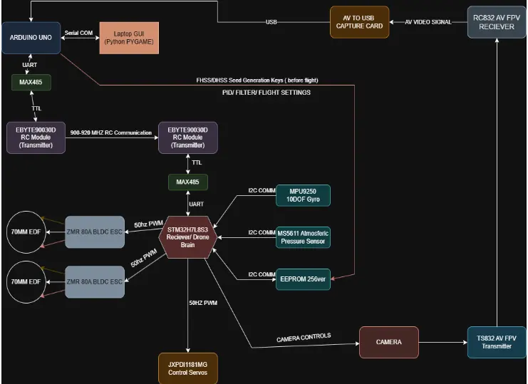

# RO10-Strigoi
A simple drone flight control system developed by MATEI Sebastian-Alexandru (1221EA - PM 2025) that leverages Rust programming language with the Embassy Hardware Abstraction Layer (HAL). This project aims to create a high-performance, reliable flight controller for drone systems with advanced capabilities including precise data acquisition and comprehensive peripheral control for servos and Electronic Speed Controllers (ESCs).
:::info

**Author**: Sebastian-Alexandru MATEI\
**GitHub Project Link**: https://github.com/UPB-PMRust-Students/project-MateiSebastian9

::::

## Description
The project is split in 3 parts. The Drone itself, the ground station and the yoke. The drone is fully written in Rust. The drone was designed by me in Fusion 360. The only files that are not mine are the ones in "import" folder( eg. arduino uno).

## Motivation
I think things that fly fast are cool.

## Architecture 
### Schematic Diagram
Include a diagram showing the components and their connections.

**Fixed wing plane (STMH7S3L8 MCU - RUST + EMBASSY HAL)**
- **Role**: This component is responsible for flight data aquisition, ground communication and flight decisions. 
- **Connections**: The standard package of the drone has the following sensors:

I. Sensors and communication
1. ***Ebyte E32 900D*** - Radio Transmitter / Reciever used to send sensor data from drone to ground station. (UART Communication)
2. ***TS832 FPV Transmitter*** - This is a premade solution tipical in FPV drones. It connects to an AV FPV Camera.
3. ***MPU9250 for gyro***, accelerometer, magnetometer and temperature data. This is used to know the orientation of the plane on each axis. It is usefull for a precise control of the drone. (I2C Communication)
4. ***NEO 8M*** - GPS module with High-precision positioning with 2.5m CEP accuracy capable of multi-constellation support (GPS, GLONASS, Galileo, BeiDou). It is used to know where the aircraft is on the map. (UART Communication)
5. ***MS5621*** - precise barometric sensor used in estimating the current vertical height. (I2C Communication)
6. ***AT24X256 EEPROM*** - Small non volatile memory used to store encryption keys and flight parameters.(I2C Communication)

II.Thrust and Control

1. ***70MM EDF + 80A ZMR Brushless ESC*** - these are the thrusters of the UAV and are controlled via a standard ESC signal.
2. ***20KG DS5320PRO Coreless Servo*** - these steer the plane and are controlled via a standard servo PWM signal.

**Ground Station ( ARDUINO UNO - Arduino C + Python GUI)**
- **Role**: This one takes information from the aircraft and displays it to the UAV pilot. It uses a RJ45 connection to communicate with a custom yoke.
- **Connections**: 
    ***Arduino UNO*** - powered via the 12v barrel jack, connected to the RC Transmitter via UART. 
    ***EBYTE E32 900D*** - Used to send commands to the UAV.
    ***50MM 5v FAN and 10k termistor*** - provides cooling.

**Yoke(Just Hardware connected to the UNO via RJ45)**
- **Role**: JoyStick for the drone. Simple 2DOF design with bearings and potentiometers.
- **Connections**: 
    ***100K Potentiometers*** - used to detect the orientation of the plane Yoke and how the depth at which the throttle trigger is pulled.
    ***Vibration Motors*** - used for haptic feedback.
    ***Buttons and rocker switches*** - used to control "equipment".

## Log
### Week 5 - 11 May
Started 3D design, software and arhitecture of the project. Drone Data Aquisition was fully dealt with and started development on the Ground Station.
The components were ordered 1 month in advance. Most of them arrived. Only needed ones are the 6S battery and the AV FPV Camera.

![]

### Week 12 - 18 May
Continue documenting your progress.

### Week 19 - 25 May
Continue documenting your progress.

## Hardware
Describe your hardware setup in detail.

### Schematics
Include your schematic diagrams.

![]

### Bill of Materials

| No. | Item Name | Qty | Status | Description |
| :-- | :-- | :-- | :-- | :-- |
| 1 | STM32H7L8S3 | 1 | Delivered  | STM Family Microcontroller |
| 2 | NEO 8M GPS | 1 | Delivered  | GPS module for location tracking |
| 3 | MPU-9250 10DOF Gyro | 1 | Delivered  | Gyroscope for aircraft orientation |
| 4 | MS5611 Pressure Sensor | 1 | Delivered  | Precision sensor for altitude determination |
| 5 | EEPROM AT24C256 | 1 | Delivered  | EEPROM storage for FHSS/DHSS seed and keys |
| 6 | 70MM EDF | 2 | Delivered  | Electric Ducted Fan propulsion units |
| 7 | 3.7V LIION CELL | 16 | 10 Available | Battery cells for power supply |
| 8 | 5000MAH 100C 6S LIPO | 1 | Needed | High-performance LiPo battery pack |
| 9 | MAX485 RS485 to TTL | 1 | Waiting Delivery | Communication interface converter |
| 10 | 80A ESC ZMR Brushless | 2 | Delivered  | Electronic Speed Controllers with BEC/UBEC |
| 11 | 2W RF Power Wideband Amplifier | 2 | Delivered  | Range amplifiers for extended communication |
| 12 | TS832 and RC832 | 1 | Delivered  | Video transmitter/receiver system |

| No. | Item Name | Qty | Status | Description |
| :-- | :-- | :-- | :-- | :-- |
| 13 | 12dBi High Gain RP SMA Male Omni Foldable | 2 | Delivered  | 40cm Antennas for communication |
| 14 | EBYTE E32 900 30D | 3 | Delivered  | 900MHz RC transmitter/receiver modules |
| 15 | ARDUINO UNO | 1 | Delivered | Middleman between transmitter and GUI |
| 16 | MP1584EN 3A | 3 | Delivered  | Stepdown Modules for power management |
| 17 | JX Servo PDI-1181MG 18g 3.5KG | 6 | Delivered  | High-torque servo motors for control surfaces |

## Software
| No. | Software Component | Description |
| :-- | :-- | :-- |
| 1 | Embassy HAL (stm32h7xx-hal) | Hardware abstraction layer for STM32H7 microcontrollers |
| 2 | Nalgebra | Linear algebra library for flight dynamics calculations |
| 3 | mpu9250 | Library for interfacing with the MPU-9250 gyroscope |
| 4 | dshot-rs | Digital motor protocol implementation for ESC control |
| 5 | pid | Proportional-Integral-Derivative control algorithm implementation |
| 6 | madgwick | Orientation filter algorithm for sensor fusion |
| 7 | heapless | Memory allocation utilities for embedded systems |
| 8 | embedded-hal-bus | Communication bus abstractions for embedded hardware |
| 9 | eeprom24x-rs | Interface library for AT24C256 EEPROM |
| 10 | ebyte-e32-rs | Driver for Ebyte E32 LoRa modules for wireless communication |

## Links
1. [Reference Link]
    
