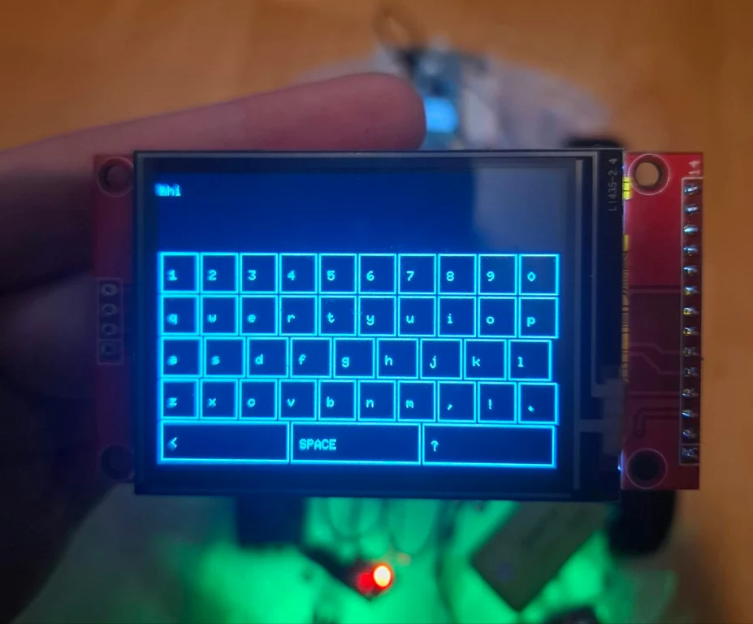
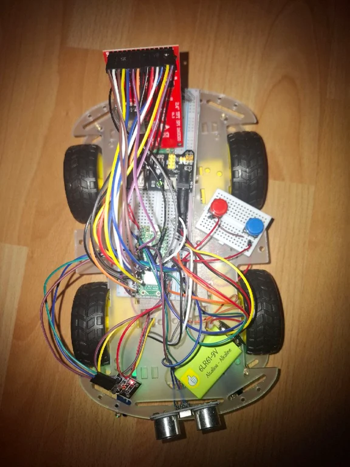
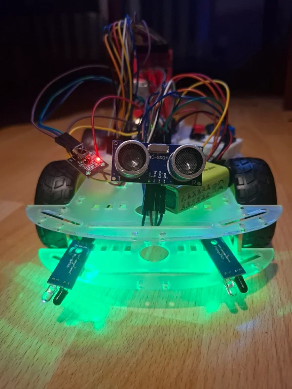
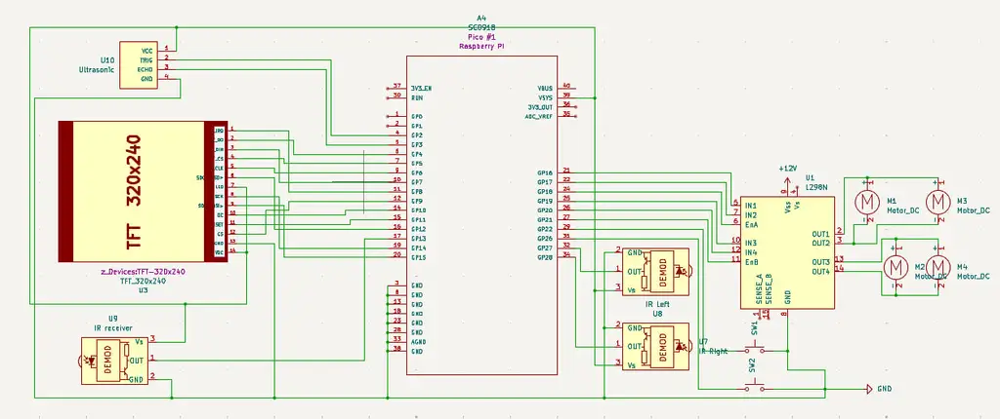

# PicoDeliver
A robotic message and small item delivery system

:::info 

**Author**: Sofiia Huzhan \
**GitHub Project Link**: https://github.com/UPB-PMRust-Students/project-demesup

:::

## Description

PicoDeliver is a robotic system that delivers messages and small items within a local area. Messages can be entered either through the device's display interface or via a web interface. The robot wanders around. When the recipient, and when they signal their presence through the website, the robot stops to deliver its payload.

## Motivation

I built this because robots are cool. There’s something satisfying about making a machine move, react to sensors, and follow commands. It’s like bringing code to life, and that never gets old.

But beyond just fun, I wanted something more personal than another phone notification. Why text my roommate "Where’s the charger?" when a little robot could deliver the message instead? It’s playful, practical, and a great way to learn.

## Architecture 

## Log

### Week 5 - 11 May

After receiving the components, I tested their functionality and researched compatible software libraries for my hardware setup. Once verified, I proceeded with system design.

### Week 12 - 18 May

### Week 19 - 25 May

## Hardware

### Component Details
- **Raspberry Pi Pico 2W**: The brain of the operation, running all control logic
- **DC Motors**: 4 gearmotors providing wheel movement (2 per side)
- **L298N Driver**: Powers and controls motor speed/direction
- **Infrared Sensors**: Left/right obstacle detection (reflectance sensors)
- **Ultrasonic Sensor**: Front-facing distance measurement (2cm-400cm range)
- **TFT Display**: 2.4" color screen with touch input for user interface
- **IR Receiver**: Decodes signals from standard remote controls and transfers to the pico
- **Buttons**: Physical input for selection
- **Dupont Wires**: Jumper cables for all electrical connections
- **Chassis**: Frame holding all components

### Schematics

Here is the KiCad schematics

### Bill of Materials

| Device | Usage | Price |
|--------|-------|-------|
| [Raspberry Pi Pico 2W *2](https://www.raspberrypi.com/documentation/microcontrollers/raspberry-pi-pico.html) | Microcontroller board | [39.66 RON each(79.32 RON total)](https://www.optimusdigital.ro/ro/placi-raspberry-pi/13327-raspberry-pi-pico-2-w.html) |
| [DC Motor (×4)](https://ardushop.ro/ro/electronica/752-motor-dc-3v-6v-cu-reductor-1-48-6427854009609.html) | Wheel drive motors | ~7 RON each (28 RON total) |
| [L298N Dual Motor Driver Module](https://www.optimusdigital.ro/ro/drivere-de-motoare-cu-perii/145-driver-de-motoare-dual-l298n.html) | Motor control | 10.99 RON |
| [Infrared Obstacle Sensor (×2)](https://www.optimusdigital.ro/ro/senzori-senzori-optici/4514-senzor-infrarosu-de-obstacole.html) | Object detection | 3.49 RON each (6.98 RON total) |
| [HC-SR04 Ultrasonic Sensor](https://www.optimusdigital.ro/ro/senzori-senzori-ultrasonici/9-senzor-ultrasonic-hc-sr04-.html) | Distance measurement | 6.49 RON |
| [10cm Dupont Wires (40-pin)](https://www.optimusdigital.ro/ro/fire-fire-mufate/653-fire-colorate-mama-tata-40p-10-cm.html) | Short connections | 5.17 RON |
| [20cm Dupont Wires (40-pin)](https://www.optimusdigital.ro/ro/fire-fire-mufate/92-fire-colorate-mama-tata-40p.html) | Long connections | 5.99 RON |
| [2.4" SPI TFT Display](https://www.emag.ro/display-tft-spi-2-4-inch-240x320-lcd-cu-touchscreen-driver-st7789v-arduino-emg178/pd/DXZMBSYBM/) | User interface | 47.99 RON |
| [IR Receiver (VS1838B)](https://www.optimusdigital.ro/ro/altele/755-modul-receptor-telecomanda-infrarou.html) | Infrared signal reception | 1.99 RON |
| [Buttons](https://www.optimusdigital.ro/ro/butoane-i-comutatoare/1115-buton-cu-capac-rotund-alb.html?search_query=buton&results=213) | User selection | 1.99 RON each(3.98 RON in total) |
| Chasis | Base for the robot | 30 RON |

## Software

| Library | Description | Usage |
|---------|-------------|-------|
| [heapless](https://crates.io/crates/heapless) | Stack-allocated data structures | Creating fixed-size strings for LCD writing |
| [embassy-time](https://crates.io/crates/embassy-time) | Timekeeping for async embedded | Delays, timeouts and scheduling |
| [embassy-executor](https://crates.io/crates/embassy-executor) | Async/await executor | Managing concurrent tasks |
| [embassy-sync](https://crates.io/crates/embassy-sync) | Synchronization primitives | Inter-task communication and resource sharing |
| [micromath](https://crates.io/crates/micromath) |  Math library featuring fast floating point approximations | Sensor data processing |
| [fixed](https://crates.io/crates/fixed) | Fixed-point numbers | Fixed-point numbers for sensors |
| [embedded-graphics](https://github.com/embedded-graphics/embedded-graphics) | 2D graphics primitives and text rendering | Drawing shapes, text and UI elements |
| [ili9341](https://crates.io/crates/ili9341) | TFT LCD display driver | Controlling screen output and display settings |
| [xpt2046](https://github.com/nullstalgia/mff-hr-v1/tree/master/xpt2046) | Resistive touch controller driver | Handling touch input and calibration |

## Links

1. Inspiration: [Delievery robots](https://www.youtube.com/shorts/X4sxt9EzPo8)
2. [IR Remote](https://www.youtube.com/watch?v=q97VE3oEwIc)