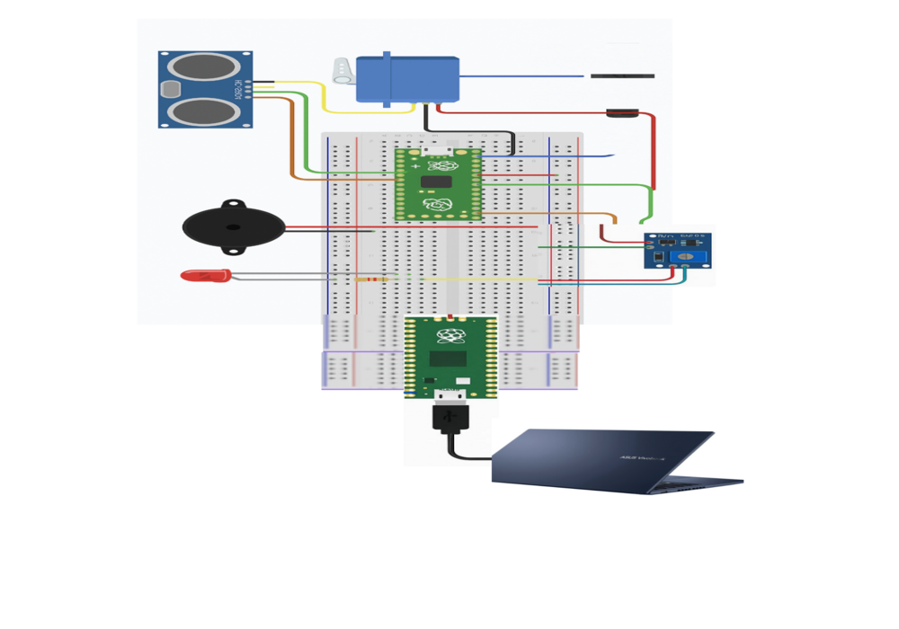
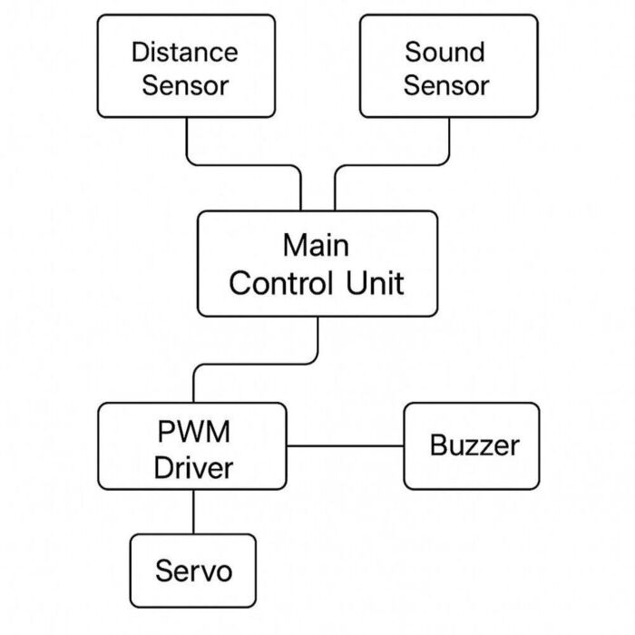
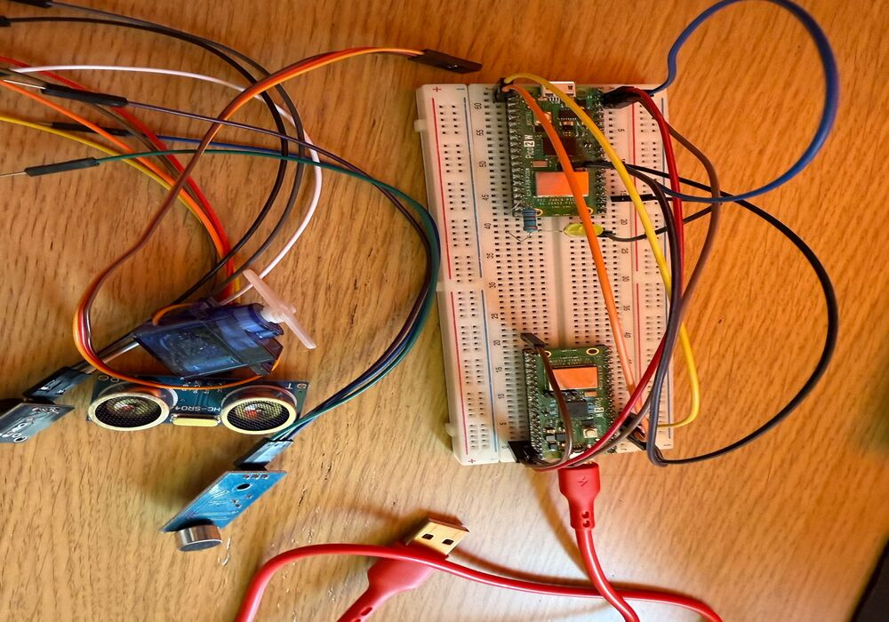

# Museum Object Defense System 
The Museum Object Defense System is a security setup protecting valuable exhibits.

:::info 

**Author**: Stefania-Daniela Croitoru \
**GitHub Project Link**: (https://github.com/UPB-PMRust-Students/project-Steffc15)

:::

## Description

This project aims to develop a motion and sound based security system using a Raspberry Pi Pico 2W as its core, designed to protect valuable museum exhibits. It utilizes an HC-SR04 ultrasonic distance sensor to detect movement and calculate the distance and speed of an approaching person. A sound sensor adds an extra layer of security by monitoring for unusual noises. When either movement or sound is detected, the system responds by activating a buzzer and illuminating RGB LEDs, providing immediate visual and auditory alerts. This setup acts as a real-time defense mechanism to help prevent unauthorized access or tampering.

## Motivation

 I chose this project because it combines engineering with real-world security needs, offering an opportunity to address critical challenges in security (in museum exhibits in my case). The project integrates motion detection, sound monitoring, and immediate alerts using a Raspberry Pi Pico 2W, offering a practical solution to protect valuable spaces. I will use Rust programming language because it offers excellent performance, memory safety, and concurrency features, making it ideal for building efficient, real-time systems. The project is challenging due to the integration of sensors and real-time communication between hardware and software, while also providing valuable hands-on experience in building complex security solutions. Additionally, it offers the opportunity to deepen my knowledge of both hardware-software integration using Rust, with the goal of contributing to creating safer environments.

## Architecture 

Main Components:\
Central Controller (Raspberry Pi Pico 2W): The core of the system that processes inputs and controls outputs. It runs the code that handles real-time responses to sensor data. \
Sensor Module: Ultrasonic Sensor HC-SR04, detects the distance and movement of objects or people in the vicinity and Sound Sensor monitors the environment for unusual noises, providing audio-based input . 

Feedback Mechanisms: \
Feedback from the sensors is processed in real-time by the Raspberry Pi Pico 2W. Upon detecting movement or sound, the system triggers the RGB LEDs to change color and the buzzer to sound off, alerting anyone nearby. 

Display Interface: \
A laptop connects to the Raspberry Pi Pico 2W via Wi-Fi, it displays motion and sound activity data, alert status, and allows basic system monitoring and control.

## Log

<!-- write every week your progress here -->

### Week 6 - 12 May

### Week 7 - 19 May

### Week 20 - 26 May

## Hardware

2× Raspberry Pi Pico 2W: One runs the system; the other is used for debugging. \
Laptop: For programming and displaying the interface via Wi-Fi. \
Wires: Female-to-Male, Female-to-Female, and Male-to-Male. Connect components to the Pico and breadboard. \
HC-SR04 Sensor: Detects motion by measuring distance with ultrasonic pulses. \
SG90 Servo Motor: Rotates to scan areas or indicate movement. \
Sound Sensor: Triggers alerts on loud or unusual sounds. \
Buzzer: Provides audible alarms during alerts. \
220Ω Resistors: Protect the RGB LED and control brightness. \
Breadboard: Used for prototyping . \
Micro USB Cable: Powers and programs the Pico. \
LED: Changes color to visually signal system status. 

This is what the wiring looks like:

### Schematics

This is the kicad schematic.

### Bill of Materials

| Component | Description | Price |
|----------|-------------|-------|
| [Raspberry Pi Pico 2W](https://www.raspberrypi.com/products/raspberry-pi-pico-2/) | This is used as the main microcontroller (×2 – one for debugging) | [39.66 RON](https://www.optimusdigital.ro/en/raspberry-pi-boards/13327-raspberry-pi-pico-2-w.html) |
| [HC-SR04 Ultrasonic Sensor](https://components101.com/ultrasonic-sensor-working-pinout-datasheet) | Used to detect object distance and movement | [20 RON](https://www.optimusdigital.ro/en/ultrasonic-sensors/2328-senzor-ultrasonic-de-distana-hc-sr04-compatibil-33-v-i-5-v.html) |
| [SG90 Micro Servo Motor](http://www.ee.ic.ac.uk/pcheung/teaching/DE1_EE/stores/sg90_datasheet.pdf) | Used to rotate the ultrasonic sensor for scanning | [14 RON](https://www.optimusdigital.ro/en/servomotors/26-sg90-micro-servo-motor.html) |
| [Sound Sensor Module](https://www.instructables.com/Sound-Sensor-Raspberry-Pi/) | Used to detect sudden loud noises | [4.99 RON](https://www.optimusdigital.ro/en/others/12325-sound-sensor-module-no-cable.html) |
| [Buzzer Module](https://components101.com/misc/buzzer-pinout-working-datasheet) | Used to emit audible alerts | [1 RON](https://www.optimusdigital.ro/en/electronic-components/12598-passive-buzzer-module.html) |
| [220Ω Resistors (×3)](https://www.electronics-tutorials.ws/resistor/res_1.html) | Used to limit current for the RGB LED | [1.5 RON](https://www.optimusdigital.ro/en/resistors/856-025w-220k-resistor.html) |
| [Breadboard](https://learn.sparkfun.com/tutorials/how-to-use-a-breadboard/all) | Used to prototype the circuit without soldering | [10 RON](https://www.optimusdigital.ro/en/breadboards/8-breadboard-hq-830-points.html) |
| [RGB LED](https://components101.com/leds/common-anode-rgb-led-pinout-working-datasheet) | Used to show visual alerts through color | [2 RON](https://www.optimusdigital.ro/en/leds/29-5-mm-red-led-with-difused-lens.html?search_query=led&results=2049) |
| [Male-Male Jumper Wires](https://www.optimusdigital.ro/en/wires-with-connectors/885-wires-male-male-10p-10cm.html) | Used for general wiring connections | ~7 RON |
| [Female-Female Jumper Wires](https://www.optimusdigital.ro/en/wires-with-connectors/212-female-female-10p-20-cm-wire.html) | Used to connect between modules and breadboard | ~7 RON |
| [Female-Male Jumper Wires](https://www.optimusdigital.ro/en/wires-with-connectors/92-female-male-wire40p-20-cm.html) | Used for flexible pin-to-board connections | ~7 RON |

## Software

| Library | Description | Usage |
|---------|-------------|-------|
| [embassy](https://github.com/embassy-rs/embassy) | Async runtime for embedded systems | Provides non-blocking async infrastructure for efficient task execution |
| [embassy-executor](https://docs.embassy.dev/embassy-executor/git/std/index.html)|Rust embedded systems| Used for asynchronous programming|
| [embassy-time](https://docs.rs/embassy-time/latest/embassy_time/) | Time management library | Used for time-based operations such as delays |
| [embassy-rp](https://docs.embassy.dev/embassy-rp/git/rp2040/index.html)| Peripheral access library |Used for initializing and interacting with peripherals |
| [embassy-hal](https://docs.embassy.dev/embassy-embedded-hal/git/default/index.html)| Hardware Abstraction Layer for Raspberry Pi Pico W | Interfaces with low-level hardware in a safe and portable way |
| [embassy-net](https://docs.embassy.dev/embassy-net/git/default/index.html)| Embedded networking stack | Handles Wi-Fi networking and IP configuration |
| [embassy-gpio](https://docs.rs/embassy-gpio/latest/embassy_gpio/) | GPIO management | Controls GPIO pins for devices and inputs |
| [embassy-usb](https://docs.rs/embassy-usb/latest/embassy_usb/) | USB management | Manages USB operation |

## Links

1. [Debug the Raspberry Pi Pico Using Another Pico](https://www.youtube.com/watch?v=0i2gLeBal9Y&t=252s&ab_channel=LearnEmbeddedSystems)
2. [HC-SR04 Ultrasonic Distance Sensor](https://www.youtube.com/watch?v=ilbSR3k-7XE&ab_channel=drselim)

