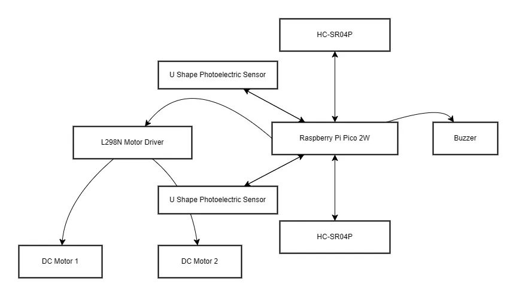

# Intelicar
A car remote-controlled via a smartphone

:::info 

**Author**: Todașcă Tudor \
**GitHub Project Link**: [https://github.com/UPB-PMRust-Students/project-TudorTT](https://github.com/UPB-PMRust-Students/project-TudorTT)

:::

## Description

Intelicar is a remote-controlled car operated via a smartphone using Internet. It is equipped with sensors on to detect nearby objects. If the car gets too close to an obstacle, the buzzer is activated as a warning.


## Motivation

I've always been passionate about cars, and I wanted to dive deeper into how some of the systems we use every day as drivers actually work. This project gave me the chance to explore that by building a miniature version of a car with real-world features like obstacle detection, motor control, and speed sensing. It's a hands-on way to show how useful and important these systems are-not just in big commercial vehicles, but even in small embedded systems. It's all about turning curiosity into something real and practical.


## Architecture 

### Raspberry Pi Pico 2W
- **Purpose**: Central controller  
- **Function**: Manages and coordinates all components in the system, including sensors, motor driver, buzzer, and motors. Runs the core logic for movement control and obstacle detection.

### L298N Motor Driver
- **Purpose**: Motor control interface  
- **Function**: Controls the speed and direction of the DC motors based on signals from the Pico. Enables forward, backward, and turning motion.

### DC Motors
- **Purpose**: Provide mobility  
- **Function**: Drive the car by rotating wheels in desired directions. Operate independently or together to enable turning and directional control.

### U-Shape Photoelectric Sensor
- **Purpose**: Speed measurement  
- **Function**: Detects motor rotation (RPM) by sensing interruptions in the beam. Sends feedback to the Pico for precise motor control.

### HC-SR04P Ultrasonic Sensors
- **Purpose**: Obstacle detection  
- **Function**: Measure distance to nearby objects by emitting ultrasonic pulses and timing the echoes. Used to avoid collisions and trigger the buzzer.

### Buzzer
- **Purpose**: Warning system  
- **Function**: Emits a sound when an obstacle is detected within a certain range. Alerts the user of potential collisions.



## Log

### Week 5 - 11 May

### Week 12 - 18 May

### Week 19 - 25 May

## Hardware

2x Raspberry Pi Pico 2W: acts as the primary processing unit, equipped with Wi-Fi capabilities.

1x HC-SR04 Ultrasonic Sensor: utilized for measuring distances to detect nearby objects.

1x L298N Motor Driver Module: Provides the ability to control the two wheels.

2x U Shape Photoelectric Sensor

2x Wheels with motors

1x Buzzer

1x Battery Support

### Schematics

Place your KiCAD schematics here.

**Note**: The schematics are not yet available, but they will be created using KiCAD

### Bill of Materials

<!-- Fill out this table with all the hardware components that you might need.

The format is 
```
| [Device](link://to/device) | This is used ... | [price](link://to/store) |

```

-->

| Device | Usage | Price |
|--------|--------|-------|
| [Raspberry Pi Pico 2W](https://www.raspberrypi.com/documentation/microcontrollers/raspberry-pi-pico.html) | The microcontroller | [40 RON](https://www.optimusdigital.ro/en/raspberry-pi-boards/13327-raspberry-pi-pico-2-w.html) |
| [Gearmotor with Wheel](about:blank) | The motors | [15 RON](https://www.optimusdigital.ro/en/others/139-gearmotor-with-wheel.html) |
| [L298N Dual Motor Driver](https://www.handsontec.com/dataspecs/L298N%20Motor%20Driver.pdf) | The motor driver | [11 RON](https://www.optimusdigital.ro/en/optical-sensors/171-u-shape-photoelectric-sensor.html) |
| [U Shape Photoelectric Sensor](about:blank) | The photoelectric senzor | [9 RON](https://www.optimusdigital.ro/en/optical-sensors/171-u-shape-photoelectric-sensor.html) |
| [HC-SR04P](https://handsontec.com/index.php/product/hc-sr04-ultrasonic-ranging-module/) | The sensor | [7 RON](https://www.optimusdigital.ro/en/distance-sensors/8150-hc-sr04p-ultrasonic-distance-sensor-3-55-v.html) |
| [Battery support ](about:blank) | Battery  | [6 RON](https://www.optimusdigital.ro/en/all-products/2374-suport-baterii-4-x-r6-patrat.html) |


## Software

| Library | Description | Usage |
|---------|-------------|-------|
| [embassy](https://github.com/embassy-rs/embassy) | Embassy | An asynchronous executor and Hardware Abstraction Layer (HAL) designed for constructing embedded applications in Rust. |
| [embassy-executor](https://docs.embassy.dev/embassy-executor/git/std/index.html) | Embassy Executor | Used for task scheduling and asynchronous programming. |
| [embassy-rp](https://docs.embassy.dev/embassy-rp/git/rp2040/index.html) | Embassy RP | Used for initializing and interacting with peripherals. |
| [gpio](https://docs.embassy.dev/embassy-stm32/git/stm32c011d6/gpio/index.html) | GPIO | Used for interacting with GPIO pins. |
| [cyw43](https://docs.embassy.dev/embassy-stm32/git/stm32c011d6/gpio/index.html) | CYW43 | Used for interacting with the wi-fi chip of the pico.|
| [HC-SR04P](https://github.com/Benehiko/pico-ultrasonic-rs?tab=readme-ov-file) | Sensor Driver for HC-SR04P | Used for controlling the ultrasonic sensor. |


## Links

<!-- Add a few links that inspired you and that you think you will use for your project -->

1. [link](https://example.com)
2. [link](https://example3.com)


