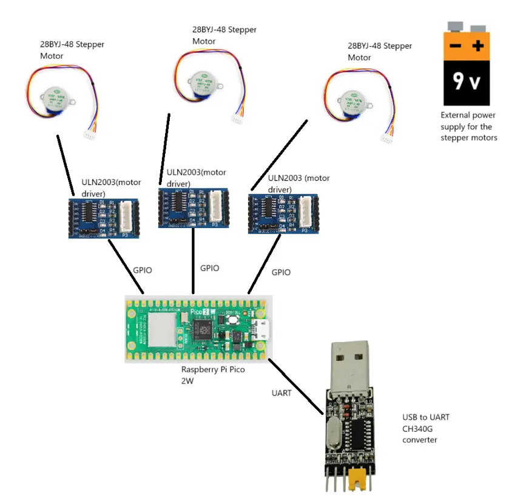
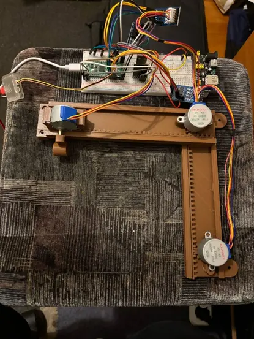
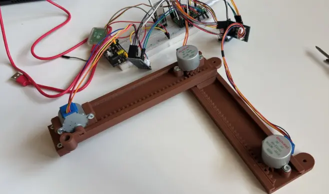

# PicoMatic

A compact CNC plotter controlled by a Raspberry Pi Pico 2W, moving a pencil in 3 axes (X, Y, Z) using stepper motors and drivers.

:::info 

**Author**: Aliwi Walid \
**GitHub Project Link**: https://github.com/UPB-PMRust-Students/project-AliwiWalid

:::


## Description

This project consists of building a CNC plotter machine that uses a pencil as its tool head. It is designed to move across three axes: X, Y, and Z, using stepper motors and motor drivers. The system is controlled by a Raspberry Pi Pico 2W microcontroller, which receives G-code commands via USB serial communication.
The commands are parsed on the Pico and translated into precise movements of the motors, allowing the machine to draw complex shapes automatically on paper. An external power supply is used to power the motors, providing enough current without overloading the Pico.


## Motivation

Initially I wanted to build a 3D printer, but due to the high cost, complexity and potential dangers with heating elements and mechanical failures, I decided to scale down the project to something safer and more achievable in the desired price range. The goal remained to build something which involves motion control and automation, where mechanical movement is precisely driven by software. And that is how I ended up choosing the CNC plotter as my project idea, as it shares a bunch of fundamental principles with a 3D printer, but clearly a lot cheaper and safer to build at home. This will help me continue my journey of learning about embedded programming and real time systems.

## Architecture 

 

## Log (not final version)

### Week 7 – 14 April

Since I had a clear idea of my project well before Week 7 and had already received approval, I ordered all the necessary components from AliExpress. This week, I 3D printed the structure of the CNC plotter and assembled the mechanical frame. I also created the initial architecture schematic and began researching which Rust crates I would need for motor control, serial communication, and other core features.
One obstacle I encountered was that the STL file source I used did not specify the required screw sizes, which delayed the mechanical assembly. Here's how the build looked at this stage:




### 8 – 21 April 

This week, I began work on the software side of the project. I wrote and tested code to control the stepper motors: first individually, then all three simultaneously. After that, I hardcoded some simple G-code movements to verify that the motors responded correctly for each axis. I also tested the USB-to-UART converter using a Python script to confirm that G-code could be sent correctly from the host to the Raspberry Pi Pico.
In parallel, I finalized both the KiCad schematic and the overall system architecture diagram.

### 9 -  28 April 

After receiving the correct screws, I completed the physical assembly of the CNC plotter. With the hardware finalized and the software functional, I tested the full pipeline:Create a vector image, use JS-Cut to convert it into G-code, send the G-code to the Pico via a Python script over UART, the Pico reads and executes each command line-by-line to control the motors and draw the image on paper, this was the first complete end-to-end test, and it worked successfully!


(yes i know the usb to uart converter should not be on the breadboard, i just put it there because otherwise i will lose it :) )

## Hardware

3× 28BYJ-48 Stepper Motors
Each stepper motor is used to drive movement along one of the three axes—X, Y, and Z. They are each controlled by a dedicated ULN2003 driver board, with signal lines connected to the Raspberry Pi Pico via GPIO as follows:

Stepper 1: GPIO 15, 14, 16, 17

Stepper 2: GPIO 18, 19, 13, 12

Stepper 3: GPIO 20, 21, 11, 10

CH340G USB-to-UART Converter
This module establishes serial communication between the Raspberry Pi Pico and a host computer. It is used to send G-code commands from the host (via a Python script) to the Pico for real-time stepper control. The pin connections are:

CH340G TX → Pico GPIO 1 (UART0 RX)

CH340G RX → Pico GPIO 0 (UART0 TX)

External Power Supply
A separate 5V external power source is used to power the stepper motors through the ULN2003 driver boards. This is necessary to avoid overloading the Raspberry Pi Pico, which cannot provide sufficient current for motor operation. Ground from the external power supply is tied to the system ground to ensure a common reference.

### Schematics


### Bill of Materials

<!-- Fill out this table with all the hardware components that you might need.

The format is 
```
| [Device](link://to/device) | This is used ... | [price](link://to/store) |

```

-->

| Device | Usage | Price |
|--------|--------|-------|
| [Raspberry Pi Pico 2W](https://www.raspberrypi.com/documentation/microcontrollers/raspberry-pi-pico.html) | The microcontroller | [39.66 RON](https://www.optimusdigital.ro/ro/placi-raspberry-pi/13327-raspberry-pi-pico-2-w.html?gad_source=1&gad_campaignid=19615979487&gbraid=0AAAAADv-p3AcTGZShwGGGHyKb6hmiamUi&gclid=Cj0KCQjwt8zABhDKARIsAHXuD7bAO3PSjO5VUcJr9qHfkmKVAr3Z09B3AA6rQCQr6-H1j137eukwUQIaAuujEALw_wcB) |
| [Debug Probe](https://www.raspberrypi.com/documentation/microcontrollers/debug-probe.html) | The debug probe | [66.17 RON](https://www.optimusdigital.ro/en/accesories/12777-raspberry-pi-debug-probe.html?srsltid=AfmBOoqRLhpWnsl_MLVLOVPS2vac9rBUAcFKuCQe_Yw-99inmJhG7OaJ) |
| [CH340G](https://static.efetividade.net/img/ch340g-datasheet-34852.pdf) | The USB to UART convertor | [2.52 RON](https://www.aliexpress.com/item/32840595066.html?src=google&pdp_npi=4%40dis!RON!2.93!2.57!!!!!%40!65055055161!ppc!!!&src=google&albch=shopping&acnt=298-731-3000&isdl=y&slnk=&plac=&mtctp=&albbt=Google_7_shopping&aff_platform=google&aff_short_key=UneMJZVf&gclsrc=aw.ds&&albagn=888888&&ds_e_adid=&ds_e_matchtype=&ds_e_device=c&ds_e_network=x&ds_e_product_group_id=&ds_e_product_id=en32840595066&ds_e_product_merchant_id=109253881&ds_e_product_country=RO&ds_e_product_language=en&ds_e_product_channel=online&ds_e_product_store_id=&ds_url_v=2&albcp=21564641029&albag=&isSmbAutoCall=false&needSmbHouyi=false&gad_source=1&gad_campaignid=21564641737&gbraid=0AAAAAqc5ie3gN_WTcoMiHw1qqrwXoOgWo&gclid=Cj0KCQjwt8zABhDKARIsAHXuD7YSrv_fn-OEWj1ayM029E8n2xmNgmmWrBtHJStsJMPdBYgHtHkIdGYaAn5VEALw_wcB) | 
| [28BYJ-48 + ULN2003](https://lastminuteengineers.com/28byj48-stepper-motor-arduino-tutorial/) | Stepper motors + drivers | [27.1 RON for a set of 3](https://www.aliexpress.com/item/1005008459804020.html?spm=a2g0o.productlist.main.1.472221F521F5lV&algo_pvid=fa09f8dd-b1aa-4823-864d-1b22b5867b0e&algo_exp_id=fa09f8dd-b1aa-4823-864d-1b22b5867b0e-0&pdp_ext_f=%7B%22order%22%3A%22212%22%2C%22eval%22%3A%221%22%7D&pdp_npi=4%40dis%21RON%2129.35%2127.10%21%21%2147.39%2143.76%21%4021038e1e17461121743717643e31bb%2112000045226842612%21sea%21RO%210%21ABX&curPageLogUid=cUGyI5R7byiR&utparam-url=scene%3Asearch%7Cquery_from%3A) |
| [Male to male/female jumper wires](https://www.cedist.com/sites/default/files/associated_files/s-w604_spec.pdf) | Wires | [0.1 * 23 = 2.3 RON](https://www.aliexpress.com/item/1005008590208433.html?spm=a2g0o.productlist.main.1.7b87ekDlekDlUc&algo_pvid=890a91ee-70aa-41f3-bb0a-5c23ababac74&algo_exp_id=890a91ee-70aa-41f3-bb0a-5c23ababac74-0&pdp_ext_f=%7B%22order%22%3A%22359%22%2C%22eval%22%3A%221%22%7D&pdp_npi=4%40dis%21RON%2116.84%216.00%21%21%2127.20%219.70%21%402103864c17461138312566697e492f%2112000045859835216%21sea%21RO%210%21ABX&curPageLogUid=cknCL6Z9dxQm&utparam-url=scene%3Asearch%7Cquery_from%3A) |
| [Breadboard Power Supply + battery](https://www.handsontec.com/dataspecs/mb102-ps.pdf) | External power for motors | [4.69 RON](https://www.optimusdigital.ro/ro/electronica-de-putere-stabilizatoare-liniare/61-sursa-de-alimentare-pentru-breadboard.html?gad_source=1&gad_campaignid=19615979487&gbraid=0AAAAADv-p3AcTGZShwGGGHyKb6hmiamUi&gclid=Cj0KCQjwt8zABhDKARIsAHXuD7YOxRovs32Q07WVmirNWilixqspoP2c5FE1Ab6qyN14nl4svQBPRkQaAuTXEALw_wcB) |


## Software

| Library | Description | Usage |
|---------|-------------|-------|
| [embassy-executor](https://crates.io/crates/embassy-executor) | Async/await executor optimized for embedded systems | Runs asynchronous tasks without an OS |
| [embassy-time](https://crates.io/crates/embassy-time) | Timekeeping, delays, and timeouts | Used for non-blocking delays and timeouts |
| [embassy-rp](https://crates.io/crates/embassy-rp) | HAL for Raspberry Pi RP2040 using Embassy | Interfaces with RP2040 peripherals (GPIO, UART, etc.) |
| [defmt](https://crates.io/crates/defmt) | Lightweight and efficient logging framework for embedded systems | Provides low-overhead debug output |
| [defmt-rtt](https://crates.io/crates/defmt-rtt) | RTT backend for defmt logging | Sends logs from device to host over RTT |
| [heapless](https://crates.io/crates/heapless) | `static`-friendly data structures without heap allocation | Used for queues, buffers, and collections without `alloc` |
| [cortex-m-rt](https://crates.io/crates/cortex-m-rt) | Minimal runtime for Cortex-M microcontrollers | Sets up vector table, stack, and entry point |

//TODO add stuff for python script also

## Links

<!-- Add a few links that inspired you and that you think you will use for your project -->

1. [inspiration](https://www.pcbway.com/project/shareproject/Build_a_simple_3D_Arduino_Mini_CNC_Plotter_e2c3f905.html)

