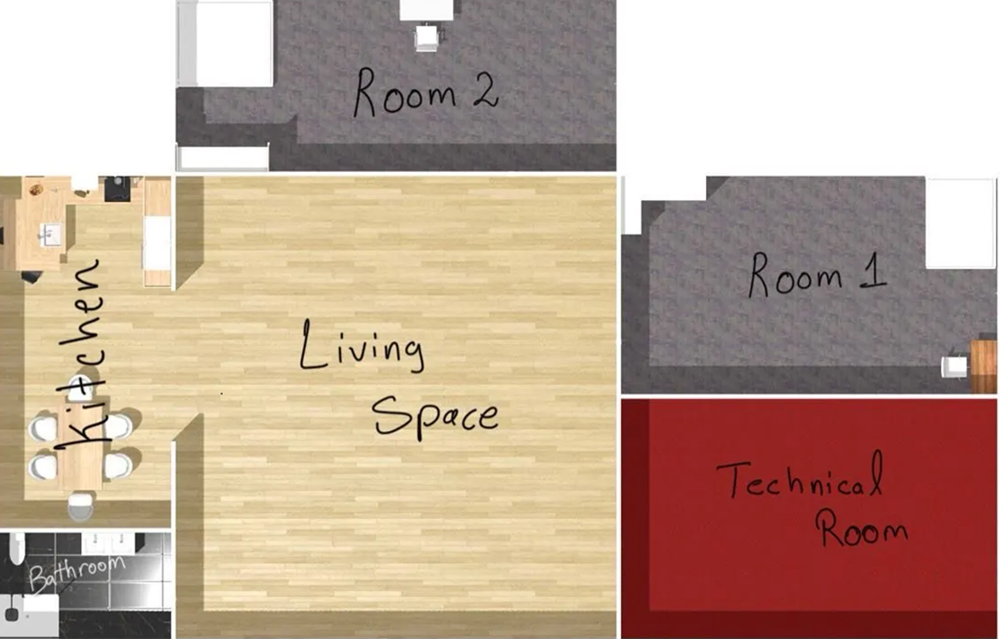
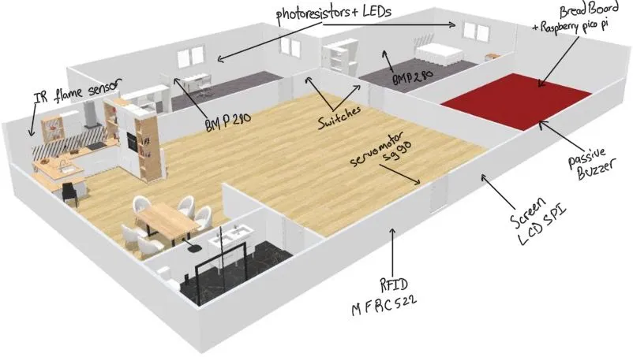
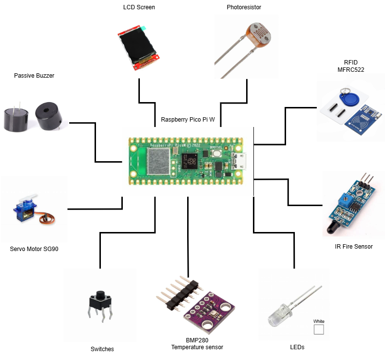

 # PicoHome
 PicoHome, powered by the Embassy framework, delivers seamless sensor-based automation, secure access control, and real-time monitoring.

 :::info

**Author**: Elastal Yahya \
**GitHub Project Link**: https://github.com/UPB-PMRust-Students/project-yahyaelastal

:::

## Description
The project centers on **PicoHome**, a smart home prototype that demonstrates key principles of intelligent automation, environmental monitoring, and secure access control. The system comprises two distinct rooms, each outfitted with temperature and light sensors to track environmental conditions in real time.

To promote energy efficiency, each room is equipped with an **intelligent lighting system**. Ambient light readings are used to determine the need for artificial lighting, and corresponding LEDs adjust their state automatically. This approach simulates smart lighting behavior by conserving power when natural light is sufficient.

Access control is managed through an **RFID-based authentication system** located at the main entrance. Upon detecting an authorized RFID tag, a servomotor simulates door actuation, while a buzzer confirms access through a distinctive tone. Unauthorized access attempts trigger a different buzzer pattern, effectively acting as an alert mechanism.

A **flame sensor is positioned in the kitchen** area to monitor for fire-related hazards. If triggered, the system activates an audible buzzer alert, initiating an emergency response procedure.

System status is displayed in real time on an **SPI-connected LCD screen**, which continuously presents sensor readings, access events, and room states. This consolidated interface offers a complete overview of the house's current condition at a glance, removing the need for manual interaction or display switching.

All subsystems operate asynchronously using the **Embassy framework**, enabling efficient, non-blocking task management. This allows for responsive handling of concurrent operations, such as sensor polling, actuator control, and display updates, ensuring stable performance even under simultaneous activity.

## Motivation
The idea for PicoHome was inspired by my interest in **architecture** and my growing passion for **technology**. I’ve always enjoyed thinking about how spaces are designed and how they can become more comfortable and functional. When I started this course, I saw a chance to combine that curiosity with what I was learning about **embedded systems and smart automation**.

I wanted to create something that connects the physical structure of a house with the logic of a smart system — something that brings together design, safety, and automation in one project. PicoHome gave me the opportunity to do that in a creative and hands-on way.

This project was also a **personal challenge** — a way to explore how technology can be used to improve living spaces, while learning to design and build something from the ground up. It helped me see how different fields can come together to create something both useful and meaningful.

## Architecture

### System Layout and Design
This is the floor plan for the home:

And this is a 3D render of the house showcasing the **Physical Layout** of all of the sensors:

### Components Overview

#### Room 1 & Room 2

- **Environmental Sensors**:
    - **BMP280 Temperature Sensors (x2)**: Installed in each room to monitor temperature. Each sensor is connected via a dedicated I²C bus using separate GPIO pins for reliability.
    - **Light Sensors (x2)**: Measure ambient light levels to support both automatic and manual lighting control.

- **Smart Lighting System**:
    - **LEDs (x2)**: Each room has a controllable LED that supports two modes:
        - **Ambient Mode**: Automatically turns on/off based on light sensor readings.
        - **Manual Mode**: Can be manually controlled to simulate standard room lighting.

#### Entrance Area

- **Access Control System**:
    - **RFID RC522**: Handles user authentication for entering the smart home.
    - **Servomotor**: Acts as a door mechanism, opening the entrance upon successful tag detection.
    - **Buzzer**: Provides audio feedback:
        - Short beep for authorized access.
        - Longer distinct warning tone for unauthorized access.

#### Kitchen Area

- **Fire Detection and Alarm System**
    - **IR Flame Sensor**: Detects fire in the kitchen area.

:::note
    The fire alarm system uses the same buzzer and servo from the entrance system to initiate emergency evacuation procedures. 
:::

#### Display Interface

- **LCD Screen (SPI-based)**:
A real-time display presents the status of the entire home , including:
    - Temperature and light levels in both rooms
    - Access activity
    - Fire detection alerts

### Connectivity
- **Light Sensors**: Connected to the Raspberry Pi Pico W’s ADC (Analog-to-Digital Converter) inputs, providing real-time ambient light readings for smart lighting control.

- **Temperature Sensors (BMP280)**: Communicate with the Pico W via I²C buses, sending temperature and pressure data.

- **LEDs**: Controlled through GPIO and PWM, supporting both ambient brightness adjustment and manual on/off control.

- **RFID**: Communicates via SPI with the Pico W, handling secure access authentication.

- **Servo Motor**: Driven by PWM signals to simulate door opening during authorized access or fire emergencies.

- **IR Fire Sensor**: Connected to a GPIO pin, detects fire and triggers an alarm response.

- **Buzzer**: Controlled using PWM, providing both access feedback tones and fire alarm activation.

- **LCD Screen**: Connected via SPI, continuously displays real-time sensor data, access status, and fire alerts .

:::note
**PicoHome** will be **handmade using cardboard**, allowing for a customizable and low-cost structure to represent the physical layout and placment of all system components.
:::
## Weekly Log
### Week 21 - 27 April
- **Entrance System**:
Integrated the RFID reader with the servo motor and buzzer. The system now unlocks the door and plays a confirmation tone for authorized access, and triggers a warning tone for unauthorized attempts.
- **Fire Detection and Alarm System**:
Implemented a fire detection feature that opens the door and activates an alarm when fire is detected, simulating an emergency response.
- **Documentation**:
Started writing the project documentation, including system descriptions and component overviews.
- **Hardware**:
I bought all the cardboard needed for the build and drew out the floor plan on it.
### Week 28 - 4 May
- **Cardboard House Construction**:
This week, I focused on building the cardboard house and successfully completed the main structure. The layout is now ready for installing components and starting the wiring process.
### Week 5 - 11 May
### Week 12 - 18 May
### Week 19 - 25 May
## Hardware
- Infrared Flame Sensor: Used to detect any nearby fire in the kitchen area, triggering an emergency alarm when activated.
- Active Buzzer Module: Provides audio feedback; it is activated both when a fire is detected and when an unauthorized RFID tag is scanned at the entrance.
- Servomotor: Simulates a door mechanism, opening automatically when authorized access is granted or during a fire emergency.
- RFID Module: Handles access control by distinguishing between authorized and unauthorized RFID tags. Authorized tags allow entry, while unauthorized tags trigger an alarm.
- BMP280 Sensors: Measure temperature inside each room.
- Light Sensors (Photoresistors): Measure ambient light levels in each room to adjust the brightness of the lighting system dynamically.
    - Room LEDs: Installed in each room, the LEDs operate in two modes:
    - Manual Mode: Allows direct on/off control.
- Ambient Mode: Adjusts brightness automatically based on the light sensor readings using PWM.
- LCD Screen: Continuously displays real-time information about room conditions, access activity, and fire alarm status.
### Schematics

### Bill of Materials
 

| Device | Usage | Price |
|--------|-------|-------|
| [Rapspberry Pi Pico WH](https://www.raspberrypi.com/documentation/microcontrollers/raspberry-pi-pico.html)| The Microcontroller | [1 x 56.23 RON](https://ardushop.ro/ro/raspberry-pi/1945-raspberry-pi-pico-wh-wirelessheaders-6427854029621.html) | 
| BreadBoard 400 Points| Connectivity | [1 x 4.56 RON](https://www.optimusdigital.ro/ro/prototipare-breadboard-uri/44-breadboard-400-points.html?search_query=breadboard&results=128)|
|[BMP280](https://cdn-shop.adafruit.com/datasheets/BST-BMP280-DS001-11.pdf) | Temperature sensor (I²C) | [2 x 8.49 RON](https://www.optimusdigital.ro/ro/senzori-senzori-de-presiune/1666-modul-senzor-de-presiune-barometric-bmp280.html?search_query=BMp280&results=10) |
| [Photoresistor](https://www.digikey.com/en/htmldatasheets/production/5858660/0/0/1/02-ldr2) | Light Detection | [2 x 1.90 RON](https://www.optimusdigital.ro/ro/componente-electronice-altele/28-fotorezistor10-pcs-set.html?search_query=photoresistor&results=3) |
| White LED 3mm | Room Lighting | [2 x 0.26 RON](https://www.optimusdigital.ro/ro/optoelectronice-led-uri/702-led-alb-de-3-mm-cu-lentile-transparente.html?search_query=LED+alb&results=175) |
| [RFID Module + RFID tags](https://www.nxp.com/docs/en/data-sheet/MFRC522.pdf)| RFID entrance | [1 x 9.99 RON](https://www.optimusdigital.ro/ro/wireless-rfid/67-modul-cititor-rfid-mfrc522.html?search_query=MOdul+RFID&results=13) |
| [IR Flame Sensor](https://www.datasheethub.com/ir-flame-sensor-module/) | Fire detection sensor | [1 x 2.49 RON](https://www.optimusdigital.ro/ro/senzori-senzori-optici/110-modul-senzor-de-flacara-.html?search_query=infrarosu&results=131) |
| [Servo Motor](http://www.ee.ic.ac.uk/pcheung/teaching/DE1_EE/stores/sg90_datasheet.pdf) | Door Simulation | [1 x 11.99 RON](https://www.optimusdigital.ro/ro/motoare-servomotoare/2261-micro-servo-motor-sg90-180.html?search_query=sg90&results=11) |
| [Buzzer Passive 3.3V](https://www.farnell.com/datasheets/2171929.pdf) | Audio Feedback and alerts | [1 x 0.99 RON](https://www.optimusdigital.ro/ro/audio-buzzere/12247-buzzer-pasiv-de-33v-sau-3v.html?search_query=buzzer+pasiv&results=15) |
| [SPI LCD Display (ST7735)](https://www.orientdisplay.com/wp-content/uploads/2022/08/ST7735_v2.1.pdf) | Real-time system display | [1 x 28.99 RON](https://www.optimusdigital.ro/ro/optoelectronice-lcd-uri/1311-modul-lcd-spi-de-18-128x160.html?search_query=ST7735&results=9) |
| [6x6x6 Push Buttons](https://components101.com/switches/push-button) | Physical User Interface | [2 x 0.36 RON](https://www.optimusdigital.ro/ro/butoane-i-comutatoare/1119-buton-6x6x6.html?search_query=buton&results=222) |
| Set of Resistors | Current Modulation | [1 x 14.99 RON](https://www.optimusdigital.ro/ro/componente-electronice-rezistoare/33-rezistoare-set.html?search_query=resistors&results=5) |
|Male-Male Wires 10cm |Connectivity |[1 x 4.99 RON](https://www.optimusdigital.ro/ro/fire-fire-mufate/884-set-fire-tata-tata-40p-10-cm.html?search_query=Fire+&results=430)|
|Female-Male Wires |Connectivity |[1 x 5.99 RON](https://www.optimusdigital.ro/ro/fire-fire-mufate/92-fire-colorate-mama-tata-40p.html?search_query=Fire+20cm&results=18)|
|Female-Female Wires |Connectivity|[1 x 7.99 RON](https://www.optimusdigital.ro/ro/fire-fire-mufate/90-fire-colorate-mama-mama-40p.html?search_query=Fire+20cm&results=18)|
| **TOTAL** | - | **171.19 RON** |

:::info Development Tool
A [Raspberry Pi Debug Probe](https://www.optimusdigital.ro/ro/accesorii/12777-placa-pentru-depanare-raspberry-pi.html?search_query=Debug+probe&results=1) was used during development and debugging but it will not be included in the final build of the project.
:::

## Software
| Library | Description | Usage |
|---------|-------------|-------|
| [embassy-executor](https://docs.embassy.dev/embassy-executor/git/std/index.html) | Asynchronous executor for embedded systems | Used to manage concurrent tasks in a non-blocking way |
| [embassy-time](https://docs.embassy.dev/embassy-time/git/default/index.html) | Time management library | Used for time-based operations such as delays |
|[embassy-rp](https://docs.embassy.dev/embassy-rp/git/rp2040/index.html)| Raspberry Pi Pico-specific HAL for Embassy |Used for PWM, SPI, GPIO, I²C, and peripheral setup |
|[embassy-sync](https://docs.embassy.dev/embassy-sync/git/default/index.html) | Lightweight async synchronization tools | Used for communication between tasks via Signal |
| [mfrc522](https://docs.rs/mfrc522/latest/mfrc522/) | RFID reader driver | Used to initialize and interact with the MFRC522 RFID module |
| [mipidisi](https://docs.rs/mipidsi/latest/mipidsi/) | Display driver for MIPI-compliant screens like ST7735 | Used to initialize and control the SPI LCD screen |
| [display-interface-spi](https://docs.rs/display-interface-spi/latest/display_interface_spi/) | Wrapper for SPI display interfaces |Used to link the display to the SPI bus and simplify communication|
| [embedded-graphics](https://docs.rs/embedded-graphics/latest/embedded_graphics/) | Graphics library for embedded displays | Used for rendering shapes, text, and layouts on the LCD screen |

## Links

