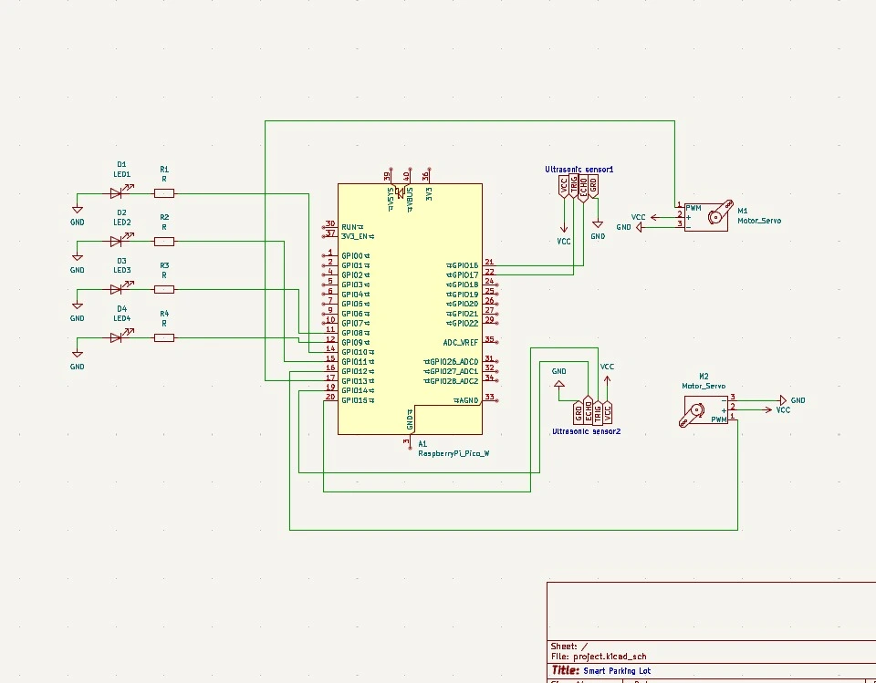

# Smart Parking Lot

 A smart system to monitor parking spaces and manage parking time for billing purposes.

:::info

**Author**: Zeinalabdin ISSA \
**GitHub Project Link**: https://github.com/UPB-PMRust-Students/project-zein409

:::
## Description

The Smart Parking Lot project automates parking spot allocation using sensors and tracks the time a car is parked for billing. The system provides real-time parking availability and uses a web interface for monitoring.

## Motivation

I chose this project to address the need for efficient parking management in crowded urban environments. The goal is to optimize parking space usage and provide real-time data to drivers.

## Architecture

# Schematic Diagram

The architecture of the Smart Parking Lot system includes the following main components:
- **Parking Sensors**: Detect free parking spaces.
- **Microcontroller (Raspberry Pi Pico W)**: Collects data from sensors and processes the information.
- **Web Interface**: Displays real-time parking availability and billing info.
- **Database**: Stores parking data such as time parked and billing information.

### How they connect:
- The Raspberry Pi Pico W communicates with the parking sensors to detect free or occupied spots.
- The microcontroller sends the data to the web interface, allowing users to view available spots.
- The system tracks parking time and calculates the bill based on the time spent.

## Log

### Week 5 - 11 May
- Started the project and gathered the necessary components.

### Week 12 - 18 May
- I started making the hardware work and figuring out how to put all the componets together and make them work perfectly with each other.
### Week 19 - 25 May

## Hardware

- Raspberry Pi Pico W
- HC-SR04 Ultrasonic Sensor
- 1602 LCD Display
- SG90 Servo Motor
- LEDs and resistors

## Schematics

 

## Bill of Materials

| Device                | Usage                        |    Price    |
|-----------------------|------------------------------|-------------|
| Raspberry Pi Pico 2W  | The microcontroller          | 39      RON |
| Ultrasonic Sensors    | Used for cars detection      | 6.45x2  RON |
| ServoMotor            | Opens the gate for the cars  | 11.99x2 RON |
| LEDs                  | Lights up on detection       | 0.39x4  RON |
| LCD 1602              | Shows results on screen      | 16.34   RON |

## Software

### Libraries

| Library              | Description                   | Usage                                |
|----------------------|-------------------------------|--------------------------------------|
| st7789               | Display driver for ST7789     | Used for the display for the Pico Explorer Base |
| embedded-graphics    | 2D graphics library           | Used for drawing to the display     |

## Links
